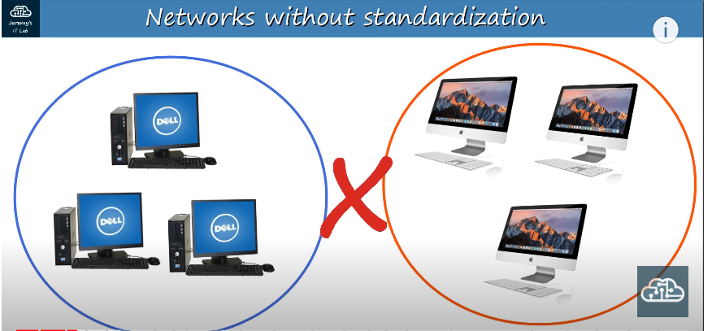
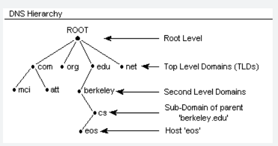
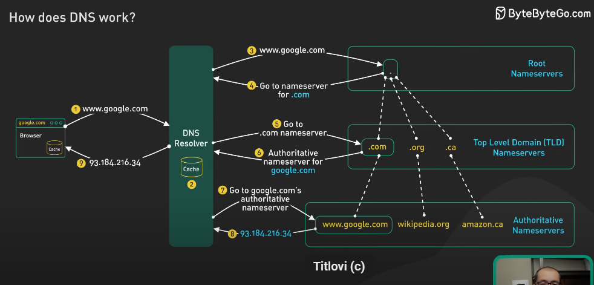

*The outcomes of this task-5 should be the following:*
#### TASK - 4 - Gained knowledge about networking
## You need to know what the OSI model is

**OSI model** - *Open System Interconnection model* omogućava uređajima različitih proizvođača, karakteristika da komuniciraju međusobno putem mreže.
* Konceptualni model koji kategoriše i standardizuje različite funkcionalnosti u mreži.

**Open** - open standard i nije razvijen od strane neke kompanije
* Kreirana od strane ISO 


**Aplikativni sloj** 

* Najbliži korisniku
* U interakciji je sa softverskim aplikacijama npr. browser
* HTTP i HTTPS su protokoli ovog sloja 
* ne uključuje samu aplikaciju, već protokole 
* PDU je *data* 

Funkcije:
1. Identifikacija komunikacionih partnera
2. Sinhronizacija komunikacije 


*Adjacent-layer-interaction* interakcija između lejera u hijerarhiji različitih lejera u OSI 

*Same layer interaction* između istih layera dva uređaja

**Presentacioni sloj**
* podaci su u aplikacionom formatu - formatu koji razumiju aplikacije 
* mora se prevesti u druge formate da bi se poslao preko mreže
* PDU je *data*

Funkcije:
1. translate ili prevod između aplikacija i mrežnih formata kao i između layera 

**Session sloj**
* kontroliše dialoge (sesije) između hostova koji komuniciraju
* PDU je *data*

Funkcije:
1. uspostavlja, upravlja i terminira konekciju između lokalnih aplikacija npr. našeg browsera i YT

**Transpotni sloj** 
* segmenuje i preraspodjeljuje podatke za komunikaciju između krajnjih hostova
* razbija velike komade podataka na manje kako bi se lakše prenijeli preko mreže 
* dodaje header na pripremljeni paket podataka koji dolazi iz gornja tri sloja 
* PDU je *segment*
* omogućava host to host komunikaciju 

**Network mrežni sloj**
* omogućava connectivity povezanost između end hostova različitih mreža (van LAN mreže)
* logičko adresiranje u formi IP adresa 
* Path selekcija između izvora do destinacije  i pronalazak najboljeg puta od do 
* Ruteri su uređaji layera 3

* dodaje header layera 3 - uključuje informacije o source i destination IP adresi 
* PDU je *paket*

**Data link sloj**
* omogućava *node-to-node* povezanost i prenos podataka **npr. PC-SW, SW - Router, Router-Router**
* definiše kako je data formatiran za prenos preko fizičkog medijuma (npr. UTP kabal)
* detektuje i ispravlja greške nastale na  fizičkom nivou

* Switch je uređaj layera 2
* MAC i ARP adresiranje 
* dodaje header i trailer 
* PDU je *frame*

**Fizički sloj**
* enkapsulirani podaci se prenose dalje putem žice ili sl.
* definiše fizičke karakteristike medijuma za prenos podataka između uređaja 
* npr. voltage levels, cable specifications
* digitalni bitovi se prevode u električne signale(wired connection) ili radio signale (wireless konekcija)

## What protocols are

Protokoli su setovi tj. grupe pravila koji definišu kako mrežni uređaji i softver treba da rade, uključujući i kako trebaju međusobno da funkcionišu.

Protokoli se odnose na logička pravila, ne fizičke standarde.



Na slici je prikazan primjer kada imamo na jednoj strani DELL računare sa svojim setom protokola i koji međusobno funkcionišu odlično. S druge strane imamo MAC računare sa drugim, svojim setom protokola koji međusobno komuniciraju odlično.
Međutim, kako nije primjenjeno pravilo standardizacije i protokoli koji kažu DELL i MAC računarima kako da komuniciraju su različiti, ova dva tipa računara međusobno nisu u mogućnosti da ostvare komunikaciju.


## IPv4 addressing (being able to create your own subnet), for example, if you have a CIDR block 10.0.0.0/24 and you are asked to create 2 subnets that belong to that CIDR block, where you will have 128 IP addresses available in each subnet you should be able to do subnetting manually using pen and paper.

Done. 

## Difference between private and public IPv4 addresses
Privatne *PRIVATE* IP adrese razvrstane su **non-rutable** adrese koje se ne mogu koristiti za izlaz na internet i prepoznaju se samo u okviru iste LAN mreže.
Tj. dva računara iz iste LAN mreže mogu komunicirati koristeći svoje privatne IP adrese.

Class A: `10.0.0.0` to `10.255.255.255`
Class B: `172.16.0.0` to `172.31.255.255`
Class C: `192.168.0.0` to `192.168.255.255`

IPV4 adrese:


* Javne *PUBLIC* IP adrese su **rutable** adrese i koriste se za komunikaciju računara na udaljenim lokacijama na internetu tj. van lokalne mreže.
* Dodjeljene su od strane Internet Service Providers (ISPs) i jedinstvene su za svaki uredjaj. 
## What is IPv6, why we need IPv6 and what is main difference between IPv4 and IPv6
IPV6 je IP protokol verzije 6 koji je nasljednik IPV4 adresa. Nastao je iz potrebe da se kreira novi i veći blok dostupnih IP adresa, kako IPV4 vremenom ima sve manji broj slobodnih IP adresa.
* IPV6 je 128 bitna adresa: 8 blokova odvojenih `:` sa 4 hex cifre
* sigurnije su jer imaju ugrađenu enkripciju i autentifikaciju
* nije potreban NAT za izlaz na Internet

Za razliku od njih, IPV4 karakteriše:
* IPV4 je 32 bitna adresa sa 4 bloka od po 8 bita odvojenih `.` i pišu se obično u decimalnoj notaciji 
* treba NAT za izlaz na Internet


## What is a client-server architecture & Who is the client and who is server


Koristi se u web aplikacijama gdje imamo dva udaljena uređaja koji putem mreže međusobno komuniciraju.

Uvijek je to komunikacija između dva servisa tj. dva procesa
npr. na klijentskoj strani je to proces za browser, dok je na serveru to proces za web server
**Klijent** onaj ko inicira sesiju tj. šalje zahtjeve ka serveru.
**Server** - uređaj koji prima, obrađuje i odgovara na zahtjev klijenta.
* Ima fiksnu IP adresu preko koje je dostupan tj. domen

### Šta je socket?

Soket je softverski endpoint koji omogućava komunikaciju između dva procesa ili programa pokrenutim na mrežnim uređajima ili na internetu.
**Socket je kombinacija IP adrese i porta** koji je jedinstven za neki endpoint.

Soket se koristi za uspostavljanje komunikacionih kanala između aplikacija ili servisa i prenos podataka na mrežnom nivou. 
Koristi se i kod **connection oriented** i **connectionless** protokola
* TCP (Transmission Control Protocol) je connection oriented protokol koji koristi soket da uspostavi pozdanu konekciju između dva uređaja
* UDP (User Datagram Protocol) je connectionless protokol koji koristi soket za primanje i slanje datagrama.


## What is the TCP protocol

* Koristi se za uspostavljenje pouzdane veze izmedju klijenta i servera. Pouzdane jer koristi 3-way handshake

* TCP (Transmission Control Protocol) je jedan od osnovnih protokola na Internetu koji se koristi za uspostavljanje pouzdane veze između uređaja (npr. računala, mobilnih uređaja) putem mreže. TCP je odgovoran za sigurnu i pouzdanu isporuku podataka između računala preko mreže, a glavne značajke TCP-a uključuju:

* Pouzdana isporuka: TCP je dizajniran tako da osigura da se svi podaci isporučuju u pravom redoslijedu i da se svi podaci isporučuju bez gubitka ili dupliranja. Ovo je postignuto korištenjem različitih mehanizama poput potvrđivanja (acknowledgments), ponovnog slanja (retransmission) i prozora (window) za kontrolu protoka.

* Trošak: TCP održava razumnu kontrolu protoka kako bi se izbjegao zagušenje mreže i smanjio broj ponovnog slanja podataka.

* Uspostava i prekidanje veze: TCP koristi trostepeni proces za uspostavu veze između dvije strane, nakon čega se podaci mogu prenositi u oba smjera. Također ima mehanizme za prekidanje veze kada je prijenos podataka završen.

* Pouzdanost: TCP provjerava integritet podataka kako bi se osiguralo da se preneseni podaci nisu promijenili ili oštetili tijekom prijenosa.

* Poredak: TCP osigurava da se podaci isporučuju u pravom redoslijedu.

## What is HTTP protocol and why we are using it

* *Hypertext Transfer Protocol* kojim se komunicira između klijenata i poslužitelja na vebu
* Koristi TCP kao osnovni transportni protokol i 3way handshake za uspostavljanje veze
* model zahtjev-odgovor gdje klijent šalje zahtjev za određenim resursom, a server šalje odgovor koji sadrži tražene informacije 

**Zahtjev se sastoji od headera i tijela**
* Header sadrži metodu zahtjeva, URL hatjevanog resura, verziju protokola itd.
* Body sadrži podatke koji se prenose putem HTTP -a kao što je HTML kod, slike itd. 

1. GET - preuzimanje resursa sa servera
```bash
GET /index.html HTTP/1.1
Host: devops-mentorship-program.com
HTTP metode zahtjeva
```

2. POST - postavljanje resursa na server
```bash
POST /login HTTP/1.1
Host: www.example.com
Content-Type: application/x-www-form-urlencoded

username=john&password=secret
```

3. PUT - ažuriranje resursa na serveru
```bash
PUT /document.doc HTTP/1.1
Host: www.example.com
Content-Type: application/msword

... sadrzaj dokumenta ...
```
4. DELETE -  brisanje resursa sa servera
```bash
DELETE /file.txt HTTP/1.1
Host: www.example.com
```

HTTP poruka 
* početna linija - HTTP metoda, URL i verzija HTTP protokola
* header - informacije o zahtjevu 
* body  - podaci koji se šalju 

**Cookies**
* sadrži jedinstven identifikator sesije koji će biti korišten za identifikaciju korisnika u budućim zahtjevima koje korisnik šalje na server
* koristi se i za pohranu postavki i preferencija korisnika kao npr jezik i valuta 
* koristi se za praćenje aktivnosti korisnika na stranici
* kolačić se na server šalje zajedno sa HTTP requestom 

## SSL i TLS 

*SSL - Secure Sockets Layer* je kriptografski protokol koji se koristi za sigurnu komunikaciju između računara preko interneta
1. Sloj protokola za upravljanje sigurnošću
2. Sloj protokola za prenos podataka

Funkcije:
*  kriptovanje podataka koji se prenose preko interneta kako bi bili zaštićeni od neovlaštenog pristupa i manipulacije
* provjera identitera web servera s kojim se korisnik konektuje

**SSL certifikati** su digitalni certifikati koji se koriste za autentifikaciju web servera i kriptiranje podataka. Certifikat se izdaje od strane pouzdanih tijela koji vrše provjeru identiteta vlasnika certifikata i izdaju digitalni potpis koji se koristi za autentifikaciju 

* ssl sesija - sigurna veza klijent-server

*TLS - Transport Layer Security* je kriptografski protokol koji se koristi za zaštitu protokola koji se koriste za prenos podataka kao što su HTTP, SMTP itd.

TLS radi u 3 koraka:
1. Dogovor o parametrima kriptiranja: Klijent i server se dogovaraju o parametrima kriptiranja, uključujući vrstu kriptografskog algoritma i duljinu ključa.

2. Razmjena ključeva: Klijent i server razmjenjuju javne ključeve kako bi se osigurala sigurna komunikacija. Klijent generira jedinstveni ključ za tu sesiju i šalje ga serveru koji ga zatim koristi za kriptiranje podataka.

3. Autentifikacija: TLS koristi certifikate kako bi se osigurala autentičnost servera s kojim se klijent povezuje. Server šalje svoj certifikat klijentu kako bi se klijent uvjerio da se povezuje s pravim serverom.

TLS handshake process je proces kojim se klijent i server dogovaraju o parametrima sigurne veze prije nego što započnu prijenos podataka. U ovom procesu, klijent i server razmjenjuju informacije o algoritmima kriptiranja i autentifikaciji, te se dogovaraju oko ključeva koji će se koristiti za kriptiranje podataka. TLS handshake proces se sastoji od sljedećih koraka:

1. `Client Hello:` Klijent započinje TLS handshake slanjem Client Hello poruke serveru. Ova poruka sadrži informacije o verziji TLS protokola koja se koristi, popis kriptografskih algoritama koje klijent podržava i nasumično generirani broj koji se koristi za stvaranje kasnije dogovorenog ključa.

2. `Server Hello:` Nakon što server primi Client Hello, server šalje Server Hello poruku klijentu. Ova poruka sadrži informacije o TLS verziji koju će koristiti, izboru kriptografskih algoritama i nasumično generirani broj koji će se koristiti za dogovor o ključu.

3. `Certificate:` Server šalje svoj certifikat klijentu, koji sadrži javni ključ koji će klijent kasnije koristiti za enkripciju podataka koje šalje serveru.

4. `Server Key Exchange:` Ako je odabran Diffie-Hellman (DH) kriptografski algoritam, server šalje svoj DH javni ključ klijentu. Klijent tada generira svoj DH javni ključ i šalje ga serveru.

5. `Client Key Exchange:` Klijent šalje serveru javni ključ koji se koristi za stvaranje zajedničkog tajnog ključa.

6. `Certificate Verify:` Klijent potvrđuje valjanost certifikata servera, koristeći javni ključ iz certifikata.

7. `Change Cipher Spec:` Klijent i server se dogovaraju o tome koji će kriptografski algoritam koristiti i prelaze na taj algoritam.

8. `Finished:` Nakon što su klijent i server dogovorili parametre sigurne veze, oba uređaja šalju Finished poruke jedan drugome. Ove poruke služe za potvrdu da je TLS handshake proces uspješno završen i da su klijent i server sada spremni za sigurnu komunikaciju.

Nakon uspješno završenog TLS handshake procesa, klijent i server koriste zajednički tajni ključ za kriptiranje i dekriptiranje podataka koji se prenose između njih. TLS handshake proces se ponavlja za svaku novu sesiju komunikacije između klijenta i servera kako bi se osigurala sigurna i privatna komunikacija.


## What is the main difference between TCP and UDP protocols
* UDP ne pruža garancije o isporuci paketa. UDP paketi se šalju putem mreže bez ikakvog garancija o tome da li će paket stići na odredište, hoće li se zagubiti ili duplicirati
**UDP protokol** je često korišten za aplikacije koje zahtijevaju brz prijenos podataka, ali ne zahtijevaju pouzdanost prijenosa, kao što su video streaming

**DNS (Domain Name System)** - UDP se često koristi za DNS jer DNS paketi obično nisu veliki, a brzina odgovora je ključna. DNS je odgovoran za mapiranje IP adresa na ljudski čitljive imena domena.

**DHCP (Dynamic Host Configuration Protocol)** - DHCP se koristi za automatsku konfiguraciju mrežnih postavki, kao što su IP adrese, podmrežne mreže i zadane mrežne brzine. UDP se koristi za prenošenje DHCP poruka između klijenata i DHCP poslužitelja.

**TFTP (Trivial File Transfer Protocol)** - UDP se često koristi za TFTP, protokol koji se koristi za jednostavan prijenos datoteka između računala u mreži. TFTP je jednostavan i ograničen protokol, ali se često koristi za firmware i konfiguracijske datoteke.

**SNMP (Simple Network Management Protocol)** - SNMP se koristi za upravljanje mrežama i prikupljanje informacija o mrežama. UDP se često koristi za prenošenje SNMP poruka između mrežnih uređaja.

**RIP (Routing Information Protocol)** - UDP se koristi za RIP, protokol za razmjenu informacija o rutiranju između mrežnih uređaja. RIP je jedan od najjednostavnijih protokola za razmjenu informacija o rutiranju, ali nije najučinkovitiji i nije najbolji izbor za velike mreže.

**Syslog** - UDP se često koristi za syslog, protokol za prikupljanje i slanje log datoteka sa različitih uređaja u mreži, kao što su poslužitelji, mrežni uređaji i sigurnosni uređaji. Syslog omogućuje centralizirano upravljanje logovima i olakšava dijagnostiku problema u mreži.

**NTP (Network Time Protocol)** - UDP se koristi za NTP, protokol za sinkronizaciju vremena između računala u mreži. NTP omogućuje računalima u mreži da se sinkroniziraju sa zajedničkim referentnim vremenom, što je ključno za različite aplikacije koje se oslanjaju na točno vrijeme, kao što su bankarske transakcije ili mjerenje vremena u proizvodnoj liniji.


## What is FQDN

* *Fully Qualified Domain Name (FQDN)* je naziv koji se koristi za potpuno identificiranje jedinstvene lokacije na internetu, a sastoji se od nekoliko dijelova u hijerarhijskom poretku. FQDN uključuje sve dijelove naziva domene, uključujući naziv subdomene, naziv drugog nivoa i naziv domene vrha (top-level domain, TLD).

## What is DNS, why do we need it, how it works
* DNS - Domanin Name System hijerarhijski distribuiran sistem koji povezuje ljudski čitljiva domenska imena za priparajućim IP adresama
* omogućava da pristupimo web sajtu bez da kucamo IP adresu, već samo pamtljivo ime 

DNS se sastoji od nekoliko komponenti:

- **DNS poslužitelji:** Ovo su računala koja čuvaju bazu podataka DNS-a i odgovaraju na upite koje im šalju drugi računala na Internetu. DNS poslužitelji se mogu podijeliti u tri kategorije: korijenski, autoritativni i posrednički.

- **DNS rekordi:** Ovo su zapisi u bazi podataka DNS-a koji povezuju domenska imena s njihovim IP adresama. Postoje različiti vrste DNS zapisa, uključujući A zapis, CNAME zapis, MX zapis i PTR zapis, koji se koriste za različite svrhe.

- **DNS klijenti:** Ovo su računala ili uređaji koji šalju upite DNS poslužiteljima kako bi saznali IP adresu za određeno domensko ime. DNS klijenti mogu biti ugrađeni u web preglednike, operativne sustave ili druge aplikacije koje se koriste za pristup Internetu.

- **DNS protokoli:** Ovo su standardi za komunikaciju između DNS poslužitelja i DNS klijenata. Postoje različiti protokoli, uključujući DNS protokol i DNSSEC protokol koji se koriste za osiguravanje integriteta i autentičnosti podataka u bazi podataka DNS-a.\

- **DNS caching:** DNS poslužitelji i klijenti obično pohranjuju informacije o DNS upitima kako bi se smanjio broj upita koji se šalju DNS poslužiteljima i ubrzalo vrijeme odgovora. To se naziva DNS caching. DNS zapisi imaju svoje vrijeme života (TTL - Time to Live) koje se koristi za upravljanje caching-om, što znači da se informacije u cache-u automatski brišu nakon isteka TTL-a.

- **DNS hijacking:** Ovo je tehnika u kojoj napadač preusmjerava DNS upite s legitimne DNS adrese na lažnu adresu. To omogućava napadaču da preuzme kontrolu nad komunikacijom između DNS klijenta i poslužitelja te može preusmjeravati korisnike na zlonamjerne web stranice ili krađu identiteta.


Postoje četiri glavna tipa DNS poslužitelja:

**Root poslužitelji:** Ovo su najviši DNS poslužitelji u hijerarhiji i oni upućuju na poslužitelje TLD domena.

**TLD poslužitelji:** Ovi poslužitelji upućuju na poslužitelje za drugu razinu domena (SLD), poput .com, .org, .net itd.

**Poslužitelji za SLD domene:** Ovi poslužitelji upućuju na poslužitelje za subdomene, ukoliko su definirane.

**Autoritativni poslužitelji:** Ovi poslužitelji su izvorni izvori informacija o DNS zapisima za određenu domenu i oni vraćaju IP adrese za tražena domenska imena.




## What is VPN

VPN (Virtual Private Network) je sigurna mrežna veza koja povezuje udaljene korisnike i uređaje preko interneta kao da su direktno povezani u istoj lokalnoj mreži. VPN se koristi za sigurno spajanje na udaljene mreže, pristup internetskim stranicama i servisima koji su inače nedostupni izvan određene lokacije, za zaštitu privatnosti i anonimnosti, te za zaštitu protoka podataka od neovlaštenog pristupa.

Kada korisnik uspostavi VPN vezu, svi podaci koji se prenose između korisnika i VPN poslužitelja su šifrirani, što znači da se informacije koje se prenose između korisnika i VPN poslužitelja ne mogu čitati ili pristupiti bilo kome drugom. VPN također može pružiti dodatnu sigurnost korištenjem protokola za autentifikaciju i enkripciju, kao što su IPsec (Internet Protocol Security), SSL/TLS (Secure Sockets Layer/Transport Layer Security) i drugi.

## BILJEŠKE SA PREDAVANJA 

Kada uspostavljamo konekciju sa serverom, koristeći terminal i komandu ssh, da bi konekcija bila uspostavljena na serveru moramo  imati:
* sshd servis instaliran
* otvoren port 22

Kada upostavljamo konekciju browser-server na serveru moramo imati neki web server kao servis
* koristi se http protokol koji sluša na portu 80
* koristi se https protokol koji sluša na portu 443
* nginx i apache tomcat su najpoznatiji veb serveri

### Provjera da li je port otvoren
`telnet 3.68.91.255 80` da provjerimo da li je port otvoren na serveru sa navedenom IP adresom
* kada koristimo `telnet` na drugoj strani **mora postojati servis koji nas sluša na tom portu**

`telnet` provjerava dostupnog servisa na hostu tj. portu 80
* umije da zavara i scena je sljedeća:

`stystemctl status httpd` provjeri servis i vidi da je *running*
`systemctl stop httpd` stopiramo servis
Na browseru osvježimo stranicu i dobijamo **The site can't be reached** error
Zašto? Zato što  stopirajući servis httpd na serveru, nemamo više servis koji bi naš request prihvatio, obradio i vratio odgovor.
**PORT 80 ostaje otvoren idalje, samo je servis stopiran**
Ako izvršimo `telnet` dobijamo **Conection refused** ali samo zato jer na serveru nemamo servisa koji bi odgovorio na request.


### otvaranje porta koji je zatvoren

*AWS -> EC2 -> Instances -> nadjemo server*
* Security grupu gledamo kao Firewal i ona ima **inbound** pravilo koje dozvoljava pristup po ssh protokolu.
* Dodamo pravilo po protokolu HTTP 


`dig facebook.com`
`nslookup facebook.com`
`traceroot facebook.com`