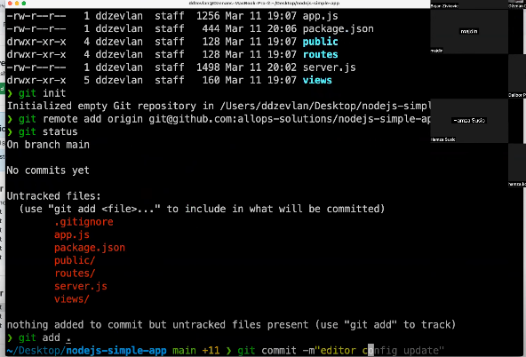

*week-5 notes about topic Serveri*
# Serveri
## Šta je server i koja je razlika između hardveskog i softverskog servera
*Server* može biti bilo koji program ili sistem na privatnom računaru koji pruža određene usluge drugim računarima unutar neke računarske mreže.

* **hardverska komponenta** - fizički server
* **softverska komponenta** - definicija gore 

Trebamo da razlikujemo uređaje koji su namjenski napravljeni da budu serveri tzv. hardverski serveri i čije performanse nisu iste u odnosu na softverske servere za koje možemo koristiti lokalne računare. 

**Hardverski serveri  su** 
* pouzdaniji jer su non stop up and running 
* podržavaju više mrežnih kartica
* mrežne kartice su veće propusnosti tj bandwith
* imaju bolje performanse
* bolju upravljivost itd. 

## Šta je Data Centar

*Data centar* je  fizički objekat koji sadrži servere, mrežnu opremu, kablovsku mrežu, UPS-e i sve potrebno za što bolji rad servera i omogućavaju da serveri pruže maksimalne performanse. 

* **UPS** uređaji služe za stabilizaciju napona

* Lokacije data centra su tajna, zbog sigurnosti

## Bilješke sa predavanja 

Povezivanje sa novim serverom: 
`ssh centos@18.156.117.35`
* kako nismo mogli da se povežemo koraci su:
1. `ssh centos@18.156.117.35 -vvv` outpur verbose da vidimo da li imamo problema 
2. `telnet 18.156.117.35 22` da provjerimo možemo li se konektovati
    * kako se nismo uspjeli konektovati, provjerimo firewall i security našeg servera

### Instaliramo neki sofrverski server - web server NGINX

**NGINX** (izgovara se "Engine X") je open-source web server i reverse proxy server. Zahvaljujuci svojoj jednostavnosti koristenja, brzini, skalabilnosti i sigurnosti postao je jedan od najpopularnijih web servera. NGINX ima i svoju placenu verziju koja se naziva **NGINX Plus**. Iako NGINX Plus ima odredjene funkcionalnosti koje nisu dostupne u open-source verziji, vecina korisnika i dalje nalazi dovoljnim open-source verziju NGINX-a.

#### Instalacija NGINX-a na CentOS 7
Koraci za instalaciju Nginx-a na CentOS 7:
```bash
pokrenemo tmux sesiju kako se konekcija ne bi prekidala

$ sudo su - #root user
$ sudo yum install epel-release -y # instalacija EPEL repozitorija
$ sudo yum install nginx -y # instalacija Nginx-a
$ sudo systemctl status nginx # provjera statusa servisa
$ sudo systemctl start nginx # pokretanje Nginx-a
```
*Obješnjenje*
Da smo uradili samo `yum install nginx` dobili bismo poruku da paket nije dostupan jer nemamo odgovrajući repozitorij. 
Zato dodajemo `epel-release` repozitorij. 

NGINX radi brzo i obrađuje sve jer ima više working procesa pokrenutih odmah. 
`$ps aux | grep nginx` da provjerimo pokrenute procese za nginx
* master proces pokrenut sa userom root
* 2 working procesa 
### Automatsko pokretanje nginx 

```bash
$ sudo systemctl enable nginx # da se nginx automatski pokreće nakon restarta servera
$ systemctl is-enabled nginx # da li je nginx podešen za automatsko startovanje
```

## NGINX konfiguracijski fajlovi 

Defaultni root direktoriji nalazi se na lokaciji: `/usr/share/nginx/html`. Ova putanja definisana je unutar `server` bloka defaultnog nginx konfiguracijskog fajla koji se nalazi na lokaciji `/etc/nginx/nginx.conf`.
**nginx.conf** predstavlja globalni konfiguracijski fajl. U njemu se definisu globalne promenljive, globalni `http` blok, globalni `server` blok, itd.

`:set nu` uključivanje brojeva linija u vi editoru 




```bash
putanja /usr/share/nginx/html #naša defaultna stranica se nalazi na ovoj putanji
```
**Konteksti (eng. contexts)** su oblasti u kojima se koriste direktive. Svaka direktiva se nalazi u nekom kontekstu, a kontekst definise koja se podesavanja primjenjuju na koji dio Nginx konfiguracije. Postoje tri vrste konteksta u Nginx-u:

- `Main Context` - Ovo je glavni kontekst koji obuhvata podesavanja koja se primjenjuju globalno na Nginx server.

- `Server Context` - Ovaj kontekst obuhvata podesavanja koja se primjenjuju na pojedinacne server blokove u konfiguraciji.

- `Location Context` - Ovaj kontekst obuhvata podesavanja koja se primjenjuju na pojedinacne URL-ove na serveru.

Primjer server konteksta bi mogao biti:
```bash
server {
    listen 80;
    server_name example.com;
    root /var/www/example.com;
    index index.html;
    location / {
        try_files $uri $uri/ /index.html;
    }
}
```
U ovom primjeru, sve direktive koje se nalaze u bloku `server` primjenjuju se na taj pojedinacni server blok.
 Direktive koje se nalaze u bloku `location` primjenjuju se samo na URL-ove koji odgovaraju putanji /.
 *  U ovom slucaju, direktiva `try_files` definise da Nginx treba da pokusa da pronadje datoteku koja odgovara URL-u koji je klijent poslao. Ako datoteka ne postoji, Nginx ce pokusati da pronadje datoteku koja odgovara URL-u koji je klijent poslao, ali sa dodatnim znakom /. Ako ni ta datoteka ne postoji, Nginx ce pokusati da pronadje datoteku koja se zove index.html.

**Razumijevanje konteksta i direktiva u Nginx-u je kljucno za kreiranje ispravne konfiguracije i definisanje podesavanja za vas web server.**
* kontekst je određena sekcija konfiguracijskog fajla gdje je definisana grupa direktiva. 
Kontekst možemo posmatrati kao kontejnere koji grupišu određene direktive
*  Direktive su individualne komande koje se koriste za konfiguraciju određenih aspekata ponašanja NGINX

Da bi izmjene koje ste napravili u konfiguraciji Nginx-a bile vidljive, potrebno je ponovo pokrenuti Nginx. Ovo se moze uraditi sa sledecom komandom:
```bash
$ sudo systemctl restart nginx
```
ili uraditi `reload`
**Razlika između restart i reload**
`$ systemctl restart nginx` stopira i startuje `nginx` servis na način da su sve konekcije ka `nginx` odbačene i ponovo uspostavljene. U kratkom periodu će `nginx` biti nedostupan.

`$ systemctl reload nginx` govori `nginx` servisu da ponovo učita tj. uradi **reload** konfiguracijskih fajlova bez da bude prekinuta ijedna konekcija. Ovo omogućava da nove promjene konfiguracije budu primjenjene bez prekidanja *ongoing* konekcija. 


Pored nginx.conf fajla, postoje i drugi konfiguracijski fajlovi koji se nalaze u direktorijumu `/etc/nginx/`.
 Ovi fajlovi se koriste za dodatna podesavanja i konfiguracije.
To su sljedeci fajlovi:
- `mime.types` - Ovaj fajl sadrzi listu MIME tipova koji se koriste za odredjivanje tipa sadrzaja koji se vraca klijentu sto omogucava klijentima da pravilno prikazu sadrzaj web stranica. Npr. MIME tip za HTML fajl je `text/html`, a za JPEG sliku `image/jpeg`. Ako server salje HTML fajl sa MIME tipom `text/html`, browser ce ga pravilno interpretirati i prikazati HTML stranicu. Slicno tome, ako server salje sliku sa MIME tipom `image/jpeg`, browser ce prikazati sliku na odgovarajuci nacin.

    * *Inspect-> Network -> Request Header -> Accept* 

    * **Ako imamo problem sa učitavanjem određenih formata, onda ih moramo dodati u mime.types i definisati**

- `fastcgi.conf` - Ovaj fajl sadrzi podesavanja za `FastCGI` procese. `FastCGI` procesi se koriste za obradu dinamickog sadrzaja na web sajtu. `FastCGI` je protokol koji omogucava web serveru da uspostavi vezu sa FastCGI procesom koji izvrsava aplikaciju. FastCGI procesi se koriste za generisanje dinamickog sadrzaja na web sajtu, kao sto su skripte za generisanje HTML stranica, **PHP skripte** i drugi programski jezici.
- `scgi_params` - **SCGI (Simple Common Gateway Interface)** je jednostavan protokol za komunikaciju izmedju web servera i aplikacijskog servera koji se koristi za generisanje dinamickog sadrzaja na web sajtovima. SCGI je slican FastCGI protokolu, ali je jednostavniji i manje fleksibilan. `SCGI` procesi se koriste za generisanje dinamickog sadrzaja na web sajtu, kao sto su skripte za generisanje HTML stranica, **Python skripte** i drugi programski jezici.
- `uwsgi_params` - Ovaj fajl sadrzi podesavanja za `uWSGI` procese. `uWSGI` je jedan od najpopularnijh **WSGI (Web Server Gateway Interface)** servera. `uWSGI` procesi se koriste za obradu dinamickog sadrzaja na web sajtu. `uWSGI` je protokol koji omogucava web serveru da uspostavi vezu sa `uWSGI` procesom koji izvrsava aplikaciju. `uWSGI` procesi se koriste za generisanje dinamickog sadrzaja na web sajtu, kao sto su skripte za generisanje HTML stranica, **Python skripte** i drugi programski jezici. Preporuka je da pogledate sljedecu stranicu [Why is WSGI necessary?](https://www.fullstackpython.com/wsgi-servers.html) kako bi razumjeli zasto je potreban WSGI protokol.
- `*-utf` - UTF metode omogucavaju enkodiranje znakova razlicitih jezika sto omogucava njihovo prikazivanje.

**NAPOMENA:** Instalacija Nginx-a na ostalim Linux/Unix distribucijama moze da kreira dodatne direktorije poput `sites-available` i `sites-enabled`. Ovi direktoriji mogu da sadrze dodatne `.conf` fajlove koji se koriste za dodatna podesavanja i konfiguracije. Kod CentOS 7 OS-a konfiguracije za razlicite sajtove se nalaze unutar direktorijuma `/etc/nginx/conf.d/`.


**VAŽNO** 
*Dodatni fajlovi koji su gore opisani komuniciraju sa nginx i pomažu da bolje obradi dinamički sadržaj poput onog koji developeri razvijaju na backend-u/node.js aplikacija. Kako bi nginx znao kako da obradi zahtjeve ovog tipa mora imati neke servise koji mu pomažu u tome, a to su upravo ovi gore fajlovi. Oni obrade sadržaj, vrate to nginx i on to proslijedi pretraživaču*

## Aplikacijski server

Osnovni zadatak aplikacijskog servera je da omoguci klijentima pristup onome sto cesto nazivamo biznis logikom aplikacije koja generise dinamicki sadrzaj. Web Server isporucuje staticki sadrzaj ukljucujuci HTML stranice, slike, video fajlove i druge tipove podataka ukljucene u web sajt. Aplikacijski server sa druge strane generise dinamicki sadrzaj koji se isporucuje klijentima. Aplikacijski server nikada ne moze biti zamjena za web servere, umjsto toga aplikacijski server i web server moraju da rade zajedno kako bi se klijent imao potpuno iskustvo prilikom koristenja web sajta. Bez aplikacijskog web servera, web aplikacije bi bile ogranicene na staticki sadrzaj i ne bi bile u mogucnosti da se prilagode promjenama u zahtjevima korisnika.

**primjer objašnjen sa node.js aplikacijom**

### Deplojment aplikacije - zadatak
Uradi deplojment node.js aplikacije na centos server sa IP adresom

1. instaliramo nginx
2. provjerimo status, ako nije running pokrenemo servis
3. kod aplikacije prebacimo na server
    * stavimo fajlove na git 
     

    * kopiramo SSH link ka repozitoriju gdje je naša aplikacija na github
    * git clone i link 
    * ako nemamo git `yum install git -y` instaliramo
    Bio je problem sa `permision denied` pa smo morali kreirati public i private ssh kljuceve.
    `ssh key-gen -t rsa` komanda za kreiranje kljuca
    * ponovimo git clone i app je uspješno dodata

4. Da bismo na serveru pokrenuli neku aplikaciju tipa node.js moramo ispuniti neke uslove - **da napravimo okruženje i instaliramo potrebne biblioteke.**

Instaliramo node.js skriptu pomoću komande `curl`
```bash
$ curl -L -o nodesource_setup.sh https://rpm.nodesource.com/setup_14.x # Download Node.js 14 setup script
#preuzmemo node instalacijsku skriptu

$ sudo bash nodesource_setup.sh # Run Node.js setup script | pokrenemo instalacijsku skriptu
$ sudo yum clean all # Clean yum cache
$ sudo yum makecache fast # Make yum cache
$ sudo yum install -y gcc-c++ make # Install build tools
$ sudo yum install nodejs # Install Node.js
$ node -v # Check Node.js version
```

**OBJAŠNJENJE CURL KOMANDE**
* The `curl` command is a tool used for transferring data from or to a server using one of the supported protocols like HTTP, HTTPS, FTP, etc.

    * The **-L** option in the curl command stands for "location" and it instructs curl to follow any redirects that may occur during the download process.

        When you use curl to download a file from a website, the server may respond with a redirect response (HTTP 3xx status code) which tells the client (in this case, curl) to go to a different URL to get the resource. This is often used to redirect requests from an old URL to a new one.

         By default, curl does not follow redirects. If you do not use the -L option, curl will return the redirect response as output instead of the actual content you were trying to download. However, when you add the -L option, curl will automatically follow the redirect and download the content from the new URL.

    * **-o**  This option specifies the output file name. In this case, it is nodesource_setup.sh.


`$ npm install ` instaliramo pakete
`$ node app.js` da pokrenemo aplikaciju 
`$ ps aux | grep node` da provjerimo da li se aplikacija pokrenula gdje smo vidjeli da aplikacija nije pokrenuta
`$ node server.js` još uvijek ništa

Spojimo se na naš server u drugom tab-u
`$ sudo su`
`$ ps aux | grep node` i vidimo pokrenut proces *server.js*
Vratimo se na prethodni tab i vidimo da nismo dobili nikakav exit code koji kaže da se radi o grešci

**Kako pristupiti aplikaciji?**

Vratimo se u kod aplikacije *node.js* i vidimo u liniji 5 pod `const port` da je podešeno sljedeće:
**Ako nije podešena enviroment varijabla naziva PORT, koristi port 3000**

`$ echo PORT` provjerimo imamo li varijablu PORT, kako nemamo znači defaultno koristimo port 3000

* U pretraživaču unesemo **IP ADRESU:3000** i provjerimo da li je otvoren firewall za 3000 i prikazaće nam se aplikacija

`$ node server.js` server je primio neke requestove i viidmo da odgovor na request ne daje nginx server već js server 

## Dodatne bilješke sa predavanja

**Ispred aplikacijskog servera stoji web server koji prima zahtjev od korisnika i prosljedjuje to aplikacijskom serveru** preuzima zahtjeve, prosljeđuje ih i štiti samim tim aplikacijski server - **reverse proxy server**

**Šta se dešava kada se izlogujemo sa terminala, sa našom aplikacijom?**

Dobijamo automatski poruku *The site can't be reached* aplikacija je pala.

*Zašto?*
* Proces node server.js proces je bio pokrenut samo dok je trajala sesija.

Što znači da nam je potreban sistem koji će proces držati non-stop pokrenutim na ovom serveru. 

Najbolja metoda za node.js aplikaciju u ovom slučaju je *proces manager* **PM2** 

**ŠTA JE pm2?**

*PM2 is a process manager for Node.js applications. It allows you to keep your Node.js applications running continuously in the background, and it can automatically restart them if they crash or if the server reboots. PM2 also provides features such as load balancing, logging, and monitoring for your Node.js applications.*

*With PM2, you can easily manage multiple Node.js applications on a single server, and you can easily deploy and scale your applications as needed. PM2 can also be used to manage applications running in production environments.*

*PM2 is a popular and widely used tool in the Node.js community, and it can be installed on most operating systems using Node Package Manager (npm).* 

**Instalacija process manager-a**
```bash
$ npm install -g pm2 # Install pm2 process manager
$ pm2 start server.js # Start Node.js application
```
Aplikaciju pokrećemo sada pomoću **pm2** gdje je u pozadini pokrenut naš proces. 

Dodatne opcije koje možemo provjeriti sa *pm2*

```bash
$ pm2 log # pogledamo logove na našem serveru
$ pm2 status # status aplikacija 
```

*To make sure that PM2 starts automatically after a server restart, you can use the PM2 startup script. Here are the steps to set up PM2 to work even after server restarts:*
**1. korak**
* Dodatak za komandu `pm2 startup` 
```bash
$ pm2 startup # nakon izvršenja prikazuje se komanda koju trebamo pokrenuti kao root user ili sa sudo privilegijama
```
Primjer komande koja se generise
```bash
sudo env PATH=$PATH:/usr/bin /usr/lib/node_modules/pm2/bin/pm2 startup systemd -u your_user --hp /home/your_user
```
* Komanda kreira `systemd` servis koji će pokrenuti `pm2` pri sistemskom boot-u i izvršiti je kao navedeni korisnik
`your_user` username koji koristimo za pokretanje Node.js aplikacije
`-u your_user` opcija `-u` specificira korisnika s cijim će se username-om izvrsiti navedena komanda
`env PATH=$PATH:/usr/bin` postavljamo enviromental varijablu `PATH` da ukljucuje `/usr/bin` direktorij gdje se nalazi `node` binary executable file
             * `node` komanda se koristi za izvršavanje fajla. Na primjer `$ node app.js`

    `/usr/lib/node_modules/pm2/bin/pm2` je putanja do executable PM2 fajla
      `--hp /home/your_user` specificira gdje se nalazi `home` direktorij korisnika, kako bi pm2 znao gdje se nalaze korisnikovi 
      konfiguracijski fajlovi i log fajlovi

Defaultno se **pm2** servis pokreće kao root korisnik, ali je preporuka iz sigurnosnih razloga da koristimo non-root korisnike sa ogranicenim permisijama i zato se navodi putanja do `home` direktorija.

Kao poruku da je komanda izvršena uspješno dobijemo nešto slično "**Systemd process manager installed**" , što znači da je skripta instalirana i `pm2` će se pokretati automatski pri sistemskom boot-u. 
**2. korak**
```bash
$ pm2 start server.js #pokrenemo aplikaciju
```
**3. korak**
```bash
$ pm2 save # da se sačuva trenutna lista procesa 
```
```bash
$ systemctl status pm2-root # da se provjeri da li je proces aktivan

$ pm2 unstartup # onemogućimo startup sistem
```


## Postavljanje REVERSE PROXY SERVERA

`node-app.conf` - predstavlja konfiguracijski fajl gdje smo unutar `server` bloka definisali jedan virtuealni server koji ce da obradjuje `HTTP` zahtjeve koji stizu na port `80` i proslijedjuje ih na Node.js server koji slusa na portu `3000`

Potreban nam je novi `config` fajl koji smještamo u folder `conf.d`

NGINX setup
```bash
$ cd /etc/nginx/conf.d
$ vi node-app.conf # novi config fajl 
```
gdje je `node-app.conf`:

```bash
server {
  listen 80; # slušamo port 80
  server_name 3.68.91.255; # IP adresa

  location / { 
    # lokacija gdje se nalazi naša aplikacija, a aplikacija je naš aplikacijski server koji je pokrenut na localhost-u
    # kao lokaciju gdje se nalaze tvoji fajlovi koristi ovu dole ip adresu
    proxy_pass http://127.0.0.1:3000;
    proxy_http_version 1.1;
    proxy_set_header Upgrade $http_upgrade; 
    # manipulacija nad headerima jer je http protokol aplikacijskog sloja
    proxy_set_header Connection 'upgrade';
    proxy_set_header Host $host;
    proxy_cache_bypass $http_upgrade;
  }
}
```

`$ curl -l http:/127.0.0.1:3000` vidimo raw html ispis naše aplikacije 
`$ curl -l http:/127.0.0.1:80` vidimo raw html ispis ono što poslužuje naš nginx server

`$ sudo service nginx restart` restartujemo nginx da sačuvamo promjene
`$ systemctl status nginx` provjerimo da li je running nginx
`$ ps aux | grep node`
`$ curl -l http:/127.0.0.1:3000` provjerimo da li su svi servisi running i app

Korisniku šaljemo **18.156.117.35** i dobijamo sljedeći problem:

## 502 BAD GATEWAY GREŠKA

**Koraci koji su rađeni za troubleshooting:**

* Iako je aplikacija dostupna na portu `3000` mi želimo da je dostupna preko *http* na portu `80` jer smo podesili nginx da bude web server

1. provjerimo logove NGINX-a na `var/log/nginx/error.log` i provjerimo `error.log` gdje nalazimo grešku *Permision denied*
```bash
[crit] 19207#19207: *23 connect() to 127.0.0.1:3000 failed (13: Permission denied) while connecting to upstream,
client: 185.58.94.229, server: 3.68.91.255, request: "GET / HTTP/1.1", upstream: "http://127.0.0.1:3000/",
host: "3.68.91.255"
```
2. Znamo da se aplikacija nalazi unutar `nodejs-simple-app` i uradimo `ls -la`
te vidimo permisije
i vidimo da je kod 755 POSTAVLJEN
3. `$ ps aux | grep nginx` 
    * proces pokrenut sa `root` userom što znači da root upravlja sa procesom nginx, što znači da nginx treba pristupiti ovoj aplikaciji kako god okrenemo.

**Što znači da nisu permisije nad fajlovima dovele do error-a**

4. `$ cd var/log/nginx/error.log` da vidimo ima li promjena

Iz liste vidimo da je `upstream` localhost, da mi kao klijent komuniciramo sa ip adrese `185.58.94.229` i da je server `18.156.117.35`

5. odradimo `$ cat var/log/audit/audit.log | grep denied` ovaj zapis bi rekao postoji problem u mrežnoj komunikaciji 

*Objašnjenje za audit.log*
`audit.log` je fajl koji sadrži evidencije o događajima vezanih za operativni sistem. Prati aktivnost sistema i idenfitikaciju potencijalnih sigurnosnih breaches i policy violations.
**Fixing problem**

```bash
$ semanage port --list # SELinux port list 
$ semanage port --list | grep http_port_t # Check if port 80 is allowed

izlaz je 

http_port_t    tcp  80,81,443,488, 8008,8009,8443,9000 
```
**1. način rješavanja**
* Kažemo developeru da promijeni `port` aplikacije na `9000` i da to pushuje na `git`
* Mi uradimo `git pull` na serveru ali mi imamo `package-lock` i to moramo riješiti da bi povukli promjene 

**2. način rješavanja**
Ručno promijenimo `server.js` fajl i umjesto `port 3000` stavimo `8008` *:wq* - zapiši, izađi
Restartujemo server
`$ pm2 restart server`
`$ curl -l http:/127.0.0.1:8008` i prikaže se stranica 

* Provjerimo `nginx.conf` fajl jer smo naveli da aplikacija sluša na portu 3000, a koristimo 8008
Pa pošto smo mijenjali nginx moramo ga restartovati
`$ service nginx restart`

**3. način rješavanja**

```bash
$ semanage port --list # SELinux port list 
$ semanage port --list | grep http_port_t # Check if port 80 is allowed

izlaz je 

http_port_t    tcp  80,81,443,488, 8008,8009,8443,9000 
```
dodamo dodatni port koristeći komandu
`$ semanage port --add --type http_port_t --proto tcp 3000`

**4. način rješavanja** 

`$ export PORT=8008` 
postavimo env. varijablu koja je dozvoljena i aplikacija bi je pročitala 

**Šta bi se desilo ako restartujemo server, da li bi app radila?**
Ne bi, jer je način na koji smo postavili env. varijablu samo za trenutnu sesiju.
Morali bismo je postaviti u `bashrc` fajl da se pri pokretanju odmah i ona učita.


## ŠTA JE STICKY BIT I DODATNI BITOVI + . ?

* **The sticky bit** is a permission bit that can be set on a directory in Unix-based operating systems, such as Linux. When the sticky bit is set, it **restricts the deletion of files within that directory to only the owner of the file or the root user, even if other users have write permissions on the directory.**

   *  Drugim riječima, ako je postavljen *sticky bit* na nekom direktorijumu, to znači da samo vlasnik fajla ili direktorija unutar tog direktorija može brisati ili mijenjati ime fajla/direktorija. Ovo je praksa kada više korisnika pristupa nekom direktorijumu, kako bi se spriječile neželjene promjene.
    Npr. `tmp` direktorij da se spriječi neželjeno brisanje fajlova.


    * The sticky bit is **represented by a 't' in the permissions of a directory**. 
    For example, the permissions on a directory with the sticky bit set would be something like: 
    ```bash
    drwxrwxrwt
    ```


* **The plus (+)** at the end of a permissions line in Unix-based operating systems, such as Linux, indicates the presence of an extended file permission known as an **Access Control List (ACL)**.

    * An ACL is a more granular way to control access to files and directories than the traditional Unix permissions. 
    **It allows you to specify permissions for specific users and groups, beyond the owner, group, and others that are covered by the traditional Unix permissions.**

   * When an ACL is present on a file or directory, the plus (+) is appended to the permissions line to indicate that there are additional permissions beyond the traditional Unix permissions. **To view the ACL for a file or directory**, you can use the `getfacl` command in the terminal.

    For example, the permissions line for a file with an ACL might look like this: 
    ```bash
    -rw-rw-r--+
    ```
 where the plus at the end indicates the presence of an ACL.

*  **The dot (.)** at the end of the permission line is used to indicate an **SELinux security context** is present for the file or directory.
    * SELinux is a **security module that provides an additional layer of security controls beyond traditional Unix file permissions and access control lists**. The SELinux security context provides information about the file or directory's security attributes, including the security context type and sensitivity level.

Here's an example of the output of the `ls -l` command that shows the permission line with the SELinux security context:
```bash
-rw-r--r--. 1 user group 1000 Mar 28 2023 myfile.txt
```
Ovo znači da je SELinux security context dodat za fajl `myfile.txt` i kontekst se može pogledati komandom `$ ls -z`
## ŠTA JE SELinux?

SELinux, or Security-Enhanced Linux, is a security module that is often included in Unix-based operating systems such as Linux. It provides a set of security policies and rules that are used to control access to system resources, such as files, directories, and network ports.

When SELinux is enabled on a system, it enforces a set of security policies that go beyond the traditional Unix file permissions and access control lists. SELinux uses a mandatory access control (MAC) system, which means that it enforces access policies that are determined by the system administrator or security policies, rather than by individual users or groups.

SELinux uses labels and contexts to control access to files and other system resources. These labels and contexts are attached to each file, directory, and process, and are used to determine what actions are allowed or denied.

When a file or directory has an SELinux context attached to it, the context is displayed at the end of the file permission line, after any dot that indicates the presence of an ACL. For example, the permissions line for a file with an SELinux context might look like this:
```bash
 -rw-r--r--. 1 user user unconfined_u:object_r:user_home_t:s0 myfile.txt
 ```

*Objašnjenje*
* SELinux context is **unconfined_u:object_r:user_home_t:s0**
* which specifies that the file belongs to the `user user`
* and is labeled with the SELinux type `user_home_t`
* The `s0` at the end indicates the SELinux sensitivity level.

# Apache server

**Apache HTTP Server** ili **Apache** ili **Apache HTTPD** je besplatni, open-source web server koji se koristi za hostovanje web stranica i web aplikacija.

####Instalacija Apache-a i osnovni konfiguracijski fajlovi
Instalacija na CentOS 7:
```bash
$ sudo yum install httpd
```
Lokacija na kojoj je instaliran je `/etc/httpd/`.

#### Konfiguracijski direktoriji i fajlovi

Folderi koje vidimo na ovoj putanji su:
- `conf` - folder koji sadrzi konfiguracijske fajlove za Apache server `httpd.conf` i `magic` fajlove.
  - `httpd.conf` - glavni konfiguracijski fajl za Apache server
  - `magic` - fajl koji sadrzi informacije o tipovima fajlova odnosno datoteka koje se prenose preko web-a. Apache koristi magic datoteku kako bi utvrdio vrstu datoteke koja se prenosi, a zatim pravilno poslao odgovarajući MIME tip u HTTP zaglavlje. MIME tip omogućuje klijentima da znaju kako da obrade datoteke koje primaju, što je posebno važno kada se radi o binarnim datotekama, poput izvršnih datoteka ili arhiva.
- `conf.d` - folder koji sadrzi konfiguracijske fajlove za Apache server kreirane od strane korisnika
- `modules` - Ovaj direktorij se koristi za pohranu modula koje Apache koristi. Ovdje se nalaze datoteke koje definiraju funkcionalnost Apache modula. To su prekompilirane datoteke s ekstenzijom `.so` za Unix sisteme ili `.dll` za Windows.
- `conf.modules.d` -  direktorij se koristi za pohranu konfiguracijskih datoteka za Apache module. Ove datoteke opisuju kako se moduli učitavaju i konfigurisu. Sadrži datoteke s nazivom u obliku `XX-naziv_modula.conf`, gdje `XX` oznacava redoslijed u kojem se moduli učitavaju. Datoteke u ovom direktoriju obično sadrže `LoadModule` direktive koje specificiraju putanju do modula i naziv modula.


#### Virtual Hosts / Virtuelni hostovi
Zahvaljujuci virtuelnim hostovi, Apache server moze da hostuje vise web stranica na jednom serveru. Svaka web stranica ima svoj virtuelni host. Virtuelni hostovi se konfigurisu u `httpd.conf` fajlu. Ukoliko je potrebno da se konfigurise vise virtuelnih hostova, onda se konfiguracija virtuelnih hostova izdvoji u posebane fajlove koji se nalaze u `conf.d` direktoriju.

```conf
<VirtualHost *:80>
    ServerName www.prva-stranica.com
    DocumentRoot /var/www/prva-stranica.com
</VirtualHost>

<VirtualHost *:80>
    ServerName www.druga-stranica.com
    DocumentRoot /var/www/druga-stranica.com
</VirtualHost>
```


#### Reverse Proxy
```conf
<VirtualHost *:80>
    ServerName example.com
    ServerAlias www.example.com

    # Proxy settings for Node.js app
    ProxyPreserveHost On
    ProxyPass / http://localhost:3000/
    ProxyPassReverse / http://localhost:3000/
    ProxyRequests Off

</VirtualHost>
```
- `ProxyPreserveHost On` - ova opcija omogucava da se host header proslijedi na Node.js aplikaciju
- `ProxyPass / http://localhost:3000/` - ova opcija proslijedjuje sve zahtjeve koji dolaze na Apache server na Node.js aplikaciju
- `ProxyPassReverse / http://localhost:3000/` - ova opcija proslijedjuje sve odgovore koji dolaze od Node.js aplikacije na Apache server
- `ProxyRequests Off` - zabranjuje koristenje apache web servera kao forward proxy servera

### Apache Tomcat
**Apache Tomcat** ili samo **Tomcat** je open-source web server koji se koristi za posluzivanje web aplikacija koje su napisane u **Javi**. Tomcat se obicno koristi za posluzivanje dinamickih web stranica koje koriste **JSP (JavaServer Pages)** i servlet tehnologije.

**Tomcat** je razvijen na bazi **Apache web servera** i sadrzi mnoge od njegovih funkcionalnosti, ali se razlikuje po tome sto je specijaliziran za posluzivanje Java aplikacija. Tomcat takodjer ima svoje vlastite funkcionalnosti, ukljucujuci ugradjenu podrsku za **Java Servlet API**, **JavaServer Pages (JSP)**, **WebSockets** i **Java Server Faces (JSF)**.

## Ostale vrste servera

- **Serveri za baze podataka** - Koriste se za pohranu i upravljanje podacima u bazi podataka, neki od popularnih servera baza podataka (eng. database server) su:
    - MySQL
    - PostgreSQL
    - MariaDB
    - Microsoft SQL Server
    - Oracle Database

- **E-mail serveri** - Koriste se za slanje i primanje e-poste.
- **File serveri** - Koriste se za pohranu i dijeljenje fajlova.
- **FTP serveri** - Koriste se za slanje i primanje fajlova preko `FTP (File Transfer Protocol)` protokola.
- **DNS serveri** - Koriste se za razrjesavanje domenskih imena u IP adrese.