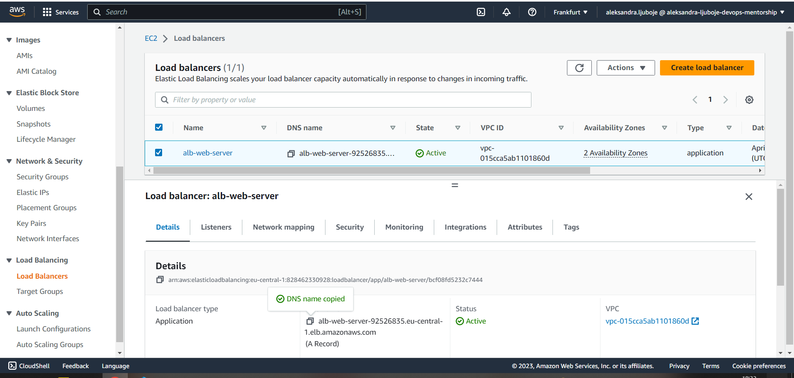

*TASK 7 https://github.com/allops-solutions/devops-aws-mentorship-program/issues/52*

## Povezivanje na EC2 instancu od koje kreiramo AMI
* Na slici vidimo uspjesan pristup instanci i nginx serveru

## Povezivanje na  EC2 instancu kreirane od AMI image-a
* Na slici vidimo uspjesan pristup instanci i nginx serveru

## DNS record ALB 
* Na slici vidimo kreiran Application Load Balancer

## Kreiran Template za ASG

## Kreirana Auto scaling group

## Instance nakon kreiranja ASG 
* Desired je 3 

## Instance dodate automatski u target group

## Povecan broj instanci, ali sa delayom 
* U momentu su `running` 4 instance, ali u ovom dijeli ASG pise 5 zbog `delay`-a od 6-7 min 

## CloudWatch u stanju "In Alarm"

## Nakon smanjenja CPU ispod 18%, smanjen broj instanci na minimum 2

## CloudWatch metrics 
* Instanca na kojoj je testirano povecanje CPU

## Pristup nginx serveru preko ALB

