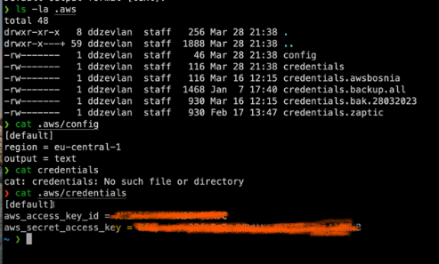

*DevOps mentorship program week-7*
# Kreiranje i korištenje Access  Key
* koristimo za programatic acces našem AWS računu tj. ako želimo koristiti terminal i radimo sa AWS servisima, trebamo imati instalirano CLI za komunikaciju sa AWS-om i možemo raditi sve što smo radili kroz Dashboard 
* **voditi računa o ključevima, jer neko to može zloupotrijebiti jer bi sa ključem imao sve permisije koje i mi imamo kao IAM user nad računom** 
* Alat koji koristimo `AWS CLI` i instaliramo ga na našem terminalu

### Koraci za instalaciju AWS  CLI 
1. Mac 
`$ brew install awscli`
Za ostale
https://docs.aws.amazon.com/cli/latest/userguide/getting-started-install.html
2. `$ aws --version` za provjeru verzije
3. Konfigurišemo lokalno svoj profil za komunikaciju sa AWS 
`$ aws configure`
`AWS Access key ID` -> Access Key **Predjemo na dio Kreiraj access key**
`AWS Secret Access key` -> Secret Access Key
`Default region name (eu-cental-1)`: -> `enter` jer nam je to region
`Default output format (text)`: -> `enter` jer nam odgovara da se ispisuje u formatu text u terminalu.
Dodatni formati:
    * table
    * json
4. Nakon toga imamo kreiran folder `aws`
`$ ls-la .aws`

    Gdje dobijamo 2 fajla:
    * `creditentials`
    * `config`

* Rotirati access key, brisati i kreirati nove kako ih neko ne bi zloupotrijebio 

### Kreiranje Access Key
1. `IAM`->`Users` -> korisnik -> `Access keys` -> `Create access key`
2. Izaberemo:
`Command line Interface CLI` - za šta koristimo access key
`Next`
3. `Description tag value` -> Aleksandras AWS CLI 
4. `Create access key` 
Nakon čega dobijemo 
* Access Key
* Secret access key 
5. Nazad u terminal :)

**VAŽNO**
5. Prije nego kliknemo `Done` uradimo sljedeće
Kopiramo `Access Key` i paste u terminal pod `AWS Access key ID`
Kopiramo `Secret Access Key` i paste u terminal pod `AWS Secret Access key`
**Voditi računa da ovo uradimo prije nego kliknemo Done, jer nakon toga Secret Access Key nije čitljiv**

### Korištenje Access Key

Zanima nas koje EC2 instance imamo pokrenute unutar AWS računa:

1. `$ aws ec2 describe-instances` 
parametar `region` imamo defaultno podešen na `eu-cental-1` te ne moramo unositi 

    Output format je nepregledan, te dodamo sljedeće:
    `$ aws ec2 describe-instances --output json` 
    I dobijamo preglednije propertije, kontekste i komande 

Primjer komande koja nam prikazuje samo Public IP kao property:
`$ aws ec2 describe-instances --query "Reservations[*].Instances[*].PublicIpAdress" `
Rezultat
`3.121.87.66` ili koja je naša public ip adresa

Komande možemo pronaći na https://docs.aws.amazon.com/cli/latest/search.html?q=ec2

`$ aws ec2 describe-instances --instance-ids i-id-ec2-instance --output json`
Rezultat
`3.121.87.66` ili koja je naša public ip adresa
Kada bi imali listu instance ID u fajlu i želimo pokupiti njihovu IP adresu, kao parametar `-i` bismo proslijedili `$1` a `while` petljom prolazili kroz fajl i skripti proslijedimo samo ID-eve.

`Stopped at 1:28:34`