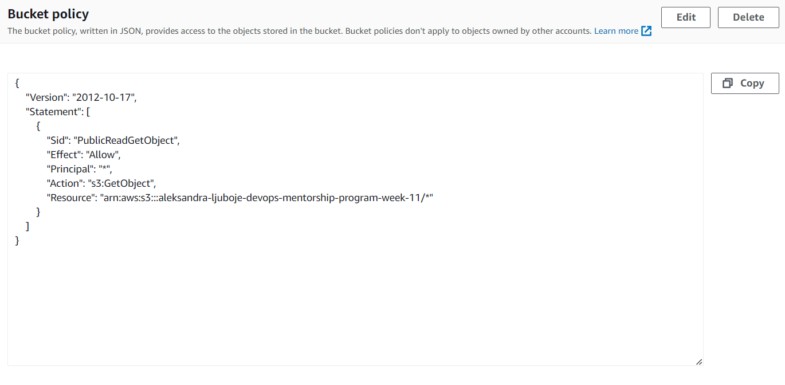
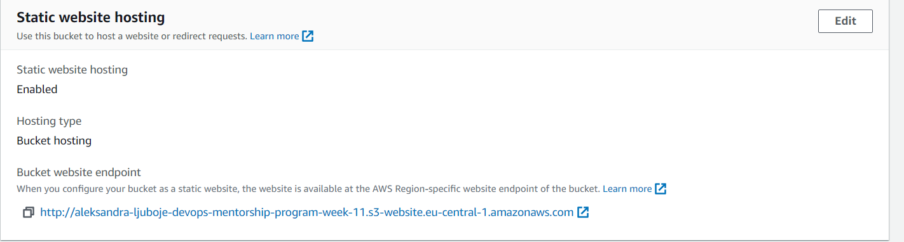
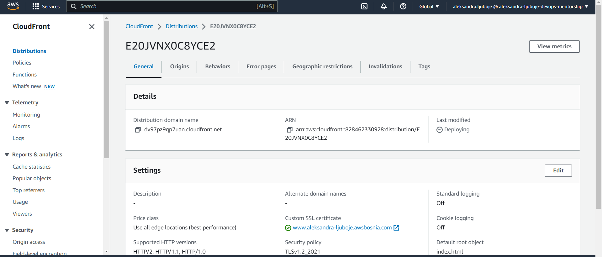
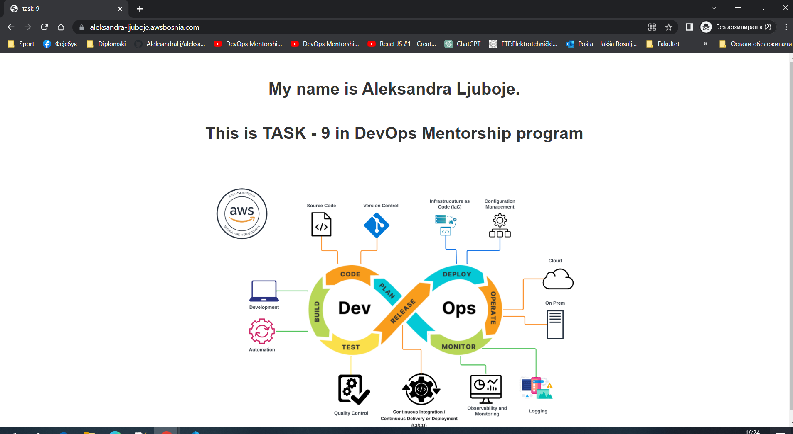

## TASK-9 requested screenshots with description

- S3 bucket policy screenshot

- S3 website endpoint screenshot

- Distribution endpoint screenshot

- Final version

## TASK-9 endpoints

- S3 website endpoint - non-encrypted
    - http://aleksandra-ljuboje-devops-mentorship-program-week-11.s3-website.eu-central-1.amazonaws.com/
- CloudFront distribution endpoint - encrypted
    - https://dv97pz9qp7uan.cloudfront.net/
- R53 record - encrypted
    - https://www.aleksandra-ljuboje.awsbosnia.com/