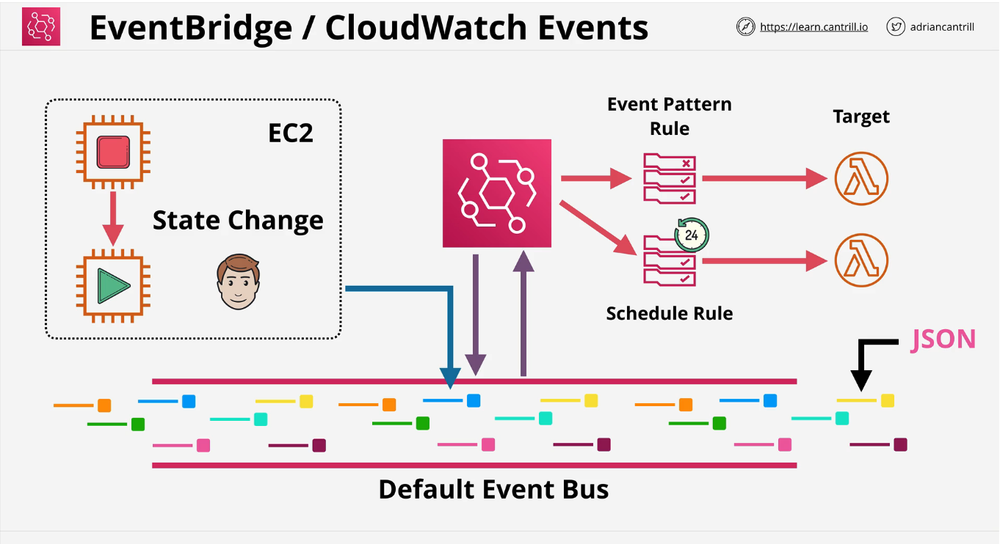

*Associated with week-12/Task-10 available on [link](https://github.com/allops-solutions/devops-aws-mentorship-program/issues/70)*

# CloudWatch Events, EventBridge

* ***CloudWatch*** za metrike i monitoring
* ***CloudWatch Logs*** za smjestanje i upravljanje logovima (*logging data*)

## CloudWatch Events

**CloudWatch Events** dostavljaju *stream* ili veci broj eventa koji su se desili nekim od AWS servisa, sto se desava skoro pa real-time uz mali delay. Na primjer, CW Events mozemo koristiti da obavjesti Lambda funkciju da se desilo terminiranje EC2 instance  i treba nesto poduzeti. 
* Postoji **samo jedan** Event Bus koji nije prikazan unutar User Interface-a, iako smo u interakciji s njim kada trazimo evente i saljemo te evente ka target servisima kada zelimo da se nesto desi 

## EventBridge

**EventBridge** ima iste funkcionalnosti kao i CloudWatch Events uz dodatnu mogucnost hendlovanja eventima od strane third-parties application ili custom application.  Iz ovih razloga, preporuka je da se polako krene u migraciju sa CW Events na EventBridge. 
* Pored defaultnog Event Bus-a, mozemo kreirati dodatne bus-ove bilo da su namijenjeni nasoj aplikaciji ili third-parties aplikacijama 

## Kljucni koncepti

#### Ako se desi X, Y puta... uradi Z
* **X** predstavlja servis koji kreira event **producer of an event**
* **Y** broj puta koliko se nesto desilo  ili period vremena, za specifikaciju koristimmo UNIX cron format koji omogucava da specificiramo jedan ili vise puta kada se nesto treba desiti
* **Z** je target servis kojem se dostavlja event da se dogadjaj X desio 

* Oba servisa imaju istu baznu arhitekturu, koriste default entity - ***Event Bus***, te imaju default event bus za AWS account

***Event Bus*** mozemo zamisliti kao pokretnu traku sa koferima na aerodromu. Gdje bi koferi predstavljali evente, aerodrom je nas AWS account, putnici su AWS servisi koji preuzimaju evente, a stuff aerodroma su AWS servisi koji dostavljaju evente. Na traku, stuff postavlja kofere na kojima pisu podaci o putniku, traka nosi kofere, a putnik kada prepozna svoj kofer i podatke uzima svoj kofer sa trake i odlazi. 
Na slican nacin EventBridge prihvata evente od servisa unutar AWS accounta, nosi te evente, a servisi koji budu obavjesteni da im stize event, rade polling tog eventa sa trake i vrse dalju obradu. 

* Kod oba servisa kreiramo *rules* koji odgovaraju sablonima eventa koji dolaze u bus, kada se prepozna unutar bus-a event, odgovarajuci rule salje event dalje ka target servisu 
* Mozemo uraditi i schedule rules, kako bismo podesili sablone eventa koji se desavaju u neko specificno vrijeme i za to ponovo koristimo UNIX CRON system 

*Slika preuzeta sa learn.cantrill.io SAA*