*Associated with week-12/Task-10 available on [link](https://github.com/allops-solutions/devops-aws-mentorship-program/issues/70)*

# Serverless
# "Serverless is serverless in the way that WiFi is wireless."
Ili nasim rijecima nesto radi, ali kako radi i gdje ne zanima nas. 

**Kljucne prednosti serverless-a:**
* Aplikacije su kolekcije malih funkcija specijalizovanih da odradjuju specificne zadatke.
* Koristi se microservice arhitektura
* Kod funkcije pokrece se u **stateless** i **empheral** okruzenjima
* Sve je ***event-driven***, nista nije u statusu **running** osim ako se to ne zahtjeva, cime se izmedju ostalog izbjegavaju dodatni troskovi
* Kada imamo neke compute procese i funkcionalnosti pozeljno je koriistiti *Function as a Servise (FaaS)* kao sto je Lambda funkcija.
* Umjesto da kreiramo sopstvene servise, pozeljno je koristiti vec postojece cija je integracija pojednostavljena

#### :memo: Koristiti servise kada je moguce, kodirati sto manje i koristiti funkcije za bilo kakve compute funkcionalnosti

* Preporuka je koristiti third-party identity provider, kao na primjer **Google IDP**, za identifikaciju korisnika kada je potrebno
* **Amazon Cognito** je servis koji AWS koristi kako bi preveo generisani Google token u privremene AWS credencijale koji korisniku dozvoljavaju pristup nasoj aplikaciji. AWS ne podraza direktno koristenje Google IDP.
* **Elastic Transcoder** je AWS servis koji sluzi za manipulaciju medijima. Ima mogucnosd da prihvati medije tipa video zapisa, manipulise s njim i radi resize i slicno. Za svaku velicinu videa kreira se **job**. Svaki job, kreira object u transcode bucket-u i podatke upise u DynamoDB

## Simple Notification Service (SNS)
* **Public AWS service** - postavlja se u Public AWS Zone i dostupno je putem Public Interneta uz napomenu da svako ko pristupa servisu mora imati AWS permisije za pristup.
* **VPC takodje moze pristupiti SNS-u** ukoliko je tako podeseno.
* **pub-sub arhitektura** - imamo nekoga ko salje poruke (**publisher**) i nekoga ko je pretplacen na topic i prima poruke (**subscriber**)
* koordinira slanje i primanje poruka velicine <= 256kB payloads
* **SNS Topic** je osnovni entitet SNS-a gdje definisemo permisije i konfiguraciju 
* **Publisher** salje poruke u TOPIC 
* **Subscribers** prima poruke od TOPIC-a na koji je pretplacen

SNS se vise koristi kada zelimo da alertujemo/obavijestimo u real time-u vise subscribera (aplikacije, kompontente u sistemu, ljude etc), monitoring (kada je doslo da breach-a nekog alarma/budgeta, pada nekog servisa etc).

Prakticno da obavijestimo da se desilo nesto, da bi se moglo nesto uraditi povodom tog dogadjaja. 

* Defaultno sve poruke u Topicu ce da se posalju subscriberima tog Topic-a. Postoji mogucnost filtriranja poruka, kako bi se postila preciznost pri slanju informacija subscriberima - koristimo **filter**

* **Fanout** cemo objasniti na primjeru ispod.

Slučaj 3 iz blog post-a [3 ways to decouple your microservices](https://blog.besharp.it/3-ways-to-decouple-your-microservices-sqs-queues-elb-load-balancing-and-sns-notification-system/?utm_source=linkedin&utm_medium=organic_post&utm_campaign=architecting&utm_content=articolo_20230512) . Slika je prikaz arhitekture za taj slucaj.

*Slika preuzeta sa blog posta blog post-a [3 ways to decouple your microservices](https://blog.besharp.it/3-ways-to-decouple-your-microservices-sqs-queues-elb-load-balancing-and-sns-notification-system/?utm_source=linkedin&utm_medium=organic_post&utm_campaign=architecting&utm_content=articolo_20230512)*

Dakle, kada korisnici upload-uju slike prva EC2 instanca/instance rade backend sto podrazumijeva smjestanje slike na S3 bucket, dok se metadata smjesta u RDS.

Onog momenta kada se uploaduje slika, desava se slanje poruke putem SNS na topic naziva `nova-slika`
Na SNS topic su pretplacena dva SQS servisa, jedan vezan za compresovanje podataka, drugi za resize slike [vezani za EC2 instance koje rade te funkcije].

Ako se istovremeno desilo vise upload-a, SNS bi generisao vise poruka o novim slikama, a da te poruke ne bismo izgubili onda koristimo SQS koji ce cuvati te poruke u redu i slati ih EC2 instancama. Ako EC2 instanca obradi te poruke, one se iz SQS queue-a brisu. A ako se desi da EC2 vrati neki error i nije obradila poruke, onda se one nakon setovanog broja ponovnih slanja smjestaju u dead-letter queues (naravno ako smo ih prethodno podesili).

**Slucaj  sa 2 SQS Queue-a je proces fan-out-a, gdje se jedan Queue koristi za jednu stvar, a drugi za drugo nad istom porukom**

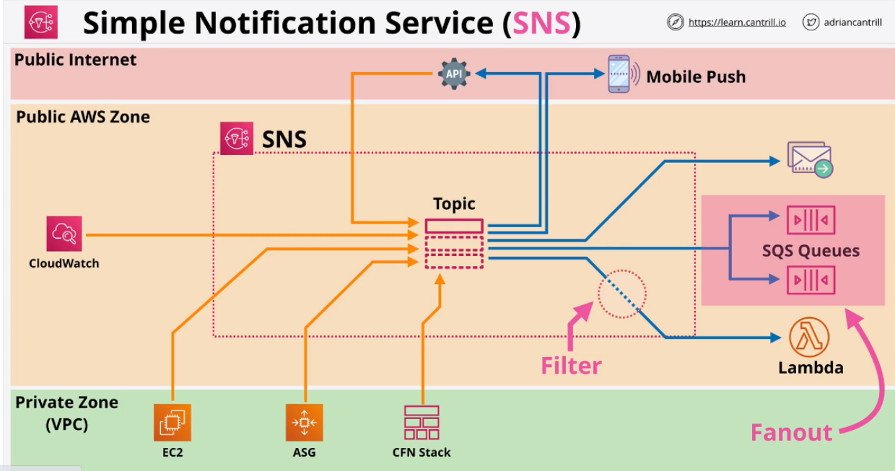
*Slika preuzata sa learn.cantrill.io SAA*

***SNS nudi:***
* Delivery Status - HTTP, Lambda, SQS - status dostavljenih poruka ka subscriberima
* Delivery Retries - koncept reliable delivery-a
* Highly Available and Scalable (region) -regionaly resilient service
* Server Side Encryption (SSE)
* Cross-Account via TOPIC Policy 

## Step Functions

* Limiti Lambda servisa 
    * nikada ne postavljati cijeli kod aplikacije unutar Lambda funkcije, posebno ne zbog timeout-a od 15min 
    * Moguce uvezati lambda funkcije da rade invoke druge Lambda funkcije, ali nastaje problem pri skaliranju 

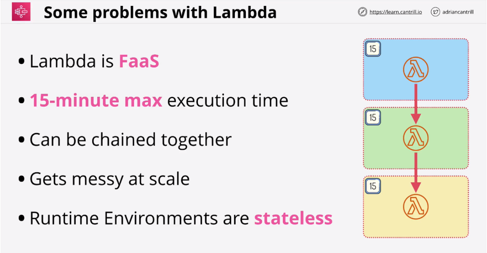
*Slika preuzata sa learn.cantrill.io SAA*

* Step functions omogucavaju kreiranje State Machines  koji mozemo posmatrati kao workflow. Ima **start point** i **end point** izmedju kojih se nalazi **states**- stvari koje se desavaju unutar State Machine
* States uzimaju data, obradjuju data, vracaju data 
#### :memo: Standard workflow je default i ima 1 godinu execution limit. Express je dizajniran za high volume event-processing workloads npr. IOT, streaming, data processing itd. - run up to 5 min. Koristimo standard  za long-running, express za highly transactional i traze vise processing guarantees
* najcesce koristene za backend procese 
* mozemo kreirati template za kreiranje i export SM-a koji se zove - Amazon states language (ASL) - json template 
* permisije se dodjeljuju pomocu IAM roles

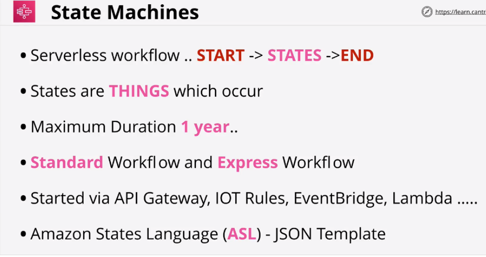
*Slika preuzata sa learn.cantrill.io SAA*

* Stanja state funkcije
    * **wait** ceka odredjeni period vremena ili do nekog odredjenog datuma i vremena. Moze pauzirati rad SM-a, odredjeni dio vremena ili do nekog datuma koji specificiramo 
    * **choice** omogucava SM da promijeni pravac izvrsenja zavisno od inputa 
    * **parallel** kreiranje paralelnih grana unutar SM sto omogucava izvrsenje seta instrukcija istovremeno 
    * **map** prihvata listu stvari i za svaku stavku iz liste vrse se odredjene akcije 
    * **task** single unit of work pefrormed by SM 

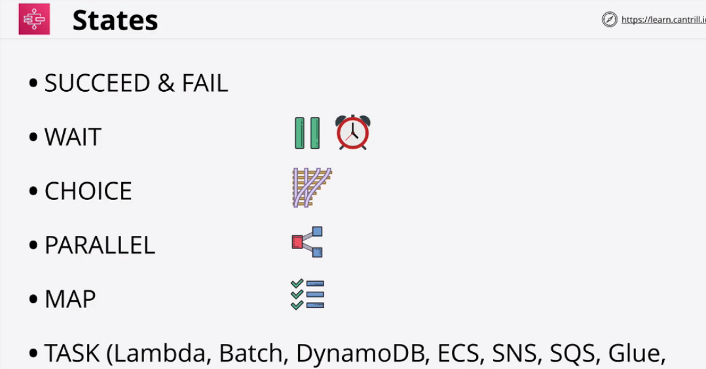
*Slika preuzata sa learn.cantrill.io SAA*

* Dijagram sa primjerom funkcionisanja state functions

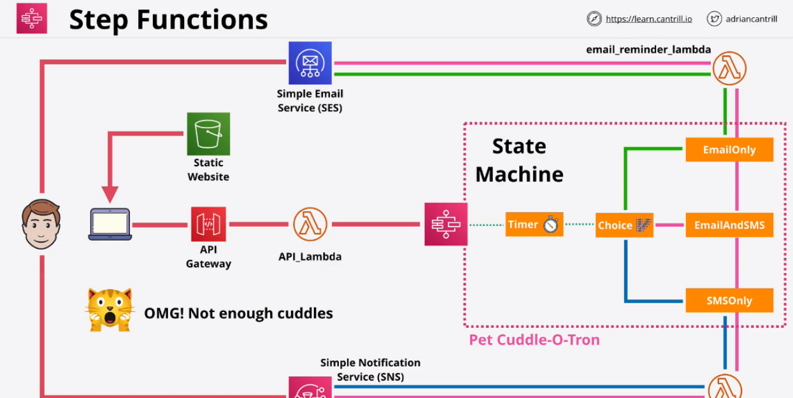
*Slika preuzata sa learn.cantrill.io SAA*

##  API Gateway 101

* API Gateway is a managed service koji omogucava kreiranje  of API Endpoints, Resources & Methods.
* API predstavlja nacin na koji aplikacije medjusobno komuniciraju

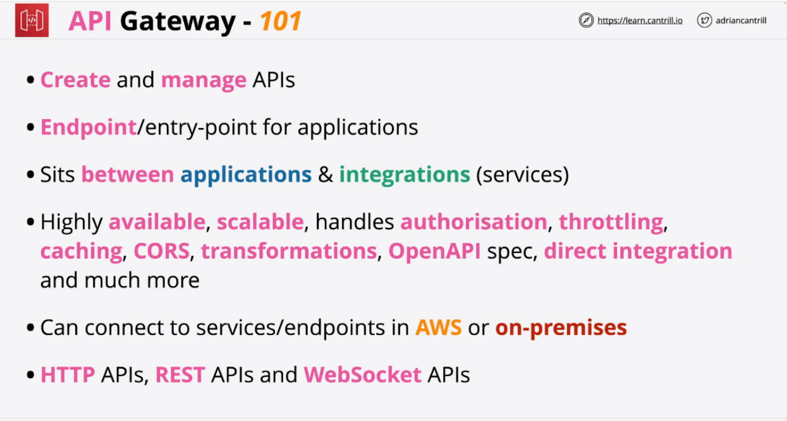
*Slika preuzata sa learn.cantrill.io SAA*

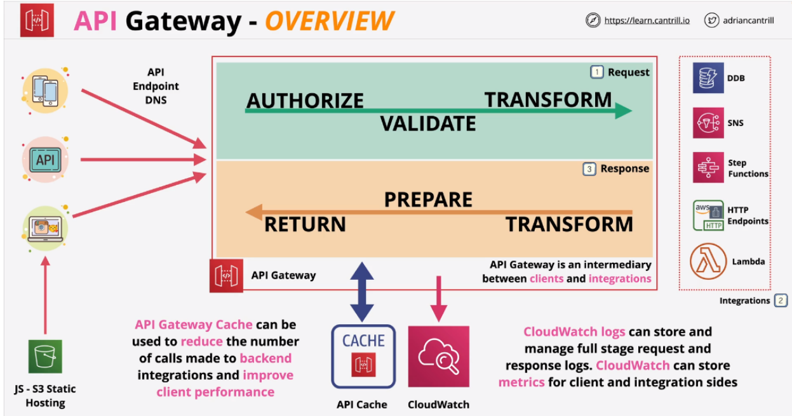
*Slika preuzata sa learn.cantrill.io SAA*

#### API Gateway - Authentication

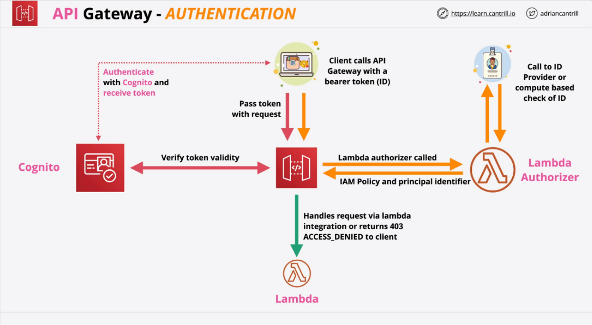
*Slika preuzata sa learn.cantrill.io SAA*

#### API Gateweay - Endpoint types

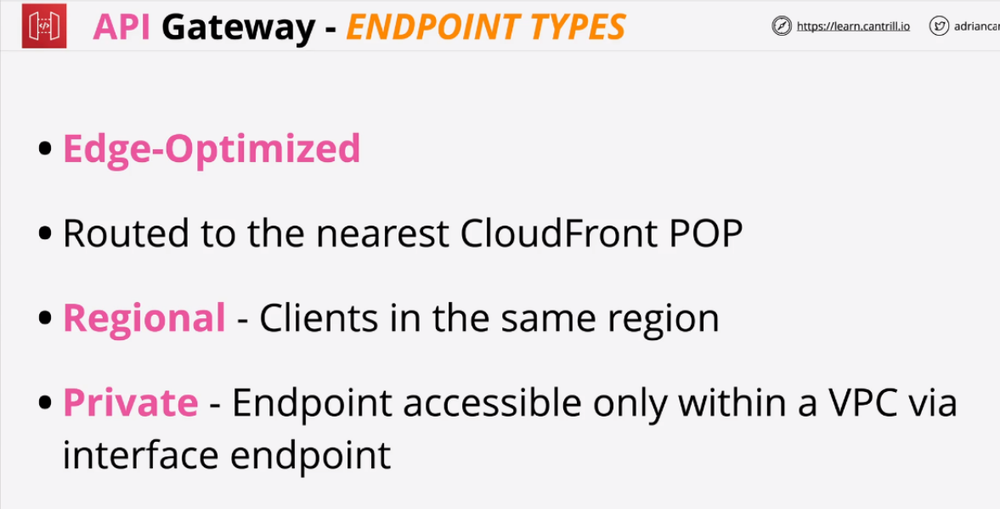
*Slika preuzata sa learn.cantrill.io SAA*

#### API Gateway - Stages

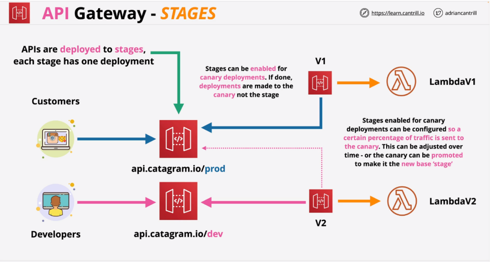
*Slika preuzata sa learn.cantrill.io SAA*

#### :memo: API Gateway - ERRORS

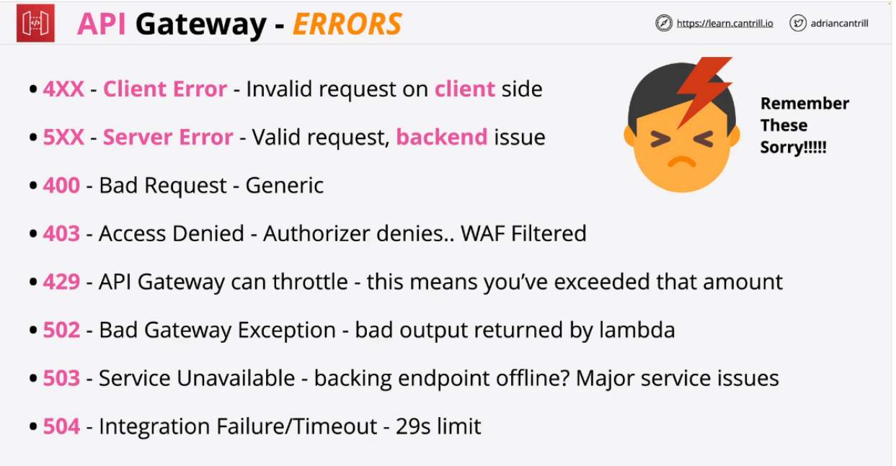
*Slika preuzata sa learn.cantrill.io SAA*

#### API Gateway - Caching
#### :memo: Cache moze biti encrypted
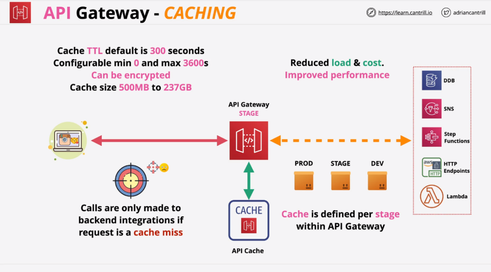
*Slika preuzata sa learn.cantrill.io SAA*

## Simple Queue Service

- SQS queues su  *managed message queue service* koji pomazu pri  *decouple application components*, omogucavaju Asynchronous messaging i implementaciju *worker pools*
- Public, Fully Managed, Highly-Available Queues - Standard or FIFO.
- Messages velicine 256KB  - link to large data
- Poruke koje su polled iz reda nisu obrisane, vec postaju nevidljive odredjeni period vremena. Ako korisnik ne obrise poruku unutar VisibilityTimeout, kada ovo vrijeme istekne poruka ce se opet pojaviti u redu 
- Dead-Letter queues koriste se za  problematicne  poruke koje treba obraditi
- ASG can scale and Lambdas invoke based on queue lenght

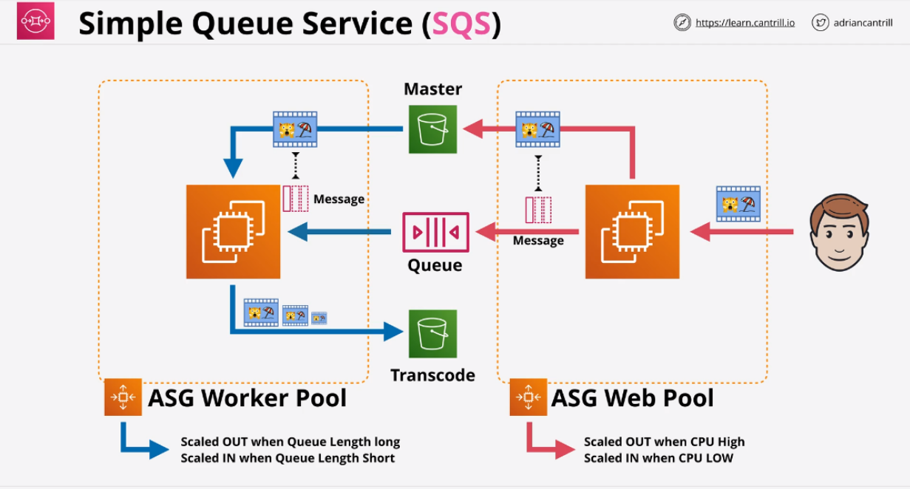
*Slika preuzata sa learn.cantrill.io SAA*

## SQS Standard vs FIFO Queues
- Standard = at-least-once delivery, FIFO = exactly-once delivery, messages in order first-in, first-out.
- FIFO (Performance) 3.000 messages per second with batching (10 poruka ili 64kB total), or up to 300 messages per second without
- Billed based on 'requests'
- 1 request = 1-10 messages up to 64KB total
- Short (immediate) vs Long (waitTimeSeconds) Polling
- Encryption at rest (KMS) and  in-transit
- Queue policy
- Poruke su u SQS 14 dana

#### :memo: Fifo imaju uvijek sufix .fifo
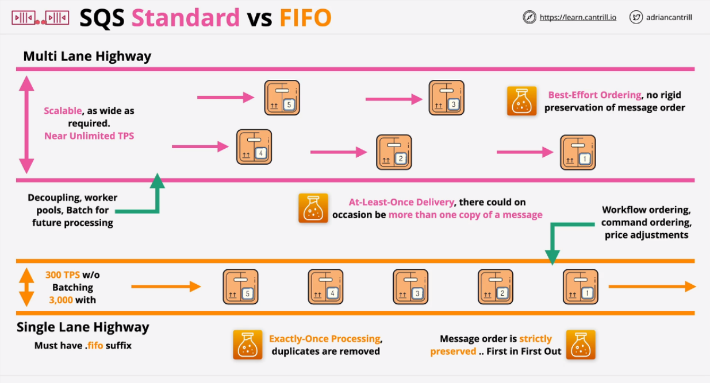
*Slika preuzata sa learn.cantrill.io SAA*

Mozemo razlikovati dva tipa queue i to
1.  **FIFO ( First in first out)** sto bi znacilo da onaj ko prvi dodje na kasu, prvi ce i da bude usluzen, dok ce zadnja osoba koja dodje i stane u red, zavrsiti zadnja. Sve se obradjuje po redoslijedu dolaska i garantuje se da ce poruke biti primjljene u onom redoslijedu u kojem su i poslate.

2. **Standardni  queue** -  FIFO redoslijed ne mora biti nuzan, mozemo stajati u redu i cekati svoje mjesto, ali ce doci neka starija baka i mi cemo joj ustupiti svoje mjesto. Ovo u FIFO redu nije dozvoljeno, ali standardni queue to dozvoljava. 
Dakle, nema garancije da poruke stizu na odrediste onim redoslijedom u kojem smo ih poslali.

**Queue lenght** je kapacitet reda tj. broj poruka koje red moze prihvatiti. 
Ovaj parametar moze se koristiti u svrhe trigerovanja Auto Scaling grupe il nekog drugog servisa. 
Dakle, servis ce da provjerava ili ce biti obavjesten putem drugog servisa da je stigla poruka u red tj. da je *queue lenght* promijenjen i nije nula. Tada servis moze da odradi potrebne operacije kako bi obradio poruku koja je stigla u red. 
Poruka koja je obradjena se sklanja iz reda a termin koji se koristi za ovo je **pulling the queue**. 

*Slika preuzeta sa blog posta dostupnog na [linku](https://devdojo.com/amp/algonoob/queues)*

## SQS Delay Queues

- *Delay queues provide an initial period of invisibility for messages. Predefine periods can ensure that processing of messages doesn't begin until this period has expired.*

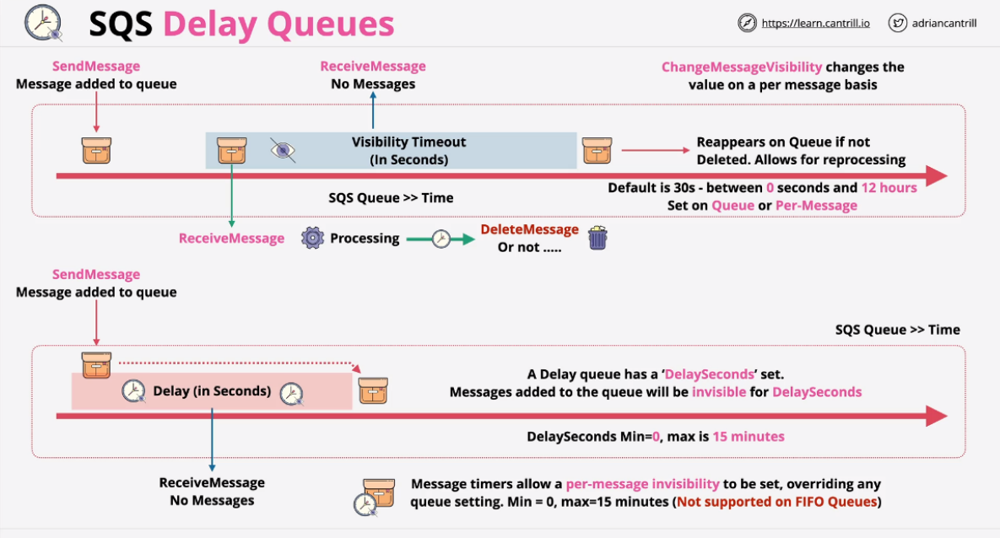
*Slika preuzata sa learn.cantrill.io SAA*