*Associated with week-12/Task-10 available on [link](https://github.com/allops-solutions/devops-aws-mentorship-program/issues/70)*

# Automated EC2 Control using Lambda and Events 

**IAM User 1 ce svoje resurse da kreira unutar eu-central-1 regiona.**
* zbog toga je potrebno u `.py` fajlovima voditi racuna o navedenim regionima 

* Zadatak je da se kreiraju 2 EC2 instance, a zatim koriste 3 Lambda funkcije koje cije su funkcije:
    * 1 Lambda funkcija pokrece instance
    * 1 Lambda funkcija stopira instance
    * 1 Lambda funkcija stiti instancu na nacin da ako neka instanca bude stopirana, ponovo ce je pokrenuti 

* Kreiramo STACK koji je dostupan na [linku](https://us-east-1.console.aws.amazon.com/cloudformation/home?region=us-east-1#/stacks/create/review?templateURL=https://learn-cantrill-labs.s3.amazonaws.com/awscoursedemos/0024-aws-associate-lambda-eventdrivenlambda/twoec2instances.yaml&stackName=TWOEC2)

#### Kreiramo stack 

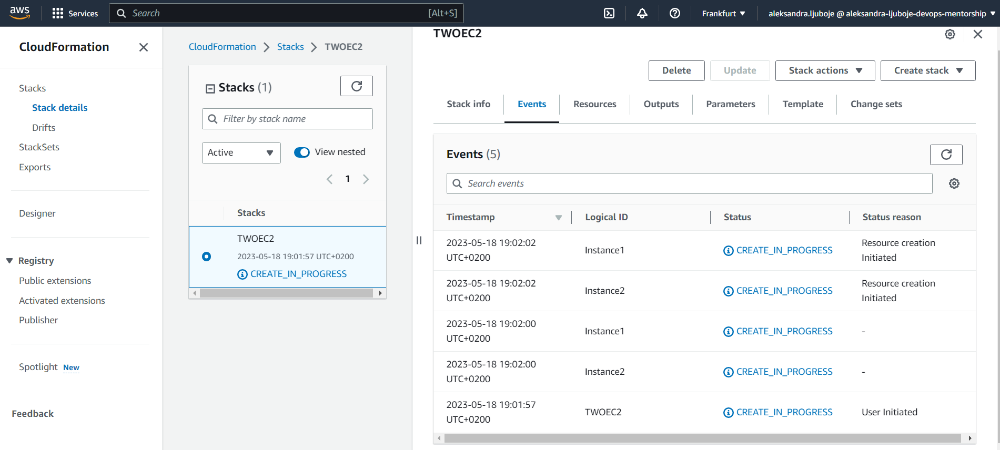

#### Nakon kreiranja stack-a, vidimo pokrenute dvije EC2 instance u odgovarajucem regionu 

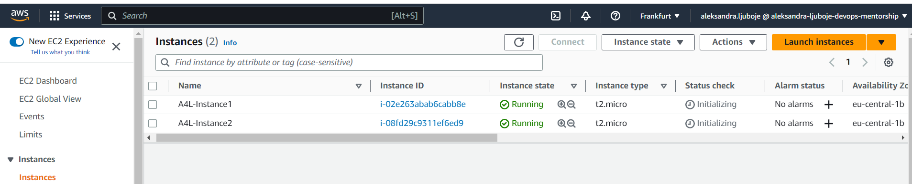

#### Kreiramo IAM role i dodamo permisije 
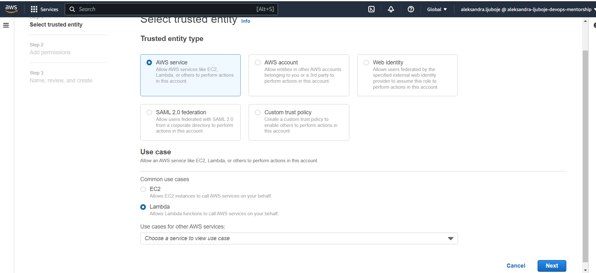
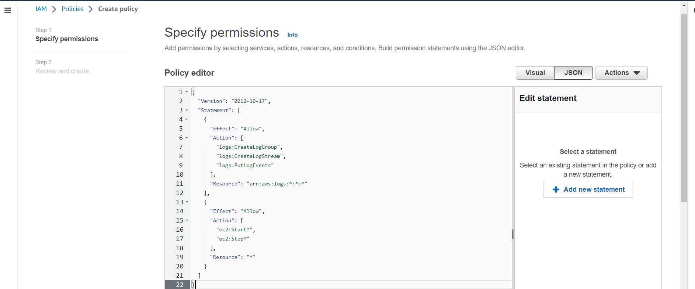
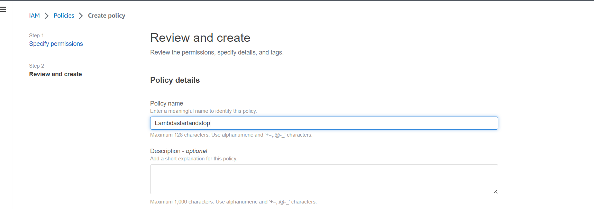
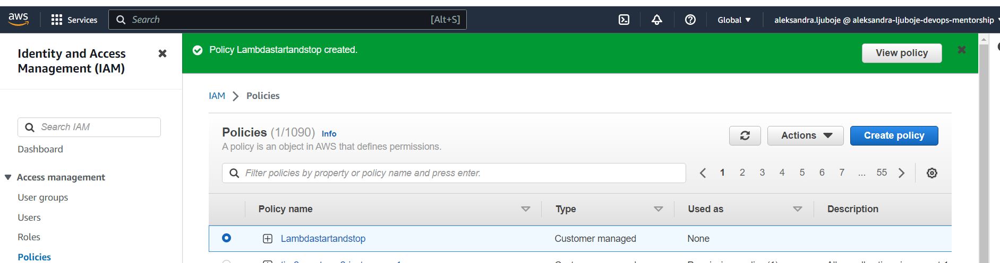
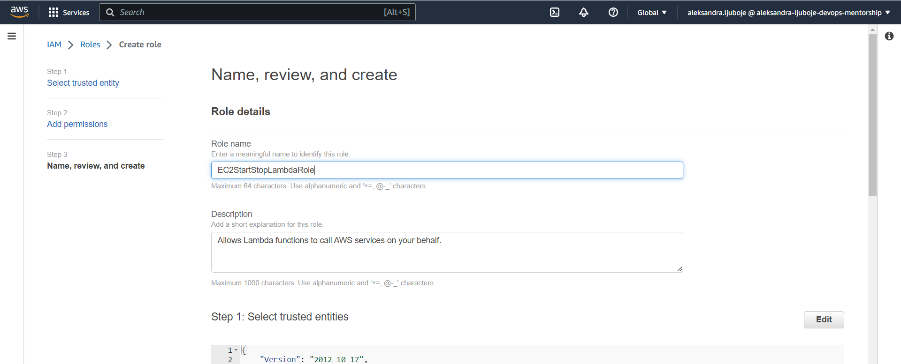
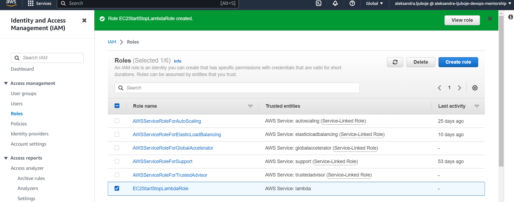

#### Kreiramo Lambda funkcije
* Proces kreiranja je isti za sve funkcije
    * Izaberemo ime
    * Izaberemo runtime Python 3.9
    * Izaberemo existing role - EC2StartStopLambdaRole
   
  

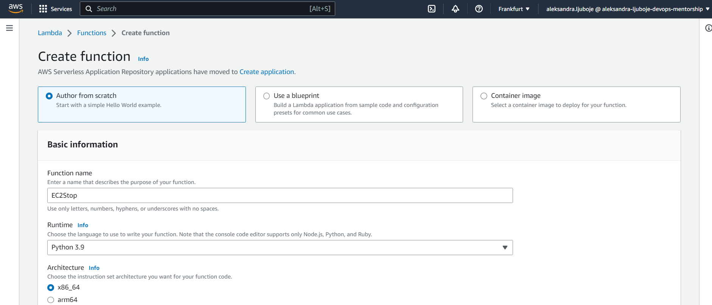

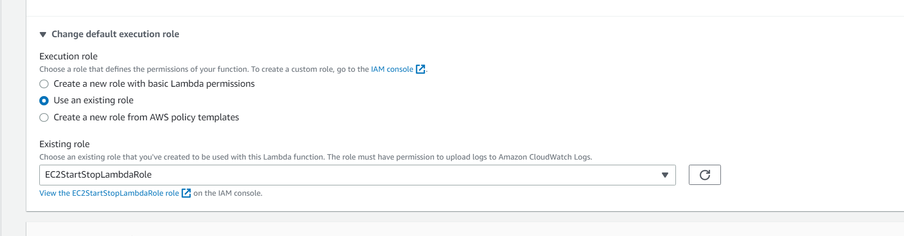

 * Dodamo potrebni JSON kod uz izmjenu regiona na `eu-central-1`

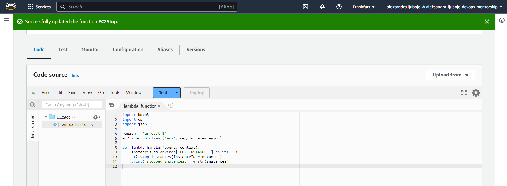

  * Kreiramo Enviroment varijablu EC2_INSTANCES gdje dodamo ID-eve instanci, odvojene zarezom za EC2Stop i EC2Start lambda funkcije.
    * Izuzetak je EC2Protect funkcija kojoj nije potrebno kreirati varijablu jer se ID instance prosljedjuje 

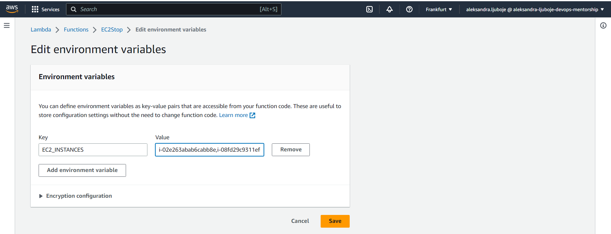

#### Testiranje Lambda funkcija EC2Stop 
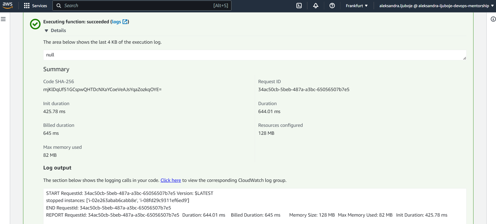
#### Testiranje Lambda funkcija EC2Start  
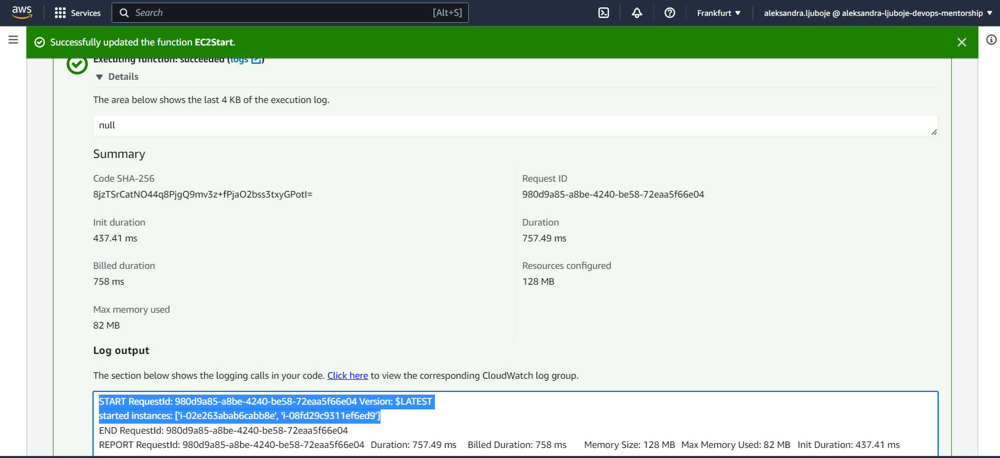

* Nakon kreiranih Lambda funckija EC2Stop, EC2Start, EC2Protect potrebno je testirati obje instance. Instanca broj 2 za koju nije primjenjena EC2Protect funkcija, nakon stopiranja ostaje u stanju stopped. Dok ce se u slucaju stopiranja prve EC2 instance, ciji smo ID postavili unutar EC2Protect funkcije, ista ponovo podici u status `Running`
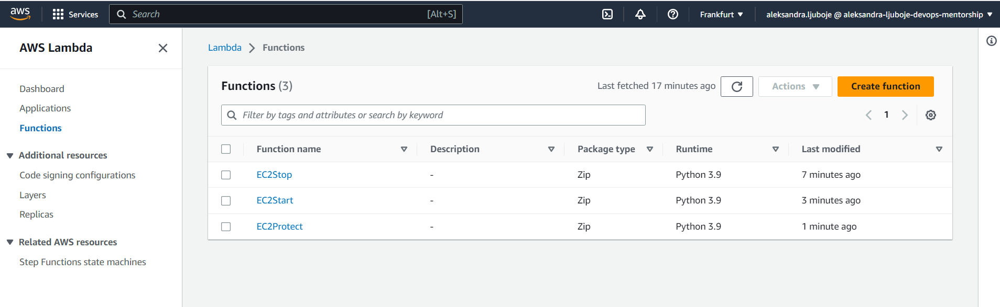

#### Rules koje smo postavili unutar Event Bridge  
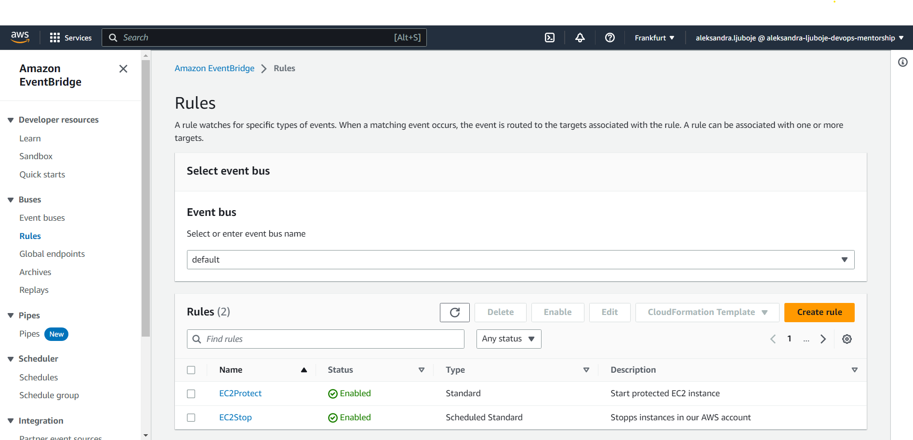

#### Testiranje prve EC2 instance nakon sto se desio Scheduled event i stopirao obje instance, te ponovno pokretanje prve instance zbog EC2Protection Lambda funkcije

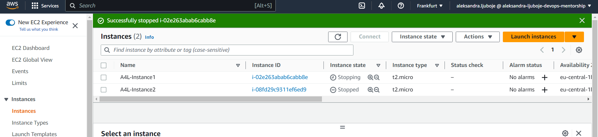
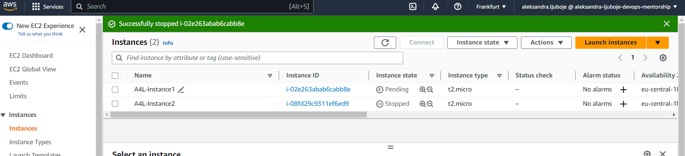
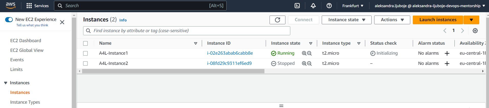

#### Kako smo sve povezali sa CloudWatch, dostupni su nam logovi 

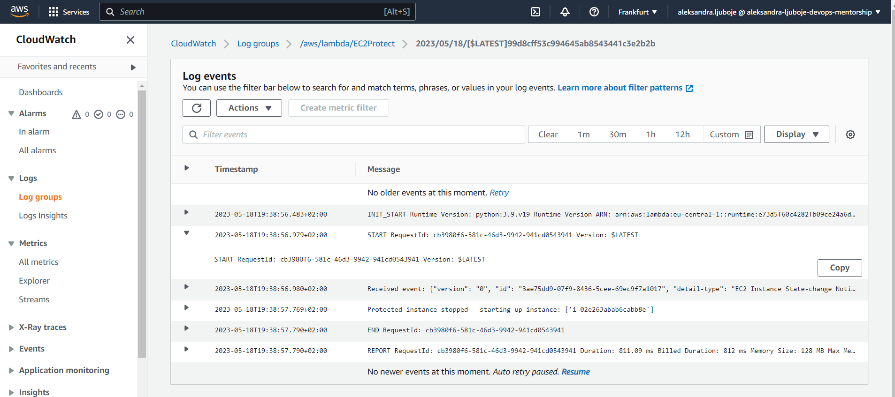
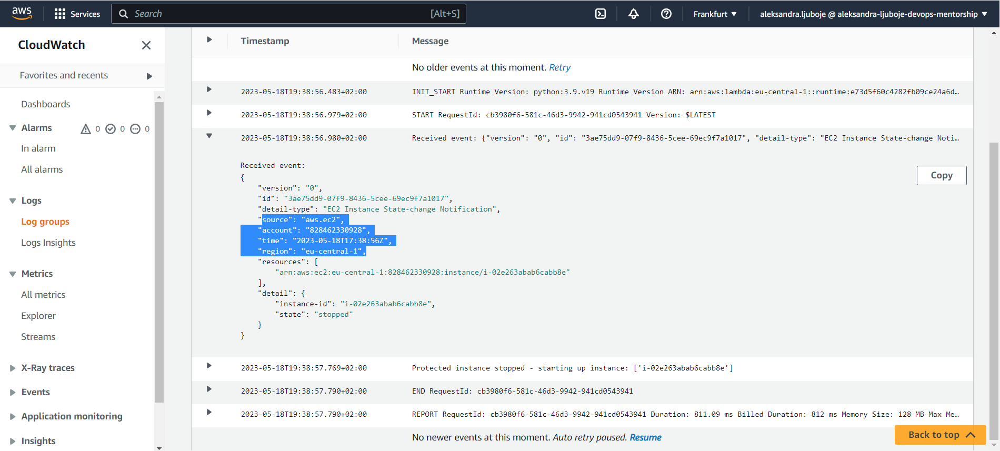