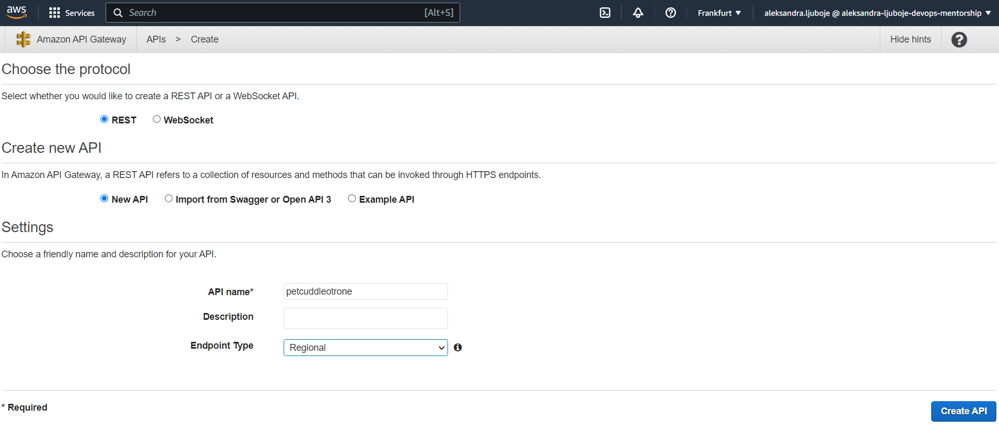

*Associated with week-12/Task-10 available on [link](https://github.com/allops-solutions/devops-aws-mentorship-program/issues/70)*

# Pet Cuddle-o-Tron mini project 
* Implementacija fully serverless aplikacije koristeci Step funkcije, Lambda, API Gateway i S3 website hosting 


## STAGE 1 - Configuring SES
* **SES** Simple Email service, korisimo za slanje i primanje email-ova unutar aplikacije. **SANDBOX MODE** da izbjegnemo spam pa moramo staviti adrese na whitelist kako bismo omogucili komunikaciju
* Email from Pet app will come from aleksandra-main-email
* Email to send emails - email-od-poslasticarnice


#### 1. Verifikovan application main email 


#### 2. Verifikovan customer  email 


#### SES Verified Identities 


## STAGE 2 - Configuring Lambda function


####  Create STACK, IAM Role and Lambda 


#### Lambda role created


#### Lambda email-reminder-lambda function


#### Lambda email-reminder-lambda function deployed


## STAGE 3 - State Machine


#### Kreiran STACK za State Machine role i rola dodata u IAM roles


#### Kreiranje State Machine in Step Function


```bash
{
  "Comment": "Pet Cuddle-o-Tron - using Lambda for email.",
  "StartAt": "Timer",
  "States": {
    "Timer": {
      "Type": "Wait",
      "SecondsPath": "$.waitSeconds",
      "Next": "Email"
    },
    "Email": {
      "Type" : "Task",
      "Resource": "arn:aws:states:::lambda:invoke",
      "Parameters": {
        "FunctionName": "EMAIL_LAMBDA_ARN",
        "Payload": {
          "Input.$": "$"
        }
      },
      "Next": "NextState"
    },
    "NextState": {
      "Type": "Pass",
      "End": true
    }
  }
}
```

* `EMAIL-LAMBDA-ARN` zamijeniti sa arn kreirane lambda funkcije, omoguciti logove koristeci postojecu rolu i dozvoliti ALL sve logove.


arn:aws:states:eu-central-1:828462330928:stateMachine:PetCuddleOTrone


## STAGE 4  - Lambda funkcija za API, Konfiguracija API i API Gateway


#### Kreiranje supportinng Lambda funkcije za API 


#### Kreiranje API Gateway, API i metod koji nasa serverless app koristi
* Kreiramo REST API
 
 


#### Kreiranje resursa 

 

 #### Kreiranje metode POST + oznaciti  Proxy integration (naknadno uradjeno)

 

 #### Method execution

 

 #### Action -> Deploy API

 


 ## STAGE 5  - Client Side Application 

  #### Kreirati S3 public bucket petcuddleotrone2212, omoguciti static website hosting, izmijeniti fajlove i dodati ih na bucket

* Bucket policy
```bash
{
    "Version":"2012-10-17",
    "Statement":[
      {
        "Sid":"PublicRead",
        "Effect":"Allow",
        "Principal": "*",
        "Action":["s3:GetObject"],
        "Resource":["REPLACEME_PET_CUDDLE_O_TRON_BUCKET_ARN/*"]
      }
    ]
  }
  ```

 

#### Testiranje aplikacije 


#### Testiranje aplikacije - ERROR


* Nakon troubleshoot-a greska koja se desila je sljedeca


`Missing authentication token	"x-amzn-errortype" = "MissingAuthenticationTokenException"	"Missing Authentication Token"	An authentication token wasn't found in the request.`
