*This file is related to TASK-11 available on [link](https://github.com/allops-solutions/devops-aws-mentorship-program/issues/73)*

Links related to task :
[AWS CloudFormation](https://catalog.us-east-1.prod.workshops.aws/workshops/484a7839-1887-43e8-a541-a8c014cd5b18/en-US/cfn)
[AWS Tools GitFlow Workshop](https://catalog.us-east-1.prod.workshops.aws/workshops/484a7839-1887-43e8-a541-a8c014cd5b18/en-US/introduction)
[A successful Git branching model](https://nvie.com/posts/a-successful-git-branching-model/) - Feature branch, Release branch, Hotfix branch and merging

# Implementing GitFlow using AWS Tools Workshop

*At the end of this workshop, you will learn below:
Automate CodePipeline creation for Master and Develop branches using CloudFormation
Automate creation of environment per branch using CloudFormation
Automate CodePipeline creation and deletion of short-lived branches using Lambda and CodeCommit trigger
Deploy an Elastic Beanstalk Application using CodeCommit, CodeBuild and CodePipeline
Automate cleanup of environments, branches, Lambda and Elastic BeanStalk Application*

## Branching models

Za lakse razumijevanje prije ovog dijela pozeljno je procitati blog post [A successful Git branching model](https://nvie.com/posts/a-successful-git-branching-model/) - Feature branch, Release branch, Hotfix branch and merging

Trenutno se najvise koriste dva branching modela:
* **Trunk based model**
Kako bi se izbjegao kompleksan problem merge-anja i kako developeri ne bi morali kreirati zasebne grane u kojima bi se radio CI deployment, koristi se jedna **trunk** grana. 
* **Feature-based aka GitFlow development**
Feature grana kreira se za svaki novi feature koji razvijamo sve dok se ne odluci da ce taj isti feature da ide na stvarni projekat, kada ce se uraditi merge na development i master/main granu.

#### Long-running branches

 they remain in your project during its whole lifetime. Other branches, e.g. for features or releases, only exist temporarily: they are created on demand and are deleted after they've fulfilled their purpose.
* **Master** always and exclusively contains production code

* **Develop** is the basis for any new development efforts you make.

#### GitFlow guidelines

- Use development as a continuous integration branch.
- Use feature branches to work on multiple features.
- Use release branches to work on a particular release (multiple features).
- Use hotfix branches off master to push a hotfix.
- Merge to master after every release.
- Master contains production-ready code.

## Kreiranje Workspace-a

### Launch AWS Cloud9 in eu-central-1 

1. U AWS Cloud9 console, izabrati Create environment.
2. Select Create environment
3. Nazovemo ga `gitflow-workshop`, sve ostalo je defaultna postavka
4. Kliknuti na kreirani enviroment i *Open in Cloud9*

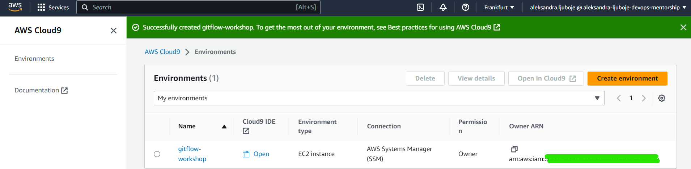

Kada se kreira enviroment, zatvoriti welcome tab i  lower work area, te otvoriti terminal 

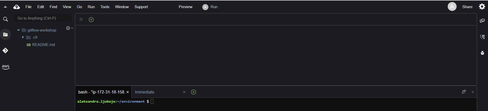

> **Note**
> Ostaviti AWS Cloud9 IDE otvoren u  tab tokom kreiranja workshop-a jer ce se koristiti za akcije poput cloning, pushing changes to repository and using the AWS CLI.


### Access AWS Cloud9 IDE
> **Note**
> *AWS Cloud9  is a cloud-based integrated development environment (IDE) that lets you write, run, and debug your code with just a browser. It includes a code editor, debugger, and terminal. Cloud9 comes prepackaged with essential tools for popular programming languages, including JavaScript, Python, PHP, and more, so you don’t need to install files or configure your development machine to start new projects. Since your Cloud9 IDE is cloud-based, you can work on your projects from your office, home, or anywhere using an internet-connected machine. Cloud9 also provides a seamless experience for developing serverless applications enabling you to easily define resources, debug, and switch between local and remote execution of serverless applications. With Cloud9, you can quickly share your development environment with your team, enabling you to pair program and track each other's inputs in real time.*

### Resize the Cloud9 instance
* *By default the Amazon EBS volume attached to the Cloud9 instance is 10 GiB* sto mozemo potvrditi komandom
`$ df -h`

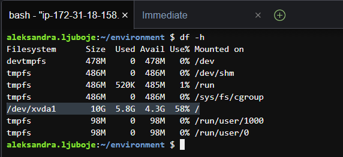

> **Warning**
> 4.3 GiB of free space nije dovoljno free space za workshop pa je potrebno promijeniti velicinu attached Amazon EBS volume.

Koraci za resize se mogu pogledati u guide [Resize an Amazon EBS volume that an environment uses](https://docs.aws.amazon.com/cloud9/latest/user-guide/move-environment.html#move-environment-resize)

* U Cloud9 terminalu kreiramo file  `resize.sh`
`$ touch resize.sh`

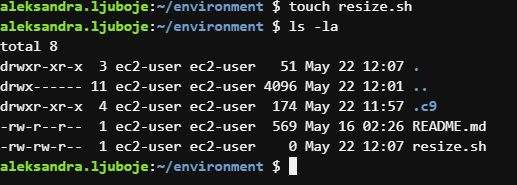

* Open `resize.sh` in Cloud9, u gornjem dijelu paste skriptu i sacuvati Ctrl+S

```bash
#!/bin/bash

# Specify the desired volume size in GiB as a command line argument. If not specified, default to 20 GiB.
SIZE=${1:-20}

# Get the ID of the environment host Amazon EC2 instance.
INSTANCEID=$(curl http://169.254.169.254/latest/meta-data/instance-id)
REGION=$(curl -s http://169.254.169.254/latest/meta-data/placement/availability-zone | sed 's/\(.*\)[a-z]/\1/')

# Get the ID of the Amazon EBS volume associated with the instance.
VOLUMEID=$(aws ec2 describe-instances \
  --instance-id $INSTANCEID \
  --query "Reservations[0].Instances[0].BlockDeviceMappings[0].Ebs.VolumeId" \
  --output text \
  --region $REGION)

# Resize the EBS volume.
aws ec2 modify-volume --volume-id $VOLUMEID --size $SIZE

# Wait for the resize to finish.
while [ \
  "$(aws ec2 describe-volumes-modifications \
    --volume-id $VOLUMEID \
    --filters Name=modification-state,Values="optimizing","completed" \
    --query "length(VolumesModifications)"\
    --output text)" != "1" ]; do
sleep 1
done

#Check if we're on an NVMe filesystem
if [[ -e "/dev/xvda" && $(readlink -f /dev/xvda) = "/dev/xvda" ]]
then
  # Rewrite the partition table so that the partition takes up all the space that it can.
  sudo growpart /dev/xvda 1

  # Expand the size of the file system.
  # Check if we're on AL2
  STR=$(cat /etc/os-release)
  SUB="VERSION_ID=\"2\""
  if [[ "$STR" == *"$SUB"* ]]
  then
    sudo xfs_growfs -d /
  else
    sudo resize2fs /dev/xvda1
  fi

else
  # Rewrite the partition table so that the partition takes up all the space that it can.
  sudo growpart /dev/nvme0n1 1

  # Expand the size of the file system.
  # Check if we're on AL2
  STR=$(cat /etc/os-release)
  SUB="VERSION_ID=\"2\""
  if [[ "$STR" == *"$SUB"* ]]
  then
    sudo xfs_growfs -d /
  else
    sudo resize2fs /dev/nvme0n1p1
  fi
fi

```

* From the terminal execute the resize.sh bash script to resize the attached EBS volume to 30 GiB
`$ bash resize.sh 30`

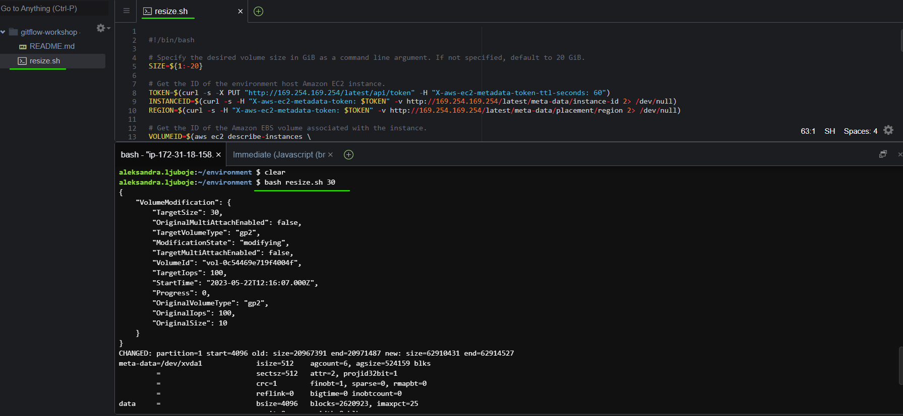

Provjerimo da li je doslo do promjene 
`$ df -h`

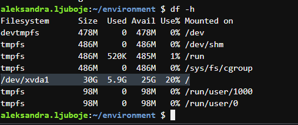

### Initial Setup

* Kada smo uradili resize EBS volume na 30 GiB mozemo odraditi inicijalni setup koristeci `git config` komandu gdje cemo setovati nas `user.name` i  `user.email` koristeci sljedece komande:

`$ git config --global user.name "aleksandra-ljuboje"`
`$ git config --global user.email aleksandraljuboje@gmail.com`

### Configure the AWS CLI Credential Helper on Your AWS Cloud9 EC2 Development Environment
> **Note**
> *After you've created an AWS Cloud9 environment, you can configure the AWS CLI credential helper to manage the credentials for connections to your CodeCommit repository. The AWS Cloud9 development environment comes with AWS managed temporary credentials that are associated with your IAM user. You use these credentials with the AWS CLI credential helper. The credential helper allows Git to use HTTPS and a cryptographically signed version of your IAM user credentials or Amazon EC2 instance role whenever Git needs to authenticate with AWS to interact with CodeCommit repositories.*

* Za konfiguraciju AWS CLI Credential helper-a za HTTPS konekciju koristimo sljedece  komande
```bash
git config --global credential.helper '!aws codecommit credential-helper $@'
git config --global credential.UseHttpPath true
```

### Install gitflow
> **Note**
> gitflow is a collection of Git extensions to provide high-level repository operations for Vincent Driessen's branching model

* Komande za instalaciju 
```bash
curl -OL https://raw.github.com/nvie/gitflow/develop/contrib/gitflow-installer.sh
chmod +x gitflow-installer.sh
sudo git config --global url."https://github.com".insteadOf git://github.com
sudo ./gitflow-installer.sh

```

Na slici su prikazane koristene komande i output, te kreirani fajlovi
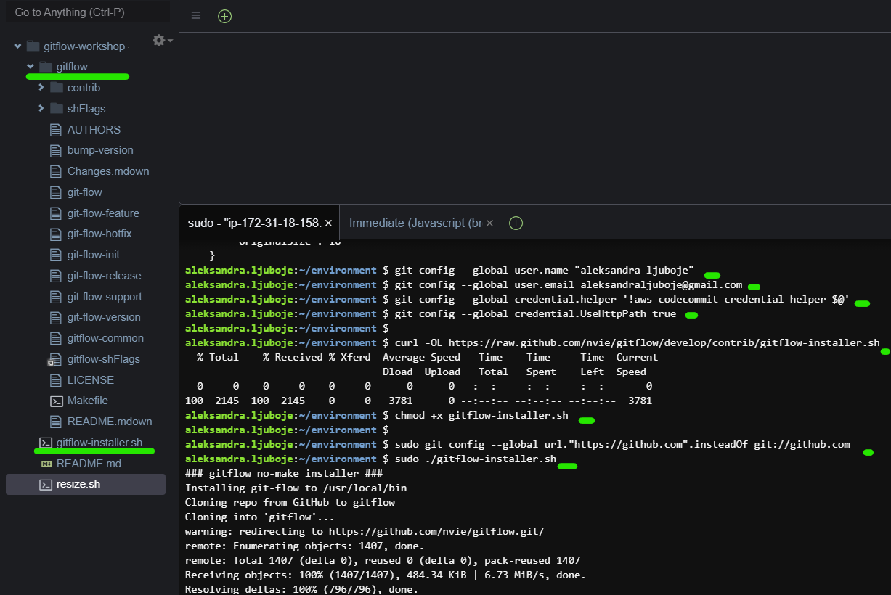


# AWS Cloudformation
> **Note**
> U ovom tasku AWS CloudFormation koristice se u svrhu podesavanja aplikacije i njene infrastrukture

## Master Branch - Elastic Beanstalk
Kako bismo pojednostavili postavljanje enviromenta i EC2 instanci potrebnih u nasem slucaju, podesicemo nodejs enviroment koristeci EB
> **Note**
> Elastic Beanstalk lets you easily host web applications without needing to launch, configure, or operate virtual servers on your own. It automatically provisions and operates the infrastructure (e.g. virtual servers, load balancers, etc.) and provides the application stack (e.g. OS, language and framework, web and application server, etc.) for you.

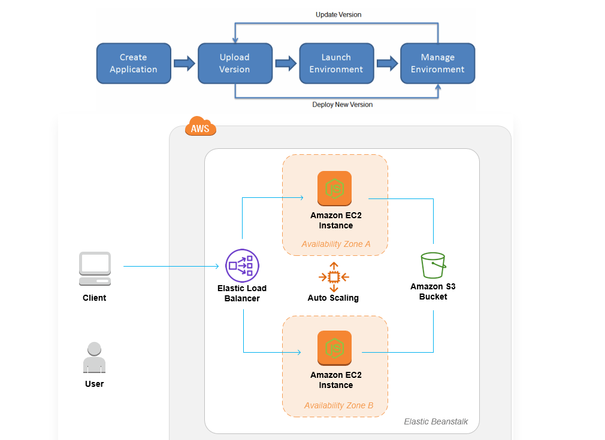

### Stage 1: Create Code Commit Repo
> **Note**
> In this step, you will retrieve a copy of the sample app’s code and create code commit repo to host the code. The pipeline takes code from the source and then performs actions on it.

* Kreiramo code commit repository `gitflow-workshop`
```bash
$ aws codecommit create-repository --repository-name gitflow-workshop --repository-description "Repository for Gitflow Workshop"
```
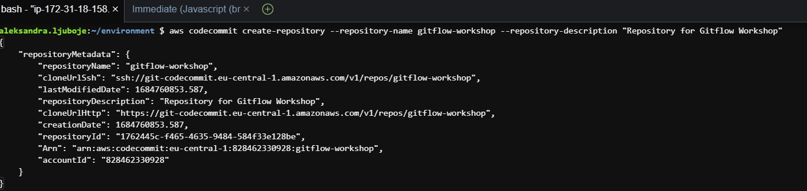

* Prikaz kreiranog repo u konzoli

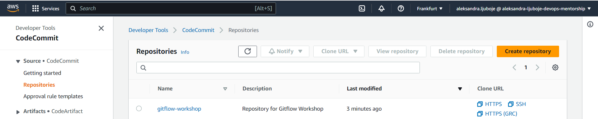

* Uradimo clone naseg kreiranog repozitorija na nacin prikazan na slici

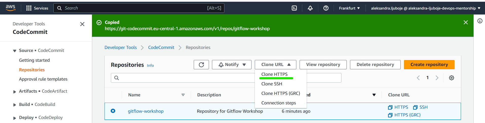

* Komanda
`git clone https://git-codecommit.eu-central-1.amazonaws.com/v1/repos/gitflow-workshop`

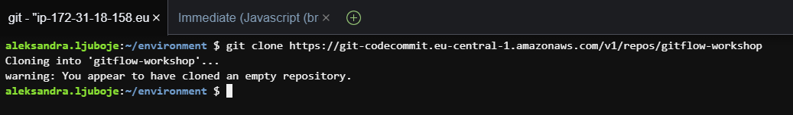

>**Note**
> Voditi racuna da je region podesen u skladu sa regionom u kojem radimo

### Stage 2: Download the sample code and commit your code to the repository

1. Download the Sample App archive by running the following command from IDE terminal.
```bash
ASSETURL="https://static.us-east-1.prod.workshops.aws/public/442d5fda-58ca-41f0-9fbe-558b6ff4c71a/assets/workshop-assets.zip"; wget -O gitflow.zip "$ASSETURL"
```
2. Unarchive and copy all the contents of the unarchived folder to your local repo folder.
```bash
unzip gitflow.zip -d gitflow-workshop/
```
3. Change the directory to your local repo folder. Run git add to stage the change.
```bash
cd gitflow-workshop
git add -A
```
4. Run git commit to commit the change and push it to master
```bash
git commit -m "Initial Commit"

git push origin master

```
* Nakon izvrsenih komandi iz stage-2, trebali bismo imati ovaj output

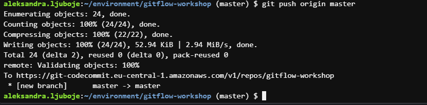

### Create Elastic Beanstalk Application
> **Note**
> To use Elastic Beanstalk we will first create an application, which represents your web application in AWS. In Elastic Beanstalk an application serves as a container for the environments that run your web app, and versions of your web app's source code, saved configurations, logs, and other artifacts that you create while using Elastic Beanstalk.

Run the following AWS CloudFormation template to create

* Elastic Beanstalk application - think of it as a folder that will hold the components of your Elastic Beanstalk

* S3 bucket for artifacts - place to put your application code before deployment

* Koristena komanda
```bash
aws cloudformation create-stack --template-body file://appcreate.yaml --stack-name gitflow-eb-app
```

* Vidimo u konzoli kreiran stack u CF

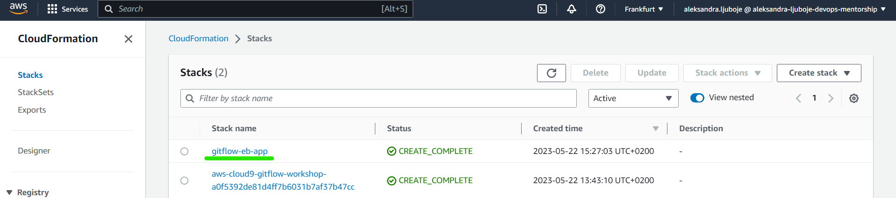

* Vidimo u konzoli kreiranu app u EB

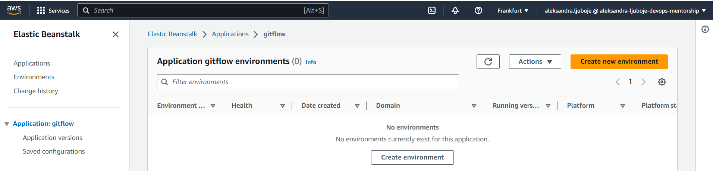

## Master Environment
### Creating an AWS Elastic Beanstalk Master Environment
> **Note**
> You can deploy multiple environments when you need to run multiple versions of an application. For example, you might have development, integration, and production environments

Use the following AWS CloudFormation templates to set up the elastic beanstalk application and codepipeline to do auto store the artifacts.

* Koristena komanda 
```bash
aws cloudformation create-stack --template-body file://envcreate.yaml --parameters file://parameters.json --capabilities CAPABILITY_IAM --stack-name gitflow-eb-master
```

> **Warning**
>Nakon poziva komande, koja je u terminalu prosla uspjesno, CF je dosao u stanje `ROLLBACK COMPLETED`

* Na slici je prikazan output komande

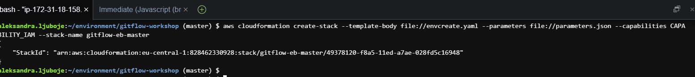

* Na slici je prikazano stanje u CF

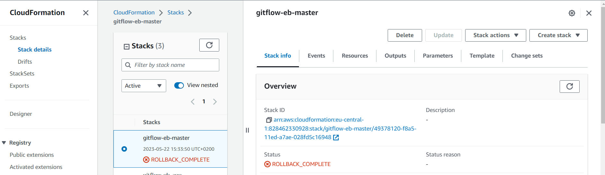

* Nakon troubleshoot-a znacenja `ROLLBACK COMPLETED` za CF, nailazim na objasnjenje 

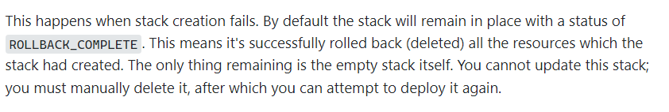
*Vise o problemu procitati [ovdje](https://stackoverflow.com/questions/57932734/validationerror-stackarn-aws-cloudformation-stack-is-in-rollback-complete-state)*

### Rjesavanje problema - koraci
1. Obrisati stack iz CF 
2. Ispraceni koraci dostupni [ovdje](https://docs.aws.amazon.com/AWSCloudFormation/latest/UserGuide/stack-failure-options.html)

* Koristene komande
1. Provide a stack name and template to the create-stack command with the disable-rollback option.
```bash
aws cloudformation create-stack --template-body file://envcreate.yaml --parameters file://parameters.json --capabilities CAPABILITY_IAM --stack-name gitflow-eb-master --disable-rollback
```
* Output

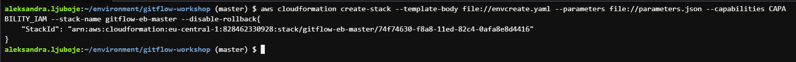

* Stanje u CF

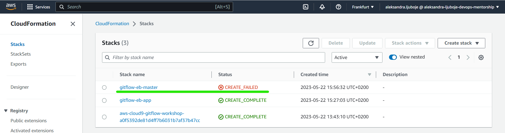

2. Describe the state of the stack using the describe-stacks option.

```bash
aws cloudformation describe-stacks --stack-name gitflow-eb-master
```

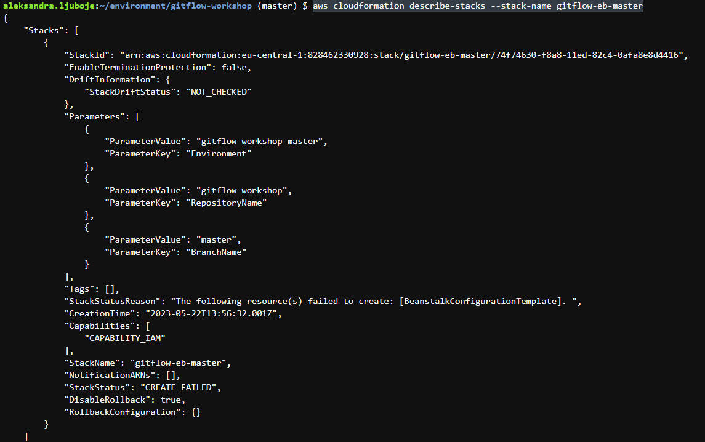

* Nakon uocene greske **The following resource(s) failed to create: [Beanstalk Configuration Template].**
 Google pretragom, dolazim do post-a dostupnog na [AWS::ElasticBeanstalk::ConfigurationTemplate](https://docs.aws.amazon.com/AWSCloudFormation/latest/UserGuide/aws-resource-elasticbeanstalk-configurationtemplate.html)

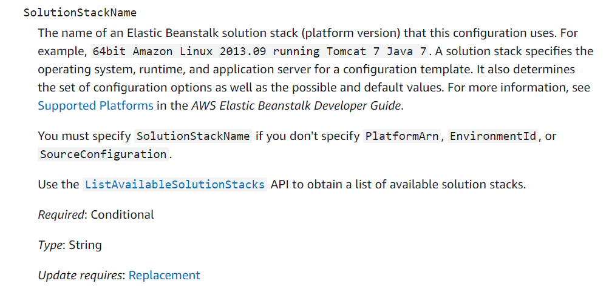

* Provjerom dodatnih linkova dolazim do podrzanih OS za nodejs app 
Clanak je dostupan [ovdje](https://docs.aws.amazon.com/elasticbeanstalk/latest/platforms/platforms-supported.html#platforms-supported.nodejs)

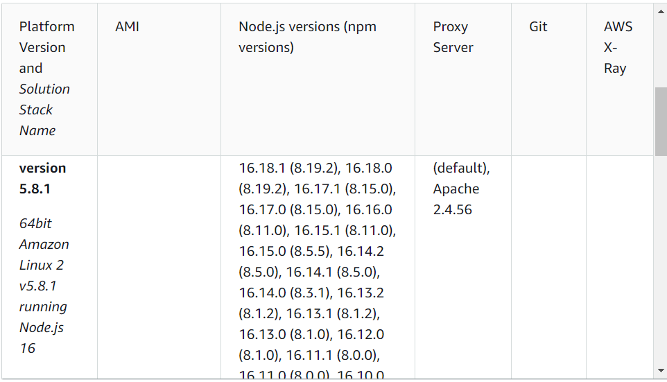

* Nakon ovoga, odlazim u Cloud9 i otvaram file `envcreate.yaml` koji komanda poziva i tu provjeravam sljedece `SolutionStackName`

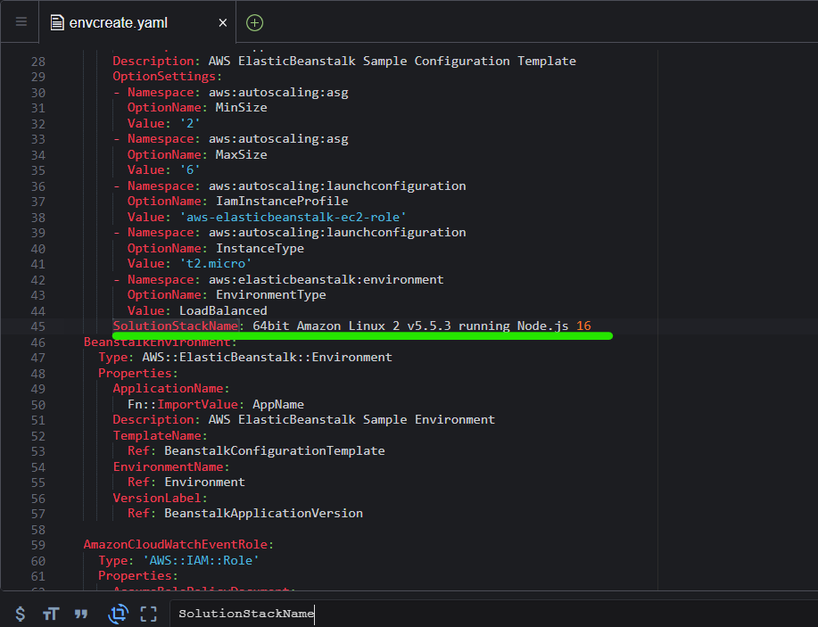

* Poredjenjem sa tabelom iznad, uocavam da se radi o verziji Amazon Linux 2 koja nije podrzana, te mijenjam na `64bit Amazon Linux 2 v5.8.1 running Node.js 16` i sacuvam fajl ponovo.

* Nakon ponovnog neuspjesnog kreiranja, dodajem izmjene komandi na nacin da se mijenja `--capabilities CAPABILITY_IAM` u `--capabilities CAPABILITY_NAMED_IAM`
```bash
aws cloudformation create-stack --template-body file://envcreate.yaml --parameters file://parameters.json --stack-name gitflow-eb-master --capabilities CAPABILITY_NAMED_IAM 
```

* Novi error je 


Rjesenje i objasnjenje problema dostupno je [ovdje](https://docs.aws.amazon.com/elasticbeanstalk/latest/dg/iam-instanceprofile.html)

1. Kreirati IAM rolu pod nazivom `aws-elasticbeanstalk-ec2-role` i zakaciti sve permisije vezane za EB 
Koraci dostupni na [linku](https://docs.aws.amazon.com/elasticbeanstalk/latest/dg/iam-instanceprofile.html#iam-instanceprofile-create)

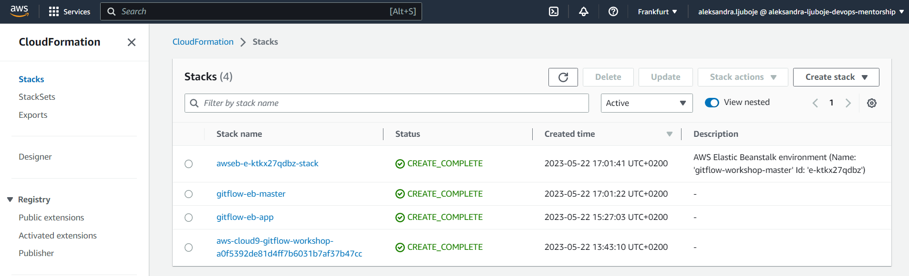
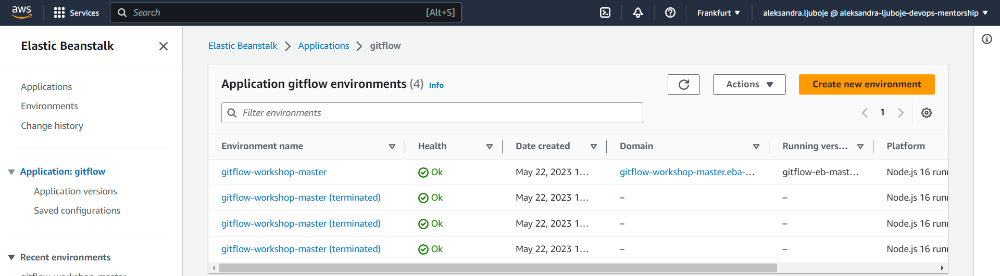

>**Note**
> Potrebno je bilo kreirati posebnu rolu za EC2 instancu i dodijeliti permisije za EB, jer se kreiranje ove role ne vrsi automatski kao nekada, vec je potrebno rucno odraditi taj dio. 


* Nakon ponovnog pokusaja izvrsenja komande, sve je proslo uspjesno i u EB vidimo sample nodejs app koju smo deployali. 

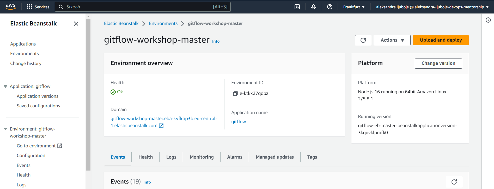

### AWS CodePipeline

> **Note**
> AWS CodePipeline is a continuous delivery service you can use to model, visualize, and automate the steps required to release your software. You can quickly model and configure the different stages of a software release process. CodePipeline automates the steps required to release your software changes continuously.

* Koristeni CF template kreira simple AWS CodePipeline with three actions: source, build and deploy


* Nakon provjere, utvrdjeno da je **Builed** failed. Troubleshooting-om je pronadjena greska, prikazana na slici.

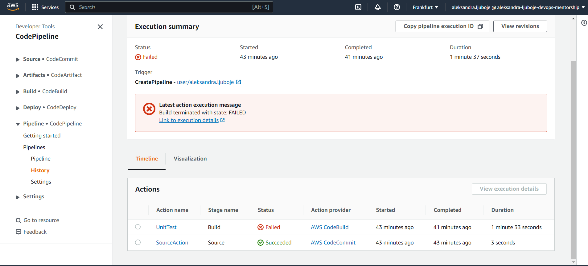
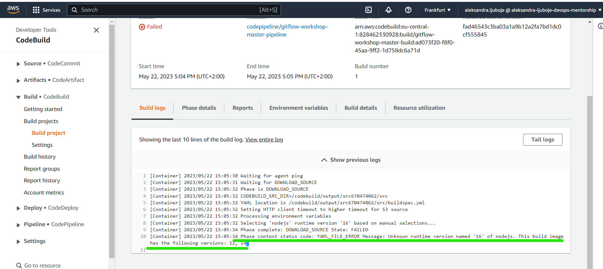

* Na osnovu error log-a, zakljucila sam da treba provjeriti `buildspec.yml` file i vidjeti verziju nodejs. Na slici je prikazan sadrzaj fajla i verzija runtime-a.

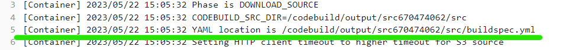
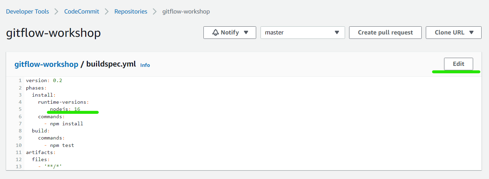
* Editovala sam file i promijenila verziju na verziju 14. Nakon toga unesemo podatke koje smo unosili pri konfiguraciji git-a - username i email. Zatim odemo na CodePipeline, Edit i Save kako bismo pokrenuli izmjene na Pipeline-u. 


* Takodje, Update EB i CF je bio uspjesan. 

## Lambda
>**Note**
> For this workshop we are using lambda function to create codepipeline and elasticbeanstalk when a branch or tag is created.

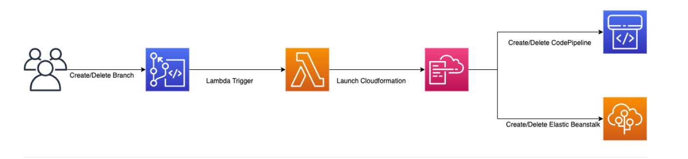

### Create Lambda
* CodeCommit moze se konifurisati na nacin da pri kreireanju ili brisanju branch-a, trigeruje Lambda funkciju 

* Komanda
```bash
aws cloudformation create-stack --template-body file://lambda/lambda-create.yaml --stack-name gitflow-workshop-lambda --capabilities CAPABILITY_IAM
```

* Nakon cega dobijamo error

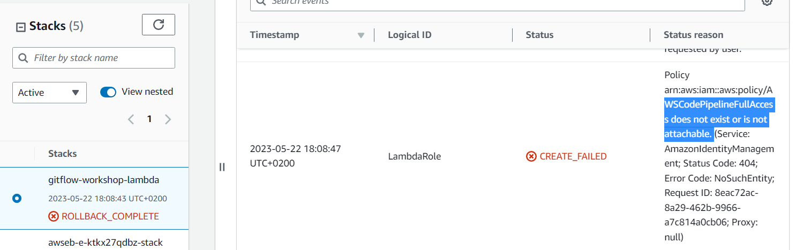

* Posto je dodijeljeni policy depricated, rucno sam izmjenila naziv policy-a unutar Cloud9 terminala, push promjene na master branch, te obrisala record iz CF, zatim ponovo pokrenula komandu.

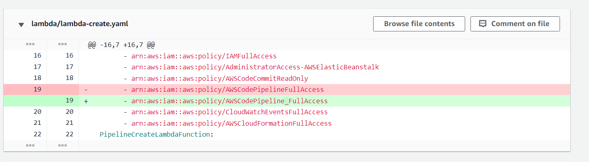

* Novi errori su pogresan region za bucket kod `PipelineDeleteLambdaFunction` i `PipelineCreateLambdaFunction`

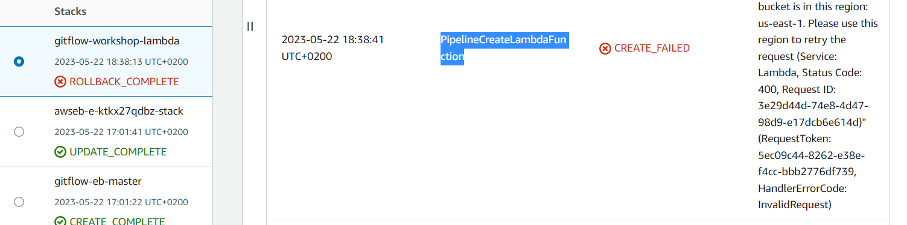

* Rjesenje ovog error-a jeste da se izmjeni `lambda-create.yaml` na nacin da se promijeni `S3Bucket` i umjesto postojeceg BucketName, stavimo BucketName kreiranog u nasoj regiji. 

* Novi error tice se S3Key koji je potrebno promijeniti

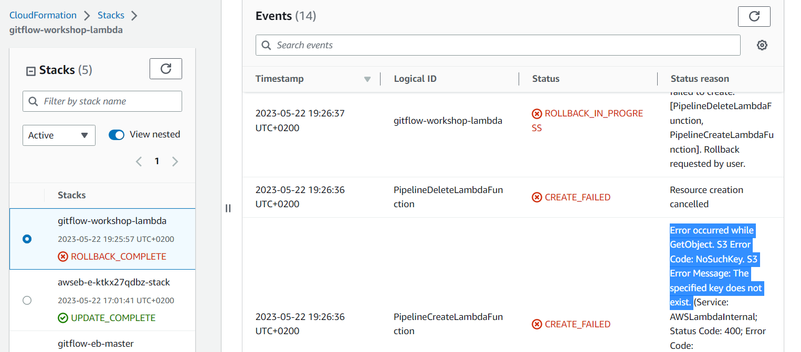

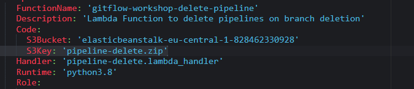

####  Rjesenje error-a sa S3 KMS key
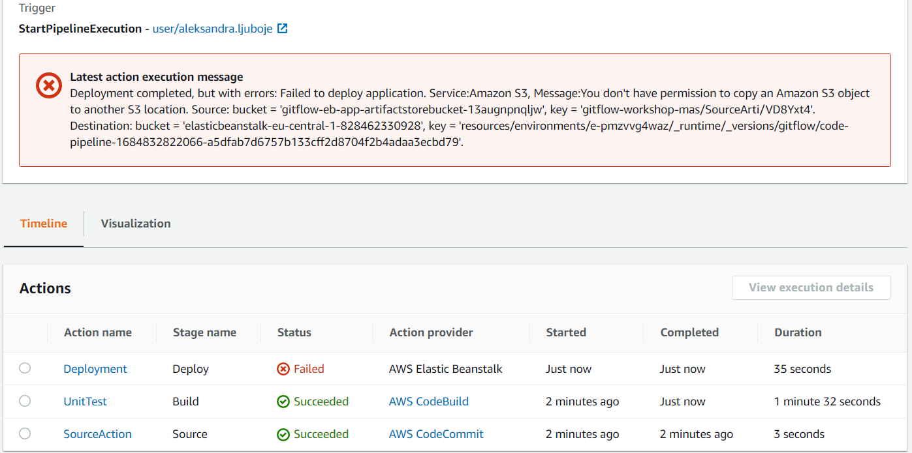
1. Otici u S3 bucket, kopirati ime bucketa koji pocinje sa `elasticbeanstalk...` te u `lambda-create.yaml` kroz Cloud9 terminal, izmjeniti `S3Bucket`. 
2. Za isti bucket unutar S3 konzole, otici na dio Permission, Edit default encryption - izabrati KMS enkripciju, izabrati `aws/s3` kljuc, kopirati key arn unutar txt fajla na desktopu. Naziv fajla `.eb-key`. Zipovati fajl u `eb-key`
3. Zipovani fajl upload-ati na S3 bucket
4. U `lambda-create.yaml` kroz Cloud9 terminal, izmjeniti `S3Key` na nacin prikazan na slici. 

* Na slici su prikazane sve promjene nad `lambda-create.yaml` fajlom.
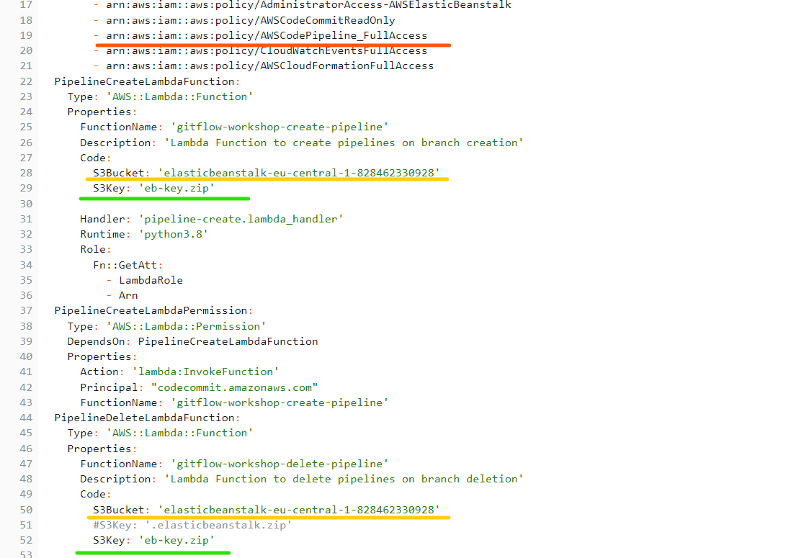

**Nakon ovog dijela Pipeline Deployment je uspjesno prosao**

* Kreiran stack `gitflow-workshop-lambda`
* Komanda 
```bash
aws cloudformation create-stack --template-body file://lambda/lambda-create.yaml --stack-name gitflow-workshop-lambda --capabilities CAPABILITY_IAM
```

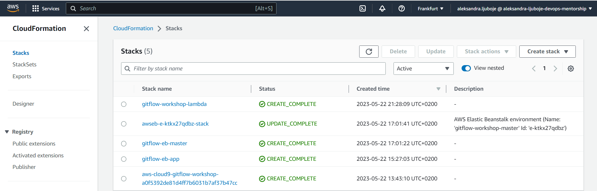

* U Lambda konzoli, kreirane su dvije Lambda funkcije za create i delete

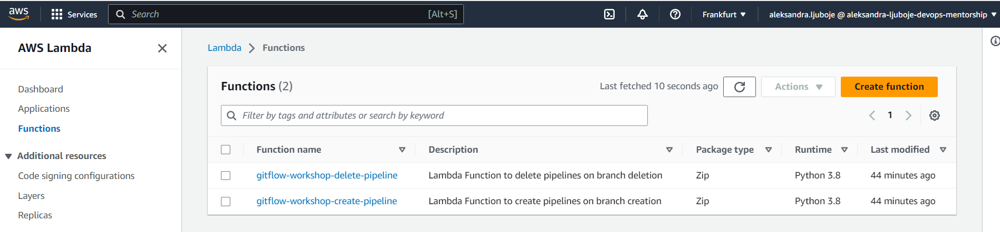

* Prikaz funkcije 
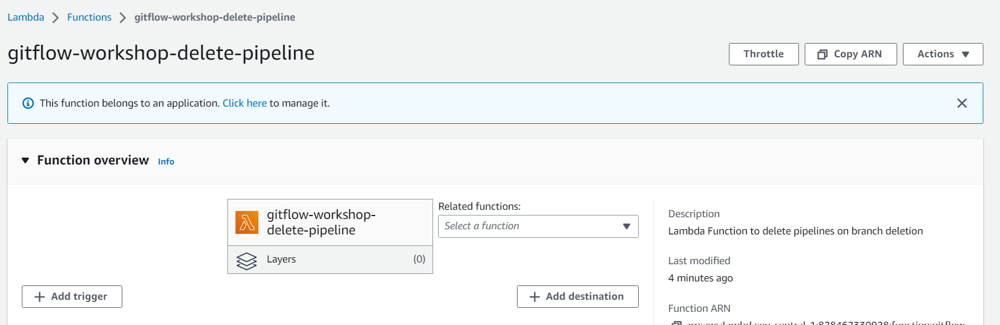

## AWS CodeCommit Trigger

### Create a Trigger in AWS CodeCommit for an Existing AWS Lambda Function

* Trigeri su kreirani kroz Lamba konzolu za svaku funkciju, testirani kroz CodeCommit.

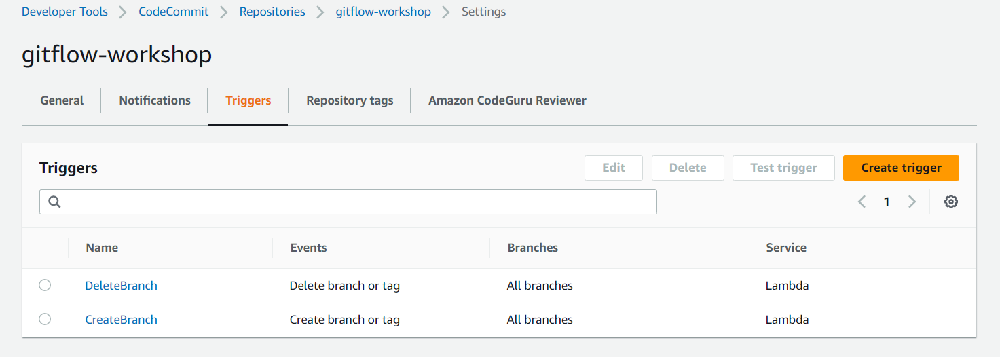

# Develop Branch
## Create Develop Branch
>**Note**
>When using the git-flow extension library, executing `git flow init` on an existing repo will create the develop branch

### 1. Initialize gitflow and list the current branches
`$ git flow init`

* Output komande 

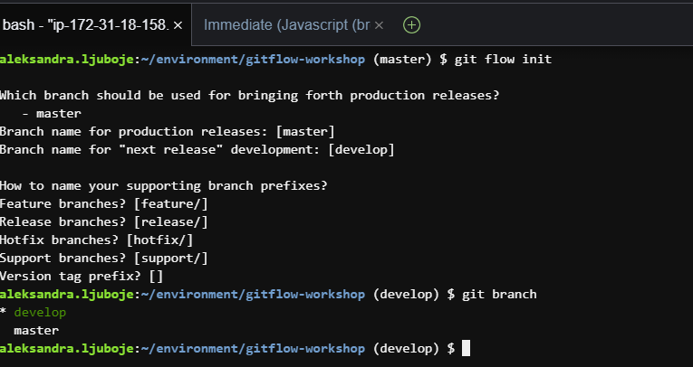

2. Push changes to remote repository 
`$ git push -u origin develop`

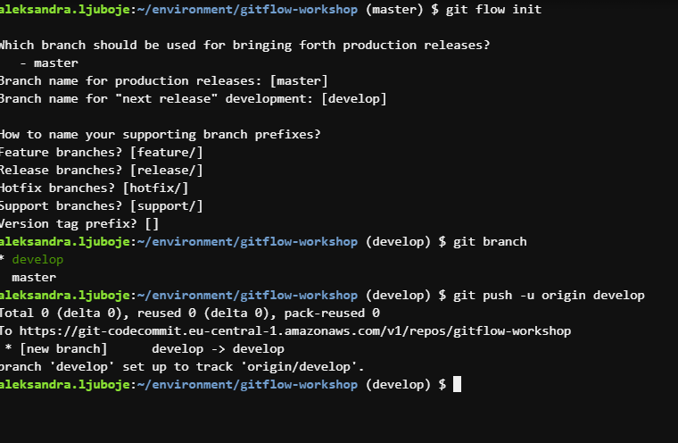

### Create Development Environment

>**Note**
>Kako kreiranje branch-a nije uspjelo trigerovati Lambda funkciju, manuelno sam kreirala `gitflow-workshop-develop` koristeci komandu
```bash
aws cloudformation create-stack --template-body file://envcreate.yaml --parameters file://parameters-dev.json --capabilities CAPABILITY_IAM --stack-name gitflow-workshop-develop
```

* Output komande - kreiranje dva nova stack-a unutar CF

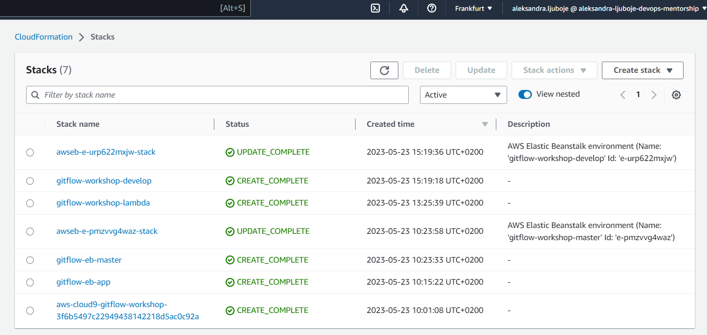


* Output komande - kreiranje novog enviromenta

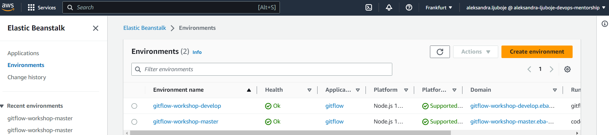

* Output komande - kreiran je i novi pipeline za develop branch

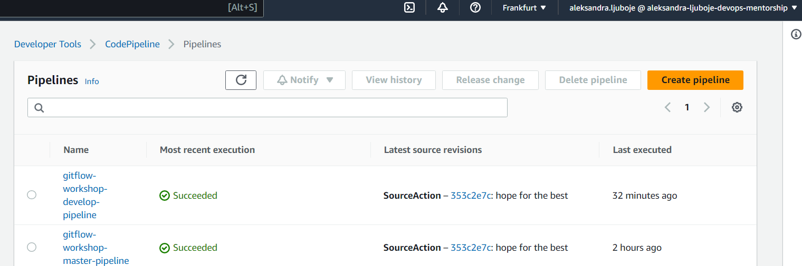

# Feature Branch
>**Note**
> Each new feature should reside in its own branch, which can be pushed to the central repository for backup/collaboration. But, instead of branching off of master, feature branches use develop as their parent branch. When a feature is complete, it gets merged back into develop. **Features should never interact directly with master.**

* *The idea is to create a pipeline per branch. Each pipeline has a lifecycle that is tied to the branch. When a new, short-lived branch is created, we create the pipeline and required resources. After the short-lived branch is merged into develop, we clean up the pipeline and resources to avoid recurring costs.*

## Create Feature Branch Environment
### Create Feature Branch

* Kreira se feature branch naziva `change-color`, testiramo funkcionisanje editovanjem  `index.html` i promjenom boje. 

>**Note**
> Pri izboru naziva feature branch-a, preporuka je koristiti kratka i smislena imena, po mogucnosti ona koja opisuju sta taj feature radi. 

* Koristena komanda za kreiranje feature branch `change-color`
`git flow feature start change-color`

* Output komande

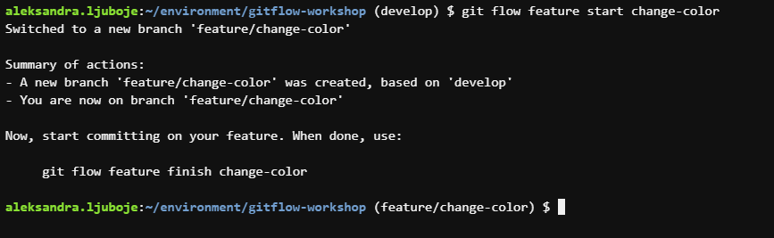

### Create feature branch environment
> The lambda function you created earlier will automatically detect a new branch it will trigger the function to create the environment and code pipeline.

> **Waring**
>Nije se desio invoke lambda funkcije

### Commit a change and then update your app
*Edit line:38 in index.html. We are going to change the color from purple to green*

* Manuelno kreiranje `gitflow-workshop-changecolor`
```bash
aws cloudformation create-stack --template-body file://envcreate.yaml --capabilities CAPABILITY_IAM --stack-name gitflow-workshop-changecolor --parameters ParameterKey=Environment,ParameterValue=gitflow-workshop-changecolor ParameterKey=RepositoryName,ParameterValue=gitflow-workshop ParameterKey=BranchName,ParameterValue=feature/change-color
```
* Git commands
```bash
$ git status    
$ git add -A  
$ git commit -m "Changed Color" 
$ git push --set-upstream origin feature/change-color
```
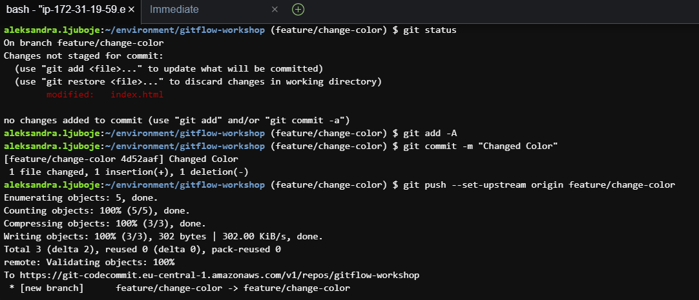


* Output komande u CF

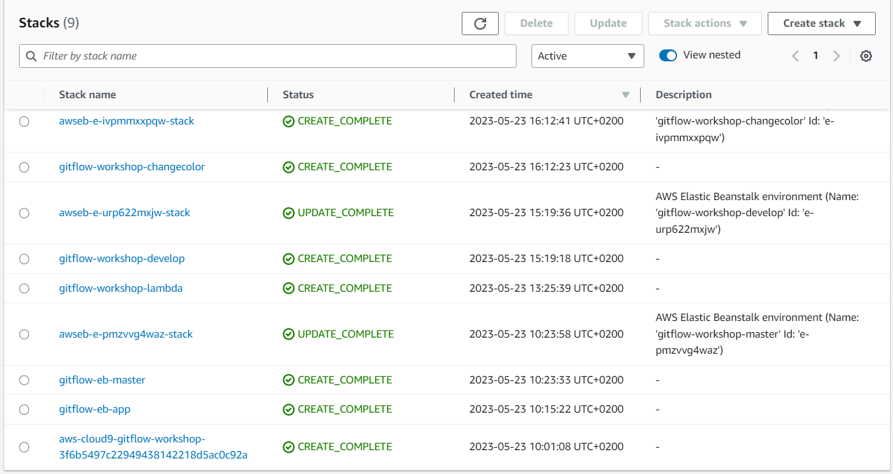

* Output komande u EB

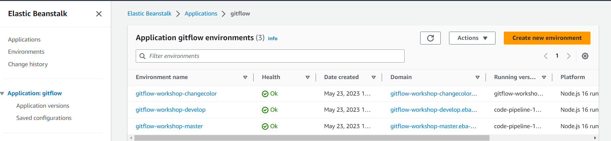

* Kreireani Pipelines

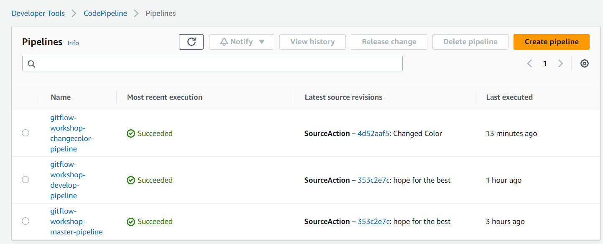

* Trenutne boje na branch-u prije merg-a sa feature na develop branch

> Develop branch

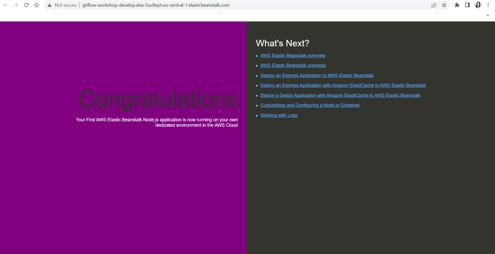
> Feature branch

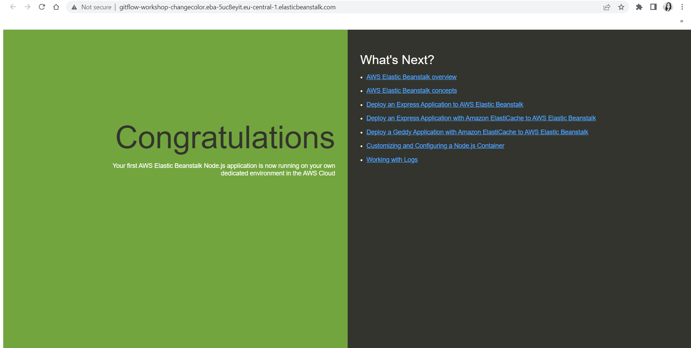

### Step 1: Feature Finish

* Kada je feature spreman za merge sa develop granom, koristimo komandu
`$ git flow feature finish change-color`


* This action performs the following:

  * Merges change-color into develop

  * Removes the feature branch

  * Switches back to develop branch


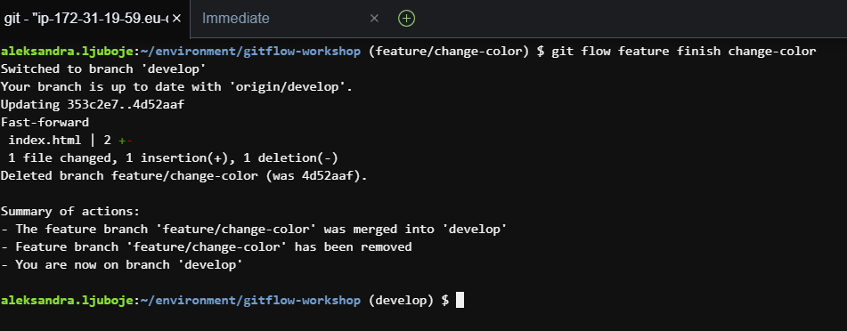

### Step 2: Delete the feature branch change-color and push it to remote at the same time.

* Koristena komanda
`$ git push origin --delete feature/change-color`

* Output komande

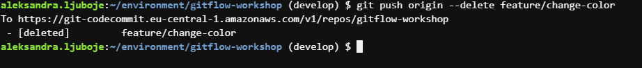

### Step 3: Push the develop branch changes to codecommit.

* Koristena komanda
`$ git push --set-upstream origin develop`

* Komanda je izmjenila `index.html` file u develop grani, ali nije pokrenula promjene boje.
* To je uradjeno manuelno, klikom na Release Change na develop Pipeline-u. 

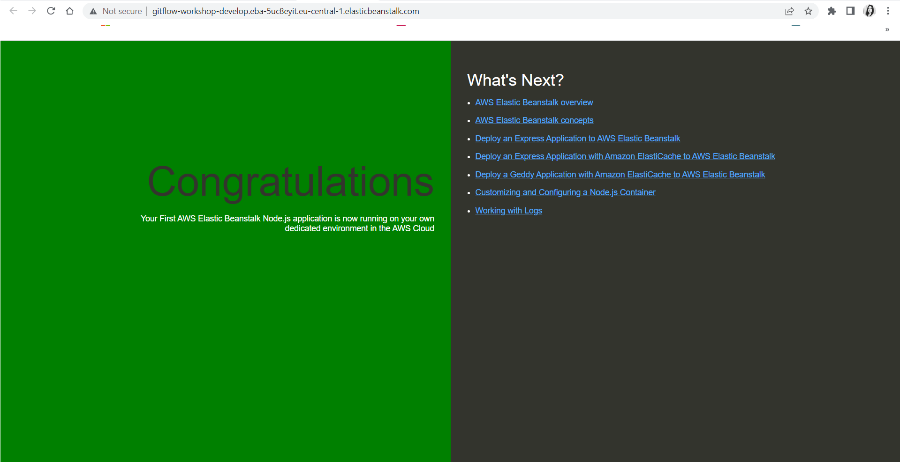


# Cleanup

## Delete Develop & Master Environments
```bash
aws cloudformation delete-stack --stack-name gitflow-eb-master
aws cloudformation delete-stack --stack-name gitflow-workshop-develop
```
## Delete Feature Environment
```bash
aws cloudformation delete-stack --stack-name gitflow-workshop-feature-change-color
```
### Delete Lambda Functions

```bash
aws cloudformation delete-stack --stack-name gitflow-workshop-lambda
```

### Delete Elastic Beanstalk Application
>**Note**
> Obrisati sve fajlove iz bucket-a, Empty bucket te onda pokrenuti komandu za brisanje. U suprotnom ce brisanje biti aborted

```bash
aws cloudformation delete-stack --stack-name gitflow-eb-app
```

### Delete code commit repository

```bash
aws codecommit delete-repository --repository-name gitflow-workshop
```

### Delete AWS Cloud9
I* n the AWS Cloud9  console, highlight your Cloud9 workspace
* Select Delete


>**NOTE**
> Triggeri koji su kreirani nisu radili, te je bilo potrebno manuelno inicirati promjene. 