## Cloud Formation 

### Opsti termini 
- **Template** za stack - kod napisan u YAML ili JSON formatu
- **Logicki resursi** su ono STA zelimo kreirati 
- Prilikom kreiranja stack-a iz svakog logickog resursa, formira se **fizicki resurs** (S3 bucket, instanca, itd.)

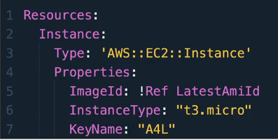

- **Resources** su logicki resursi
- **Properties** su svojstva tog resursa koji ga dodatno opisuju
- **Tag Name** je naziv fizickog resursa
- **KeyName** naziv SSH kljuca 

### Parameters

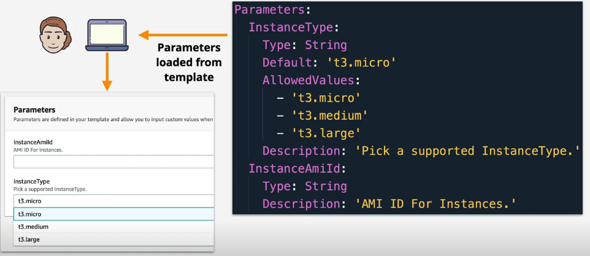

- U **Parameters** blok kod navodimo parametre koji su vidljivi pri kreiranju stack-a i koji se mogu mijenjati. Na primjeru sa slike, korisniku je omoguceno da bira tip instance, a defaultni izbor je `t3-micro`

### Pseudo Parametri

- `AWS::Region`, `AWS::StackId` itd. su predefinisani parametri cijim pozivom u kodu automatski "kupimo" neke informacije. Npr, region u kojem se nalazimo tj. u kojem je stack kreiran

### Intrinsic Functions 

- `!Ref` da se referenciramo na nesto. U primjeru sa slike, definisan je parametar `LatestAmiId` na koji se referenciramo

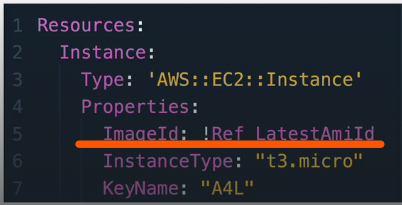

- `!GetAtt Logickiresurs.Attribute` da pokupimo atribute bilo kojeg logickog resursa
Na primjer DNS name, PublicIp itd.


- `Join` i `Split` za spajanje i razdvajanje "slogova"
* Kod `split` navedemo delimiter tj. znak koji razdvaja rijeci i dobijamo listu razdvojenih rijeci
* Kod `join` radimo obrnuto, pojedinacne stringove spajamo koristeci delimiter 

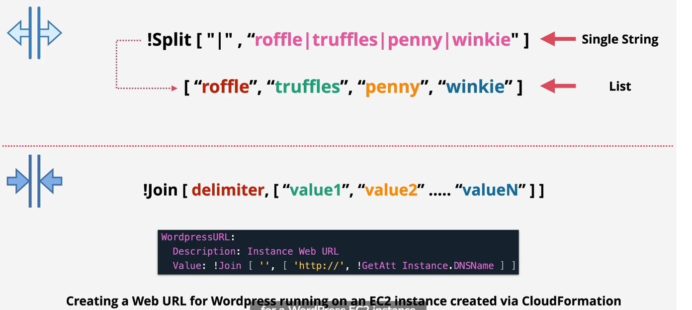


- `!GetAZs` da pokupimo listu AZ iz regije u kojoj se kreira stack. Kupi sve ako nema VPC ili je defaultni. Ako smo neke subnete birsali, nece se prikazati
- `!Select` da selektujemo nesto iz liste

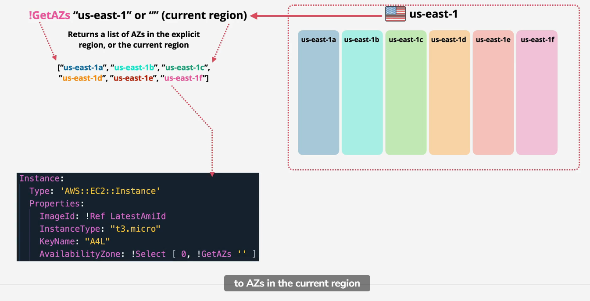

- `Base64` prihvata `plaintext` i kao outpud daje encoded base64 text
- `Sub` mijenja `${Instance.InstanceId}` sa stvarnom vrijednoscu
- Koristimo najcesce u dijelu `UserData` kada se radi o encoded tekstu.

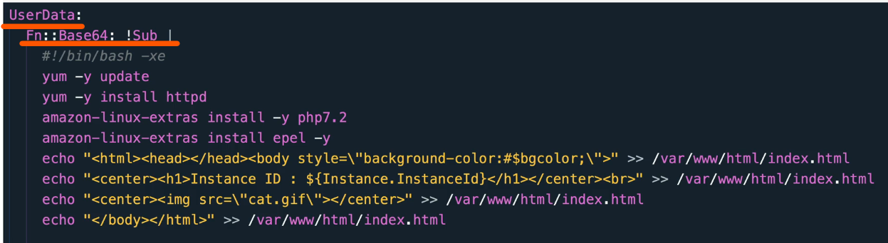

### Mapping

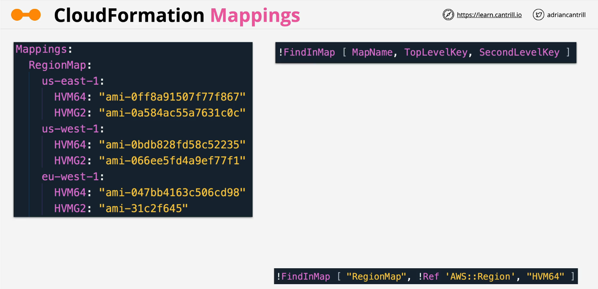

- `!FindInMap [ MapName, TopLevelKey, SecondLevel,Key]`

### Outputs

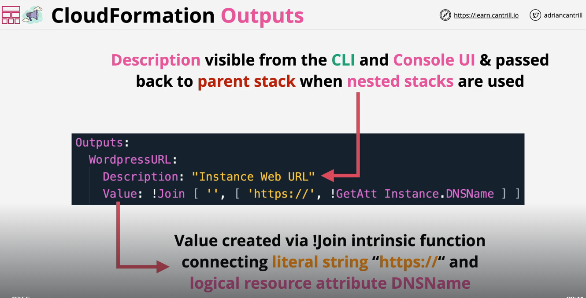

- `Outputs` blok kod koristimo da ispisemo neki output koji je vidljiv kroz CLI ili u CF stack output dijelu. Npr, DNS name kreiranog resursa i sl kako isti ne bismo morali traziti kroz kod. 

### Conditions 

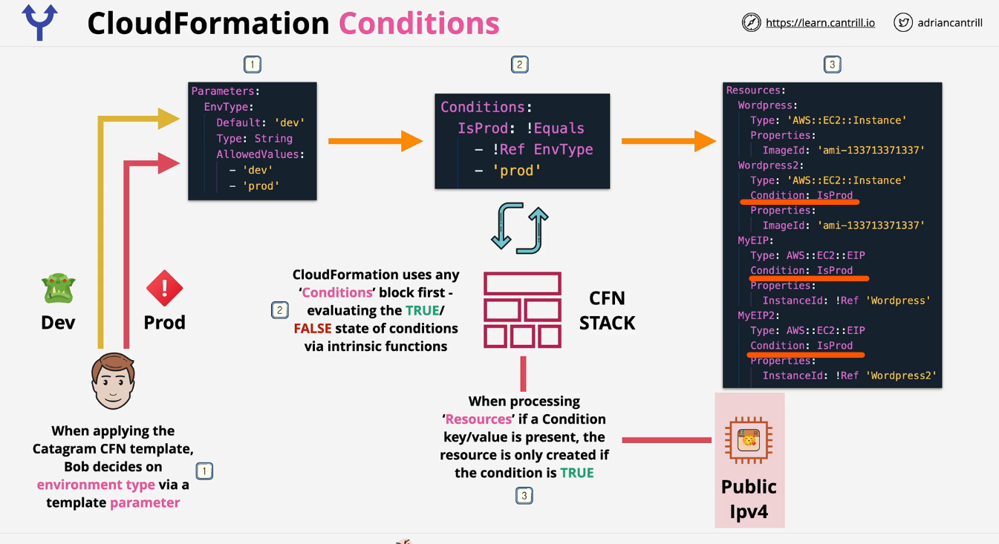
- `Conditions` koristimo kada zelimo usloviti kreiranje nekog resursa true/false outputom nekog drugog resursa. U primjeru sa slike, ukoliko nismo u produkcijskom enviromentu svi resursi koji imaju `Condition: IsProd` nece se kreirati. Dakle kreirao bi se samo WordPress resurs jer nema uslov. 

### DependsOn

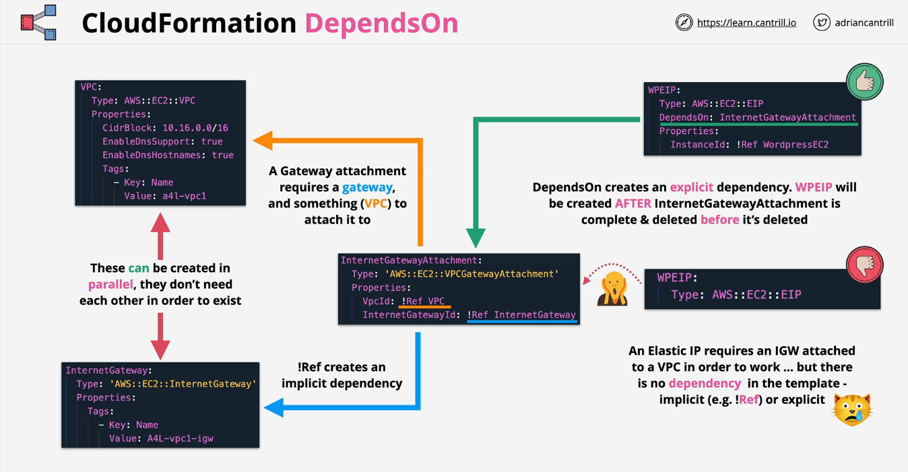

- `DependsOn` koristimo kada zelimo eksplicitno naglasiti da neki resurs zavisi od kreiranja nekog drugog resursa.
- U vecini slucajeva CF sam/implicitno vodi racuna o redoslijedu kreiranja resursa. Na primjer, ako zahtjevamo kreiranj VPC, subneta i EC2 instance bez obzira kako mi naveli redoslijed prvo ce se kreirati VPC, pa subnet i EC2 u tom subnetu. 
- Medjutim u nekim slucajevima, kao ovdje pri kreiranju `Elastic Ip adrese` i njene dodjele VPC-u moramo eksplicitno navesti da se ceka prvo kreiranje VPC-a kako bismo mogli automatski tom VPC-u zakaciti novokreiranu EIP 

### CloudFormation Wait Conditions & cfn-signal

- `cfn-signal` koristimo kada zelimo kroz CF Events biti obavjesteni o tome da li je zavrseno kreiranje naseg resursa, kako bismo preduzeli sljedece korake, a ne smatrali da imamo gresku jer se nesto jos uvijek nije ucitalo. 
- Kada je postavljen `cfn-signal`zaustavice se ispis poruke `Creation Completed` kako nas to ne bi zavaralo u smislu da mislimo da je cijeli proces zavrsen iako se zbog instalacionih skripti unutar `UserData` jos uvijek vrse podesavanja nase EC2 instance u ovom primjeru 

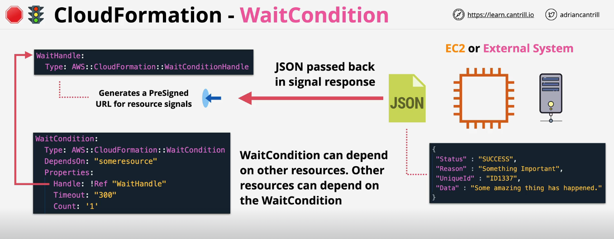

- `cfn-signal` u kratkim crtama

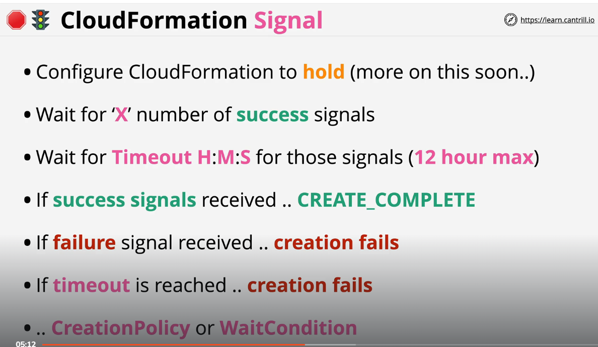

### Nested stack

- Ugnjezdeni stack koristimo kada zelimo unutar root stack-a kreirati i neke druge resurse koristeci drugi stack

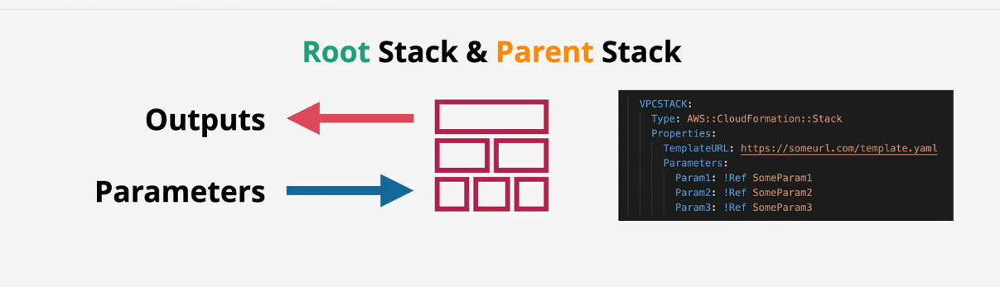

- `nested stack` u kratkim crtama

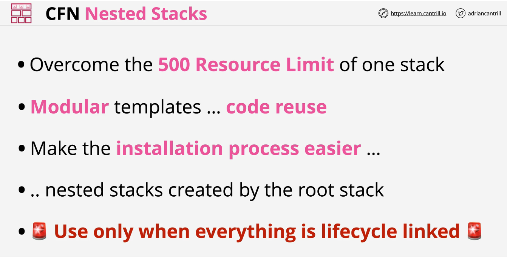

### Cross-Stack References

- Koristimo u slucaju kada nam je potreban Output drugog stack-a. U tom slucaju u `output bloku` navodimo sve potrebne informacije i koristimo `export`. Drugi stack moze koristiti `!ImportValue` i koristiti ime stack-a koji se importuje, ali to **vrijedi unutar istog regiona**
> **Note**
> Cross region i cross - account nije podrzan od strane cross stack references

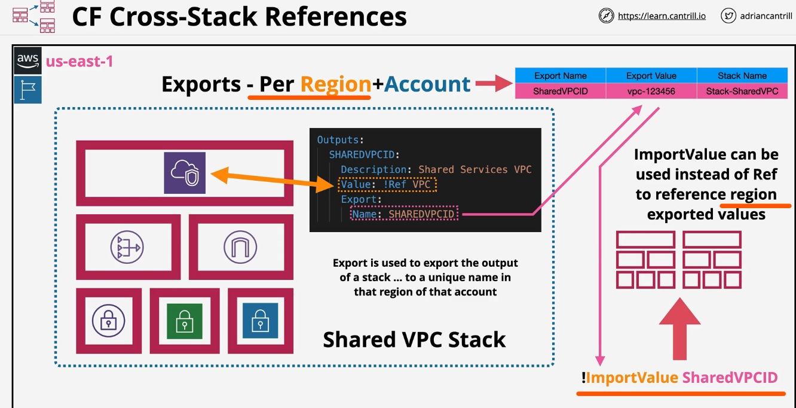

### StackSets

- StackSets su kontejneri koji sadrze vise StackInstances, a koje su referenca na Stack-ove kreirane unutar nekog regiona ili account-a tzv. `target account`
-  Koristimo ih kada zelimo omoguciti deployment i menedzovanje kroz vise regiona ili accounta sa jedne lokacije

- `ConcurentAccounts` definisemo koliko individualnih AWS account-a se moze koristiti istovremeno 
- `Failure Tolerance` broj deploymenta koji mogu biti failed prije nego se proglasi da je failed cijeli stack 
- `Retain stack` 

### Deletion Policy

- Kada se obrise logicki resurs, automatski se brise i fizicki resurs koji je od njega kreiran sto je defaultna opcija.
- Unutar `deletion policy` mozemo za svaki resurs navesti opcije brisanja
    - Delete (default) brisanjem logickog brise se fizicki resurs
    - Retain pri brisanju stack-a ili logickog resursa ostaje fizicki resurs
    - Snapshot koji je dostupan za neke servise tipa EBS, Neptune,ElastiCashe itd. Prije nego se obrise fizicki resurs kreira se njegov snapshot, koji se kasnije moze alocirati sa drugim servisom 

### CloudFormation Init (cfn-init) 
- `cfn-init` se izvrsava jednom na ec2 instanci i to je dio UserData. Ukoliko uradio update  CloudFormation::Init, podesavanja ostaju nepromjenjena jer nema opcije re-run. 

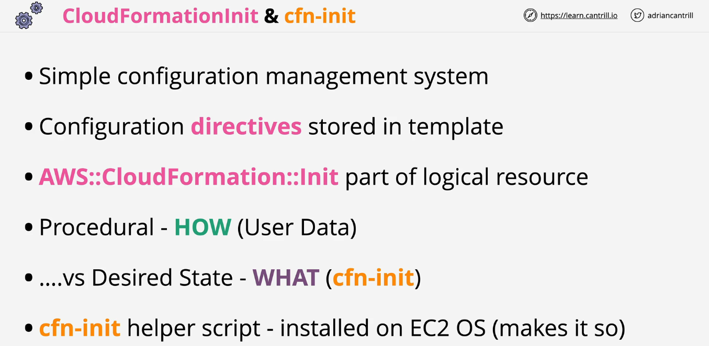

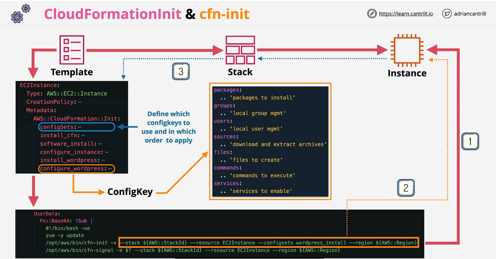

### cfn-hup
- Instalira se na EC2 instanci kako bi se mogle pratiti promjene nad konfiguracijom. Nacin na koji radi je da provjerava resource metadata periodicno i ako uoci promjene, uradi se update i inicira poziv cfn-init kako bi se primjenile promjene. 

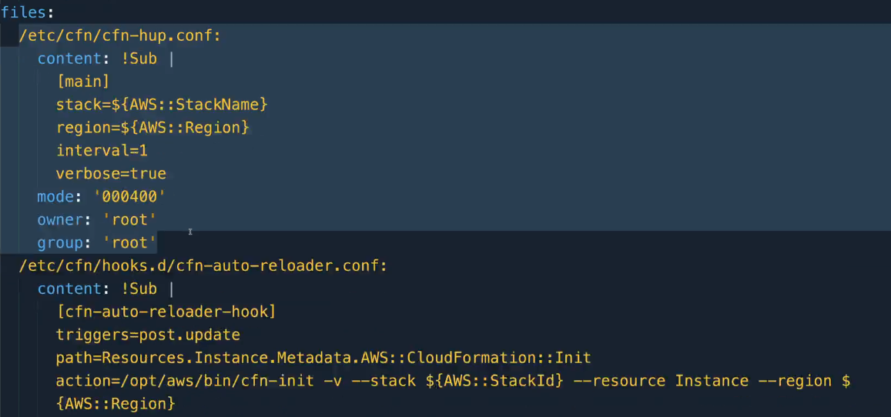
- U prvom dijelu je config file gdje unesemo opste podatke, ime stack-a, interval cekanja itd.
- U drugom dijelu navodimo STA URADITI kada se detektuje promjena
- trigeruje se update i trazi se resurs CF::Init
- U `action` je komanda koja simulira ponovni poziv `cfn-init`
```bash
action=/opt/aws/bin/cfn-init -v --stack ${AWS::StackId} --resource Instance --region ${AWS::Region}
```

### ChangeSets
- Koristimo kada zelimo promijeniti nesto unutar template-a, ali ne zelimo odmah primjeniti nad stack-om.

- Tipovi interruption-a
  - `No interruption` promjene na stack-u ne uticu na fizicki resurs
  - `Some interruption` promjene na stack-u djelimicno uticu na fizicki resurs. Na primjer, zahtjeva se reboot ec2 instance
  - `Replacement` promjene na stack-u dovode do potpune zamjene resursa, kreira se potpuno nova kopija fizickog resursa
- Kreiranje change-stacks

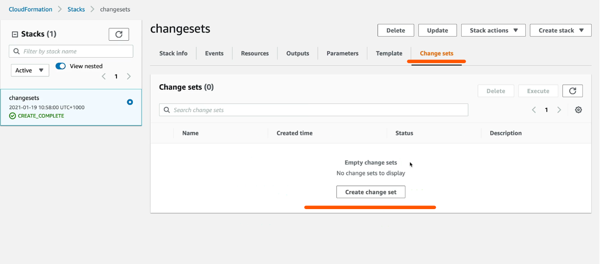
- Upload-ujemo novi template i idemo na Execute kada budemo zadovoljni verzijom template-a. To ce u pozadini uraditi update stack-a.


# Vazni dijelovi koda i komande

### cfn init, signal, hup 
- U direktoriju `var/log` na EC2 instanci
- `$ sudo cat cfn-init-cmd.log` da vidimo sta je sve instalirano pomocu init
- `$ sudo cat cfn-init-output.log` da vidimo error-e koji su se desili 
- `$ sudo cat cfn-hup.log` da pratimo promjene pri update-u stack-a

### AMI za EC2 instancu u zavisnosti od regiona
```bash
Parameters:
  LatestAmiId:
    Description: "AMI for EC2"
    Type: 'AWS::SSM::Parameter::Value<AWS::EC2::Image::Id>'
    Default: '/aws/service/ami-amazon-linux-latest/amzn2-ami-hvm-x86_64-gp2'
```
### Ispis poruke u konzoli CF pri kreiranju stack-a
```bash
Parameters:
  Message:
    Description: "Message for HTML page"
    Default: "Cats are the best"
    Type: "String"
```
### Kreiranje Security Group 
```bash
Resources:
  InstanceSecurityGroup:
    Type: 'AWS::EC2::SecurityGroup'
    Properties:
      GroupDescription: Enable SSH and HTTP access via port 22 IPv4 & port 80 IPv4
      SecurityGroupIngress:
        - Description: 'Allow SSH IPv4 IN'
          IpProtocol: tcp
          FromPort: '22'
          ToPort: '22'
          CidrIp: '0.0.0.0/0'
        - Description: 'Allow HTTP IPv4 IN'
          IpProtocol: tcp
          FromPort: '80'
          ToPort: '80'
          CidrIp: '0.0.0.0/0'
```
### Kreiranje S3 bucket bez navodjenja imena
```bash
Resources:
  Bucket:
    Type: 'AWS::S3::Bucket'
```
### Kreiranje EC2 instance i inicijalizacija
```bash
Resources:
  Instance:
    Type: 'AWS::EC2::Instance'
    Metadata:
      'AWS::CloudFormation::Init':
        config:
          packages:
            yum:
              httpd: []
          files:
            /etc/cfn/cfn-hup.conf:
              content: !Sub |
                [main]
                stack=${AWS::StackName}
                region=${AWS::Region}
                interval=1
                verbose=true
              mode: '000400'
              owner: 'root'
              group: 'root'
            /etc/cfn/hooks.d/cfn-auto-reloader.conf:
              content: !Sub |
                [cfn-auto-reloader-hook]
                triggers=post.update
                path=Resources.Instance.Metadata.AWS::CloudFormation::Init
                action=/opt/aws/bin/cfn-init -v --stack ${AWS::StackId} --resource Instance --region ${AWS::Region}
                runas=root
              mode: '000400'
              owner: 'root'
              group: 'root'
            /var/www/html/index.html:
              content: !Sub |
                <html><head><title>Amazing test page</title></head><body><h1><center>${Message}</center></h1></body></html>
          commands:
            simulatebootstrap:
              command: "sleep 300"
          services:
            sysvinit:
              cfn-hup:
                enabled: "true"
                ensureRunning: "true"
                files:
                  - /etc/cfn/cfn-hup.conf
                  - /etc/cfn/hooks.d/cfn-auto-reloader.conf
              httpd:
                enabled: "true"
                ensureRunning: "true"
                files:
                  - "/var/www/html/index.html"
    CreationPolicy:
      ResourceSignal:
        Timeout: PT15M
    Properties:
      InstanceType: "t2.micro"
      ImageId: !Ref "LatestAmiId"
      SecurityGroupIds: 
        - !Ref InstanceSecurityGroup
      Tags:
        - Key: Name
          Value: A4L-UserData Test
      UserData:
        Fn::Base64: !Sub |
          #!/bin/bash -xe
          /opt/aws/bin/cfn-init -v --stack ${AWS::StackId} --resource Instance --region ${AWS::Region}
          /opt/aws/bin/cfn-signal -e $? --stack ${AWS::StackId} --resource Instance --region ${AWS::Region}
```