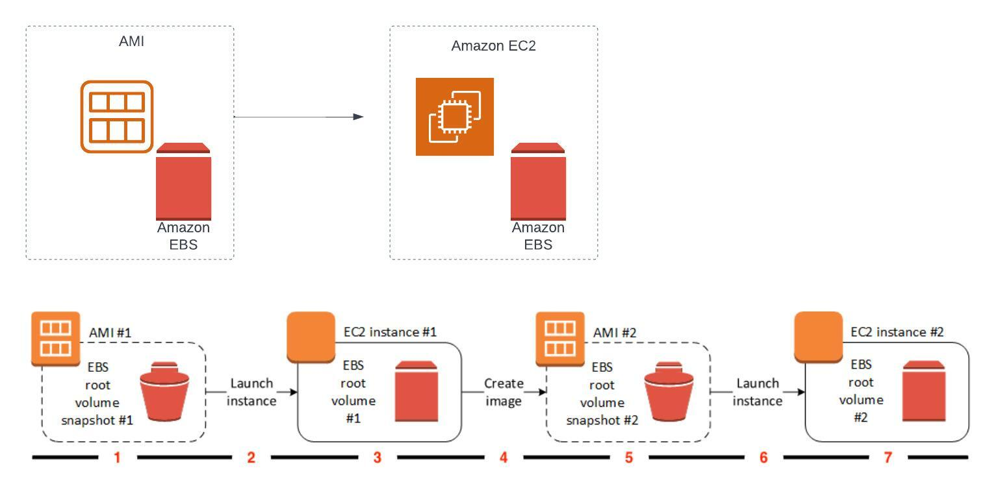

# Infrastructure as Code (IaC)

- Jednostavniji nacin kreiranja i upravljanja AWS resursima. Sa jednim ***template***
-om  mogu se kreirati jako kompleksna okruzenja. 
- Nema dodatnih troskova, placate samo za resurse koje kreirate
- Tretiranje infrastrukture kao koda koristeci neki od kod editora (GitHub, AWS CodeCommit). Mogucnosti ***roll back**-a na posljednje stabilno stanje.

## Machine Images / Slike Servera
Svaki server kojeg pokrenete bilo unutar on-prem okruzenja ili u cloud okruzenju je baziran na nekoj slici servera (eng. Machine image - Zbog lakseg razumijevanja i ujednacenosti sa standardnom IT terminologijom u nastavku cemo koristiti termin **_Image_**).
Image predstavlja sablon odnosno template koji unutar sebe sadrzi prekonfigurisani operativni sistem i predinstlairane potrebne aplikacije. Image koristite da krairate nove ili klonirate postojece hostove.  U zavisnosti od toga koju platformu koristite Image moze biti u razlicitim formatima. Npr. AWS koristi AMI (Amazon Machine Image) format, dok Azure koristi VHD (Virtual Hard Disk) format, vmWare koristi VMDK (Virtual Machine Disk) format itd. 


### Golden Image
Golden Image predstavlja predifisnisanu i pre-konfigurisani image koji cemo korisiti kao osnovu za sve hostove koje kreiramo. 


## Configuration Managment / Server Configuration Management / Upravljanje Konfiguracijama Servera
Kako bi bili u mogucnosti da upravljavmo konfiguracijama (eng: configuration management) velikog broja servera na automatizovan, konzistentan, skalabilian i nacin koji mozemo jednostavno da reporoduciramo potreban su nam alati za upravljanje konfiguracijama servera odnosno server konfiguration menadzment alati.
Upravljanje konfiguracijama servera je proces automatskog upravljanja konfiguracijama servera. Ovaj proces se sastoji od dva dijela:
- **Provizioniranje** - Instalacija OS-a i aplikacija na servere
- **Konfigurisanje** - Konfigurisanje aplikacija na serverima

### Imperative vs Declarative
Imperativni i deklarativni pristupi su dvije različite paradigme koje se koriste u upravljanju serverima i automatizaciji. Osnovne razlike su:

- **Imperative** - Imperativni pristup: U ovom pristupu, definirate kako postići željeno stanje. To znači da se fokusirate na korake ili operacije koje trebate izvršiti kako biste postigli željeno stanje. Na primjer, možete reći: "Instalirajte X softver, zatim konfigurirajte Y datoteku na ovaj način, a zatim pokrenite Z servis". Ovaj pristup je korak-po-korak i često uključuje ručnu intervenciju ili niz skripti koje izvršavaju specifične zadatke.

Primjer imperativnog pristupa:  

```bash
$ export PDSH_SSH_ARGS_APPEND="-i /Users/ddzevlan/Downloads/week-8.pem"  # SSH key za AWS instancu
$ pdsh -w ^hosts.txt sudo yum -y install java # hostname komanda na svim serverima
$ PDSH_SSH_ARGS_APPEND="-o StrictHostKeyChecking=no" pdsh -l ec2-user -w ^ip-addresses ./start-testing.sh
```

- **Declarative** Deklarativni pristup: U ovom pristupu, definisete sta zelite postici, ali ne i kako to postici. Na primjer, umjesto da definisete niz koraka za postavljanje servera, samo definisete zeljeno stanje (npr. "X softver treba biti instaliran, Y datoteka treba izgledati ovako, Z servis treba biti pokrenut"), a alat za upravljanje konfiguracijama (kao što su Ansible, Puppet, Chef ili SaltStack) odgovoran je za utvrđivanje kako postići to stanje. Ako stanje već postoji (npr. ako je softver već instaliran), alat neće ništa raditi; ako stanje ne postoji, alat će poduzeti potrebne korake za postizanje tog stanja.

Deklarativni pristup je često poželjniji u upravljanju serverima i DevOps-u, jer omogućuje veću konzistentnost, pouzdanost i automatizaciju. Također olakšava upravljanje velikim brojem servera, jer samo trebate definirati željeno stanje, a ne brinuti se o pojedinačnim koracima potrebnim za postizanje tog stanja.

### Popularni alati za upravljanje konfiguracijama servera  
Postoji nekoliko popularnih alata za upravljanje infrastrukturom. Evo nekoliko najpoznatijih:

- **Ansible**: Ansible je alat za upravljanje konfiguracijama koji koristi deklarativni pristup i ne zahtijeva instalaciju agenta na ciljanim serverima. Koristi se za automatizaciju postavljanja i konfiguracije servera, aplikacija i drugih IT potreba. Ansible koristi YAML za pisanje skripti, što ga čini lako čitljivim i razumljivim.

- **Puppet**: Puppet je jedan od najstarijih alata za upravljanje konfiguracijama i koristi deklarativni pristup. Puppet koristi vlastiti opisni jezik i zahtijeva instalaciju agenta na svakom serveru koji upravlja.

- **Chef**: Chef je još jedan popularan alat za upravljanje konfiguracijama. Chef koristi Ruby kao jezik za pisanje "receita" (skripti) koje definiraju konfiguraciju sistema. Kao Puppet, Chef također koristi model sa agentom.

- **SaltStack (Salt)**: Salt je sličan Ansible u mnogim aspektima, uključujući upotrebu YAML-a za definiranje konfiguracija. Međutim, Salt može raditi u modu s agentom (kao Puppet i Chef) ili bez agenta (kao Ansible).

### Immutable vs Mutable Infrastructure
Koncepti mutabilne i imutabilne infrastrukture odnose se na način na koji se upravlja promjenama u infrastrukturi. Evo osnovne razlike:

- **Mutable Infrastructure** - Mutabilna infrastruktura: Tradicionalni pristup upravljanju infrastrukturom je mutabilan. To znači da se serveri i aplikacije mijenjaju tijekom vremena. Na primjer, kada se ažurira softver, dodaju se nove značajke ili popravljaju sigurnosni propusti, te promjene se primjenjuju direktno na postojeću infrastrukturu. Ova promjena može biti ručna ili automatizirana (koristeći alate za upravljanje konfiguracijama kao što su Ansible, Puppet, ili Chef), ali rezultat je isti: postojeći entiteti se mijenjaju tijekom vremena.

- **Immutable Infrastructure** - Imutabilna infrastruktura: Sa druge strane, imutabilna infrastruktura tretira infrastrukturu kao nepromjenjivu: jednom kada se entitet (kao što je server ili kontejner) pokrene, on se ne mijenja. Umjesto ažuriranja postojeće infrastrukture, nova verzija infrastrukture se izgrađuje od nule, a zatim zamjenjuje staru verziju. To znači da nema "in-place" ažuriranja, konfiguracijskih promjena, ili popravaka na postojećim entitetima. Kada su potrebne promjene, novi entiteti se stvaraju sa novom konfiguracijom i zamjenjuju stari entiteti. Ovaj pristup često se koristi u kontekstu "infrastructure as code" i DevOps praksi.

Imutabilna infrastruktura može poboljšati pouzdanost i predvidljivost infrastrukture, jer eliminira mogućnost konfiguracijske razlike odnosno "drift" (kada se stanje infrastrukture mijenja u nepredvidljive načine tijekom vremena) i smanjuje utjecaj ljudskih pogrešaka. Međutim, zahtijeva i sofisticiranije alate i procese, kao što su kontinuirana integracija i isporuka (CI/CD), te virtualizacija ili kontejnerizacija.


### EC2 Image Builder
EC2 Image Builder je AWS-ov servis koji vam omogućuje da automatizirate proces kreiranja, održavanja i ažuriranja sigurnih i upotrebljivih AMI-ja (Amazon Machine Images). EC2 Image Builder vam omogućuje da definišete konfiguraciju operativnog sistema, softvera i ažuriranja paketa, a zatim da kreirate AMI-je na osnovu te konfiguracije. 

### AWS Systems Manager
AWS Systems Manager je AWS-ov servis koji vam omogućuje da centralizirano upravljate vašim AWS resursima. AWS Systems Manager vam omogućuje da automatizirate operacije i upravljate konfiguracijama vasih resursa unutar AWS cloud okruzenja.

## 📹 Session recordings
- [**WEEK-14-tier-1-group-1 video session recording**](https://youtu.be/4L-p7Wh4Dlc)
- [**WEEK-14-tier-1-group-2 video session recording**](https://youtu.be/AkwoyEM639o)  
  
## 📖 Reading materials  
- [**Golden Image or Foil Ball? (repost)**](https://madstop.com/post/85950592485/golden-image-or-foil-ball-repost)
- [**Packer Docs: Build an Image**](https://developer.hashicorp.com/packer/tutorials/aws-get-started/aws-get-started-build-image)  
- [**Packer Docs: Amazon AMI Builder**](https://developer.hashicorp.com/packer/plugins/builders/amazon)  
- [**Automated, immutable, and declarative**](https://justingarrison.com/blog/2022-11-04-immutable-declarative-automated/)  
- [**Ansible Documentation: Installing Ansible**](https://docs.ansible.com/ansible/latest/installation_guide/intro_installation.html)
- [**DevOps AWSBosnia - YAML**](https://devops.awsbosnia.com/devops-learning-path/yaml#uvod)  


### 📚 Books
[Ansible: Up and Running, 3rd Edition](https://learning.oreilly.com/library/view/ansible-up-and/9781098109141/)
