*Ovaj file sadrzi instrukcije za izradu dijela zadatka TASK -12 koji se tiču Ansible alata i konfiguracije EC2 instanci*

# Ansible

# Instalacija WSL i Ansible
*Preduslovi - instaliran WSL. Verzija Ubuntu 22.04.2 LTS u mom slucaju.*

Na videu dostupnom na linku ispod imate sve potrebne korake za instalaciju kako WSL tako i Ansible. 

* [Koraci za instalaciju Ansible na WSL Windows 10](https://www.youtube.com/watch?v=4w6eVmYY-Oc&t=216s)

>**Note**
> Kako nakon ovih koraka nije kreiran Ansible config file, a nije radila ni komanda sa `init` opcijom odradite prvo sljedece korake. Vodite racuna da ste pozicionirani unutar svog usera u WSL. 

```bash
$ sudo su
$ sudo add-apt-repository --yes --update ppa:ansible/ansible
$ sudo apt install ansible
$ ansible --version
```
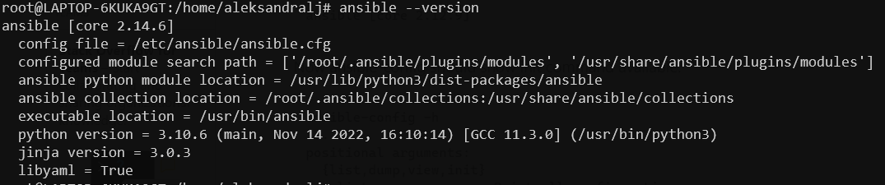

```bash
$ ansible-config -h # sada je init opcija dostupna
```
* Kreirati `ansible.cfg` file

`$ ansible-config init --disabled -t all > ansible.cfg`

* Output komande


## Rjesenje za TASK - 12

- U fajl `inventory/prod.ini` smjestene su grupe hostova. Hostovi su dodati rucno, koristeci output Template-a gdje smo mogli vidjeti Public Ip adrese instanci, te iste kopirati bez da kliknemo na svaku posebno. 
- Ovakav staticki inventory file nije dobra praksa, ali zbog error-a koje nisam bila u stanju rijesiti ovaj put je moralo ovako. :)

- Grupe hostova su 
```bash
[webservers_cf]
# za web instance kreirane koristeci CF

[webservers_tf]
# za web instance kreirane koristeci TF

[dbservers]
# za db instance 
```
- Ovime je olaksan proces dodjele razlicitih `index.html` fajlova.

### Instalacija nginx servisa 
-  Za instalaciju nginx servisa potrebno je uraditi sljedece
1. Pozicionirati se unutar `ansible-playbooks` direktorija
2. Pokrenuti playbook `01-nginx-install-playbook.yml`
- Za CF i TF kreirana su dva posebna `index.html` fajla i dodati su na nacin prikazan u kodu 

```bash
- name: Configure webserver with nginx
  hosts: webservers_cf, webservers_tf
  become: True
  vars:
    ansible_python_interpreter: /usr/bin/python3
  tasks:
    - name: Install nginx 
      yum:
        name: nginx
        state: latest

    - name: Start nginx
      service: 
        name: nginx
        state: started
        enabled: yes


- name: Update index.html in CloudFormation webservers
  hosts: webservers_cf
  become: True
  vars:
    ansible_python_interpreter: /usr/bin/python3
  tasks:
  
    - name: copy index.html
      template: src=templates/index_cf.html.j2 dest=/usr/share/nginx/html/index.html
        mode=0644

    - name: restart nginx
      service: name=nginx state=restarted


- name: Update index.html in Terraform webservers
  hosts: webservers_tf
  become: True
  vars:
    ansible_python_interpreter: /usr/bin/python3
  tasks:
  
    - name: copy index.html
      template: src=templates/index_tf.html.j2 dest=/usr/share/nginx/html/index.html
        mode=0644

    - name: restart nginx
      service: name=nginx state=restarted
```
- Komanda za pokretanje playbook-a je
`ansible-playbook -i inventory/prod.ini 00-nginx-install-playbook.yml`
- Izmjena `index.html` fajla na `task-12-web-server-cf` instanci


- nginx status active - `systemctl status nginx`

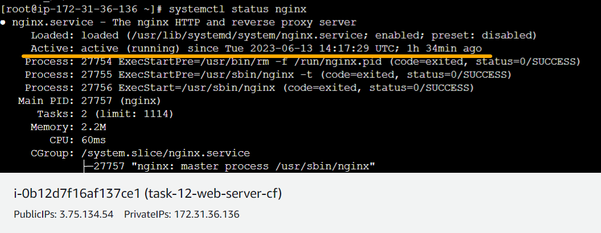

- Izmjena `index.html` fajla na `task-12-web-server-tf` instanci

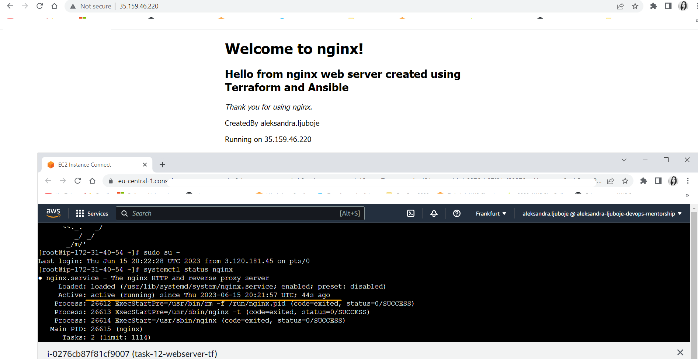


### Instalacija mysql na db server instance
- pokrenemo playbook `$ ansible-playbook -i inventory/prod.ini 01-mysql-install-playbook.yml`
- nakon ovoga imamo instaliran `mysql` na db server instancama
- provjerimo repozitorije 
`yum repolist enabled | grep "mysql.*-community.*"`

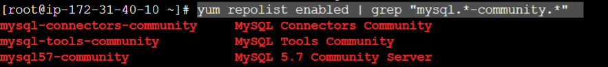
- `yum repolist all | grep mysql` 

### Kreiranje  baze, korisnika i dodjela privilegija 
#### root password problem [SOLVED]
- proces je polu-automatizovan jer nisam uspjela pokupiti **root password** automatski kroz Ansible playbook. 
- Koraci za rjesavanje problema sa `root` passwordom
1. Nakon instalacije mysql, povezati se na db-server ec2- instancu
2. Pokupimo privremeni root password pomocu komande 
`$ sudo grep 'temporary password' /var/log/mysqld.log`, te iskopiramo sifru na kraju
3. Pokrenemo `$ sudo mysql_secure_installation`
  * Unesemo temp password i dodijelimo novi 
```bash
# odgovori na neka pitanja 
Dissallow root login remotely? -n
Remove test database and access to it? -y
Reload privileges tables now? -y
```
#### Zapisati novu sifru jer ce se koristiti kao root pw za playbook
4. Povezemo se na bazu
`$ mysql -h localhost -u root -p`,  unesemo privremeni password

#### Podesavanje remote povezivanja
```bash
$ sudo su -
$ cd .. # da dodjemo do root /
$ cd /etc/
$ vi my.cnf

# dodamo bind-address = 0.0.0.0 iznad 
datadir=/var/lib/mysql
log-error=/var/lib/mysqld.log

# i sacuvamo 
```
- Restartujemo bazu podataka `$ service mysqld restart`
- Povezemo se `$ mysql -h localhost -u root -p`
- Sada je potrebno da dozvolimo da se user root moze povezati sa bilo koje adrese, ne samo localhost.
```bash
mysql> show databases;
mysql> use mysql;
mysql> show tables; # gdje vidimo tabelu user
mysql> UPDATE mysql.user SET host='%' WHERE user='root';
mysql> FLUSH PRIVILEGES;
```
- sada se mozemo povezati na db-server sa neke druge instance 
`$ mysql -h <ip-adresa-db-instance> -u root -p`

### U terminalu gdje pokrecemo ansible playbook eksportovati root password i user password
```bash
export MYSQL_ROOT_PASSWORD='ukoliko sadrzi neke nedozvoljene znakove koristiti jednostruke navodnike'
export MYSQL_USER_PASSWORD=nova-sifra
```
- Ovaj korak nije obavezan, mogli smo ove podatke unijeti u varijable unutar playbook-a, medjutim bolja je praksa koristiti `lookup` kako ne bismo direktno postavljali sifre na GitHub i sl. 

### Kreiranje baze podataka
```bash
- name: Kreiranje mysql baze
      mysql_db:
        name: "{{ mysql_db_name }}"
        state: present
        login_user: "{{ mysql_root_username }}"
        login_password: "{{ mysql_root_password }}"
      vars:
        ansible_python_interpreter: /usr/bin/python3
```
- output ansible playbook-a `ansible-playbook -i inventory/prod.ini 02-mysql-configure-playbook.yml`

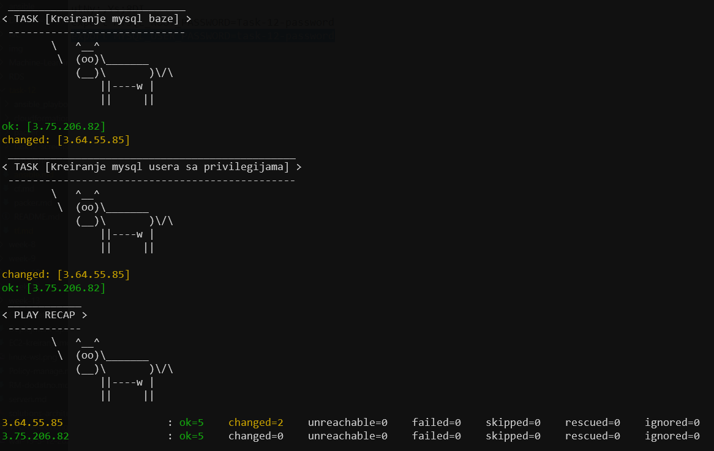
- Baza `task-12-db` je kreirana

- Komanda `$ show databases;`

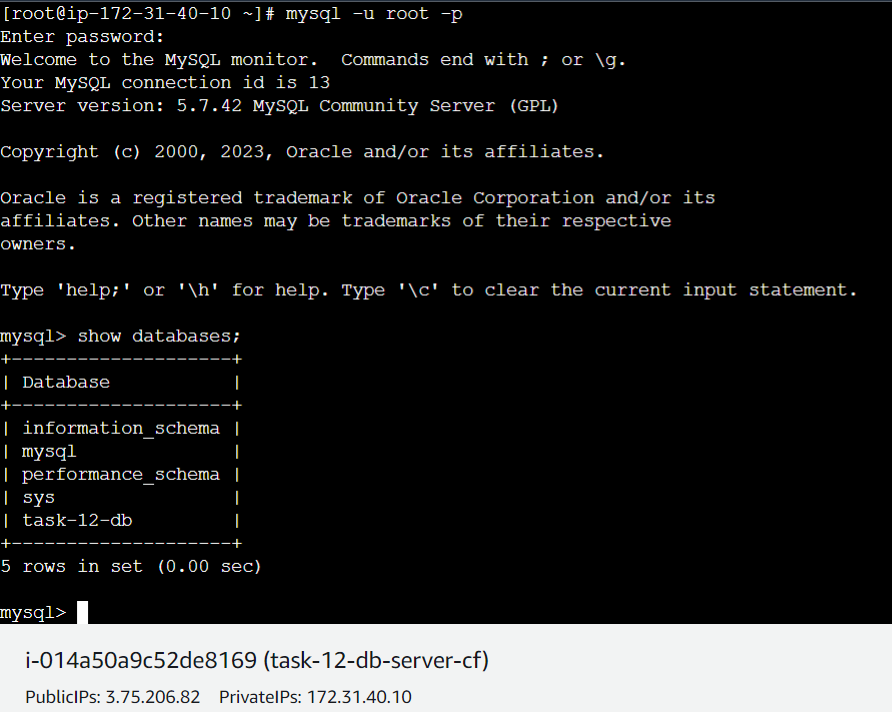


- User `task-12-user` je kreiran
- Komanda `$ select user, host from mysql.user;`

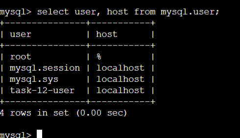


- Provjera privilegija za korisnika `task-12-user`
- Komanda `$ show grants for 'task-12-user'@'localhost';`

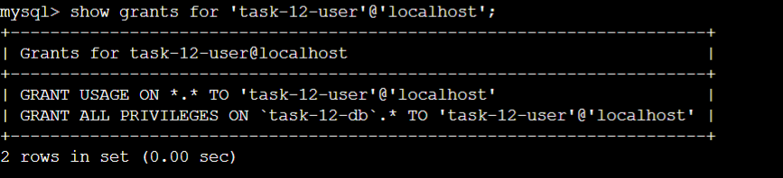

>*Source*
> MYSQL queries: https://www.shellhacks.com/mysql-show-users-privileges-passwords/
> MySQL better output format: add \G at the end of select command
https://stackoverflow.com/questions/48272997/mysql-command-output-too-wide-in-command-line-client
### Verifikacija konekcije izmedju webserver instanci i db server instanci

- Koristen je ansible playbook pod nazivom `02-check-conncection.yml`
- instaliran je `telnet` koristeci komandu `yum install -y telnet` 
- Output komande 
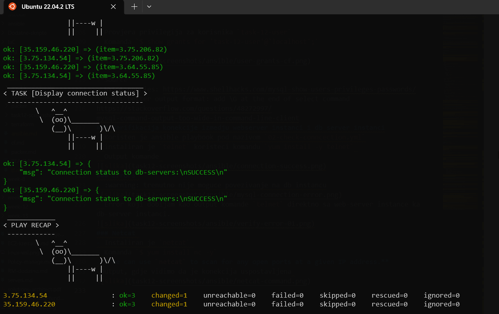
### Errors 
- :warning: trenutno nije moguce povezivanje na db instancu
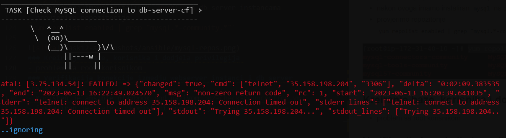
- Error koji dobijam kao output komande `telnet` direktno sa web-server instance ka db-server instanci.
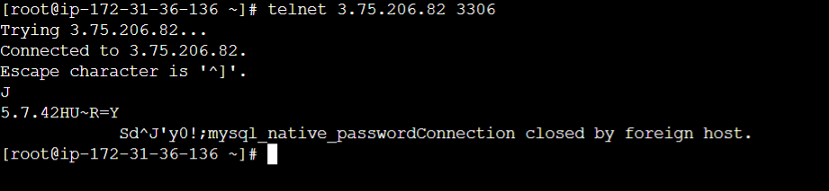
### Netcat 
- Instaliran je `netcat` 
- Komanda `$ yum install nc -y`
- **We can use `netcat` to scan for any open ports at a given IP address.**
-Output, gdje vidimo da je konekcija uspostavljena 
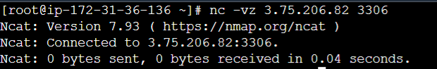
