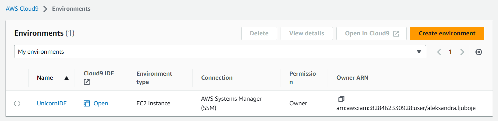
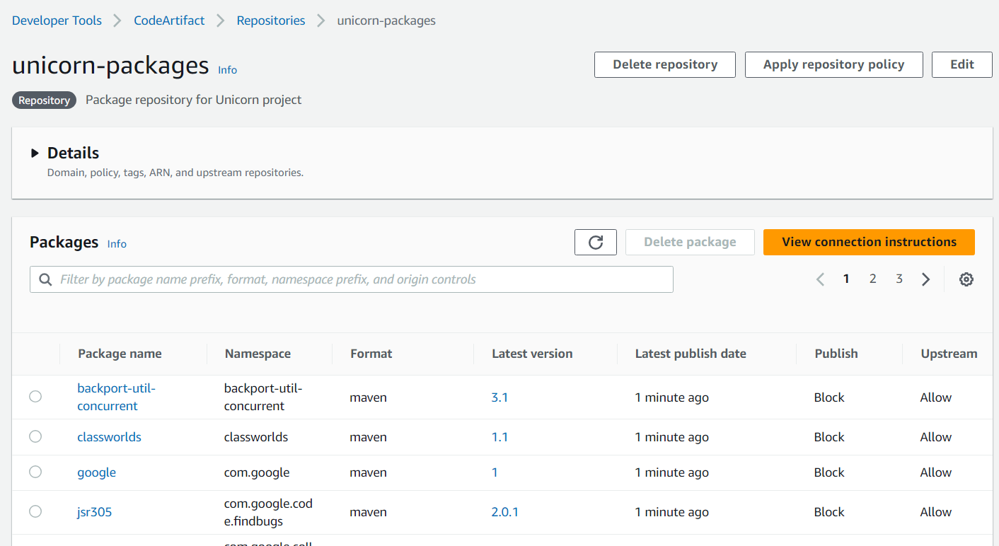
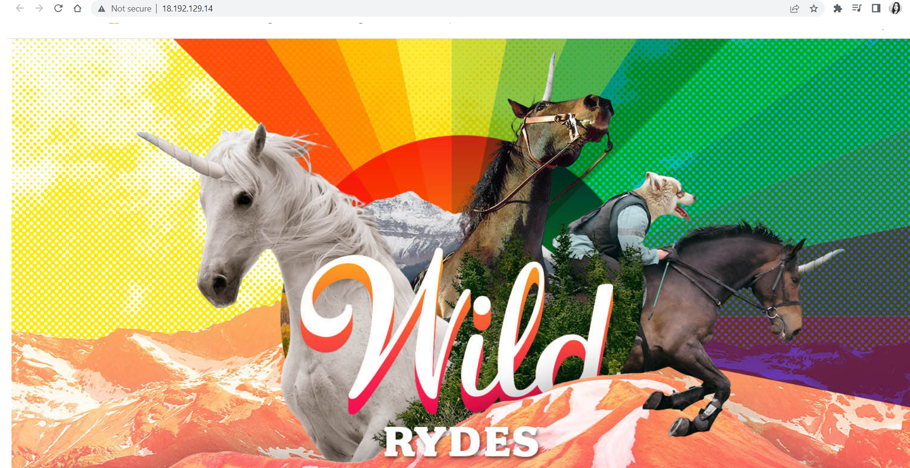

*This file is associated with TASK - 13 "Unicorn Workshop"*
- *Workshop is available on [link](https://catalog.us-east-1.prod.workshops.aws/workshops/752fd04a-f7c3-49a0-a9a0-c9b5ed40061b/en-US/introduction)*
- *Task-13 is available on [link](https://github.com/allops-solutions/devops-aws-mentorship-program/issues/83)*

# Introduction to AWS Code Family
### Sta cemo nauciti kroz workshop?

- Tokom workshop-a steci cemo hands-on iskustvo u radu sa AWS Code servisima:

    - **AWS CodeCommit** as a Git repository
    - **AWS CodeArtifact** as a managed artifact repository
    - **AWS CodeBuild** as a way to run tests and produce software packages
    - **AWS CodeDeploy** as a software deployment service
    - **AWS CodePipeline** to create an automated CI/CD pipeline

- Iskusicemo proces kreiranja CI/CD pipeline-a za Java aplikaciju koja se deploja na EC2 Linux instancu.
- Kao bonus, steci cemo hands-on iskustvo u koristenju **AWS Cloud9** servisa, koji je cloud-based IDE koji nam omogucava da pisemo, run-iramo i debug-ujemo kod koristeci browser.

### Vrijeme izrade
- ~ 3-5  sati
### :moneybag: Troskovi na AWS racunu
- Troskovi su 0 ili minimalni, kako su svi servisi koje koristimo dio  Free tier-a. 

### Prethodno znanje
- Potrebno je poznavanje servisa Amazon S3, Amazon EC2, AWS IAM and AWS CloudFormation.
- Rad sa Git-om i osnovne Linux komande.

## Environment setup
- Podesavanje okruzenja
### Setup AWS Cloud9 IDE
- Kreiran je environment `UnicornIDE`



- Kreirana je i instanca 


>**Note**
>The Cloud9 environment already has tools such as Docker and Git installed. The awscli is also pre-configured with AWS managed temporary credentials 

## Create a web app
### Install Maven & Java
>**Note**
>Apache Maven  is a build automation tool used for Java projects. In this workshop we will use Maven to help initialize our sample application and package it into a Web Application Archive (WAR) file.

1. Instaliramo Apache Maven koristeci komande (enter them in the terminal prompt of Cloud9):
```bash
sudo wget https://repos.fedorapeople.org/repos/dchen/apache-maven/epel-apache-maven.repo -O /etc/yum.repos.d/epel-apache-maven.repo
sudo sed -i s/\$releasever/6/g /etc/yum.repos.d/epel-apache-maven.repo
sudo yum install -y apache-maven
```
2. **Maven** dolazi sa **Java 7**. Za build image nama je potrebna Java 8, te cemo instalirati  **Java 8** tacnije **Amazon Correto 8** - *free, production-ready distribution of the Open Java Development Kit (OpenJDK) provided by Amazon*

```bash
sudo amazon-linux-extras enable corretto8
sudo yum install -y java-1.8.0-amazon-corretto-devel
export JAVA_HOME=/usr/lib/jvm/java-1.8.0-amazon-corretto.x86_64
export PATH=/usr/lib/jvm/java-1.8.0-amazon-corretto.x86_64/jre/bin/:$PATH
```
3. Provjerimo da li su instalirane potrebne verzije Java 8 i Maven:


> **Important**
> If the command above doesn't return openjdk version 1.8 (=> Java 8), then run the following command that allows you to choose the correct Java version:
> ```bash sudo alternatives --config java```

### Create the Application
1. Use `mvn` to generate a sample Java web app
```bash
mvn archetype:generate \
    -DgroupId=com.wildrydes.app \
    -DartifactId=unicorn-web-project \
    -DarchetypeArtifactId=maven-archetype-webapp \
    -DinteractiveMode=false

```
- Output komande


2. Provjerimo strukturu fajlova. Imamo i`ndex.jsp` i `pom.xml` fajlove


3. Izmjenimo `index.jsp` file to customize the HTML code (just to make it your own!). 
- *You can modify the file by double-clicking on it in the Cloud9 IDE. We will be modifying this further to include the full Unicorn branding later.*
```html
<html>
<body>
<h2>Hello Unicorn World!</h2>
<p>This is my first version of the Wild Rydes application!</p>
<p>Created by aleksandra.ljuboje</p>
<p>DevOps Mentorship pogram 2023 - AWS Community Bosnia</p>
</body>
</html>
```

## Lab 1: AWS CodeCommit
>**Note**
>AWS CodeCommit is a secure, highly scalable, managed source control service that hosts private Git repositories. CodeCommit eliminates the need for you to manage your own source control system or about scaling its infrastructure.

- **U ovoj LAB vjezbi podesicemo CodeCommit repository da cuva nas  Java kod**


### Create a Repository
- Unutar CodeCommit konzole kreiramo repozitorij `unicorn-web-project`
- Dodamo tagove `key`-`team`, `value`-`devops`


4. Iz Clone URL kopiramo `Clone HTTPS`, link sacuvamo za kasnije.
```bash
https://git-codecommit.eu-central-1.amazonaws.com/v1/repos/unicorn-web-project
```


### Commit your Code

1. Unutar Cloud9 environment podesimo Git identity:
```bash
git config --global user.name "aleksandra.ljuboje"
git config --global user.email aleksandraljuboje@gmail.com
```

2. Moramo biti unutar putanje `~/environment/unicorn-web-project` i uraditi *init the local repo and set the remote origin to the CodeCommit URL you copied earlier:*
```bash
cd ~/environment/unicorn-web-project
git init -b main
git remote add origin https://git-codecommit.eu-central-1.amazonaws.com/v1/repos/unicorn-web-project
```
- Output komandi


3. Uradimo commit i push koda.
```bash
git add *
git commit -m "Initial commit"
git push -u origin main
```

- Output komandi


- Unutar CodeCommit-a sada imamo kreirane foldere 


>**Note**
> Now we have a working CodeCommit repository to store and version control our code! Next, we need a way to fetch the packages to produce our Java WAR file. Introducing AWS CodeArtifact!

## Lab 2: AWS CodeArtifact

>**Note**
>AWS CodeArtifact is a fully managed artifact repository service that makes it easy for organizations of any size to securely fetch, store, publish, and share software packages used in their software development process.

- **In this lab we will setup a CodeArtifact repository that we will be using during the build phase with CodeBuild to fetch Maven packages from a public package repository (the "Maven Central Repository"). Using CodeArtifact rather than the public repository directly has several advantages, including improved security, as you can strictly define which packages can be used. To see other advantages of using CodeArtifact, please refer to the AWS CodeArtifact features  web page.**


### Create Domain and Repository
- Kreiramo Domain imena `unicorns`


- Unicorn domain je kreiran


3. Kreiramo repository za domen pod nazivom  `unicorn-packages` 


- **Review the settings. Especially keep note of the Package flow section that visualizes how there will be two repositories created as part of the process: the actual unicorn-packages repository, as well as an upstream repository (maven-central-store), which serves as an intermediate between the public repository. Click Create repository to finish the process.**


- Kreirana dva repozitorija


### Connect the CodeArtifact repository
- Ispratimo navedene korake 

1. On the next page, click View connection instructions. In the dialog, choose Mac & Linux for Operating system and mvn as package manager.


2. Export a CodeArtifact authorization token for authorization to your repository from your preferred shell. I kopiramo ga u Cloud9
```bash
export CODEARTIFACT_AUTH_TOKEN=`aws codeartifact get-authorization-token --domain unicorns --domain-owner 828462330928 --region eu-central-1 --query authorizationToken --output text`
```
3. For the next steps, we'll have to update the settings.xml. As this doesn't exist yet, let's create it first:
```bash
cd ~/environment/unicorn-web-project
echo $'<settings>\n</settings>' > settings.xml 
```


4. Open the newly created settings.xml in the Cloud9 directory tree and follow the remaining steps in the Connection instructions dialog in the CodeArtifact console including the mirror section. The complete file will look similar to the one below. Close the dialog when finished by clicking Done.

- Connection instruction dialog izgleda ovako


- Izgled `settings.xml` fajla


### Testing via Cloud9
1. Let's verify if the application can be compiled successfully locally in Cloud9 using the settings file:
`mvn -s settings.xml compile`

- Output komande i **BUILD SUCCESS**


2. If the build was successful, go back to the CodeArtifact console and refresh the page of the unicorn-packages repository. You should now see the packages that were used during the build in the artifact repository. This means that they were downloaded from the public repository and are now available as a copy inside CodeArtifact.



### IAM Policy for consuming CodeArtifact
- Before moving on to the next lab, let's define an IAM policy so that other services can consume our newly created CodeArtifact repository.

1. In the AWS Console, search for IAM, select it, and click Policies in the menu on the left.

2. lick Create policy and select the JSON tab on top to view the raw JSON code of the IAM policy, then copy/paste the policy code below (source: Using Maven packages in CodeBuild ). This will make sure that other services such as CodeBuild will be able to read the packages in our CodeArtifact repository.

```json
{
  "Version": "2012-10-17",
  "Statement": [
      {
          "Effect": "Allow",
          "Action": [ "codeartifact:GetAuthorizationToken",
                      "codeartifact:GetRepositoryEndpoint",
                      "codeartifact:ReadFromRepository"
                      ],
          "Resource": "*"
      },
      {       
          "Effect": "Allow",
          "Action": "sts:GetServiceBearerToken",
          "Resource": "*",
          "Condition": {
              "StringEquals": {
                  "sts:AWSServiceName": "codeartifact.amazonaws.com"
              }
          }
      }
  ]
}
```
- Kreiran novi policy `codeartifact-unicorn-consumer-policy`


## Lab 3: AWS CodeBuild
>**Note**
>AWS CodeBuild is a fully managed continuous integration service that compiles source code, runs tests, and produces software packages that are ready to deploy. You can get started quickly with prepackaged build environments, or you can create custom build environments that use your own build tools.


- In this lab we will setup a CodeBuild project to package our application code into a Java Web Application Archive (WAR) file.

### Create an S3 bucket
- Kreiramo S3 bucket `unicorn-build-artifacts-<neki-broj>` jedinstvenog imena.


### Create a CodeBuild build project

- Prateci korake, kreiran je `unicorn-web-build` projekat


### Create the buildspec.yml file
- Now we have our build project setup we need to give it some instructions on how to build our application. To do this we will create a buildspec.yml (YAML) file in the root of the code repository.

- Kreiran je file `buildspec.yml`
```bash
cd /environment/unicorn-web-project/
touch buildspec.yml
```
- Otvorimo `buildspec.yml` i kopiramo kod koji smo dobili


-  Then commit and push it to CodeCommit.
```bash
cd ~/environment/unicorn-web-project
git add *
git commit -m "Adding buildspec.yml file"
git push -u origin main
```

- Output komandi


### Modifying the IAM role
- Roli `codebuild-unicorn-web-build-service-role` koju smo kreirali kroz CodeBuild projekat, dodijelimo policy koji smo sami kreirali prethodno u zadatku `codeartifact-unicorn-consumer-policy`


### Testing the build project

1. In the AWS Console search for CodeBuild service.

2. Select the unicorn-web-build project and select Start build > Start now.
#### ERROR
- Nakon pokretanja build procesa, dobila sam error prikazan na slici ispod.


#### Rjesenje 
1. U `buildspec.yml` file, promjeniti `correto8` u `correto17`
2. U dijelu koda
```bash
commands:
      - echo Initializing environment
      - export CODEARTIFACT_AUTH_TOKEN=`aws codeartifact get-authorization-token --domain unicorns --domain-owner <unesi-svoj-domain> --query authorizationToken --output text
```
 potrebno je unijeti nas `domain-owner` koji smo dobili pri kreiranju domena u CodeArtifact. 
 - Uraditi commit i push promjena
- Nakon ponovnog pokretanja build procesa sve je OK. 


- Vidimo i da su logovi sacuvani kao zip file unutar naseg S3 bucket-a


## Lab 4: AWS CodeDeploy
>**Note**
> AWS CodeDeploy is a fully managed deployment service that automates software deployments to a variety of compute services such as Amazon EC2, AWS Fargate, AWS Lambda, and even on-premise services. You can use AWS CodeDeploy to automate software deployments, eliminating the need for error-prone manual operations.


- **In this lab, we will use CodeDeploy to install our Java WAR package onto an Amazon EC2 instance running Apache Tomcat**

### Create an EC2 instance
- Instance kreiramo pomocu CF template koji nam je provajdan `ec2-cfn.yaml` 
>**Note**
> http://checkip.amazonaws.com/
- Ispratimo sve korake koji su navedeni
- Stack je kreiran 


- Instanca `UnicornStack::WebServer` je kreirana


- Kao output stack-a dobili smo URL za nasu instancu


### Create scripts to run the application
- Next, we need to create some bash scripts in our Git repository. CodeDeploy uses these scripts to setup and deploy the application on the target EC2 instance

- Kreiran folder `scripts` i potrebne skripte


- Sadrzaj skripte `install_dependencies.sh`
```bash
#!/bin/bash
sudo yum install tomcat -y
sudo yum -y install httpd
sudo cat << EOF > /etc/httpd/conf.d/tomcat_manager.conf
<VirtualHost *:80>
    ServerAdmin root@localhost
    ServerName app.wildrydes.com
    DefaultType text/html
    ProxyRequests off
    ProxyPreserveHost On
    ProxyPass / http://localhost:8080/unicorn-web-project/
    ProxyPassReverse / http://localhost:8080/unicorn-web-project/
</VirtualHost>
EOF
```

- Sadrzaj skripte `start_server.sh`
```bash
#!/bin/bash
sudo systemctl start tomcat.service
sudo systemctl enable tomcat.service
sudo systemctl start httpd.service
sudo systemctl enable httpd.service

```

- Sadrzaj skripte `stop_server.sh`
```bash
#!/bin/bash
isExistApp="$(pgrep httpd)"
if [[ -n $isExistApp ]]; then
sudo systemctl stop httpd.service
fi
isExistApp="$(pgrep tomcat)"
if [[ -n $isExistApp ]]; then
sudo systemctl stop tomcat.service
fi

```
- Kreiramo `~/environment/unicorn-web-project/ appspec.yml` file
```bash
version: 0.0
os: linux
files:
  - source: /target/unicorn-web-project.war
    destination: /usr/share/tomcat/webapps/
hooks:
  BeforeInstall:
    - location: scripts/install_dependencies.sh
      timeout: 300
      runas: root
  ApplicationStart:
    - location: scripts/start_server.sh
      timeout: 300
      runas: root
  ApplicationStop:
    - location: scripts/stop_server.sh
      timeout: 300
      runas: root
```

- Zatim editujemo `buildspec.yaml` u dijelu `artifacts`
```bash
version: 0.2

phases:
  install:
    runtime-versions:
      java: corretto17
  pre_build:
    commands:
      - echo Initializing environment
      - export CODEARTIFACT_AUTH_TOKEN=`aws codeartifact get-authorization-token --domain unicorns --domain-owner 828462330928 --query authorizationToken --output text`
  build:
    commands:
      - echo Build started on `date`
      - mvn -s settings.xml compile
  post_build:
    commands:
      - echo Build completed on `date`
      - mvn -s settings.xml package
artifacts:
  files:
    - target/unicorn-web-project.war
    - appspec.yml # ovaj dio je dodat
    - scripts/**/* # ovaj dio je dodat
  discard-paths: no
  ```

  - Promjene sacuvane u CodeCommit
```bash
cd ~/environment/unicorn-web-project
git add *
git commit -m "Adding CodeDeploy files"
git push -u origin main
```

- Nakon ponovnog pokretanja Build procesa sa novim izmjenama, ovo je output, a nove promjene su sacuvane u S3 Bucket-u kao zip.


- Promjene nad S3 bucket zip fajlom


### Create CodeBuild service IAM Role

- Kreiranje role `UnicornCodeDeployRole`


- Rola  `UnicornCodeDeployRole` je kreirana


### Create a CodeDeploy application
- Kreirana aplikacija


### Create a deployment group
>**Note**
> deployment group, which contains settings and configurations used during the deployment. It defines for example that our deployment shall target any EC2 instances with a specific tag.

- Deployment grupa `unicorn-web-deploy-group` je kreirana prateci korake


### Create deployment

- Deployment je kreiran 


- Testiramo ispis na instanci


## Lab 5: AWS CodePipeline
>**Note**
> AWS CodePipeline is a fully managed continuous delivery service that helps you automate your release pipelines for fast and reliable application and infrastructure updates. You only pay for what you use.


- In this lab we use CodePipeline to create an automated pipeline using the CodeCommit, CodeBuild and CodeDeploy components created earlier. The pipeline will be triggered when a new commit is pushed to the main branch of our Git repo.

- Kreiramo pipeline `unicorn-web-pipeline`
- Role name `AWSCodePipelineServiceRole-eu-central-1-unicorn-web-pipeline`


### Release a change
- Sada imamo fully managed CI/CD pipeline.
- Testiramo da li sve radi kako treba.

1. Log back into your Cloud9 environment.

2. Update `index.jsp` sa novim html kodom. Kreiramo `images` folder `unicorn-web-project/src/main/webapp/images/` i dodamo sliku `File > Upload Local File`.
3. Pushamo promjene
```bash
cd ~/environment/unicorn-web-project/
git add *
git commit -m "Visual improvements to homepage"
git push -u origin main
```
- Pratimo promjene na CodePipeline
- Deployment je prosao uspjesno 


- Webserver instanca sada izgleda ovako



## Extending the pipeline
- **In this lab we will look at extending our existing CodePipeline pipeline to include a manual approval step before deploying to a production server.**


- Trenutni pipeline


- Buduci pipeline


### Update the CloudFormation stack
- Uradimo Update naseg stack-a, na nacin da dodamo novi template `ec2-cfn-cp-ext.yaml`

- Update stack-a


- Output stack-a nakon update-a


### Add an additional CodeDeploy deployment group
- Kreiramo novu CodeDeploy group


### Create SNS topic
- SNS topic to be used for manual approvals in the next section
- Kreiramo SNS topic `unicorn-pipeline-notifications`


- Kreiramo subscirption za EMAIL


- Potvrdimo email, sada je status *Confirmed*


### Update CodePipeline
- add in our manual approval step and the deployment to the production web server

- Dodati su novi *stages* sa akcijama, kako je navedeno u tekstu


### Testing the new pipeline
- Kada uradimo *release* ponovo ce se pokrenuti cijeli proces deployment-a.
Ovoga puta kada dodje do stage `Approval` moracemo potvrditi email koji dobijemo. 
- Cekanje na approval 


- Email:


- Nakon toga ce da se odradi Deploy proces i dobicemo output na instanci


## Cleanup

### Delete CloudFormation stack
- Obrisemo `UnicornStack` - brise se VPC, subnet i EC2 instance

### Delete the Cloud9 environment
- Obrisemo `UnicornIDE`

### Delete CodePipeline
- Obrisemo `unicorn-web-pipeline`

### Delete the CodeCommit repository
- Obrisemo `unicorn-web-project`

### Delete the CodeArtifact repository and domain
- Obrisati u `Repositories` -> `maven-central-store`, ` unicorn-packages`
- Obrisati u `Domain` -> `unicorn`

### Delete CodeBuild projects
- Obrisati `unicorn-web-build`

### Delete CodeDeploy application
- Obrisati u `Applications`- `unicorn-web-deploy`

### Delete SNS topic and subscription
- Obrisati Topics `unicorn-pipeline-notifications`
- Obrisati Subscription 

### Delete artifact S3 bucket
- Empty `unicorn-build-artifacts` i onda Delete 

### Empty and delete buckets created in S3

### Delete IAM Policies and Roles
- Obrisati Topics `codeartifact-unicorn-consumer-policy`i `UnicornCodeDeployRole`te sve sto ima u imenu `unicorn-web`

### Delete CloudWatch Logs group
- Obrisati `unicorn-build-logs`
