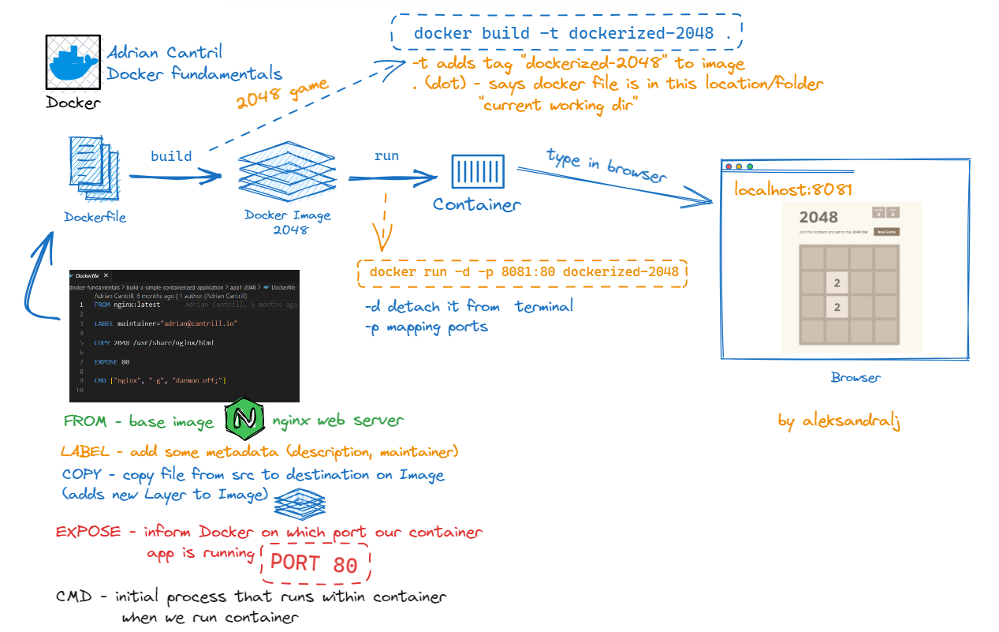
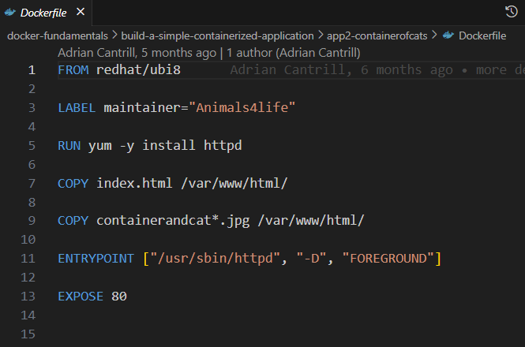

*U ovom fajlu nalaze se instrukcije i najbolje prakse za pisanje Docekrfile-a*

# [](https://skillicons.dev)  Docker - Dockerfile 

- Komentar u Dockerfile pocinje sa `#` ili `$`
``` # ovo je komentar ``` 
``` $ i ovo je komentar ```

- Svaka linija ima instrukcije i argumente
- **INSTRUKCIJE** se pisu **VELIKIM SLOVIMA**, kako bismo ih razlikovali od argumenata
---
- Osnovne instrukcije su:

1. **FROM** - postavimo bazni image koji koristimo za build *(npr. Alpine - lightweight Linux)*. Dodatno mozemo navesti tag za verziju.

2. **LABEL** - dodavanje metadata image-u *(opis, maintainer)*
---
- Instrukcije koje kreiraju novi **layer** Image-a. ***One layer per instruction***:

1. **RUN** - izvrsava komande u novom layer-u *(instalacija paketa, aplikacija, testovi, druga konfiguracija)*
* **output** RUN komande bice smjesten u novi layer Docker image-a
2. 3. **COPY** i **ADD** komande
* zajednicko: kopiraju nove fajlove iz src (client machine) u destination na Docker image
- **ADD** moze dodati file sa remote URL i uraditi ekstrakciju 

---

- Instrukcije u odnosu na **sta Image radi** i **kako se izvrsava/run**

1. **CMD** postavljamo **default** izvrsenje. *(default run game server)*
- aKO pri `build` ne navedemo parametre, koriste se defaultni 
- mogu biti *overridden*  ako koristimo **CMD**
- koristiti kada kreiramo *general image*

2. **ENTRYPOINT** radi isto sto i CMD, ali ne moze biti *overridden*
- koristiti kada kreiramo *single purpose image*

3. **EXPOSE** - informise Docker koji port container app koristi za izvrsenje
---
## [DEMO] Build and run simple container application
*[GithHub repository Cantril Docker Fundamentals](https://github.com/acantril/docker-fundamentals)*
- Potrebno je uraditi `clone` repozitorija:
```$ git clone git@github.com:acantril/docker-fundamentals.git```

Kreiramo:
- *web-based game* naziva `2048`
- vlastiti container od `cats Docker image` 

### 2048 igrica
- Dijagram toka je prikazan na slici


- U browseru ukucati `localhost:8081` i igrati :)

## Koristene komande

```bash
$ docker build -t dockerized-2048 . # build image sa tagom
$ docker run -d -p 8081:80 dorckerized-2048 # run image detached from terminal and with port mapping
```

### Cats Docker Image

- Dockerfile za ovaj Image prikazan je na slici 




- Kreiramo Image `containerofcats`
``` docker build -t containerofcats . ```
- Kreiramo container
``` docker run -d -p 8081:80 containerofcats ```

- U browseru ukucati `localhost:8081` prikazace nam se Cantrill macke :cat: