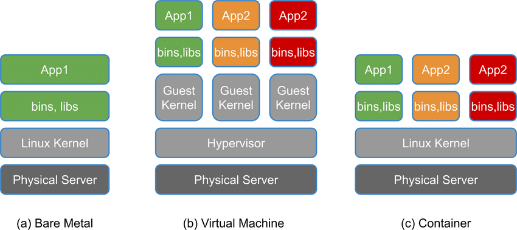
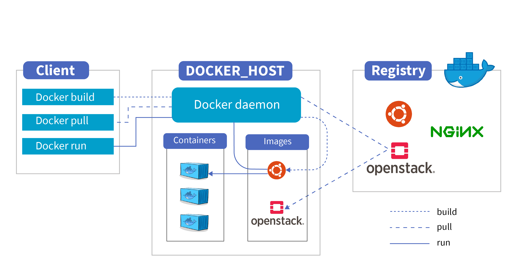
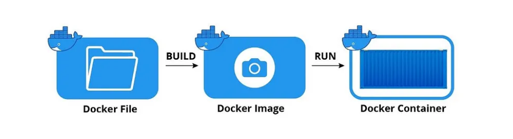

*U ovom fajlu nalaze se biljeske vezane za osnove Docker-a i kontejnerizacije*
- [x] Obavezno pogledati - [Free Docker Fundamentals - Cantrill](https://www.youtube.com/watch?v=gthvzSE4yIY&list=PLTk5ZYSbd9Mg51szw21_75Hs1xUpGObDm&ab_channel=LearnCantrill)
# Sadrzaj
[📖 1 Sta je docker?](#1-docker)

[📖 2 Docker arhitektura i terminologija](#2-docker-terminologija)

[📖 3 Instalacija na Windows WSL](#3-docker-instalacija)

[📖 4 hello-world container](#4-docker-hello-world)

[📖 Korisne komande](#5-docker-commands)


# [](https://skillicons.dev)  Docker 

<a name= "docker">
## Sta je Docker?
- Docker je open-source softverska platforma koja omogucava da radimo build, testiramo i deplojamo aplikacije, radimo update i upravljamo kontejnerima.
- Docker pakuje softver u standardizovane jedinice koje se nazivaju *kontejneri* a koji sadrze sve sto je potrebno da bi se aplikacija izvrsavala na OS ukljucujuci biblioteke, system tools, kod i runtime enviroment.

### "Ali na mojoj masini je radilo?!"


- Docker nam pomaze da prevazidjemo jedan od problema - "Ali radilo je na mojoj masini". Dakle, sa upotrebom kontejnera, omoguceno je da bilo ko i na bilo kojoj masini moze izvrsiti aplikaciju. Razlog tome je upravo kontejner, koji sadrzi sve potrebno da bi ta specificna aplikacija radila. 

## Fizicki server vs Virtuelni server (VM) vs Kontejneri
- Server je kolekcija hardverskih komponenti kao sto je maticna ploca, CPU, memorija, storage i dodatne kartice. 

- **Fizicki server** ili *Bare metal* je racunar koji radi kao server, a za ciju konfiguraciju i kapacitete smo zaduzeni sami. Dakle, mozemo da koristimo 100% kapaciteta fizickog servera ali sa druge strane, moramo i da popravimo sve sami ukoliko dodje do neke greske ili kvara.
- Na njemu imamo instaliran OS, zatim runtime-enviroment sa bibliotekama te samu aplikaciju ili vise aplikacija koje zahtjevaju iste resurse i konfiguraciju. 
- Pad jedne aplikacije, moze dovesti do kraha svih ostalih aplikacija na serveru. A potrebno je voditi racuna i o iskoristivosti resursa servera.

- **Virtualni serveri ili Virtualne masine** omogucavaju nam da na jednom fizickom serveru, koji ima svoj OS i ostale hardverske komponente (*host*), podignemo vise aplikacija sa zasebnim OS koji mogu biti razliciti od onoga koji host ima, te konfigurisati potpuno zaseban runtime enviroment za aplikaciju.
- **Prednost VM, jeste sto aplikacijama omogucava jedan vid samostalnosti i odvojenosti od drugih VM na istom host-u.** Sto znaci da ako pravilno dodijelimo resurse svim VM pokrenutim na Host-u, one ce imati svoje zasebne CPU, memoriju, OS itd. U zavisnosti od kapaciteta VM, zavisice izvrsenje i kvalitet rada aplikacije.

- Tu uvodimo i pojam **Hypervisor**
>**Note**
> Hypervisor je komponenta, ciji je zadatak da upravlja resursima fizickog servera (host) i regulise pristup OS istog.
>

- **Container** su softverske jedinice, koje su slicne VM s bitnom razlikom da ne sadrze OS u paketu vec koriste Docker engine, a svaka aplikacija u kontejnere pakuje svoje runtime-enviroment (biblioteke i sl.) i sami kod aplikacije.
- Za razliku od VM, koje imaju jedan vid samostalnosti, kvalitet izvrsenja aplikacija u ovom slucaju ce da zavisi od rada ostalih aplikacija koje su na istom Docker host-u, jer se ipak koristi isti OS. 



<a name= "docker-terminologija">
## Docker arhitektura i terminologija

- **Docker engine** je bazni engine instaliran na Docker host-u a koji radi build  i run kontejnera koristeci Docker komponente i servise 

- **Docker Client** je nacin na koji smo u interakciji sa Docker-om (Docker Desktop, Command Line i sl.). Docker Client koristi Docker API da bi poslao komande ka Docker Daemon.

- **Docker host** je fizicki ili virtuelni server na kojem se izvrsava glavna komponenta Dockera - Docker engine. Ima svoj Host OS.

- **Docker Daemon** osluskuje klijentove zahtjeve i u interakciji sa OS kreira kontejnere i upravlja istim.

- **Docker Registry** je open-source server-side servis koji se koristi kao hosting distribucija za Docker Images. **[Docker Hub](https://hub.docker.com/)** je najveci Registry za Docker Images. Images mogu biti u public ili private repozitorijima. Za interakciju sa Docker Registry mozemo koristiti `pull` i `push` komande.
`Pull` komandu koristimo da preuzmemo Image dostupan u Docker Registry.
`Push` komandu koristimo da podijelimo nas Docker Image u Docker Registry.

- **Dockerfile** je text file sa setom instrukcijama kako da uradimo build naseg  Docker Image-a.  Svaka instrukcija predstavlja sloj (*layer*) Image-a. 

- **Docker Image** je template Docker kontejnera. Images su read-only i sadrze aplikaciju i potreban enviroment za aplikaciju (runtime tools, biblioteke i sl.).

- **Docker container** je **runnable** instanca Image-a. To je standalone, executable softverski paket koji ukljucuje aplikaciju i njene dependencies. Koristeci Docker API ili CLI, mozemo startovati, stopirati ili obrisati kontejner. 



<a name= "docker-instalacija">
# Instalacija Docker na Windows WSL
### Pre-requirements
- Instaliran WSL na Windows
- Instaliran Linux distro (Ubuntu, itd.)

### Instalacija Docker Desktop na Windows
- Preuzmemo **[Docker Desktop za Windows](https://www.docker.com/)**
- Tokom instalacije obratiti paznju da **omogucimo WSL2**

- Nakon instalacije od nas ce se zahtjevati ponovni *Sign in*


*Welcome screen za Docker Desktop*

- Unutar WSL kreirana su i dva foldera
1. `docker-desktop` koristi se za `run` Docker engine.
2. `docker-desktop-data` koristi se za skladistenje containters i images


*Na slici je prikazan izgled mog WSL sa instaliranim folderima*

### Podesavanje Docker za Ubuntu-22.04 distro
>**Napomena**
>Komande su izvrsavane u Command Prompt-u sa administratorskim privilegijama
- Kako bi mogli koristiti Docker unutar Ubuntu-22.04 terminala, potrebno je da distro koristi WSL2 sto mozemo provjeriti koristeci komandu
#### Provjera distro verzije
```bash
$ wsl.exe -l -v
```
- Output komande prikazan je na slici


- Vidimo da je Ubuntu-22.04 na verziji 1, te je potrebno uraditi upgrade na verziju 2, da bi se omogucila komunikacija sa Docker-om koji vidimo da koristi WSL2.

#### Upgrade Ubuntu distro verzije sa v1 na v2
- Upgrade Linux distroa moguc je komandom
```bash
$ wsl.exe --set-version (distro name) 2
```
- Gdje u `distro name` upisujemo `Ubuntu-22.04`, pa komanda izgleda ovako:
```bash
$ wsl.exe --set-version Ubuntu-22.04 2
```
- Nakon toga, potrebno je sacekati da se uradi upgrade. 


#### Postavljanje v2 za buduce instalacije
- Komanda koja se koristi za postavljanje na v2 je:
```json
$ wsl.exe --set-default-version 2
```
- Upgrade je uspjesno zavrsen


- Provjerimo verziju Ubuntu-22.04 i vidimo da je sada v2


### Podesavanje Docker Desktop

1. Kada se pokrene  Docker Desktop otici u `Settings > Resources > WSL Integration`
2. The Docker-WSL integration je enabled on the default WSL distribution, sto je u ovom slucaju Ubuntu.


### Provjera da li su dostupne Docker komande unutar Ubuntu-22.04

- Nakon pokretanja Ubuntu, unutar terminala otkucamo
```bash
$ docker
```


<a name= "docker-hello-world">
## hello-world container

- Jedan odlican primjer interakcije izmedju Docker Client i Docker Daemon prikazan je u nastavku. 
- Koristeci komandu, provjerimo da li imamo aktivne i running containere tj. procese.
```bash
$ docker ps
$ docker ps -a # da se  prikazu i procesi koji su zavrseni
```


- Pokrenemo komandu
```bash
$ docker run hello-world
```
- Kao output dobijamo sljedece:


- Kako prethodno nismo imali `hello-world` image na nasem lokalu, Docker je odradio `$ docker pull` komandu i preuzeo image `hello-world` i to `latest` kao zadnju dostupnu verziju ovog image-a.
- Cijeli postupak objasnjen je u output-u komande koju smo pokrenuli. 
```json
Da bi se generisala ova poruka. Docker je odradio sljedece korake:
1. Docker Client kontaktirao je Docker Daemon
2. Docker Daemon odradio je `pull` i iz Docker Hub preuzeo image naziva "hello-world"
3. Docker Daemon je zatim kreirao Container od tog Image-a a koji je sadrzao sve potrebne alate i resurse kako bi kreirao output koji sada citate.
4. Docker Daemon je strimovao taj output ka Docker Client-u, koji je poslat na nas terminal. 
```

- Kako bismo vidjeli koje images imamo na lokalu koristimo komandu
```bash
$ docker images
```
- Trenutni output komande


<a name= "docker-commands">
### Korisne Docker komande
```bash
$ docker ps
$ docker ps -a # pregled svih procesa i zavrsenih

$ docker run <image-name> # za pokretanje image-a

$ docker images # prikaz svih image-a
```