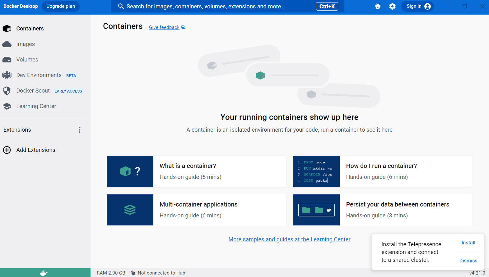

*U ovom fajlu nalaze se biljeske vezane za osnove Docker-a i kontejnerizacije*
- [x] Obavezno pogledati - [Free Docker Fundamentals - Cantrill](https://www.youtube.com/watch?v=gthvzSE4yIY&list=PLTk5ZYSbd9Mg51szw21_75Hs1xUpGObDm&ab_channel=LearnCantrill)
# Sadrzaj
[📖 1 Sta je docker?](#1-docker)
[📖 2 Docker arhitektura i terminologija](#2-docker-terminologija)
[📖 3 Instalacija na Windows WSL](#3-docker-instalacija)
[📖 4 hello-world container](#4-docker-hello-world)
[📖 Korisne komande](###5-docker-commands)
[📖 Docker Container Networking](###5-docker-commands)
[📖 Enviroment variables](###5-docker-commands)
[📖 Docker Container Storage](###5-docker-commands)


# [](https://skillicons.dev)  Docker 


## Sta je Docker?
- Docker je open-source softverska platforma koja omogucava da radimo build, testiramo i deplojamo aplikacije, radimo update i upravljamo kontejnerima.
- Docker pakuje softver u standardizovane jedinice koje se nazivaju *kontejneri* a koji sadrze sve sto je potrebno da bi se aplikacija izvrsavala na OS ukljucujuci biblioteke, system tools, kod i runtime enviroment.

### "Ali na mojoj masini je radilo?!"


- Docker nam pomaze da prevazidjemo jedan od problema - "Ali radilo je na mojoj masini". Dakle, sa upotrebom kontejnera, omoguceno je da bilo ko i na bilo kojoj masini moze izvrsiti aplikaciju. Razlog tome je upravo kontejner, koji sadrzi sve potrebno da bi ta specificna aplikacija radila. 

## Fizicki server vs Virtuelni server (VM) vs Kontejneri
- Server je kolekcija hardverskih komponenti kao sto je maticna ploca, CPU, memorija, storage i dodatne kartice. 

- **Fizicki server** ili *Bare metal* je racunar koji radi kao server, a za ciju konfiguraciju i kapacitete smo zaduzeni sami. Dakle, mozemo da koristimo 100% kapaciteta fizickog servera ali sa druge strane, moramo i da popravimo sve sami ukoliko dodje do neke greske ili kvara.
- Na njemu imamo instaliran OS, zatim runtime-enviroment sa bibliotekama te samu aplikaciju ili vise aplikacija koje zahtjevaju iste resurse i konfiguraciju. 
- Pad jedne aplikacije, moze dovesti do kraha svih ostalih aplikacija na serveru. A potrebno je voditi racuna i o iskoristivosti resursa servera.

- **Virtualni serveri ili Virtualne masine** omogucavaju nam da na jednom fizickom serveru, koji ima svoj OS i ostale hardverske komponente (*host*), podignemo vise aplikacija sa zasebnim OS koji mogu biti razliciti od onoga koji host ima, te konfigurisati potpuno zaseban runtime enviroment za aplikaciju.
- **Prednost VM, jeste sto aplikacijama omogucava jedan vid samostalnosti i odvojenosti od drugih VM na istom host-u.** Sto znaci da ako pravilno dodijelimo resurse svim VM pokrenutim na Host-u, one ce imati svoje zasebne CPU, memoriju, OS itd. U zavisnosti od kapaciteta VM, zavisice izvrsenje i kvalitet rada aplikacije.

- Tu uvodimo i pojam **Hypervisor**
>**Note**
> Hypervisor je komponenta, ciji je zadatak da upravlja resursima fizickog servera (host) i regulise pristup OS istog.
>

- **Container** su softverske jedinice, koje su slicne VM s bitnom razlikom da ne sadrze OS u paketu vec koriste Docker engine, a svaka aplikacija u kontejnere pakuje svoje runtime-enviroment (biblioteke i sl.) i sami kod aplikacije.
- Za razliku od VM, koje imaju jedan vid samostalnosti, kvalitet izvrsenja aplikacija u ovom slucaju ce da zavisi od rada ostalih aplikacija koje su na istom Docker host-u, jer se ipak koristi isti OS. 


*Na slici su prikazane razlike izmedju fizickog servera, VM i container-a*


## Docker arhitektura i terminologija

*Slikoviti prikaz kako docker funkcionise*
- **Docker engine** je bazni engine instaliran na Docker host-u a koji radi build  i run kontejnera koristeci Docker komponente i servise 

- **Docker Client** je nacin na koji smo u interakciji sa Docker-om (Docker Desktop, Command Line i sl.). Docker Client koristi Docker API da bi poslao komande ka Docker Daemon.

- **Docker host** je fizicki ili virtuelni server na kojem se izvrsava glavna komponenta Dockera - Docker engine. Ima svoj Host OS.

- **Docker Daemon** osluskuje klijentove zahtjeve i u interakciji sa OS kreira kontejnere i upravlja istim.

- **Docker Registry** je open-source server-side servis koji se koristi kao hosting distribucija za Docker Images. **[Docker Hub](https://hub.docker.com/)** je najveci Registry za Docker Images. Images mogu biti u public ili private repozitorijima. Za interakciju sa Docker Registry mozemo koristiti `pull` i `push` komande.
`Pull` komandu koristimo da preuzmemo Image dostupan u Docker Registry.
`Push` komandu koristimo da podijelimo nas Docker Image u Docker Registry.

- **Dockerfile** je text file sa setom instrukcijama kako da uradimo build naseg  Docker Image-a.  Svaka instrukcija predstavlja sloj (*layer*) Image-a. 

- **Docker Image** je template Docker kontejnera. Images su read-only i sadrze aplikaciju i potreban enviroment za aplikaciju (runtime tools, biblioteke i sl.).

- **Docker container** je **runnable** instanca Image-a. To je standalone, executable softverski paket koji ukljucuje aplikaciju i njene dependencies. Koristeci Docker API ili CLI, mozemo startovati, stopirati ili obrisati kontejner. 


*Od Dockerfile do Docker Container*


# Instalacija Docker na Windows WSL
### Pre-requirements
- Instaliran WSL na Windows
- Instaliran Linux distro (Ubuntu, itd.)

### Instalacija Docker Desktop na Windows
- Preuzmemo **[Docker Desktop za Windows](https://www.docker.com/)**
- Tokom instalacije obratiti paznju da **omogucimo WSL2**

- Nakon instalacije od nas ce se zahtjevati ponovni *Sign in*


*Welcome screen za Docker Desktop*

- Unutar WSL kreirana su i dva foldera
1. `docker-desktop` koristi se za `run` Docker engine.
2. `docker-desktop-data` koristi se za skladistenje containters i images


*Na slici je prikazan izgled mog WSL sa instaliranim folderima*

### Podesavanje Docker za Ubuntu-22.04 distro
>**Napomena**
>Komande su izvrsavane u Command Prompt-u sa administratorskim privilegijama
- Kako bi mogli koristiti Docker unutar Ubuntu-22.04 terminala, potrebno je da distro koristi WSL2 sto mozemo provjeriti koristeci komandu
#### Provjera distro verzije
```bash
$ wsl.exe -l -v
```
- Output komande prikazan je na slici


- Vidimo da je Ubuntu-22.04 na verziji 1, te je potrebno uraditi upgrade na verziju 2, da bi se omogucila komunikacija sa Docker-om koji vidimo da koristi WSL2.

#### Upgrade Ubuntu distro verzije sa v1 na v2
- Upgrade Linux distroa moguc je komandom
```bash
$ wsl.exe --set-version (distro name) 2
```
- Gdje u `distro name` upisujemo `Ubuntu-22.04`, pa komanda izgleda ovako:
```bash
$ wsl.exe --set-version Ubuntu-22.04 2
```
- Nakon toga, potrebno je sacekati da se uradi upgrade. 


#### Postavljanje v2 za buduce instalacije
- Komanda koja se koristi za postavljanje na v2 je:
```bash
$ wsl.exe --set-default-version 2
```
- Upgrade je uspjesno zavrsen


- Provjerimo verziju Ubuntu-22.04 i vidimo da je sada v2


### Podesavanje Docker Desktop

1. Kada se pokrene  Docker Desktop otici u `Settings > Resources > WSL Integration`
2. The Docker-WSL integration je enabled on the default WSL distribution, sto je u ovom slucaju Ubuntu.


### Provjera da li su dostupne Docker komande unutar Ubuntu-22.04

- Nakon pokretanja Ubuntu, unutar terminala otkucamo
```bash
$ docker
```


## hello-world container

- Jedan odlican primjer interakcije izmedju Docker Client i Docker Daemon prikazan je u nastavku. 
- Koristeci komandu, provjerimo da li imamo aktivne i running containere tj. procese.
```bash
$ docker ps
$ docker ps -a # da se  prikazu i procesi koji su zavrseni
```


- Pokrenemo komandu
```bash
$ docker run hello-world
```
- Kao output dobijamo sljedece:


- Kako prethodno nismo imali `hello-world` image na nasem lokalu, Docker je odradio `$ docker pull` komandu i preuzeo image `hello-world` i to `latest` kao zadnju dostupnu verziju ovog image-a.
- Cijeli postupak objasnjen je u output-u komande koju smo pokrenuli.
```bash
Da bi se generisala ova poruka. Docker je odradio sljedece korake:
1. Docker Client kontaktirao je Docker Daemon
2. Docker Daemon odradio je `pull` i iz Docker Hub preuzeo image naziva "hello-world"
3. Docker Daemon je zatim kreirao Container od tog Image-a a koji je sadrzao sve potrebne alate i resurse kako bi kreirao output koji sada citate.
4. Docker Daemon je strimovao taj output ka Docker Client-u, koji je poslat na nas terminal. 
```

- Kako bismo vidjeli koje images imamo na lokalu koristimo komandu
```bash
$ docker images
```
- Trenutni output komande


### Korisne Docker komande
```bash
# pregled aktivnih i zavrsenih procesa
$ docker ps
$ docker ps -a # pregled svih procesa i zavrsenih

$ docker run <image-name> # za pokretanje image-a

$ docker images # prikaz svih image-a

$ docker pull <ime-image-a> # da preuzmemo image sa Docker Hub

$ docker inspect <imageID> # da uradimo review metadata image-a

# port i detach from terminal
$ docker run -p x:y <image-name or image-id> # -p mapira port x koji je Docker Hub port u port y koji container koristi za pristup aplikaciji 
$ docker run -p x:y -d <image-name or image-id> # -d  detach from terminal

$ docker port <container-id> # prikazuje mapiranje portova npr. 80/tcp -> 0.0.0.0:8081

# izvrsavanje u exec mode
$ docker exec -it <CONTAINERID> ps -aux # izvrsavanje komandi unutar container-a
$ docker exec -it <CONTANERID> sh # izvrsavanje shell komandi
$ docker exec -it <CONTANERID> sh
sh-4.4# df -k # prikaz file system unutar docker container-a


# start, stop, restart 
$ docker restart <CONTAINDERID> # restart container-a
$ docker stop <CONTAINERID> # stopiranje container-a
$ docker start <CONTAINERID> # start container-a

# docker logs
$ docker logs <CONTAINERID> # prikaz logova
$ docker logs <CONTAINERID> -t # prikaz logova i -t za timestamp

# brisanje container-a
$ docker stop <CONTAINERID> # stopiramo container
$ docker rm <CONTAINERID> # obrisemo container

# brisanje image-a
$ docker images 
$ docker rmi <IMAGEID>


# tag image
$ docker build -t <naziv-taga> . # tagovanje image-a pri build-u

# name container, postavljanje env varijabli -e PMA_ARBITRARY=1
$ docker run --name <ime-kontejnera> -d -p x:y -e PMA_ARBITRARY=1 phpmyadmin/phpmyadmin

# bind mount -v option
$ docker run -v "$(pwd)"/mariadb_data:/var/lib/mysql # pwd - current working dir / docker host file/dir name : container path to file/dir

# bind mount --mount option 
--mount type=bind,source="$(pwd)"/mariadb_data,target=/var/lib/mysql # source - docker host, target - container file/dir

# kreiranje volume
$ docker volume create <VolumeName>

# lista dostupnih volume
$ docker volume ls

# pregled metadata
$ docker volume inspect <VolumeName>

# brisanje volume
$ docker volume  <VolumeName>

# docker compose
$ docker compose up -d 
$ docker compose down
```


## Docker Container Networking
- Aplikacija se izvrsava na portu `tcp/1337`
### Host Networking
- Kod Host Networking modula, host koristi isti port kao i aplikacija, `tcp/1337`
- Ako korisnik zeli pristupiti, potrebno je da pristupi po portu 1337.
- Nema mapiranja portova
- Mana je sto, ako imamo jos jedan kontejner cija aplikacija koristi isti port 1337, on ce pasti jer se port vec koristi.
- Pozeljno je za koristenje u slucaju kada imamo vise kontejnera sa aplikacijama, gdje svaka aplikacija koristi razlicite portove
- ovaj nacin je dosta jednostavniji 

### Bridge Networking

- rjesava problem pristupa portu 1337 
- Bridge Network je kreiran odvojeno, svakom kontejneru je dodijeljena IP adresa te mogu da se identifikuju i koriste port 1337 jer imaju jedinstvene IP adrese unutar mreze
- oba kontejnera mogu medjusobno komunicirati jer su unutar istog bridge-a
- ne moze im se pristupiti van Docker Host-a
- kako bi im se pristupilo van Docker Host-a potrebno je mapiranje portova

### Mapiranje portova
``` HostPort:ContainerPort ```
- Neka Container App koristi port 1337
- Neka Docker Host koristi port 80 za pristup "sa vana"
- za mapiranje koristimo parametar `-p` i komanda izgleda ovako:
``` docker run -p 80:1337 -d <image-name or image-id>```
- dakle sa mapiranjem cinimo Container port javno dostupnim za pristup preko Docker Host port-a


## Enviroment Variables
- Objasnjenje komande 

``` docker run --name phpmyadmin -d -p 8081:80 -e PMA_ARBITRARY=1 phpmyadmin/phpmyadmin ```

- `--name` - ime container-a
- `-e` da specificiramo enviroment variable

## Docker Container  Storage
### Writtable layer
- koristi *Union File System* koji omogucava fajlovima iz odvojenih file sistema da formiraju jedan file sistem.
- prostije receno u ovom layeru, svi fajlovi iz svih Image layera bice dostupni na jednom mjestu.
- U ovom layeru dostupni su i podaci koji se dodaju naknadno, a koji ce da *override*-uju defaultne vrijednosti.
- Image data (podaci iz Image layera) dostupni su samo za citanje, dok svi podaci koji su **writes** idu u ovaj Writtable layer.
- cini container jedinstvenim/*unique*
- Zakacen je za lifecycle container-a i ne moze se lako migrirati

### tmpfs
- file sistem koji se koristi kao privremeny/*temporary* storage
- fast in-memory storage
- not persistent
- ne moze biti dijeljena izmedju container-a

### bind-mount
- mapiranje file/directory sa Docker Host na Container 
- sa ovom opcijom vise container-a moze pristupati istom host folderu 
- koristi se za *share access to data*
- nije managed od strane Dockera
- parametri za mapiranje su `-v` ili `--mount`
#### Primjer koda sa `--mount`
```bash
docker run \
 --name db \
 -e MYSQL_ROOT_PASSWORD=somewordpress \
 -e MYSQL_PASSWORD=wordpress \
 -e MYSQL_DATABASE=wordpress \
 -e MYSQL_USER=wordpress \
 --mount type=bind,source="$(pwd)"/mariadb_data,target=/var/lib/mysql \
 -d \
 mariadb:10.6.4-focal \
 --default-authentication-plugin=mysql_native_password
 ```
 - u `source` se nalazi folder na Docker Host-u tj. putanja ka folderu
 - u `target` se nalazi putanja do foldera na Container-u koji zelimo mapirati
 - Ovom komandom cemo u `mariadb_data` folder na Docker Host-u kopirati sve fajlove sa putanje navedene u target
 - svaka promjena u folderu `mysql` u Container-u, bice odmah vidljiva u folderu `mariadb_data` na Docker Hostu
 - **vrijedi i obrnuto**
 #### Primjer koda sa `-v`
 ```bash
 docker run \
 --name db \
 -e MYSQL_ROOT_PASSWORD=somewordpress \
 -e MYSQL_PASSWORD=wordpress \
 -e MYSQL_DATABASE=wordpress \
 -e MYSQL_USER=wordpress \
 -v "$(pwd)"/mariadb_data:/var/lib/mysql \
 -d \
 mariadb:10.6.4-focal \
 --default-authentication-plugin=mysql_native_password
 ```
 - `$ pwd` je current working directory path 
 >**Note**
 > \ back-slash se koristi za izvrsenje u novom redu

-  za brisanje foldera na Docker Host koristimo
 ```bash
  rm -rf <ime-foldera>
  ```
### volumes
- dodavanje storage-a van lifecycle container-a
- kao i bind mounts samo je managed od strane Docker-a
- postoji van container lifecycle te ce postojati i kada ce container za koji je vezan ukloni 
- mogu se premjestati i povezivati sa drugim kontejnerima
- mogu biti koristene od strane vise kontejnera
- nema *file-locking* opcije

#### Komande za volumes
```bash
# kreiranje volume
$ docker volume create <VolumeName>

# lista dostupnih volume
$ docker volume ls

# pregled metadata
$ docker volume inspect <VolumeName>

# brisanje volume
$ docker volume  <VolumeName>

```
 #### Primjer koda sa `--mount`
```bash
docker run \
 --name db \
 -e MYSQL_ROOT_PASSWORD=somewordpress \
 -e MYSQL_PASSWORD=wordpress \
 -e MYSQL_DATABASE=wordpress \
 -e MYSQL_USER=wordpress \
 --mount source=mariadb_data,target=/var/lib/mysql \
 -d \
 mariadb:10.6.4-focal \
 --default-authentication-plugin=mysql_native_password
 ```
 #### Primjer koda sa `-v`
 ```bash
 docker run \
 --name db \
 -e MYSQL_ROOT_PASSWORD=somewordpress \
 -e MYSQL_PASSWORD=wordpress \
 -e MYSQL_DATABASE=wordpress \
 -e MYSQL_USER=wordpress \
 -v mariadb_data:/var/lib/mysql \
 -d \
 mariadb:10.6.4-focal \
 --default-authentication-plugin=mysql_native_password
 ```

 >**Note**
 > Ako navedemo ime volume-a koji ne postoji, kerirace se za nas isti pod tim nazivom.

  ## Docker Compose 

- koristi se za kreiranje, upravljanje i brisanje aplikacija sa vise kontejnera /*multi-container apps*
- Docker Compose radi na nacin da procita `Docker Compose file`, obicno se ovaj file zove `compose.yaml` , a zatim Docker kreira, upravlja i brise resurse zavisno od toga sta je navedeno u `compose.yaml`
- Komanda koja se koristi je `$ docker compose up`
