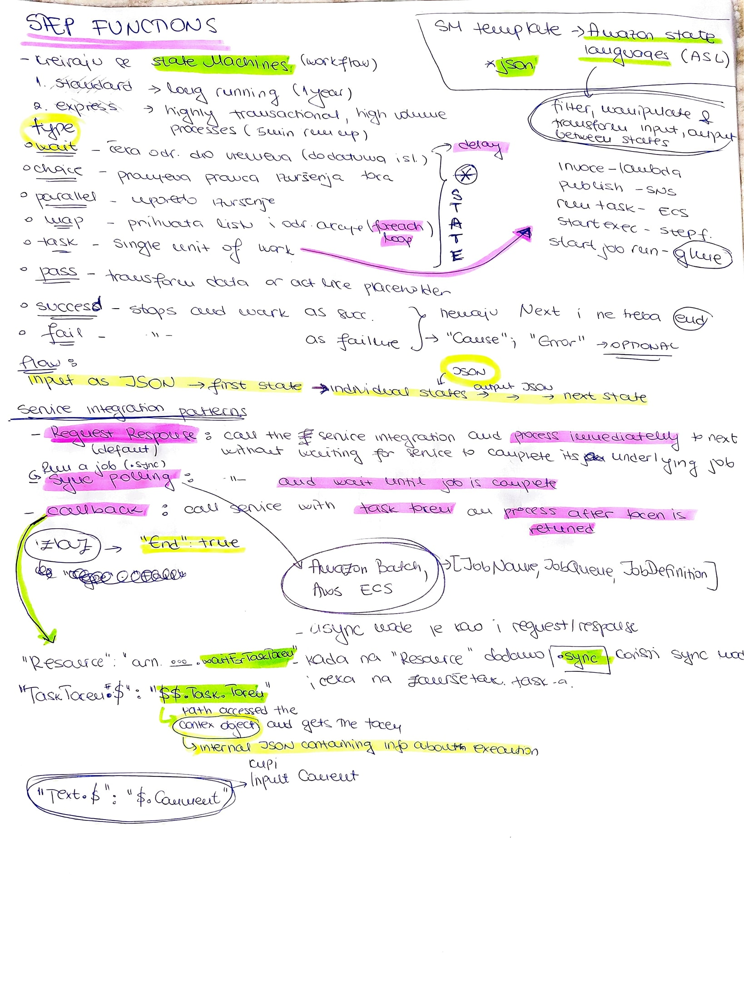

# STEP FUNCTIONS 
- [Step-functions-workshop](https://catalog.workshops.aws/stepfunctions/en-US/basics/task-state/request-response/step-2)

## Step-function basics 

## Dodatni resursi
- [Service Integration Patterns](https://docs.aws.amazon.com/step-functions/latest/dg/connect-to-resource.html#connect-default)

- [Servisi koji podrzavaju  Run a job (.sync polling)](https://docs.aws.amazon.com/step-functions/latest/dg/connect-supported-services.html)

- [AWS Compute Blog
Orchestrating high performance computing with AWS Step Functions and AWS Batch](https://aws.amazon.com/blogs/compute/orchestrating-high-performance-computing-with-aws-step-functions-and-aws-batch/)

- [Wait for a Callback with the Task Token](https://docs.aws.amazon.com/step-functions/latest/dg/connect-to-resource.html#connect-wait-token)