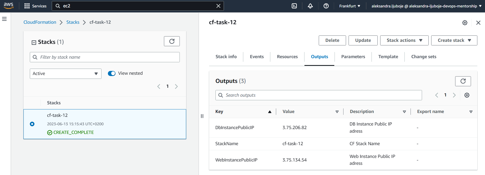
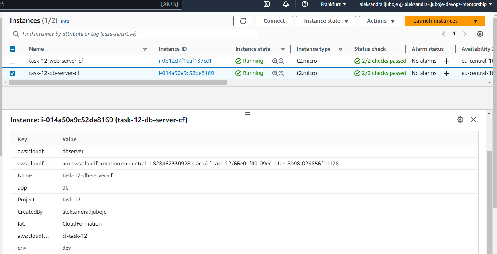

*Ovaj file sadrzi instrukcije za izradu dijela zadatka TASK -12 koji se tiče CloudFormation alata i kreiranja EC2 instanci*

# Cloud Formation
* više o alatu pročitati fajlu `cloud-formation.md` u direktorijumu `IaC`

## Rjesenje za TASK - 12
- Kreirani template za CF stack dostupan je u direktorijumu `cloudformation` pod nazivom `cf-instances.yaml`
- Slijedi objasnjenje za pojedine dijelove koda

### Pocetak template-a

```bash
AWSTemplateFormatVersion: "2010-09-09"
Description: Setup enivorment with EC2 instances using CF
Parameters:
  KeyName:
    Description: Name of an existing EC2 KeyPair to enable SSH access
    Type: 'AWS::EC2::KeyPair::KeyName'
    Default: packer-proba
Mappings:
  RegionMap:
    eu-central-1:
      test: "ami-09ecc100363951e6a" # Custom AMI created using Packer tool
```
- U `KeyName` definisemo kljuc za SSH povezivanje sa nasom EC2 instancom. 
- Svi kreirani kljucevi na nalogu bice dostupni na izbor, a u slucaju da ne izaberemo, defaultno je to navedeni `packer-proba` kljuc. 
- `Mappings` je koristen kako bi se omogucilo da, u zavisnosti od regiona izaberemo zeljeni AMI Image jer je isti ogranicen na region, pa da izbjegnemo hardcodiranje.

### Kreiranje Security Groups za instance
```bash
Resources:
  WebInstanceSG:
    Type: AWS::EC2::SecurityGroup
    Properties:
      GroupDescription: Enable HTTP/SSH Access
      SecurityGroupIngress:
        - IpProtocol: tcp
          FromPort: 22
          ToPort: 22
          CidrIp: 0.0.0.0/0
        - IpProtocol: tcp
          FromPort: 80
          ToPort: 80
          CidrIp: 0.0.0.0/0
```

- U dijelu `Resources` krecemo sa kreiranjem logickih resursa koji ce postati nasi fizicki resursi.
- Ovdje je kreirana SG za webserver instancu kojoj je dozvoljen Inbound saobracaj po portu 22 i 80 za SSH/HTTP. 
- Kako nije naveden VPCId ili Subnet, SG kao i kasnije instance bice kreirane u defaultnom VPC-u i jednom od Defaultnih Subneta.

### Kreiranje instanci
```bash
webserver:
    Type: AWS::EC2::Instance
    Properties:
      ImageId: !FindInMap ["RegionMap", !Ref "AWS::Region", "test" ]
      InstanceType: t2.micro
      KeyName: !Ref "KeyName"
      SecurityGroupIds:
        - !Ref WebInstanceSG
      
      Tags:
        - Key: Name
          Value: task-12-web-server-cf
        - Key: CreatedBy
          Value: aleksandra.ljuboje
        - Key: Project
          Value: task-12 
        - Key: IaC 
          Value: CloudFormation 
        - Key: "env"
          Value: "dev"
        - Key: "app"
          Value: "web"
```
- U ovom dijelu koristena je Intrinsic Functions `!Ref` kako bi se referencirali na neke resurse iz koda. 
- Kao i  funckija `!FindInMap` da bi se preuzeo odgovarajuci AMI ID za region u kojem se Stack kreira
- Tagovi koji su neophodni, kao i dodatni tagovi radi kreiranja dinamickog inventory file-a za Ansible playbook. 

### Output kreiranja Stack-a
```bash
Outputs:
  StackName:
    Description: CF Stack Name
    Value: !Ref "AWS::StackName"
  WebInstancePublicIP:
    Description: Web Instance Public IP adress
    Value: !GetAtt webserver.PublicIp
  DbInstancePublicIP:
    Description: DB Instance Public IP adress
    Value: !GetAtt dbserver.PublicIp
```
- Ovdje je prikazan kod za ispis output-a sa potrebnim podacima. Ovime je olaksano kreiranje inventory file-a jer odmah vidimo koje su to Public Ip adrese nasih kreiranih instanci



* Kreirane instance `task-12-web-server-cf` i `task-12-db-server-cf`




## Brisanje resursa
- Potrebno je samo obrisati CF stack i svi kreirani resursi ce biti obrisani 