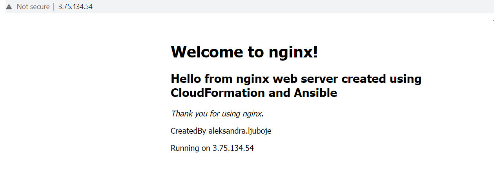

*Ovaj file sadrzi instrukcije za izradu dijela zadatka TASK -12 koji se tiče Ansible alata i konfiguracije EC2 instanci*

# Ansible

# Instalacija WSL i Ansible
*Preduslovi - instaliran WSL. Verzija Ubuntu 22.04.2 LTS u mom slucaju.*

Na videu dostupnom na linku ispod imate sve potrebne korake za instalaciju kako WSL tako i Ansible. 

* [Koraci za instalaciju Ansible na WSL Windows 10](https://www.youtube.com/watch?v=4w6eVmYY-Oc&t=216s)

>**Note**
> Kako nakon ovih koraka nije kreiran Ansible config file, a nije radila ni komanda sa `init` opcijom odradite prvo sljedece korake. Vodite racuna da ste pozicionirani unutar svog usera u WSL. 

```bash
$ sudo su
$ sudo add-apt-repository --yes --update ppa:ansible/ansible
$ sudo apt install ansible
$ ansible --version
```


```bash
$ ansible-config -h # sada je init opcija dostupna
```
* Kreirati `ansible.cfg` file

`$ ansible-config init --disabled -t all > ansible.cfg`

* Output komande


## Rjesenje za TASK - 12

- U fajl `prod.ini` smjestene su grupe hostova. Hostovi su dodati rucno, koristeci output CF Template-a gdje smo mogli vidjeti Public Ip adrese instanci, te iste kopirati bez da klikcemo na svaku posebno. 
- Ovakav staticki inventory file nije dobra praksa, ali zbog error-a koje nisam bila u stanju rijesiti ovaj put je moralo ovako. :)

- Grupe hostova su 
```bash
[webservers_cf]
# za web instance kreirane koristeci CF

[webservers_tf]
# za web instance kreirane koristeci TF

[dbservers]
# za db instance 
```
- Ovime je olaksan proces dodjele razlicitih `index.html` fajlova.

### Instalacija nginx servisa 
-  Za instalaciju nginx servisa potrebno je uraditi sljedece
1. Pozicionirati se unutar `ansible-playbooks` direktorija
2. Pokrenuti playbook `01-nginx-install-playbook.yml`
- Za CF i TF kreirana su dva posebna `index.html` fajla i dodati su na nacin prikazan u kodu 

```bash
- name: Configure webserver with nginx
  hosts: webservers_cf, webservers_tf
  become: True
  vars:
    ansible_python_interpreter: /usr/bin/python3
  tasks:
    - name: Install nginx 
      yum:
        name: nginx
        state: latest

    - name: Start nginx
      service: 
        name: nginx
        state: started
        enabled: yes


- name: Update index.html in CloudFormation webservers
  hosts: webservers_cf
  become: True
  vars:
    ansible_python_interpreter: /usr/bin/python3
  tasks:
  
    - name: copy index.html
      template: src=templates/index_cf.html.j2 dest=/usr/share/nginx/html/index.html
        mode=0644

    - name: restart nginx
      service: name=nginx state=restarted


- name: Update index.html in Terraform webservers
  hosts: webservers_tf
  become: True
  vars:
    ansible_python_interpreter: /usr/bin/python3
  tasks:
  
    - name: copy index.html
      template: src=templates/index_tf.html.j2 dest=/usr/share/nginx/html/index.html
        mode=0644

    - name: restart nginx
      service: name=nginx state=restarted
```
- Komanda za pokretanje playbook-a je
`ansible-playbook -i inventory/prod.ini 01-nginx-install-playbook.yml`
- Izmjena `index.html` fajla na `task-12-web-server-cf` instanci


- nginx status active - `systemctl status nginx`


- Izmjena `index.html` fajla na `task-12-web-server-tf` instanci


### Instalacija mysql na db server instance
- pokrenemo playbook `$ ansible-playbook -i inventory/prod.ini 01-mysql-install-playbook.yml`
- nakon ovoga imamo instaliran `mysql` na db server instancama
- provjerimo repozitorije 
`yum repolist enabled | grep "mysql.*-community.*"`


- `yum repolist all | grep mysql` 

### Kreiranje  baze, korisnika i dodjela privilegija 
- problem sa root korisnikom 
## ERRORs - pokusavam rijesiti ovaj dio 
>*Source*
> https://dev.mysql.com/doc/refman/8.0/en/linux-installation-yum-repo.html

### Verifikacija konekcije izmedju webserver instanci i db server instanci
- Koristen je ansible playbook pod nazivom `02-check-conncection.yml`
- instaliran je `telnet` koristeci komandu `yum install -y telnet` 

- :warning: trenutno nije moguce povezivanje na db instancu

