*TASK-9 dostupan na [linku](https://github.com/allops-solutions/devops-aws-mentorship-program/issues/63)*

# TASK-9: Static website with S3 and CloudFront - step by step

## Zadatak 1
*U tasku 9 je zadatak napraviti .html file koji ce prikazivati Vaše ime i prezime, kratki Vaš opis, te DevOps image koji koristimo od početka programa. HTML file uredite kako god želite (text, colors, fonts, etc.), nije bitno, ali da je preglednost u najmanju ruku okey.*

**Fajlovi** `index.html` **i** `error.html` nalaze se u folderu `HTML`.

## Zadatak 2
*Potrebno je kreirati S3 bucket u formatu: `ime-prezime-devops-mentorship-program-week-11`, te omogućiti `static website`:*

*Dodati `.html` i `error.html` file,
Podesiti bucket na public access, te dodati bucket policy koji će omogućiti samo minimalne access permissions nad bucketom.*

1. U AWS konzoli, kreirati S3 bucket na nacin:
* `Bucket name` - `ime-prezime-devops-mentorship-program-week-11`
* `AWS Region` - izaberete region u kojem zelite kreirati S3 bucket -  `eu-central-1`
* `Object ownership` - ostaviti kako jeste `ALS disabled`
* `Block all public access` - odstrihirati kako bi bucket bio public i u `warning prompt-u` kliknuti na `I acknowledge ...`
* `Bucket versioning` - ostaviti `Disable`
* DODATI TAGOVE 
* ostalo ostaviti defaultne postavke
* `Create bucket`

2. Kliknuti na kreirani S3 bucket
*  `Upload` -> `Add files` i dodamo `index.html`, `error.html` i image za mentorship.
* Oznacimo dodane fajlove i `Upload`

Na slici je prikazan S3 bucket sa dodatim fajlovima.

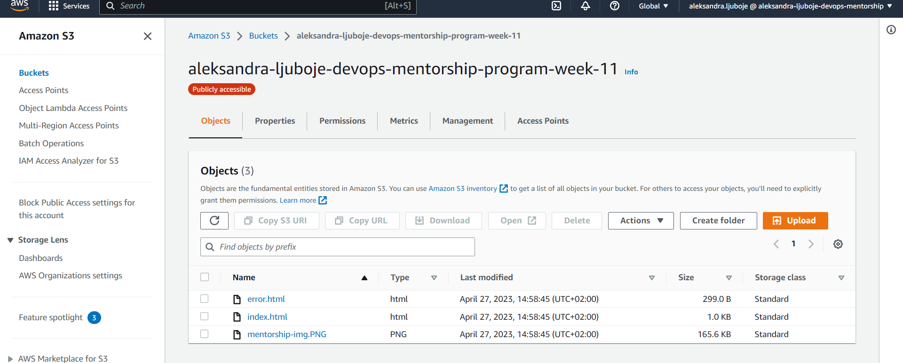

3. Kreirani S3 `Properties` i skrolati do kraja - `Static website hosting` 
* `Edit`
* `Enable`
* `Index document` - `index.html` vas index fajl
* `Error document` - `error.html` dodati error fajl
* `Save changes`

4. Dodavanje `Bucket policy` -> Kreirani S3 `Permissions`
* `Edit` i kopirati policy gdje je potrebno izmjeniti policy na nacin da se doda svoj `ARN` u zadnjoj oznacenoj liniji pod `example-bucket`

**Bucket policy je dostupan na [linku](bucket-policy)**

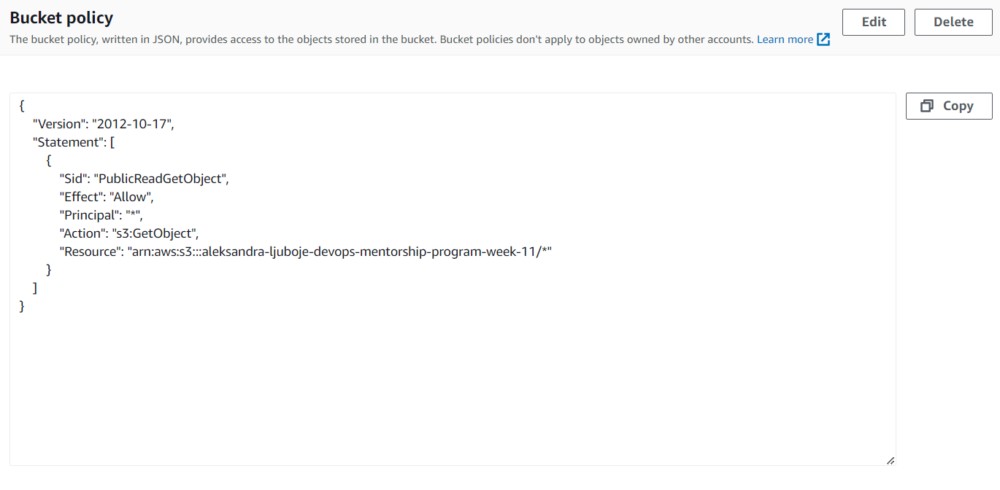

S3 website endpoint : http://aleksandra-ljuboje-devops-mentorship-program-week-11.s3-website.eu-central-1.amazonaws.com/

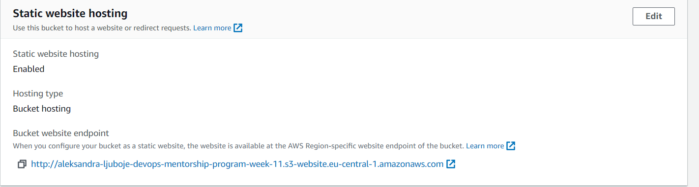

Prikaz website-a :

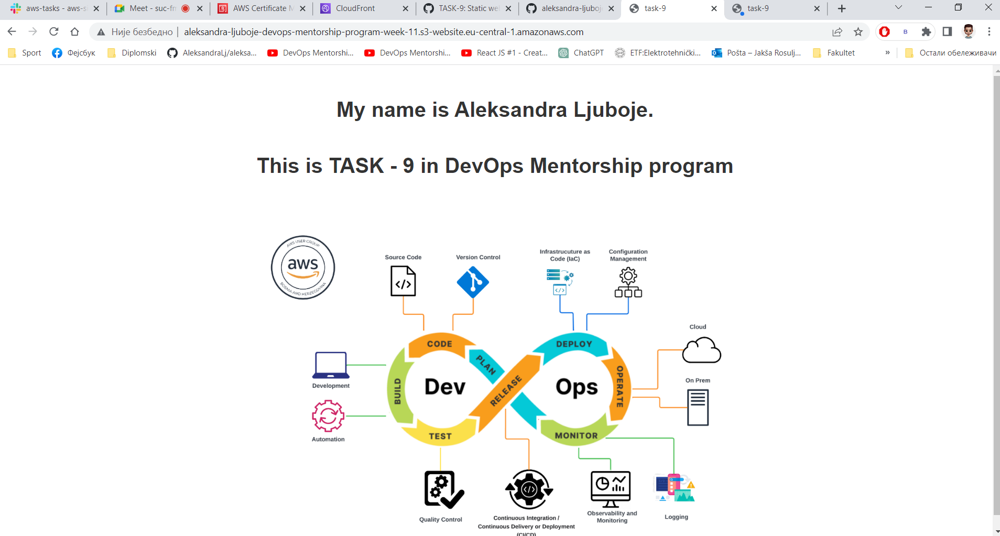

## Zadatak 3

*Drugi dio zadatka jeste objaviti tu statičku web stranicu kroz CloudFront distribuciju.*

*Prilikom kreiranja CloudFront distribucije potrebno je samo sljedeće opcije modifikovati:*

*Origin domain,*
*Name,*
*Viewer protocol policy (Redirect HTTP to HTTPS),*
*Custom SSL certificate,*
*SSL certifikat koristite od AWS Certificate Manager-a.*

*Sve ostale opcije po default ostaviti. Kada se završi kreacija distribucije napraviti record unutar Route 53 ( www.ime-prezime.awsbosnia.com) koji će pokazivati na tu distribuciju.*


**Prije nego predjemo na kreiranje Cloud Front-a, potrebno je kreirati ACM certifikat na nacin kako je to radjeno u TASK -8**

* `ACM -> Request certificate ->`
    * `Fully qualified domain name` - `www.ime-prezime.awsbosnia.com`
    * `Validation method` - `DNS validation`
    * `Key algorithm` - `RSA`

* Kada se kreira certifikat, otvoriti CLI terminal i odraditi aktivaciju certifikata

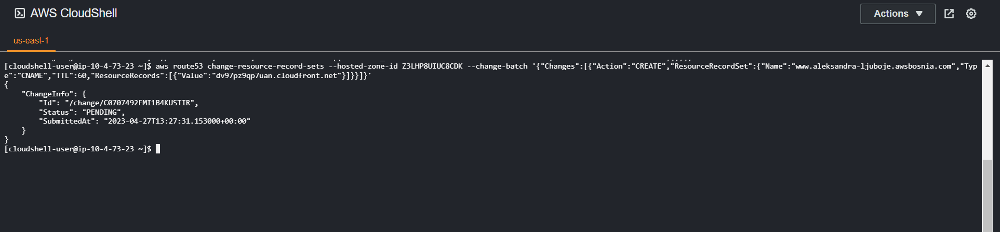

Koristene komande su:
```bash
aws route53 change-resource-record-sets --hosted-zone-id Z3LHP8UIUC8CDK --change-batch '{"Changes":[{"Action":"CREATE","ResourceRecordSet":{"Name":"CNAME -NAME","Typ
e":"CNAME","TTL":60,"ResourceRecords":[{"Value":"CNAME-VALUE"}]}}]}'

# promijeniti CNAME NAME i CNAME VALUE

```
Nakon par minuta bi certifikat trebao biti `Issued`

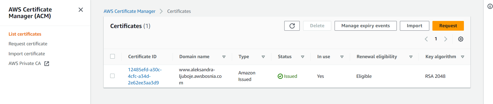

**Ukoliko se javi greska da nemate potrebne permisije, potrebno je odraditi `aws configure` u terminalu, na nacin da se unesu Public i Secret keys iz TASK - 8 exel file, a region postaviti na us-east-1 i file json**

### Kreiranje Cloud Front distrubucije

* `Create Cloud Front distribution`
    * `Origin domain` - `izaberemo s3 bucket`
    * `Origin path` preskocimo
    * `Name` ostavimo defaultno
    * `Origin access` - public
    * `Default root object` - `index.html`
    * `Viewer protocol policy`-  `(Redirect HTTP to HTTPS)`
    * `Settings` - `Custom SSL certificate` - izaberemo kreirani Amazon certifikat

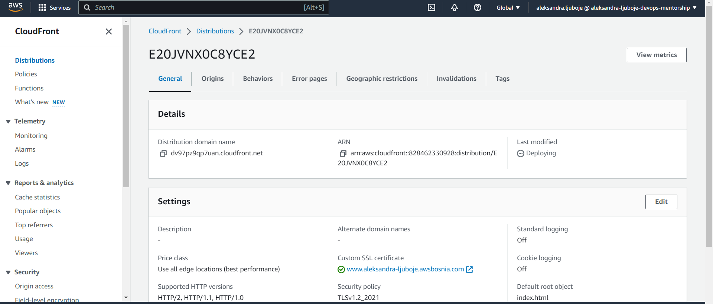

**Kopiramo distribution domain name i browser i dobijamo sljedece:**

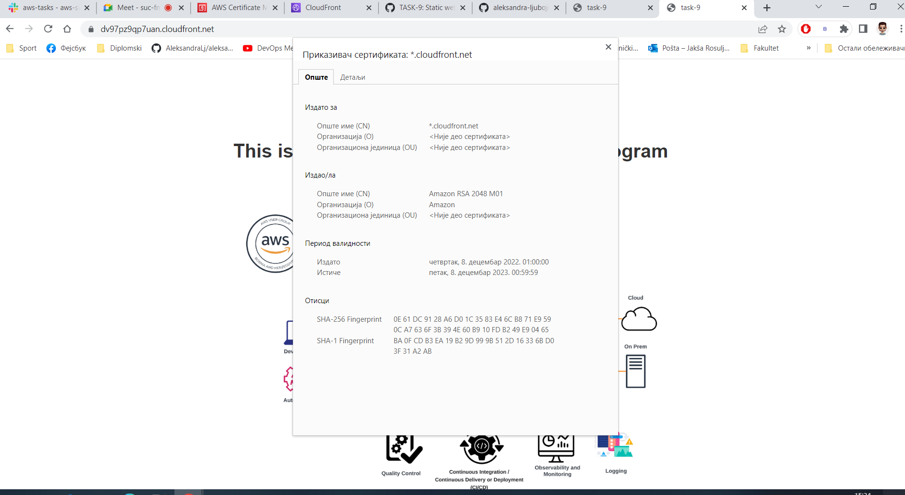

**Sačekati da se završi proces `deploying` inače dobijamo error 403**

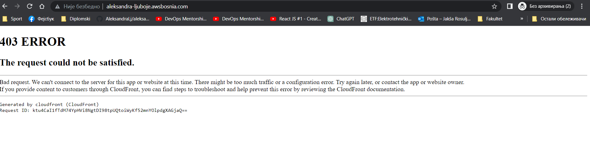


**Konfigurišemo Route 53 kroz CLI**

```bash
# Route 53 configuration:
`aws route53 change-resource-record-sets --hosted-zone-id Z3LHP8UIUC8CDK --change-batch '{"Changes":[{"Action":"CREATE","ResourceRecordSet":{"Name":"www.aleksandra-ljuboje.awsbosnia.com","Type":"CNAME","TTL":60,"ResourceRecords":[{"Value":"https://dv97pz9qp7uan.cloudfront.net/"}]}}]}'` 
```


```bash
# To check DNS propagation:
`aws route53 list-resource-record-sets --hosted-zone-id Z3LHP8UIUC8CDK | jq '.ResourceRecordSets[] | select(.Name == "www.aleksandra-ljuboje.awsbosnia.com.") | {Name, Value}'`
```

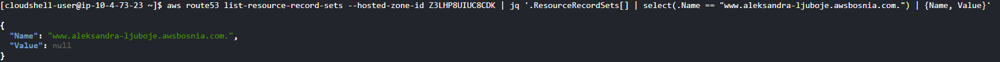


**Kopiramo domenu u browser www.ime-prezime.awsbosnia.com**

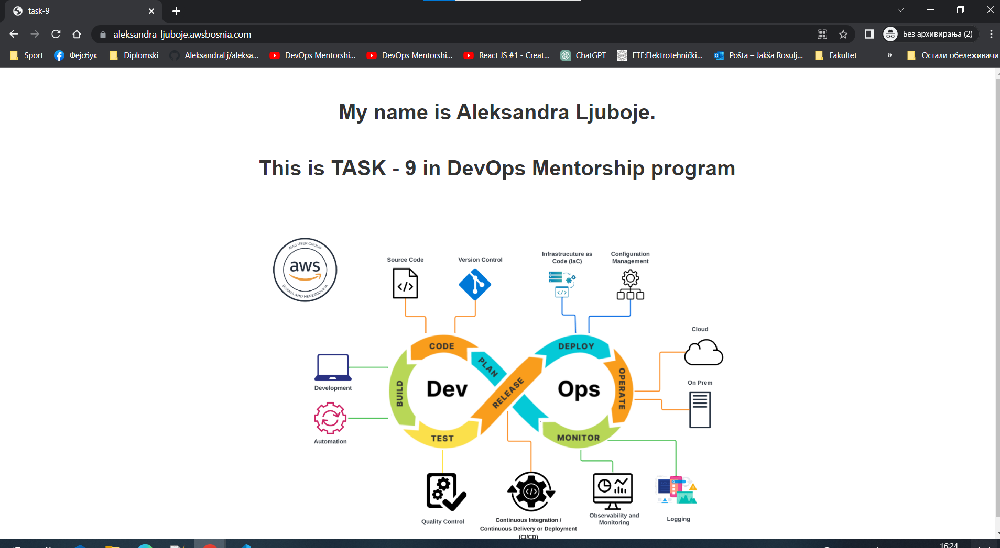