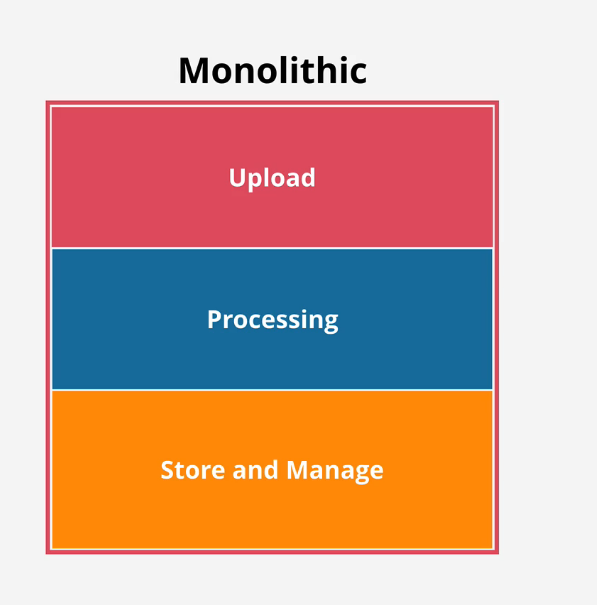
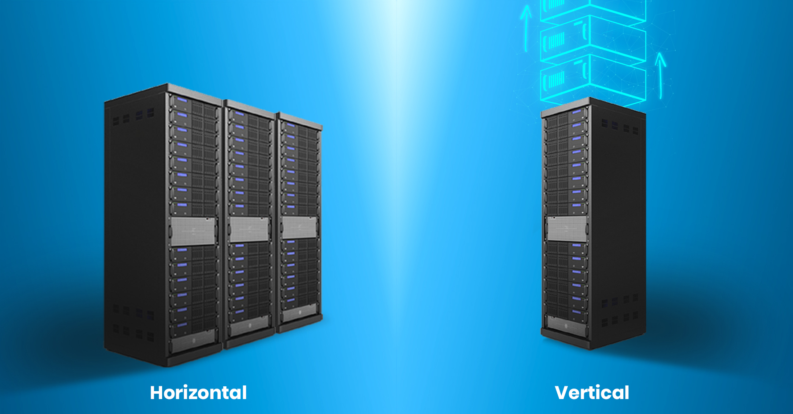
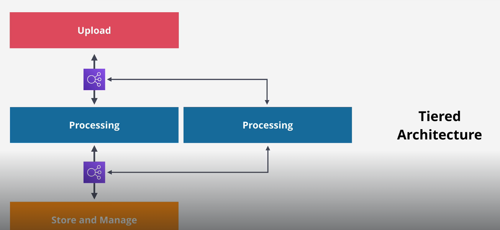
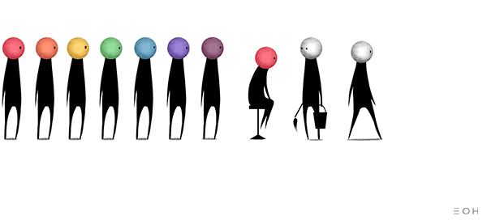
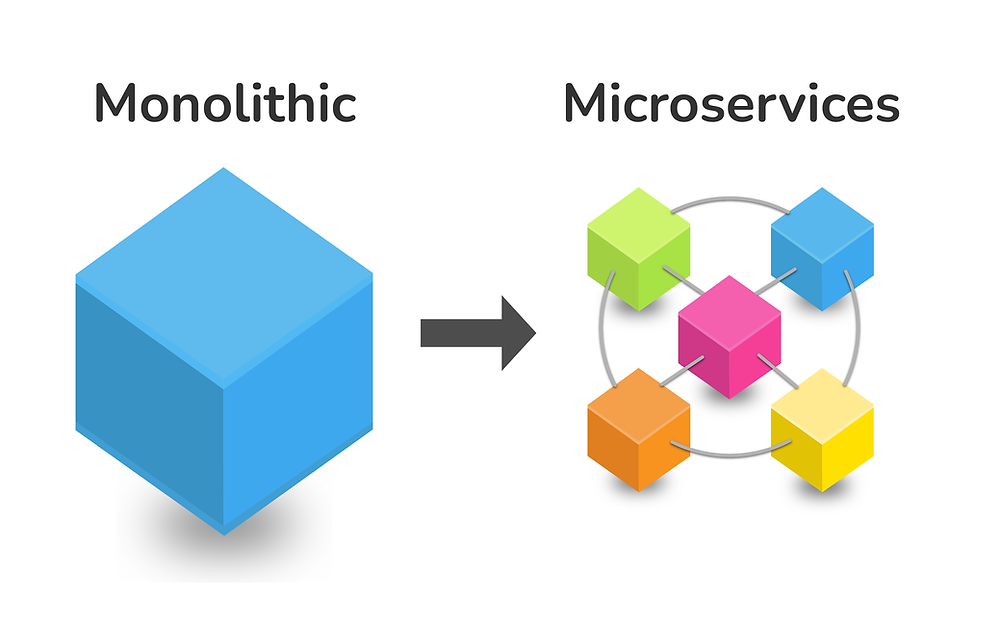
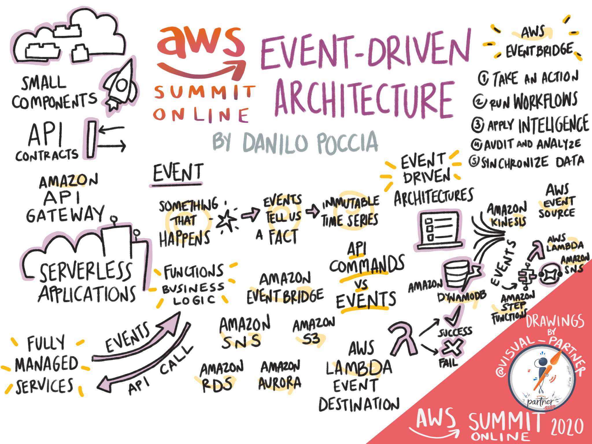
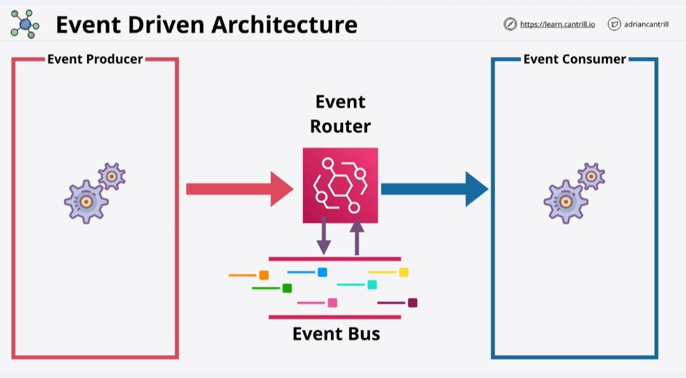

*Associated with week-12/Task-10 available on [link](https://github.com/allops-solutions/devops-aws-mentorship-program/issues/70)*

## Architecture Deep Drive I 

### Monolithic architecture
*Monolitnu arhitekturu* mozemo zamisliti kao jedan boks u kome su zajedno smjestene sve komponente potrebne za izvrsenje aplikacije. 
Dakle, *upload,processing i store and manage* komponente nalaze se na jednom entitetu. Ukoliko dodje do greske na jednoj od komponenti, lancanim putem ce ta greska da utice na sve ostale komponente i na kraju cijeli entitet ce da "padne". 

Na slici vidimo razliku izmedju Monolitne arhitekture i Microservices arhitekture.

*Slika preuzeta sa Learn Cantril SAA course*

**Monolitne componente su *highly coupled* tj. jako vezane i skaliraju zajedno.**
Ovo znaci da sve komponente ocekuju da budu povezane na isti server i imaju istu *codebase*. Dakle, ne mozemo skalirati jednu komponentu bez da skaliramo i ostale.

**Skaliranje je VERTIKALNO** kako bi se omogucilo da se sve komponente nalaze na istom *compute-hardware*-u.

*Slika preuzeta sa blog posta dostupnog na [linku](https://www.esds.co.in/blog/what-is-the-difference-between-horizontal-vertical-scaling/)*

**Bills together** -  najveca mana ove arhitekture je sto neki kapaciteti iako u trenutku ne obavljaju nikakve procese i operacije, moraju biti u stanju *running*, sto iziskuje velike troskove, koji su u vecini situacija neopravdani.

### Tiered architecture

*Tiered arhitektura* nastaje kada razdvojimo nivoe ili operacijske cjeline unutar monolitne strukture, na nacin da su idalje povezani sa endpointom za drugi sloj  i mogu medjusobno komunicirati, ali imaju mogucnost da se nalaze na istom ili razlicitim serverima.

* [x] Benefiti tiered arhitekture jesu sto mozemo raditi **individualno skaliranje nivoa**. 

Na primjer, ako *Proccessing* nivo zahtjeva vise CPU kapaciteta, jednostavno cemo vertikalno skalirati ovaj nivo i dodijeliti potrebne kapacitete, bez da povecavamo kapacitete ostalim nivoima i stvorimo bespotrebne troskove. 

* [x] Izmedju svakog nivoa moguce je postaviti **internal Load Balancer** cime vrsimo **abstrakciju** i omogucavamo **horizontalno skaliranje**. 

Kada je postavljen Load Balancer, nivo Proccessing nece direktno komunicirati sa slojem Upload, vec ce primati zatjeve preko Load Balancera. Kako Load Balancer moze usmjeravati saobracaj ka vise instanci, imamo mogucnost dodavanja novog nivoa Proccessing instance.
Ovime smo omogucili da ukoliko jedna Processing instanca prestane sa radom, LB ce joj prestati slati saobracaj i sve preusmjeriti ka ostalim dostupnim instancama na tom nivou.

* :x: Kao i kod monolitne arhitekture jos uvijek "pad" jednog nivoa dovodi do "pada" cijelog sistema, kao i to da procesi moraju biti u statusu *running* iako nisu potrebni u tom momentu. 
* :x: Nije moguce skalirati nivoe ka nuli, jer uvijek mora postojati jedna instanca - **sinhronizacija**

Na slici je prikazana Tiered arhitektura sa Load Balancerima izmedju nivoa.

*Slika preuzeta sa Learn Centril SAA course*

## Architecture Deep Drive II

### QUEUE | RED

*Slika preuzeta sa blog posta dostupnog na [linku](https://stock.adobe.com/images/long-queue-in-food-store-vector-banner-concept-young-and-old-people-waiting-in-queue-line-men-women-and-children-cartoon-characters-shop-sale-customer-service-flat-illustration/262074381)*

*Queue (kju)* mozemo posmatrati kao red za cekanje na jednoj kasi, gdje na kraj uvijek dolaze novi kupci, dok oni koji su trenutno na redu nakon obavljene kupovine odlaze i oslobadjaju svoje mjesto. 

Mozemo razlikovati dva tipa queue i to
1.  **FIFO ( First in first out)** sto bi znacilo da onaj ko prvi dodje na kasu, prvi ce i da bude usluzen, dok ce zadnja osoba koja dodje i stane u red, zavrsiti zadnja. Sve se obradjuje po redoslijedu dolaska i garantuje se da ce poruke biti primjljene u onom redoslijedu u kojem su i poslate.

2. **Standardni  queue** -  FIFO redoslijed ne mora biti nuzan, mozemo stajati u redu i cekati svoje mjesto, ali ce doci neka starija baka i mi cemo joj ustupiti svoje mjesto. Ovo u FIFO redu nije dozvoljeno, ali standardni queue to dozvoljava. 
Dakle, nema garancije da poruke stizu na odrediste onim redoslijedom u kojem smo ih poslali.

**Queue lenght** je kapacitet reda tj. broj poruka koje red moze prihvatiti. 
Ovaj parametar moze se koristiti u svrhe trigerovanja Auto Scaling grupe il nekog drugog servisa. 
Dakle, servis ce da provjerava ili ce biti obavjesten putem drugog servisa da je stigla poruka u red tj. da je *queue lenght* promijenjen i nije nula. Tada servis moze da odradi potrebne operacije kako bi obradio poruku koja je stigla u red. 
Poruka koja je obradjena se sklanja iz reda a termin koji se koristi za ovo je **pulling the queue**. 

*Slika preuzeta sa blog posta dostupnog na [linku](https://devdojo.com/amp/algonoob/queues)*

**Poruke sadrze data za posao koji treba obaviti i metadata - dodatne podatke.**
Na primjer, ako smo uradili Upload neke slike na S3 bucket, slika se salje na S3 a poruka sa metapodacima (lokacija slike na S3 i sl.) se salje u red i ceka da je odgovarajuci servis preuzme.

### Worker-fleet arhitecture

**Koristeci *queue* izmedju nivoa komponenti, komponente su *decoupled* sto omogucava da svaki nivo postoji sam za sebe i obavlja svoju funkciju bez da ga interesuje sta se dalje desava sa podacima koje proslijedi.**

Ovime je omogucena **asinhrona** komunikacija izmedju nivoa. 

### Microservices arhitecture

*Microservices arhitektura* nastaje razlaganjem monolitne arhitekture na sto prostije nivoe i zadatke, gdje svaki zadatak obavlja zaseban servis koji je individualan. 

Slikoviti prikaz razlike monolitne i microservices arhitekture

*Slika preuzeta sa blog posta dostupnog na [linku](https://dataforseo.com/blog/monolithic-vs-microservices-which-architecture-is-better-for-your-seo-tool)*

# Event-Driven Architecture 

*Slika preuzeta sa blog posta dostupnog na [linku](https://www.awsgeek.com/AWS-Summit-Online-EMEA-2020/Event-Driven-Architecture/)*

Prije nego kazemo sta je to *Event-Driven Architecture* objasnicemo par pojmova.

* **Producer** ili **Event producer** *(Upload service)* porizvode podatke ili poruke tj. razlicite evente kada se nesto dogodi - klik misa na button ili error pri upload-u slike. 
* **Customer** *(Processing service)* koriste podatke ili poruke koje kreira Producer. Oni ne cekaju da se event desi, vec budu obavjesteni kada se desio event namijenjen specificnom servisu. Preduzmu potrebne akcije i onda stanu dok ne dodje sljedeci event. 
* **Both** *(Data store and manage microservices)* rade i produce i consume

**Events** ili **dogadjaji** desavaju se kada servisi nesto proizvode ili koriste

**Microservice** je aplikacija koja ima svoju logiku, skladiste za podatke, kao i I/O komponente i obavlja jedan specifican zadatak za koji je programirana. 

*Event-Driven Architecture* zasniva se na eventima, bilo da se radi o servisima koji ih generisu **Event producer** ili servisima koji se pokrecu kada se generise neki event i dodje do njih **Event consumers** 

**Event router** je visoko dostupni, centralni endpoint za evente.
Sadrzi **event bus** koji omogucava konstantan protok informacija. 

*Slika preuzeta sa learn.cantrill.io SAA*

Zamislimo to kao kanal kroz koji se krecu eventi od Producer-a ka Consumer-ima cekajuci da ih neki servis prihvati i obradi. 
Servisi sa druge strane bivaju obavjesteni koji event je namijenjen njima, odrade potrebne operacije i stanu sa radom.

* [x] Nema konstantnog i bespotrebnog rada instanci i servisa kada nisu potrebni
* [x] Postoje Produceri koji generisu evente kada se nesto desi 
* [x] Nema stalnog cekanja i provjeravanja da li se event desio, vec svaki servis biva obavjesten kada treba poduzeti potrebne akcije 
* [x] Event Router odlucuje kojem Consumer servisu dostavlja koji event 
* [x] Kada event bude obradjen od strane Consumer servisa, servis se vraca  u stanje cekanja ili **dormant state** i ne koristi resurse

