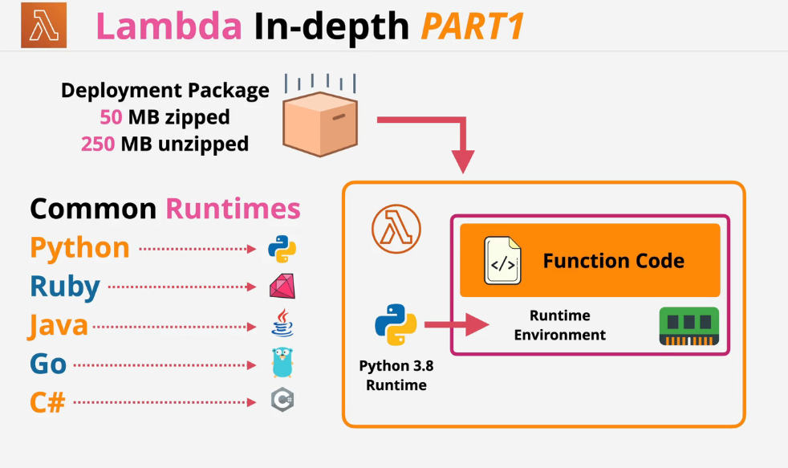
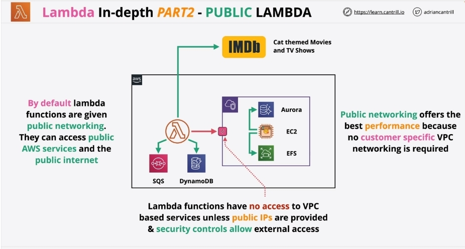
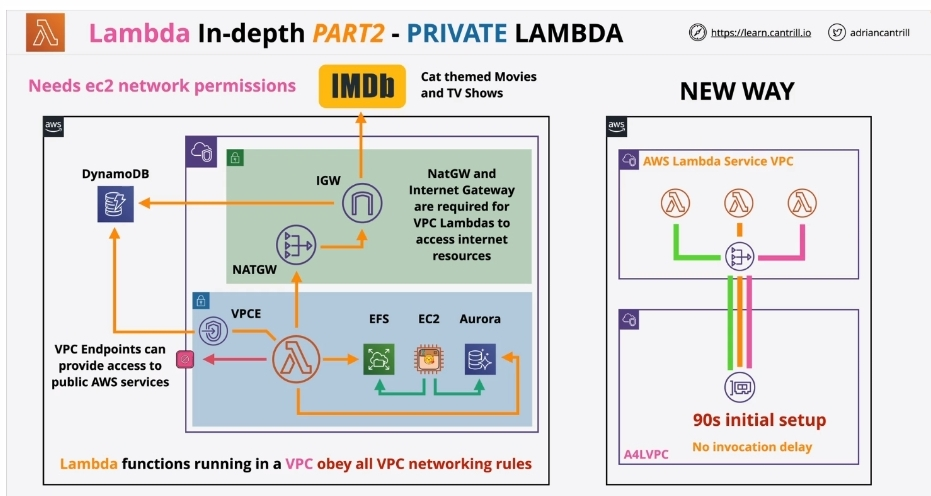
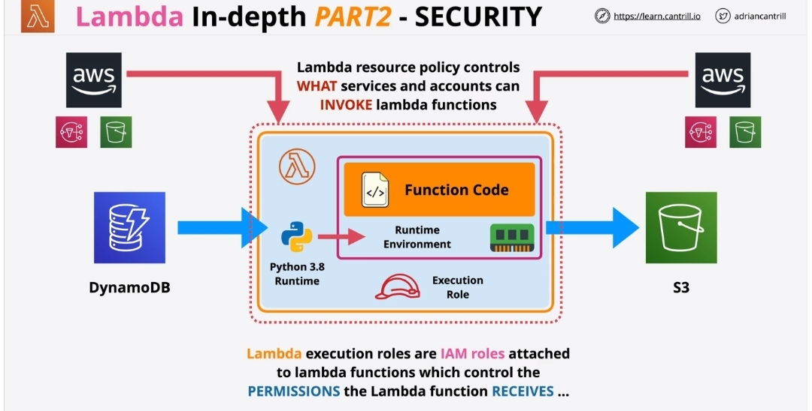
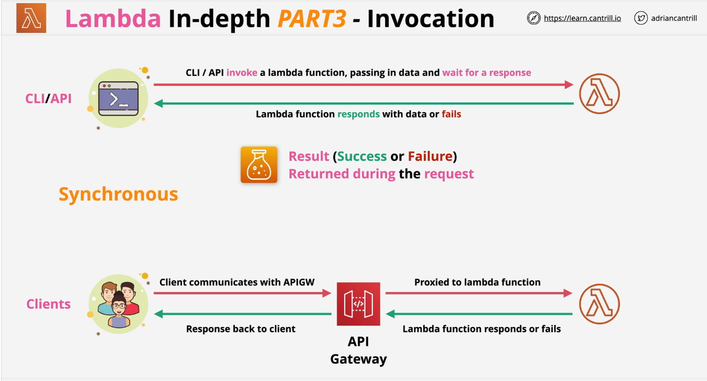
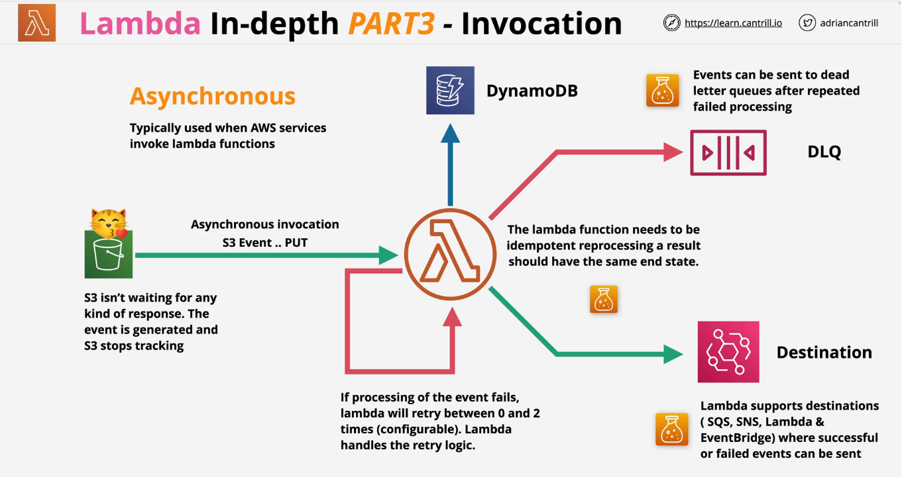
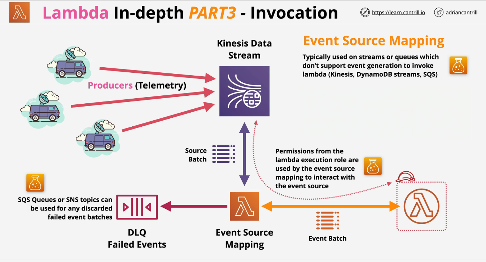
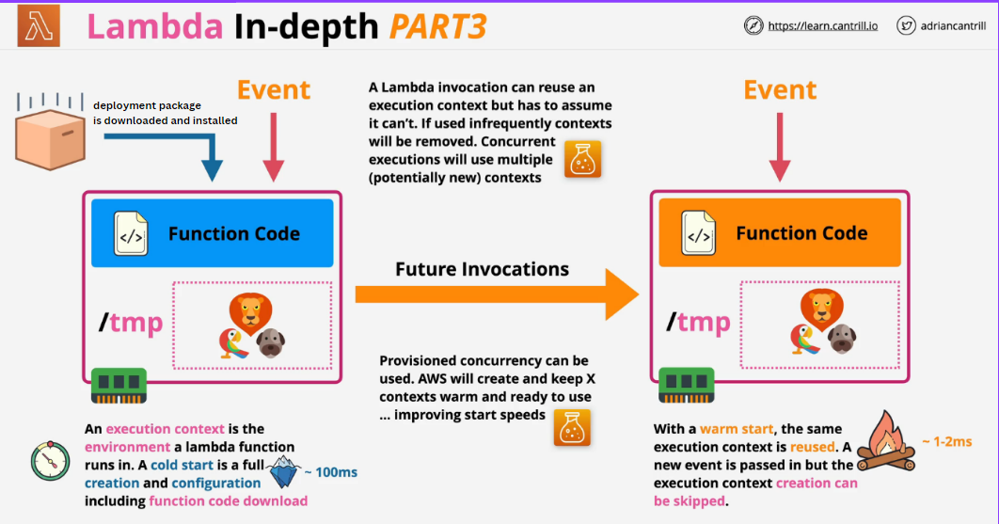

*Associated with week-12/Task-10 available on [link](https://github.com/allops-solutions/devops-aws-mentorship-program/issues/70)*

**Rijecnik novih pojmova:**

* **FaaS** -*Function as a Service*
* **Runtime** - *language used to run code, e.g. Python 3.8*

#### Obratiti paznju na Heading 4
*koji je koristen u kombinaciji sa :memo: ili :exclamation: kako bi se obratila paznja na bitne cinjenice koje se ticu servisa a koje mogu doci na certifikacijskom ispitu.*

# AWS LAMBDA I
### for short - running and focused functions

***Lambda*** je AWS *event-driven servis* ciji je osnovni zadatak izvrsavanje **Lambda funkcije** onda kada se desi okidac tj. **trigger** a koji je izazvan dogadjajem koji se desio - **event**.

Lambda servis ce izvristi Lambda funkciju specijalnizovanu za handle-ovanje tog event-a. Dakle, u ovom slucaju **ne znamo gdje se nasa funkcija u pozadini izvrsava**, ali to za nas nije od kljucne vaznosti. 

**Lambda funkcija** je dio koda koji Lambda servis izvrsava.
Kada kreiramo Lambda funkciju, potrebno je da izaberemo jezik u kojem pisemo kod funkcije odnosno **runtime** koji ce funkcija koristiti. Tada se kreira i **runtime enviroment**, okruzenje podeseno na osnovu jezika koji smo izabrali za nasu Lambda funkciju. 

### Runtime enviroment 
**Runtime enviroment** ima svoju memoriju **direct memory** koju alociramo unaprijed pri kreiranju Lambda funkcije, a jedan dio memorije ce biti odvojen za **virtual CPU**. 
* ***Alokacija memorije od 128MB do 1024MB sa 1MB koracima***
* ***1769 MB memorije dodjeljuje 1 vCPU***
Ne mozemo sami izabrati velicinu CPU koju zelimo, vec ce se taj dio odvojiti zavisno od memorije koju smo alocirali. Ovaj nacin dodjele CPU-a je **indirektan**.

* ***Runtime enviroment ima alociranu dodatnu memoriju za fajlove u folderu /tmp - 512 MB, koja moze da se poveca do 10240 MB - dozvoljeno je koristenje ali /tmp folder je prazan pri svakom novom pozivu funkcije jer se tu cuvaju temporary files***

Izborom jezika koji ce biti koristen za izvrsenje koda, odredjuje se i koje komponente ce nam biti dostupne. 

### :exclamation::exclamation::exclamation: *Svaki put kada se Lambda funkcija pozove na izvrsenje, kreira se novi runtime enviroment sa svim potrebnim komponentama koje Lambda funkcija zahtjeva za adekvatno izvrsenje. Kod se ucita, izvrsi i terminira.*

### *Lambda funkcije su stateless* 
Sto znaci *no data left from pevious invocation*. Nakon svakog novog poziva, pokrece se "cisto" radno okruzenje, bez zaostalih fajlova iz prethodnih poziva. 

### Kako Lambda funkcionise?

*Slika preuzeta iz video predavanja Learn Cantril SAA*

Lambda funkciju osim kao *samo dio koda* mozemo posmatrati i kao paket koji sadrzi sve potrebne postavke za izvrsenje - **deployment package**. Kada se desi event i Lambda funkcija je pozvana na izvrsenje, deployment paket se preuzme i izvrsi unutar podesenog runtime enviroment-a. 

Na slici su prikazani i neki od jezika koje Lambda funkcija podrzava. 

### :whale:  Docker je anti-pattern za Lambda servis. 
Lambda podrzava koristenje ***Docker image-a*** i drugih image-a, ali u smislu da su to **build procesi** od kojih mozemo kreirati Lambda images. 

### :clock930: Function timeout je 15min/9000s - vrijeme koliko dugo se Lambda funkcija moze izvrsavati.
 Za sve preko 15 min nije moguce koristiti samo Lambda funkciju. Primjer dodatnih servisa su *step functions*.

### :closed_lock_with_key: IAM roles koristimo za kontrolu pristupa drugim servisima i proizvodima.
 Kreiramo *execution role* i zakacimo je za Lambda funkciju.
 ### :moneybag: **AWS ce za Lambda servis naplatiti trajanje izvrsavanja Lambda funkcije.** 

### :bulb: Najcesca upotreba
 * **Serverless applications** -  S3, API gateway, Lambda
 * **File Processing** - S3, S3 Events, Lambda
 * **Database triggers** - DynamoDB, Streams, Lambda
 * **Serverless CRON** - EventBridge/CloudWatch Events + Lambda
* **Realtime stream data processing** - Kinesis + Lambda 

# AWS LAMBDA II
### Lambda networking, Lambda permissions, Lambda monitoring

##   Lambda networking
Lambda funkcije imaju 2 **networking modes** - **public** i **VPC** networking.

#### :exclamation::memo: *Defaultno* Lambda funkcije su u *public networking mode*, cime je omogucena komunikacija sa public AWS servisima i public Internetom
**Naravno gledano sa mrezne strane to je moguce, ali samo ako je pristup servisima takodje dozvoljen pomocu authentication i authorization metoda.**

Isto vazi i za servise koji se nalaze unutar nekog VPC-a. Ukoliko servisi imaju dodijeljene Public IP adrese, NACL ili Security groups koje omogucavaju komunikaciju van VPC-a, Lambda moze pristupiti ovim servisima. U suprotnom - to nije moguce. 

*Slika preuzeta sa learn.cantrill.io SAA*

### :memo: Za Lambda funkcije koje se izvrsavaju unutar VPC -a, vrijede sva VPC pravila i ponasaju se kao svi ostali servisi unutar tog VPC-a.

Kada je Lambda postavljena unutar subneta u VPC-u, moze pristupati svim servisima unutar VPC-a ukoliko je tako regulisano security i policy pravilima. 

Lambda funkcija ne moze slobodno pristupati servisima van VPC-a ukoliko nije drugacije konfigurisano na nivou VPC-a.

* Ako je potreban izlaz van VPC-a mozemo koristiti **VPC Endpoint** - **za pristup public AWS servisima**
* Ako je potreban **izlaz na internet**, koristimo **NAT gateway + Internet Gateway** 

*Slika preuzeta sa learn.cantrill.io SAA*

#### Kako Lambda funkcija ustvari radi unutar VPC-a?

Na slici iznad u dijelu "New way" prikazan je primjer funkcionisanja.
Unutar jednog regiona tj. account-a, kreiraju se dva VPC-a. 
**AWS Lambda Service VPC** gdje su smjestene sve Lambda funkcije, dok imamo i **A4LVPC** sto predstavlja **Customer VPC**. 

#### :older_man: The old way
Prilikom poziva Lambda funkcije na izvrsenje (*invocation*) iz Lambda service VPC, bilo je potrebno da se u Customer VPC kreira ENI (*Elastic Network Interface* slicno mreznoj kartici) kako bi se uspostavio saobracaj izmedju ova dva VPC-a. 
Mana ovog nacina rada jeste sto se javljao veliki delay u prenosu, za svaku Lambda funkciju je bio potreban poseban ENI, lose skaliranje za koje je pri svakom paralelnom izvrsenju ili konkurentom izvrsenju bio potreban dodatni ENI, sto je bilo jako tesko za odrzavati. 

#### :man:  The new way

Naravno, vise nije potrebno zahtjevati ENI pri svakom izvrsenju Lambda funkcije. AWS analizira sve funkcije koje su pokrenute unutar regiona tj. unutar account-a, te pravi jedinstvene kombinacije subneta i security grupa. Za svaku jedinstvenu kombinaciju, zahtjeva se 1 ENI unutar VPC-a. 

Na primjer, ako se  Lambda funkcije nalaze unutar kolekcija koje imaju razlicite subnete ali koriste istu security grupu, onda je potreban 1 ENI/subnet. 
U slucaju da sve funkcije koriste isti subnet i istu security grupu, potreban je samo jedan zajednicki ENI unutar VPC-a. 
Za svaku jedinstvenu kombinaciju subnet, security grupa kreira se posebna veza izmedju Lambda VPC i Customer VPC. 
To se dešava samo jednom, pri konfiguraciji Lambda funkcije i trajanje inicjalnog setup-a je 90s.
Kasnije, ako zelimo nesto promjeniti jednostavno uradimo Update i nema potrebe za ponovnim uspostavljanjem novih veza. 

##   Lambda Permissions

*Slika preuzeta sa learn.cantrill.io SAA*

Kako bi runtime enviroment ili radno okruzenje imalo pristup AWS proizvodima i servisima, moramo kreirati Execution role koju zakacimo za nasu Lambda funkciju. 

Lambda permissions - 2 kljucna dijela:
1. Roles permission policy, koji se odnosi na kod koji Lambda pokrece, a koji preuzima od Lambda funkcije premisije definisane za tu rolu. Ovim se kreiraju privremeni kredencijali koje Lambda funkcija koristi za pristup servisima. 
2. Trust policy, koji vjeruje Lambda funkciji 

### :memo: Lambda Execution roles su IAM role zakacene za Lambda funkcije, cime se kontrolisu permisije koje funkcija prihvata

#### :memo: Lambda Resource policy koji kontrolise KOJI servisi i accounts mogu raditi INVOKE poziv Lambda funkcije
Nesto slicno kao S3 bucket policy. 
Moze se rucno promijeniti pomocu CLI ili API, ali ne i preko Console UI. 

##   Lambda Monitoring

Lambda koristi **Cloud Watch, Cloud Watch Logs i X-Ray** za pracenje logging-a i sami monitoring.

* **Logovi** koji nastaju pri izvrsenju Lambda funkcije **smjestaju se u** **CloudWatch Logs**
* **Metrika** - detalji o uspjesnom invoke-u funkcije, failure error, retries, latency s**mjestaju se u CloudWatch**
* **Distributed tracing** - Lambda se integrise sa **X-Ray**, u slucajevima kada zelimo pratiti putanju do korisnika, putanju sesija unutar serverless aplikacija koje koriste Lambdu.

#### :memo: Kako bi Lambda mogla da cuva logove unutar CloudWatch Logs mora imati permisije definisane unutar Execution role

# AWS LAMBDA III
### Lambda invocation, Lambda Versions, Lambda startup times

## Lambda invocation

Postoje tri nacina da se uradi invoke Lambda funkcije:
1. Synchronous invocation
2. Asynchronous invocation
3. Event Source mappings

### Synchronous invocation

*Slika preuzeta sa learn.cantrill.io SAA*

**Synchronous invocation** ili sinhroni poziv lambda funkcije podrazumijeva da klijent pomocu CLI ili API posalje zahtjev ka Lambda funkciji. Lambda funkcija ce da se "probudi" iz stanja cekanja, obradi zahtjev tj. izvrsi kod namijenjen za taj event koji se desio i posalje klijentu nazad podatke koji se zahtjevaju. Obicno je to poruka o uspjesno zavrsenom izvrsenju funkcije ili fail-u. 
* Sve vrijeme dok Lambda funkcija izvrsava kod, klijent ceka na odgovor.
* Svi error-i koje dobijemo kao odgovor i eventualni ponovni pokusaji moraju biti odradjeni od strane klijenta jer Lambda funkcija se probudi iz stanja cekanja, izvrsi kod i stane. 

#### :memo: Synchronous invocation koristi se kada covjek tj. klijent direktno utice na invoking Lambda funkcije. Klijent salje zahtjev i sve vrijeme dok traje izvrsenje Lambda funkcije, ceka odgovor. Ako je odgovor greska ili zahtjeva ponovno slanje zahtjeva, klijent je u obavezi da to rucno uradi. 

### Asynchronous invocation

*Slika preuzeta sa learn.cantrill.io SAA*

**Asynchronous invocation** ili asinhroni poziv lambda funkcije podrazumijeva da AWS servisi rade invoke Lambda funkcije. 
* Servis ne ceka da Lambda funkcija vrati odgovor
* Svi error-i koje dobijemo kao odgovor i eventualni ponovni pokusaji moraju biti odradjeni od Lambda funkcije. Broj pokusaja je 0 do 2. 
*  Kod mora biti ***idempotent*** sto znaci da moramo omoguciti da kod daje isti rezultat operacije ili da ima isti *end state* prilikom re running-a. 
* Events mogu biti poslati u **Dead letter queue** nakon nekoliko bezuspjesnih pokusaja. 
* Lambda ima mogucnost kreiranja destinacija, sto znaci da eventi koji su obradjeni od strane Lambda funkcije i imaju povratne informacije, one mogu biti poslate na drugu destinaciju tj. ka drugim servisima kao npr. SNS, SQS, Lambda ili Event Bridge. 

### Event Source mapping

*Slika preuzeta sa learn.cantrill.io SAA*

**Event Source mapping** koristimo u slucaju kada imamo Streams ili Queues koji nemaju mogucnost generisanja eventa koji bi trigerovali pokretanje Lambda funkcije (Kinesis, DynamoDB streams, SQS) - **eventi kod koji zahtjevaju polling tj. povlacenje podataka iz reda**

* **Kinesis Data stream** je Stream-based proizvod, koji omogucava korisnicima da citaju iz Stream-a, ali nema generisanja dogadjaja kada se doda novi podatak u Stream. 

Kako bismo koristili Kinesis Data stream u kombinaciji sa Lambda funkcijom potreban nam je **Event Source mapping** servis koji radi polling podataka iz Stream-a, trazi nove podatke i vraca nazad **Source batches**.  Batch podaci su podijeljeni po velicini batch-a i poslati Lambda fuknciji kao **Event batches**. 
* Lambda pri jednom invoke-u moze primiti stotine event-a u obliku batch-a, ali zavisi od toga koliko je potrebno da obradi svaki event jer je limitirana na 15 min timeout. 

#### :memo: Kod Asinhronih poziva Lambda funkcije, nisu potrebne permisije za pristup izvornom servisu jer on samostalno triggeruje izvrsenje Lambda funkcije, osim u slucaju kada je potrebno preuzeti jos informacija od izvornog servisa. 
Na primjer, kada dodajemo sliku u S3 bucket, nakon sto se doda slika, S3 servis ce sam da odradi invoke proces slanjem podataka o dodatoj slici ka Lambda funkciji. Lambda ukoliko zeli dodatne informacije o objektu, mora imati potrebne permisije za pristup. 

#### :memo: Pri koristenju Event Source mapping izvorni servis ne radi direktni invoke Lambda funkcije. ES mapping cita podatke iz izvornog servisa koristeci Lambda Execution role permisije da bi pristupio tim podacima. Tako da se ES mapping koristi samo kao posrednik u ime Lambda funkcije i koristi njene permisije iz Execution roles kako bi prikupio potrebne podatke. 

* Batches koji imaju konstantan *fail* salju se u Dead Letter Queue i prosljedjuju preko SNS ili SQS servisa na dalju obradu. 

## Lambda versions

* Lambda funkcije mogu imati svoje verzije koda - ***v1,v2,...***
* Verzija je kod + konfiguracija Lambda funkcije
* Kada objavimo verziju Lambda funkcije ona je ***immutable*** - ne mijenja se od momenta kada je objavljena i ima svoj Amazon Resource Name i **nije moguce mijenjati tu verziju**
* `$Latest` pokazuje na posljednju/najnoviju verziju Lambda funkcije i mijenja se u skladu sa objavljivanjem novih verzija - ***not-immutable***
* **Aliases** - mozemo kreirati aliase (DEV, STAGE, PRODUCTION) koji ce da pokazuju na neku verziju Lambda funkcije, pokazujuci time faze razvoja. Aliasi se mogu mijenjati te su ***not-immutable***

#### :memo:Pri deploymentu Lambda funkcije, kada se radi o vecim skaliranjima, kreiramo verzije Lambda funkcije za sve veće promjene te koristimo aliase za razlicite komponente serverless aplikacije koji pokazuju na immutable verzije Lambda funkcije. 

## Lambda startup times

*Slika preuzeta sa learn.cantrill.io SAA*

* ***Cold start*** desava se pri prvom "pokretanju" Lambda funkcije, kada je potrebno da se postavi adekvatno okruzenje, instaliraju potrebni paketi i odradi sve potrebno za efikasno izvrsenje Lambda funkcije tj. njenog koda. Za ovo je potrebno **~ 100ms** 
* ***Warm start*** svaki sljedeci poziv Lambda funkcije, nece zahtjevati ovoliko vremena, jer su sve pocetne  postavke sacuvane u **execution context**. Context sada samo prihvati event i odmah pocinje obradu. Za ovo je potrebno **~ 1-2ms**

***Voditi racuna da izmedju poziva Lambda funkcije ne prodje mnogo vremena, jer u suprotnom ce podaci biti obrisani iz execution context-a i ponovo cemo morati cekati cold start da se odradi build.***

***1 execution context / invocation*** sto znaci da ako u trenutku zahtjevamo 20 invokacija Lambda funkcije, imacemo 20 cold start-ova. 

* Kako bismo rijesili ovaj problem, preporuka je da se koristi **Provision concurrency** onda kada znamo da nam predstoji high load invokacija nad Lambda funkcijom, kao i kada se planira product release kako bi se poboljsale performanse. 

* Takodje moguce je u execution context-u kreirati `/tmp` prostor za temporary files, te ukoliko neka druga funkcija koristi isti context imace odmah pristup tim fajlovima.

#### :memo: Sve sto se definise unutar Lambda function handler-a postoji samo u toku te invokacije Lamda funkcije. 

Sve sto smatramo da bi bilo korisno da se ponovo koristi kao resurs, mozemo kreirati van Lambda function handler-a i bice dostupno za sve ostale pozive Lambda funkcije. Voditi racuna da funkcije ipak ne zahtjevaju te resurse i da nisu svjesne postojanja istih , vec da budu spremne da ponovo sve kreiraju kako ne bismo imali problem ako se dogodi neki fail ili nemogucnost pristupa resursu. 
