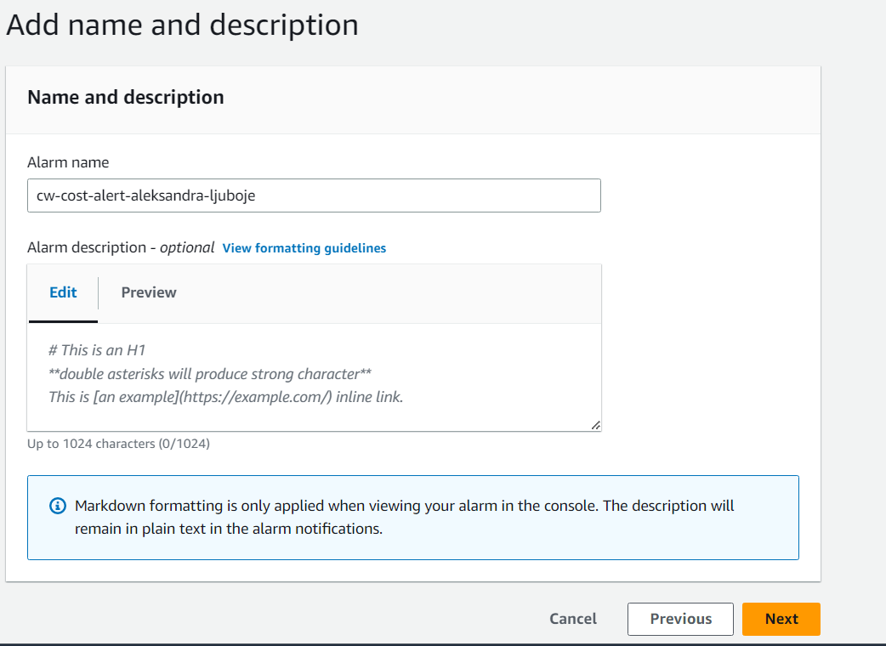
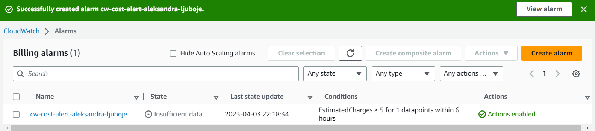
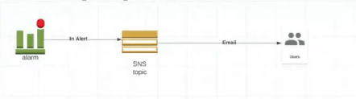
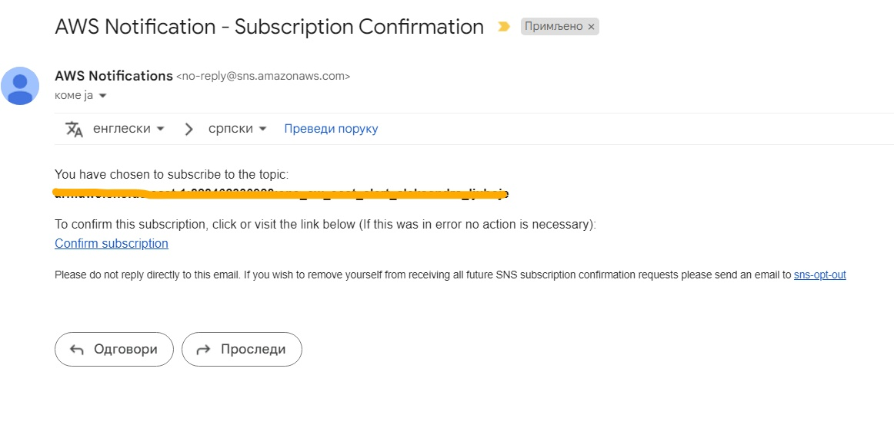
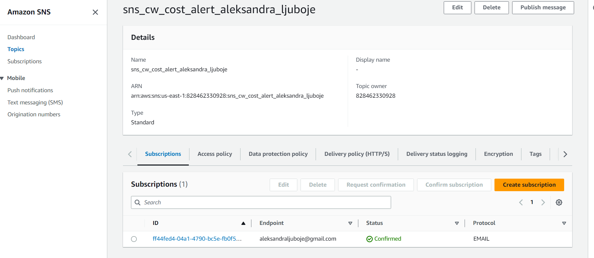
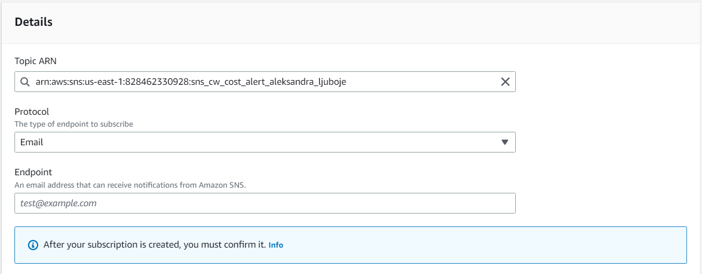

*office-hours-subota-1-april*

# Cloud Watch
* Monitoring svih resursa unutar AWS-a i troškova

### *Napomene*
* Da bismo kreirali Biling Alarm moramo se prebaciti na regiju **North Virginia** jer AWS tamo čuva biling metrics.
* **10 alarma free i 1000 emails/mjesecno**
* Kreirati alarme na način da ako želimo da nam report šalje na *10USD* stavimo *7USD* jer radi presjeke u neko vrijeme, pa konačni troškovi kada mi pogledamo stanje mogu biti i veći 

## Kreiranje Biling Alarm
 * ako estimate AWS troskovi predju **5$ mjesecno**
 * Naziv CloudWatch alarma treba da bude: `cw-cost-alert-ime-prezime`

1. Regiju promjenimo u `North Virginia` tj. `us-east-1`
2. `Cloud Watch` -> `Alarms`-> `Billing`-> `Create Alarm`
3. Za polja izaberemo:

`Metric Name` -> `EstimatedCharges`

`Currency`    -> `USD`

`Statistics`    -> `Maximum`

`Period`    -> `6hours` za `Maximum` 

4. `Conditions` biramo:

`Threshold type` -> `Static`

`Whenever EstimatedCharges is...` -> `Greater`

`than…` -> `5 USD`

5. `Notification` 
* koje stanje CW alarma ce nam poslati notifikaciju

`Alarm state trigger` -> `In alarm` ako je alarm u stanju alarma

`Send a notification to the following SNS topic` -> `Create New Topic` -> **predjemo na korake za kreiranje sns topic**
6. `Create alarm`i dodamo naziv 

7. Idemo na `Next` i pregledamo sva podešavanja

* Alarm je u `State` *Insufficient data* jer nije prikupio dovoljno informacija o AWS troškovima. Kada se to desi, stanje se mijenja u `OK`

### Koraci kreiranja SNS topic

1. Dodamo naziv za topic -> `sns_cw_cost_alert_aleksandra_ljuboje`
2. Upišemo email na koji želimo primati notifikacije
3. Potrvdimo email koji je stigao u sanduče

4. Vratimo se kreiranju alarma 

**Dodavanje još email adresa za sns email**
* Odemo u SNS Dashboard i `Create Subscription`

