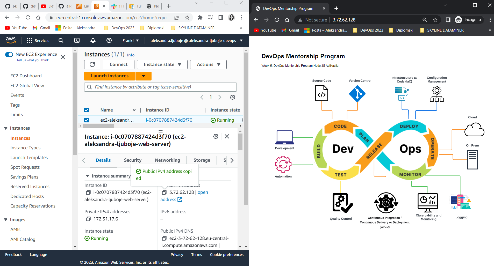

*TASK-6: Create an EC2 instance and deploy simple nodejs app #45*

**TASK**
https://github.com/allops-solutions/devops-aws-mentorship-program/issues/45
**Node-js-app**
https://github.com/allops-solutions/nodejs-simple-app

# Deployment aplikacije na Amazon Linux 2023

`$ cd Downloads` pozicioniramo se u `Downloads` gdje nam se nalazi `.pem` ključ/ključevi
`$ chmod 600 *.pem` dodijelimo privilegije svim `.pem` fajlovima samo za r+w na owner
`$ ssh -i "key.pem" ec2-user@ec2-public-ip` uz `yes` odgovor na pitanje

--- **spojeni smo na EC2 instancu** ---


## Koraci za Deployment aplikacije
Koraci: 
* Instalirati `nginx`
* Kreirati novi `nginx conf` file za našu aplikaciju
* Provjeriti da li postoje parovi public i private kljucevi, ako ne -> kreirati ih
* Intalirati `git`
* Instalirati `npm`, `node` i potrebne biblioteke i alate 
* instalirati `pm2` i pokrenuti `server.js`
### Instaliramo nginx

1. `$ sudo su -` da se prebacimo na root korisnika
2. `$ yum install nginx -y` instaliramo NGINX
3. `$ systemctl start nginx` pokrenemo NGINX

--- **refresh stranicu u browseru i dobijemo defaultni *Welcome to nginx*** ---

4. `$ systemctl enable nginx` da omogućimo pokretanje nginx pri boot-u

--- **Kreiramo novi nginx conf file za našu veb aplikaciju** ---
svi novi fajlovi moraju biti u `conf.d` i imati ekstenziju `.conf`

5. `$ cd /etc/nginx/conf.d` pozicioniramo se u `conf.d`
6. `$ sudo touch node-app.conf` kreiramo `node-app.conf` file u kojem podesimo sljedece:
7. `$ vi node-app.conf` da editujemo fajl
```bash
server {
  listen 80;
  server_name 3.72.62.128/; # public ip adresa

  location / {
    proxy_pass http://127.0.0.1:8008; # localhost 127.0.0.1 na portu 8008 kako je navedeno u app konfiguraciji
    proxy_http_version 1.1;
    proxy_set_header Upgrade $http_upgrade;
    proxy_set_header Connection 'upgrade';
    proxy_set_header Host $host;
    proxy_cache_bypass $http_upgrade;
  }
}
```
8. `$ sudo systemctl restart nginx` restartujemo nginx 
9. Provjerimo stanje nginx, da li je running
`$ systemctl status nginx` ili `$ ps aux | grep nginx`

### Kreiranje ključeva za git

***Objasnjenje***
Ako nemamo ključeve i uradimo 
`$ git clone git@github.com:allops-solutions/nodejs-simple-app.git`

Dobili smo grešku `Permision denied ˙(publickey)` te moramo provjeriti imamo li public-private key pair i ako nemamo kreirati ih.

--- **Kreiranje public private key** ---

 `$ ls -la` i vidimo `.ssh` direktorij
 `$cd .ssh/` 
 `$ ls -la` gdje vidimo da imamo fajl `authorized_keys` nemamo public i private key parove

  `ssh-keygen -t rsa` komanda za kreiranje kljuca
   `$ ls -la` da vidimo da li su kreirani ključevi
   `$ cat id_rsa.pub` i kopiramo ključ na naš GitHub profil -> `Settings` -> `SSH and GPG keys`
   naziv mog  ključa -> `ec2-instance-amazon-linux-git`
   
   --- **ovim smo završili dio sa ključevima** ---

### Instaliranje git na server i clone aplikacije

1. `$ yum install git -y` instaliramo `git`na serveru 

2. Odemo na klijentov GitHub gdje je smještena app -
 https://github.com/allops-solutions/nodejs-simple-app

3. Kopiramo SSH link 
 `Code` -> `SSH` -> `Copy link`
4. Uradimo `git clone`
 `$ git clone git@github.com:allops-solutions/nodejs-simple-app.git`
5. `$ ls -la` i imamo `nodejs-simple-app` direktorij kreiran

### Instalacija node i npm potrebnih biblioteka i alata
* Da bismo na serveru pokrenuli app, moramo instalirati biblioteke i alate. 

--- **Instalacija node i npm na Dzenanov nacin** ---

Instaliramo `node.js` skriptu pomoću komande `curl`
```bash
$ curl -L -o nodesource_setup.sh https://rpm.nodesource.com/setup_14.x # Download Node.js 14 setup script
#preuzmemo node instalacijsku skriptu

$ sudo bash nodesource_setup.sh # Run Node.js setup script | pokrenemo instalacijsku skriptu
$ sudo yum install -y nodejs # instalacija nodejs 14.x i npm
$ node -v # Check Node.js version
$ sudo yum install -y gcc-c++ make # Install build tools
```
--- **Instalacija node i npm za Ubuntu** ---
---- **Setting Up Node.js on an Amazon EC2 Instance** ----
* Dostupno na linku: 
https://docs.aws.amazon.com/sdk-for-javascript/v2/developer-guide/setting-up-node-on-ec2-instance.html

```bash
$ curl -o- https://raw.githubusercontent.com/nvm-sh/nvm/v0.39.3/install.sh | bash # Install node version manager (nvm) by typing the following at the command line
# We will use nvm to install Node.js because nvm can install multiple versions of Node.js and allow you to switch between them.

$ . ~/.nvm/nvm.sh # Activate nvm by typing the following at the command line

$ nvm install --lts # Use nvm to install the latest version of Node.js by typing the following at the command line
# This installs the latest LTS release of Node.js.
# Note: Installing Node.js also installs the Node Package Manager (npm) so you can install additional modules as needed.

$ node -e "console.log('Running Node.js ' + process.version)" # This displays the following message that shows the version of Node.js that is running.

Running Node.js VERSION
 $ node -v # node version

```


### Pokretanje aplikacije
1. `$ cd nodejs-simple-app`
2. `$ ls` i pronađemo file `server.js`

3. `$ npm install ` instaliramo pakete iz js
4. `$ node app.js` da pokrenemo aplikaciju 
5. `$ ps aux | grep node` da provjerimo da li se aplikacija pokrenula gdje smo vidjeli da aplikacija nije pokrenuta
6. `$ node server.js` 
Aplikacija bi se trebala prikazati kada ukucamo u browser `http://ip-adresa:8008`

### Instalacija pm2 

--- **Instalacija process manager-a** ---
```bash
$ npm install -g pm2 # Install pm2 process manager
$ pm2 start server.js # Start Node.js application
```
Aplikaciju pokrećemo sada pomoću **pm2** gdje je u pozadini pokrenut naš proces. 

--- **Dodatne opcije koje možemo provjeriti sa *pm2*** ---

```bash
$ pm2 log # pogledamo logove na našem serveru
$ pm2 status # status aplikacija 
```

### Prikaz pokrenute aplikacije na ec2 instanci u browseru




## Rjesenje problema 502 error i sta je dovelo do greske

* Prvo je uradjeno postavljanje reverse proxy servera na sljedeći način
* Port u aplikaciji je bio env. variabla PORT || 3000
* Kasnije je to ispravljeno na env. variabla PORT || 8008

--- **Postavljanje REVERSE PROXY SERVERA** ---

`node-app.conf` - predstavlja konfiguracijski fajl gdje smo unutar `server` bloka definisali jedan virtuealni server koji ce da obradjuje `HTTP` zahtjeve koji stizu na port `80` i proslijedjuje ih na Node.js server koji slusa na portu `3000`

Potreban nam je novi `config` fajl koji smještamo u folder `conf.d`

NGINX setup
```bash
$ cd /etc/nginx/conf.d
$ sudo touch node-app.conf
$ vi node-app.conf # novi config fajl 
```
gdje je `node-app.conf`:

```bash
server {
  listen 80; # slušamo port 80
  server_name 3.68.91.255; # public IP adresa

  location / { 
    # lokacija gdje se nalazi naša aplikacija, a aplikacija je naš aplikacijski server koji je pokrenut na localhost-u
    # kao lokaciju gdje se nalaze tvoji fajlovi koristi ovu dole ip adresu
    proxy_pass http://127.0.0.1:3000;
    proxy_http_version 1.1;
    proxy_set_header Upgrade $http_upgrade; 
    # manipulacija nad headerima jer je http protokol aplikacijskog sloja
    proxy_set_header Connection 'upgrade';
    proxy_set_header Host $host;
    proxy_cache_bypass $http_upgrade;
  }
}
```

`$ curl -l http:/127.0.0.1:3000` vidimo raw html ispis naše aplikacije 
`$ curl -l http:/127.0.0.1:80` vidimo raw html ispis ono što poslužuje naš nginx server

`$ sudo service nginx restart` restartujemo nginx da sačuvamo promjene
`$ systemctl status nginx` provjerimo da li je running nginx
`$ ps aux | grep node`
`$ curl -l http:/127.0.0.1:3000` provjerimo da li su svi servisi running i app

Korisniku šaljemo **18.156.117.35** i dobijamo sljedeći problem:

## 502 BAD GATEWAY GREŠKA

 --- **Koraci koji su rađeni za troubleshooting:** ---

* Iako je aplikacija dostupna na portu `3000` mi želimo da je dostupna preko *http* na portu `80` jer smo podesili nginx da bude web server

1. provjerimo logove NGINX-a na `var/log/nginx/error.log` i provjerimo `error.log` gdje nalazimo grešku *Permision denied*
```bash
[crit] 19207#19207: *23 connect() to 127.0.0.1:3000 failed (13: Permission denied) while connecting to upstream,
client: 185.58.94.229, server: 3.68.91.255, request: "GET / HTTP/1.1", upstream: "http://127.0.0.1:3000/",
host: "3.68.91.255"
```
2. Znamo da se aplikacija nalazi unutar `nodejs-simple-app` i uradimo `ls -la`
te vidimo permisije
i vidimo da je kod **755** POSTAVLJEN
3. `$ ps aux | grep nginx` 
    * proces pokrenut sa `root` userom što znači da root upravlja sa procesom nginx, što znači da nginx treba pristupiti ovoj aplikaciji kako god okrenemo.

--- **Što znači da nisu permisije nad fajlovima dovele do error-a** ---

4. `$ cd var/log/nginx/error.log` da vidimo ima li promjena

Iz liste vidimo da je `upstream` localhost, da mi kao klijent komuniciramo sa ip adrese `185.58.94.229` i da je server `18.156.117.35`

5. odradimo `$ cat var/log/audit/audit.log | grep denied` ovaj zapis bi rekao postoji problem u mrežnoj komunikaciji 

*Objašnjenje za audit.log*
`audit.log` je fajl koji sadrži evidencije o događajima vezanih za operativni sistem. Prati aktivnost sistema i idenfitikaciju potencijalnih sigurnosnih breaches i policy violations.

--- **Rješavanje problema** ---

```bash
$ semanage port --list # SELinux port list 
$ semanage port --list | grep http_port_t # Check if port 80 is allowed

izlaz je 

http_port_t    tcp  80,81,443,488, 8008,8009,8443,9000 
```
**1. način rješavanja**
* Kažemo developeru da promijeni `port` aplikacije na `9000` i da to pushuje na `git`
* Mi uradimo `git pull` na serveru ali mi imamo `package-lock` i to moramo riješiti da bi povukli promjene 

**2. način rješavanja**
Ručno promijenimo `server.js` fajl i umjesto `port 3000` stavimo `8008` *:wq* - zapiši, izađi
Restartujemo server
`$ pm2 restart server`
`$ curl -l http:/127.0.0.1:8008` i prikaže se stranica 

* Provjerimo `nginx.conf` fajl jer smo naveli da aplikacija sluša na portu 3000, a koristimo 8008
Pa pošto smo mijenjali nginx moramo ga restartovati
`$ service nginx restart`

**3. način rješavanja**

```bash
$ semanage port --list # SELinux port list 
$ semanage port --list | grep http_port_t # Check if port 80 is allowed

izlaz je 

http_port_t    tcp  80,81,443,488, 8008,8009,8443,9000 
```
dodamo dodatni port koristeći komandu
`$ semanage port --add --type http_port_t --proto tcp 3000`

**4. način rješavanja** 

`$ export PORT=8008` 
postavimo env. varijablu koja je dozvoljena i aplikacija bi je pročitala 


