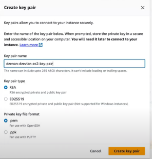
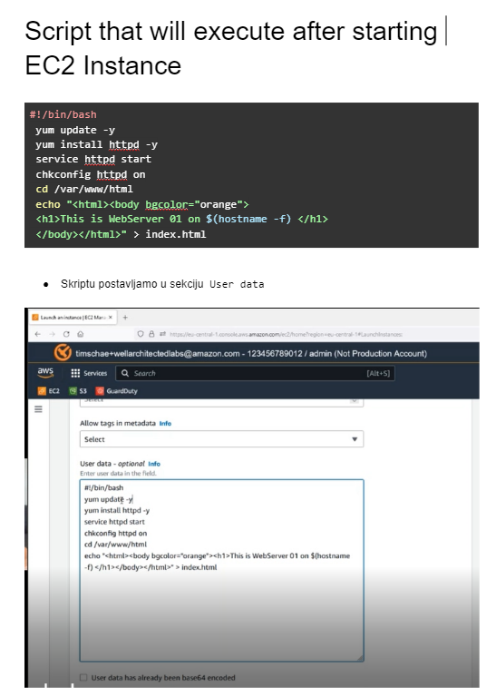
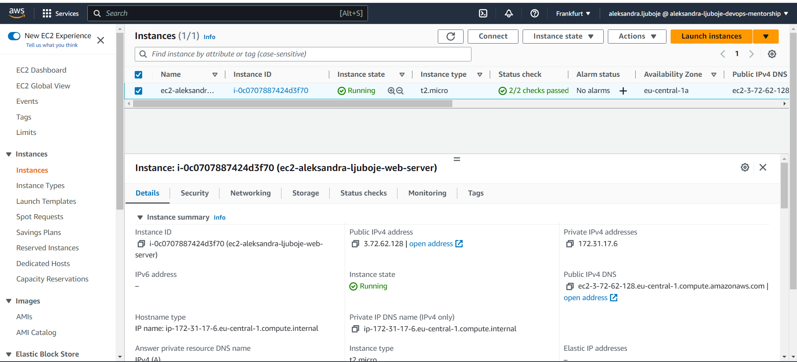
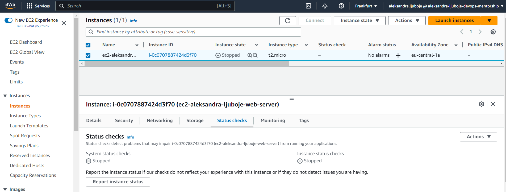
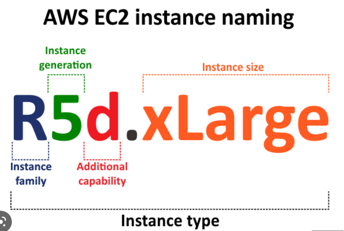

# EC2 - Elastic Compute Cloud 

* EC2 Dashboard - mjesto na kojem upravljamo sa našim VM, Serverima i zovemo ih `EC2 INSTANCE`

*Napomena* 
* IAM User 1 ce svoje resurse da kreira unutar `eu-central-1` regiona.

## Kreiranje EC2 instance
* Kreirajte EC2 instancu tipa `t2.micro` koristeci **AMI Image** `Amazon Linux 3` gdje vasa EC2 instanca da ima sljedece osobine:

`Name`: `ec2-ime-prezime-web-server`
`Security Group` sa inbound pravilima koja dozvoljavaju sav dolazni saobracaj za portove: `22` i `80` 
Ime za Security Group je -> `sec-group-web-server`
`Key Pair Name`-> `ime-prezime-web-server-key`
`EBS volume size` -> `14 GiB gp3`

1. Prebacimo se na `eu-central-1` region ako već nismo
2. U EC2 Dashboard -> `Launch Instance`
3. Dodamo ime -> `ec2-aleksandra-ljuboje-web-server`
4. Dodamo tagove
`CreatedBy` ->  `Ime Prezime`
`Email` -> `vas@email.com`
Pod `Resource Type` izaberemo na šta se odnose naši tagovi, jer Instanca ima više property-a -> Mi izaberemo `Instances`
4. U `Aplication and OS Images (Amazon Machine Image)` izaberemo `Amazon Linux 3`
* ***AMI je template na osnovu kojeg kreiramo EC2 instancu kasnije i sadrži podatke o OS kojeg ćemo koristiti i od slike kreira EC2 instancu koja ima iste karakteristike kao izabrani Image.***

*Napomena*
* Mora biti `Free Tier eligible`
* Verified Provider
* 64-bit arhitektura

5. `Instance Type`
* definiše veličinu servera tj. EC2 instance, koliko resursa dodjeljujemo EC2 instanci
* Biramo `t2.micro` jer je `Free tier eligible`

* **t** instance type family - Brustable CPU
* **t** family type su instance za testiranje tj. non-production okruženje

6. `Key pair (login)`
* kreiramo ključ koji koristimo za `login` na EC2 instancu
-> kliknemo na `Create new key pair` i dobijamo sljedeći prozor

* Izaberemo sljedece:

    `Key pair name` je `ime-prezime-web-server-key`
    `Key pair type` -> `ED25519`
    `Private key file format` -> `.pem` for use with OpenSSH ili `.ppk` for use with Putty i tada treba odabratii RSA kao `key pair type` jer drugi nije podržan od strane Windows Instance
    -> `Create key pair`

7. Ovorimo `key-pair` koji se preuzeo automatski na naš računar i vidimo da smo dobili `privatni ključ`. Sačuvamo za kasnije.

8. `Network settings`
Ostavimo sve `default` postavke do dijela `Security group`

9. `Firewall (Security group)`
* na nivou EC2 instance kreiramo Firewall, tj. inbound i outbound pravila koja služe da regulišu sve dolazne/odlazne događaje (logovanje korisnika, čitanje podataka itd.)
Kliknemo na `Edit` u gornjem desnom dijelu 
-> `Create security group`
 `Name` ->`sec-group-web-server`
 `Description` -> `Security group used for EC2 instance created by Aleksandra Ljuboje`

    -> `Security group rule`
    `Type` -> `SSH`
    `Protocol` -> `TCP`
    `Port range` -> `22`
    `Source type` -> `Anywhere`
    `Description` -> `Allow SSH Access from anywhere`

     ---  **Da dodamo i za port 80** ---

    -> Kliknemo na `Add security group rule`
    `Type` -> `HTTP`
    `Protocol` -> `TCP`
    `Port range` -> `80`
    `Source type` -> `Anywhere`
    `Description` -> `Allow http Access from anywhere`
10. `Configure storage`
* do 30GiB je  `Free tier eligible`
* `gp3` General purpose SSD 
* Rečeno je `EBS volume size` -> `14 GiB gp3`
* Kada koristimo `EBS` Elastic Block Storage nije ovisan o EC2 instanci te ukoliko istu terminiramo, Storage će naastaviti da postoji. Takođe, nekoj novoj EC2 instanci možemo bridružiti isti taj Storage

    -> **Podesimo sljedeće**
    1x `14` GiB `gp3`

11. `Advanced details` **možemo preskočiti**, ali primjer šta se može uraditi u tom dijelu. Dodamo kao skriptu u kojoj se nalaze komande koje je potrebno izvršiti pri pokretanju EC2 instance. 

12. Kliknemo na `Launch Instance` i inicirano je kreiranje instance
13. Kliknemo na ID instance i prebacimo se na tab instances gdje vidimo sve potrebne informacije. 
* **Svaka instanca ima 2 Status check-a**
    * `System Status Check` verifikuje da je instanca dostupna, testira mrežnu dostupnost 
    * `Instance status check` verifikuje operativni sistem naše instance
    **Instanci možemo pristupiti kada su oba Status check-a Running tj. zelena**
    

14. U `Details` vidimo dodijeljene Public i Private IP adrese
15. Spojimo se na EC2 instancu 

## Spajanje na EC2 instancu

* Iskoristimo `.pem` fajl iz koraka `7` da se spojimo na instancu
1. Otvorimo terminal
2. Pozicioniramo se u `Downloads` gdje nam se preuzeo `pem` fajl
`$ ls- ls *.pem` da pretražimo sve fajlove sa ekstenzijom `pem`
i uradimo `cat` našeg `key-pair`
3. provjerimo permisije za key pair
`$ ls - la ime-prezime-web-server-key`
`$ chmod 600 ` da samo owner može da čita i piše nad fajlom

4. Spajanje na EC2 instancu
`$ ssh -i "ime-prezime-web-server-key" ec2-user@nasa-public-ip`
`ec2-user` je defaultni username
* Na pitanje odgovorimo `YES`

I spojeni smo na Amazon Linux 2023 EC2 instancu :)

### Stopiranje ec2 instance

1. Oznacimo instancu u check box-u
2. `Instance state` -> `Stop instance`

## Problem sa instancom EC2

* ako je dugo u statusu `pending`, status check je pao uradimo sljedeće

U dijelu `Actions` -> `Monitor and troubleshoot`
* `Get System log` Možemo preuzeti logove instance
* `GetInstanceScreenshot` dobijemo prikaz ekrana EC2 instance

## EC2 INSTANCE TIPOVI 

* malo slovo označava tip procesora koji se koristi
    * **g** -> `AWS Graviton 3 processors`
   

* **General Purpose**
    * Instance koje  daju balans između CPU i Memory resursa
    * Ako imamo neki standardni tip app koristimo ovaj tip instance
* **Compute Optimized** 
    * Počinju sa slovom **C** i imaju veze sa compute i optimizet
    * Daju više CPU resursa, a manje za Memoriju 
* **Memory Optimized**
    * Počinju slovom **R**
   *  Imaju više memory resursa, u odnosu na CPU
* **Accelerated Computing**
* **Storage Optimized**
   *  Baze podataka su Storage heavy, non stop pišemo na disk i čitamo sa diska i zato koristimo ovaj tip koji nudi dobre performance po pitanju diska
* **HPC Optimized**
    * High Performance Computing
* **Instance Features**
* **Measuring Instance Performance**

