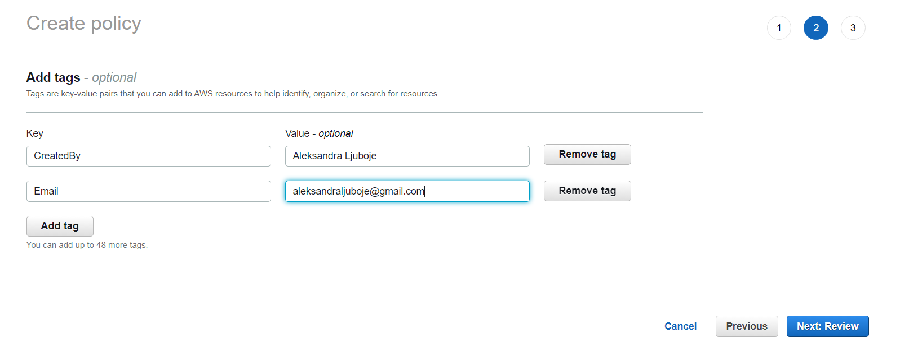
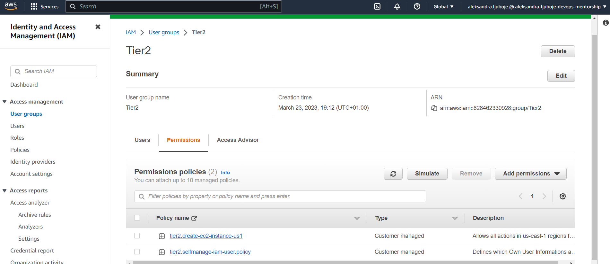

*week-7-mentorship-program*
# Kreiranje policy-a za IAM 2 usera

***IAM -> Policies***
* Definišu koje akcije mogu da se naprave nad računom
* Policy napisan u JSON formatu key-value 

```bash
AdministratorAccess
{
    "Version": "2012-10-17", # verzija jezika u kojem se piše aws policy
    "Statement": [ # definišemo sta je Allow ili Deny 
        {
            "Effect": "Allow",
            "Action": "*",
            "Resource": "*"
        }
    ]
}
```
## Koraci pri kreiranju policy
*Neophodni tagovi u formatu*
`CreadtedBy: Ime Prezime`
`Email: vas@email.com`
* Tagovi služe da pruže dodatne infromacije `metadata` o određenom resursu

1. Create Policy 
2. Kopirati policy koje smo dobili u JSON 
3. Kreirati tražene tagove

4. Unijeti naziv policy-a
5. Create policy


## Dodavanje policy-a i ažuriranje permisija za grupu Tier 2

1. Odemo u dio `User groups`
2. `Permisions` -> `Add Permisions`
3. Dodamo kreirani policy 

