*Office Hours 15.4.2023. dostupne na [linku](https://www.youtube.com/watch?v=w4GP-jHYffI&feature=youtu.be)*

*TASK 8 dostupan na [linku](https://github.com/allops-solutions/devops-aws-mentorship-program/issues/57)*

# Task 8 - Let's Encrypt SSL Certificate on EC2 Amazon Linux AMI3 (Nginx) step by step solution

```bash
Office Hours: [38:32]
```

* *Ovaj dokument sadrzi dodatne informacije i korake sa Office Hours a koji nisu pomenuti u `ssl.md` dostupnom [ovdje](https://github.com/allops-solutions/devops-aws-mentorship-program/blob/main/devops-learning-path/ssl.md) cime je dodatno prosiren izvorni dokument.*
* ***Ovaj dokument sadrzi korake potrebne za rjesenje TASK-8***

U sljedecem primjeru cemo pokazati na koji nacin mozemo konfigurisati **SSL Let's Encrypt certifikat** na EC2 Amazon Linux 3 serveru koristeci Nginx web server.

**Za ovaj primjer cemo koristiti:**

* EC2 instancu sa Amazon Linux 3 operativnim sistemom
* Nginx web serverom
* web aplikaciju koja je dostupna po HTTP protokolu na portu 80 koristeci nasu javnu IP adresu. `nodejs-simple-app`

**Koraci:**

### Zadatak 1 
* *Od AMI image `ec2-ime-prezime-web-server` napravite novu EC2 instancu `ec2-ime-prezime-task-8`*

1. Od AMI image koji ima Nginx i nodejs-simple-app kreirati novu instancu.
`Name`: `ec2-web-server-office-hours`
`Instance type`: `t2.micro`
`Key-pair`: izaberemo koji zelimo `week-8`
`Security group` -> `Select existing sg` -> `web-server-week-8`
    * moze se kreirati i nova, ali sa `inbound rule` za portove `22` i `80` sa bilo koje lokacije
    * **OBAVEZNO**: promijeniti u `web-server-week-8` sg pravilo da prima HTTP samo sa ALB-a i staviti `anywhere`

### Share AMI image

**Ukoliko nemamo AMI instancu, mozemo preuzeti od kolega na sljedeci nacin**

1. EC2 Dashboard -> AMIs -> oznacimo AMI koji zelimo podijeliti -> Actions -> `Edit AMI permissions` -> I dodamo AWS account ID kome s kim zelimo podijeliti AMI.
2. AMI nalazimo u dijelu koji je prikazan na slici.
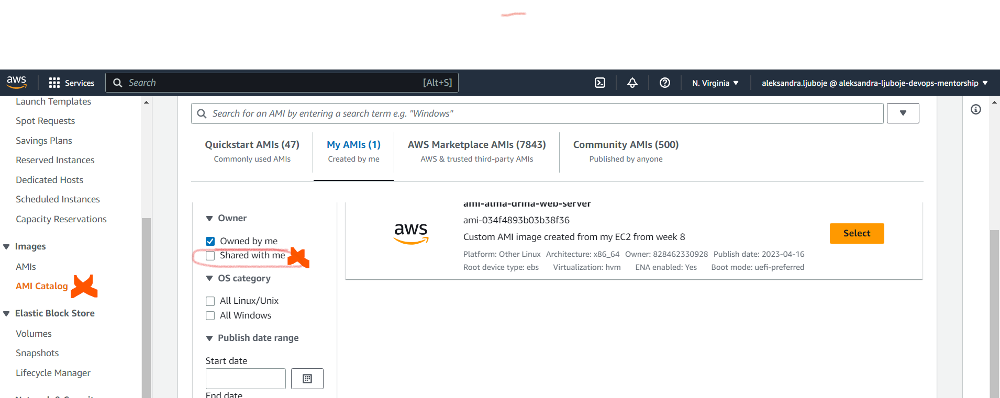

--- **Zavrsen dio o share AMI** --
-- **Vracamo se na kreiranje instance** --

3. `Configure storage` - `14 GiB gp3`
4. `Launch instance`

Na slici vidimo povezivanje na EC2 instancu kreiranu od AMI image-a.

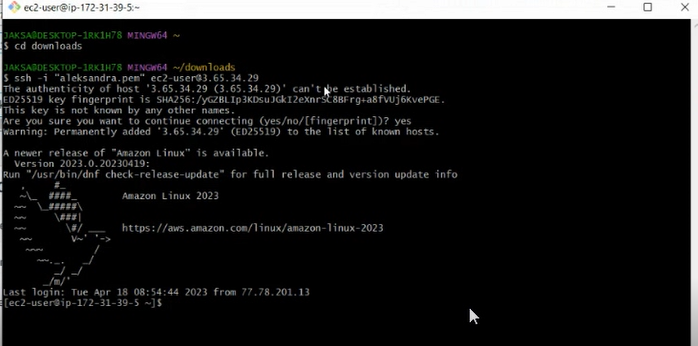

#### Podesavanje i ispravljanje greske 502 Bad Gateway

**Sta znaci error 502?**

* *Kada je klijent uputio request i on je dosao do web servera (nginx) a kada je web server krenuo da proslijedi request dalje ka aplikacijskom serveru (node js) nije dobio odgovor od strane aplikacijskog servera.
Što nama govori da node-js nije pokrenut.*

1. spojimo se na EC2 instancu
`$ ssh -i "key-pair" ec2-user@ip-adresa`
2. `$ sudo su -`
3. `$ systemctl status nginx` i vidimo da je nginx u statusu `running`
4. `$ pm2 list` vidimo da nemamo pokrenut node js server.
5. `$ cd nodejs-simple-app` da se pozicioniramo u folder gdje je app i uradimo `$ pm2 start server.js`


### Zadatak 2
* *Kreirati DNS record `<ime>-<prezime>.awsbosnia.com` za Hosted Zone awsbosnia.com (Hosted zone ID: Z3LHP8UIUC8CDK) koji ce da pokazuje na EC2 instancu koju ste krairali. Za kreiranje DNS zapisa korisite AWS CLI AWS kredencijale koji se nalaze unutar sljedeceg excel file-a **dostupan u TASK8**. AWS CLI konfigurisite tako da koristite named profile aws-bosnia. Kako da podesite AWS CLI i vise o CLI profilima mozete vidjeti [ovdje](https://docs.aws.amazon.com/cli/latest/reference/route53/change-resource-record-sets.html#)
Za ovaj dio taska mozete da iskorisite `change-resource-record-sets` AWS CLI komandu. Kada ste dodali novi DNS record njegov Name i Value ispiste uz pomoc komande `aws route53 list-hosted-zones` i alata `jq` gdje cete prikazati samo Name i Value za DNS record koji ste vi kreirali odnosno za vase domensko ime.*

Kako je na EC2 instanci već instaliran AWS CLI prelazimo na konfigurisanje, više o kreiranju na [linku](https://docs.aws.amazon.com/toolkit-for-visual-studio/latest/user-guide/keys-profiles-credentials.html)

**Obavezno biti na `root` korisniku `$ sudo su -`**
1. `$ aws configure`
Za `AWS Access Key ID` i `Secret Access Key` unosimo podatke koje smo dobili u excel file-u u TASK 8.
`Default region name` - `eu-central-1` za IAM 1
`Default output format` - `json` radi lakšeg prikaza

Output komande izgleda kao na slici ispod, s tim da unosimo svoje podatke.

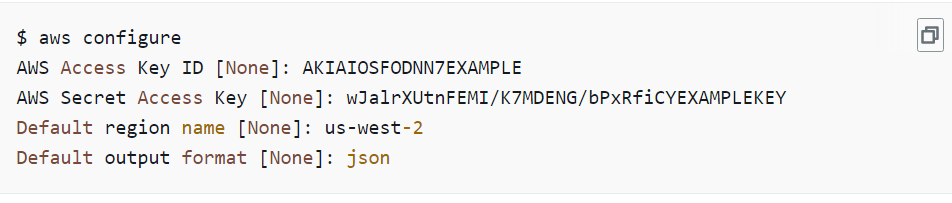

2. `$ aws configure list` da vidimo podešenu konfiguraciju

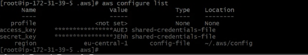


3. Komanda `change-resouce-record`
```bash 
$ aws route53 change-resource-record-sets --hosted-zone-id Z3LHP8UIUC8CDK --change-batch '{"Changes":[{"Action":"CREATE","ResourceRecordSet":{"Name":"aleksandra-ljuboje.awsbosnia.com.","Type":"A","TTL":60,"ResourceRecords":[{"Value":"3.65.34.29"}]}}]}'
```
* `Name` - upisujemo svoj DNS record
* `Value` - upisujemo IP adresu instance 

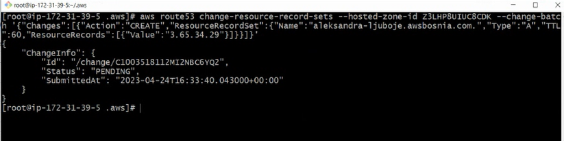

4. `$ yum install jq` instaliramo `jq` alatku
5. Kada smo kreirali DNS record, Name i Value ispišemo pomoću komande
```bash
aws route53 list-resource-record-sets --hosted-zone-id Z3LHP8UIUC8CDK | jq '.ResourceRecordSets[] | select(.Name == "aleksandra-ljuboje.awsbosnia.com.") | {Name, Value}'
```
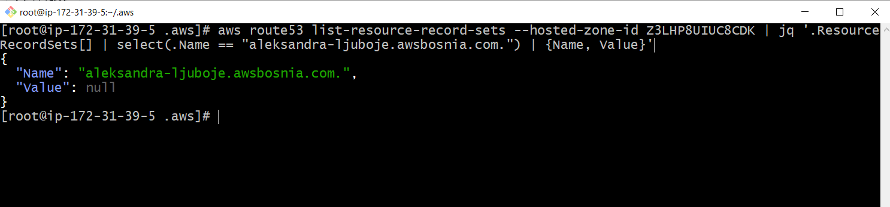

### Zadatak 3
* *Na EC2 instanci `ec2-ime-prezime-task-8` kreirati Let's Encrypt SSL certifikat za vasu domenu. Neophodno je omoguciti da se nodejs aplikaciji moze pristupiti preko linka `https://<ime>-<prezime>.awsbosnia.com`, to verifikujte skrinsotom gdje se vidi validan certifikat u browseru.*


#### Kreiranje Route 53 DNS zapisa [ nije korak u TASK 8]
Kreirali smo **Route 53** DNS zapis `http://ssl.awsbosnia.com/` i usmjerili ga na nasu Public IP adresu nase EC2 instance na kojoj se nalazi nasa aplikacija.
Sa predavanja:
`Record name`: `office-hours.awsbosnia.com`
`Value`: `IP adresa instance na kojoj se nalazi app`
`Record type`: `A`
`Smanjiti time-to-live (TTL) na 60s`
`Routing policy` je `Simple routing`

#### Rješavanje Zatadak 3
Za kreiranje Lets Encrypt certifikata iskorisiti cemo [certbot](https://certbot.eff.org/) alat. **Certbot** je alat koji nam omogucava da automatski generisemo i instaliramo SSL certifikat.
*Na Amazon Linux Ami 3 cert bot cemo instalirati koristeci **pip alat**.*

```bash
Komande u AWS CLI

sudo dnf install python3 augeas-libs
sudo python3 -m venv /opt/certbot/
sudo /opt/certbot/bin/pip install --upgrade pip
sudo /opt/certbot/bin/pip install certbot certbot-nginx
sudo ln -s /opt/certbot/bin/certbot /usr/bin/certbot
sudo ls -la /usr/bin/certbot # da vidimo link 
sudo certbot certonly --nginx # I am feeling conservative :) you can use sudo certbot --nginx instead to automatize the process
```
#### Zahtjev certifikata za nasu domenu
Output komande `sudo certbot certonly --nginx`:

* dodamo email adresu
* prihvatimo uslove koristenja
* Mozemo i ne moramo prihvatiti da na email salju emails sa ponudama i sl.
* unesemo domene u dole oznacenom polju  `Please enter the domain name(s)...`

```bash
[root@ip-172-31-91-148 ~]# sudo certbot certonly --nginx
Saving debug log to /var/log/letsencrypt/letsencrypt.log
Please enter the domain name(s) you would like on your certificate (comma and/or
space separated) (Enter 'c' to cancel): ssl.awsbosnia.com, www.ssl.awsbosnia.com
Requesting a certificate for ssl.awsbosnia.com and www.ssl.awsbosnia.com 
# !!!U OVOM DIJELU UNESEMO DOMENU ZA KOJU ZAHTJEVAMO CERTIFIKAT!!!

Successfully received certificate.
Certificate is saved at: /etc/letsencrypt/live/ssl.awsbosnia.com/fullchain.pem
Key is saved at:         /etc/letsencrypt/live/ssl.awsbosnia.com/privkey.pem
This certificate expires on 2023-07-14.
These files will be updated when the certificate renews.

NEXT STEPS:
- The certificate will need to be renewed before it expires. Certbot can automatically renew the certificate in the 
background, but you may need to take steps to enable that functionality. See https://certbot.org/renewal-setup for instructions.

- - - - - - - - - - - - - - - - - - - - - - - - - - - - - - - - - - - - - - - -
If you like Certbot, please consider supporting our work by:
 * Donating to ISRG / Let's Encrypt:   https://letsencrypt.org/donate
 * Donating to EFF:                    https://eff.org/donate-le
- - - - - - - - - - - - - - - - - - - - - - - - - - - - - - - - - - - - - - - -
```
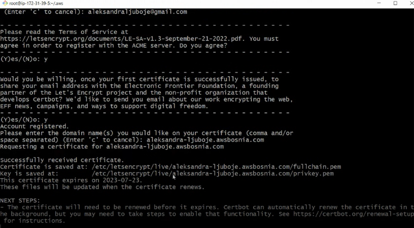

Vidimo da su nasli certifikati na sljedecoj lokaciji:

```
Certificate is saved at: /etc/letsencrypt/live/ssl.awsbosnia.com/fullchain.pem
Key is saved at:         /etc/letsencrypt/live/ssl.awsbosnia.com/privkey.pem
```

Ako uradimo komandu
 `$ ls -la /etc/letsencrypt/live/ime-prezime.awsbosnia.com/` i `cat README` trebamo zapamtiti sljedece termine:
`privatekey.pem` - privatni kljuc za nas certifikat
`fullchain.pem` - fajl certifikata koristen od strane server softvera tj. nginx i OS
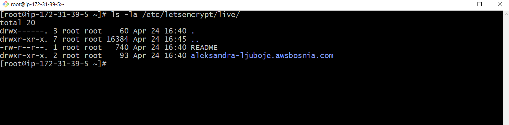
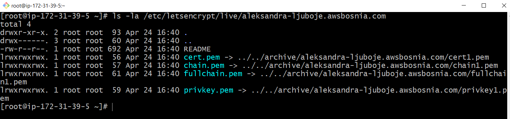

**Potvrditi email od certbot-a!!**

Ako sada pristupimo aplikaciji preko DNS recorda, vidimo da još uvijek veza nije `secured`. Razlog je što je potrebno ažurirati NGINX config fajl `node-app.conf` i dodati port `443 HTTPS`

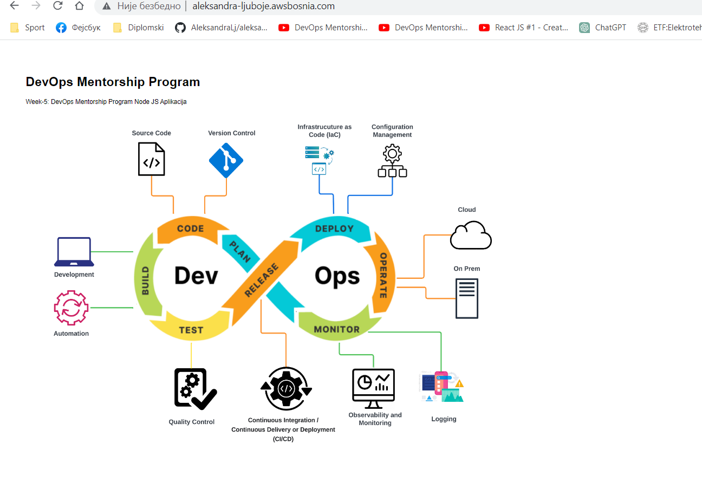

#### Omogucavanje zahtjeva za HTTPS 
1. Auzurirati `security group` na nacin da se doda `inbound rule HTTPS port 443 anywhere`

2. Kako bi NGINX mogao da primi HTTPS zahtijeve neophodno je da azuriramo NGINX konfiguraciju.
* Provjerimo koji port je otvoren
```bash
$ cd /etc/nginx/
$ cd conf.d/
$ ls
$ cat node-app.conf # vidimo da slusamo samo po portu 80
```
Napravimo kopiju tj. backup fajla sa konfiguracijom
```bash
$ cp node-app.conf node-app.conf.bak<dodamo datum kreiranja - opciono> # backup originalne konfiguracije
$ vi node-app.conf # obrisemo sadrzaj i upisemo sadrzaj fajla naveden u narednom koraku

```
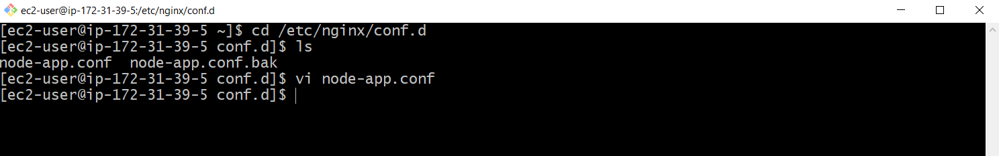

Nakon sto smo napravili backup upisujemo novi konfiguracijski fajl `node-app.conf` gdje upisemo nase domensko ime umjesto `<domensko-ime.com>`:

```bash
server {
  listen 80;
  server_name <domensko-ime.com>;
  return 301 https://$server_name$request_uri;
}

server {
  listen 443 ssl;
  server_name <domensko-ime.com>;

  ssl_certificate /etc/letsencrypt/live/<domensko-ime.com>/fullchain.pem;
  ssl_certificate_key /etc/letsencrypt/live/<domensko-ime.com>/privkey.pem;

  location / {
    proxy_pass http://127.0.0.1:8008;
    proxy_http_version 1.1;
    proxy_set_header Upgrade $http_upgrade;
    proxy_set_header Connection 'upgrade';
    proxy_set_header Host $host;
    proxy_cache_bypass $http_upgrade;
  }
}
ECS 
:wq
```

4. Restartujemo NGINX web server:

```bash
$ sudo systemctl restart nginx 
ili
$ service nginx restart
$ service nginx status

```
* Ako bude problema sa restartom, provjerimo nginx komandom
`$ nginx -t` i vidimo o kojoj greski se radi

* Nakon toga vidimo da mozemo pristupiti nasoj web aplikaciji preko sigurne HTTPS veze koristeci domensko ime`https://<domensko-ime.com>/`

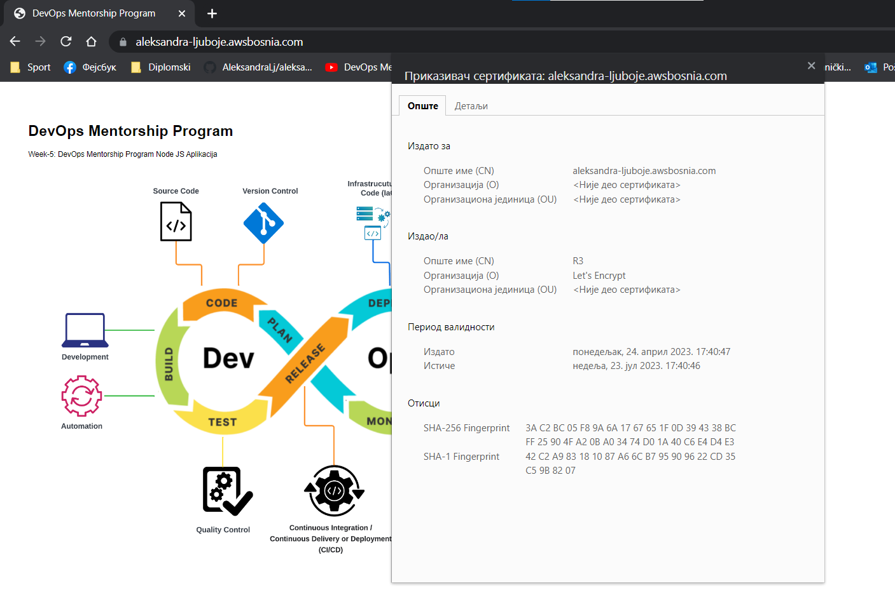
### Zadatak 4
* *Omoguciti autorenewal SSL certifikata*
#### Kako omoguciti renewal cetifikata? Cert Auto-renewal 

Certbot posjeduje automatizme koji omogucavaju renewal tj. automatsko obnavljanje certifikata uz pomoc `cronjob`-a.
*Link ka koracima i objasnjenju pogledati na [linku](https://eff-certbot.readthedocs.io/en/stable/using.html#setting-up-automated-renewal)*

Komanda koja ce dodati cronjob u `/etc/crontab`
```bash
SLEEPTIME=$(awk 'BEGIN{srand(); print int(rand()*(3600+1))}'); echo "0 0,12 * * * root sleep $SLEEPTIME && certbot renew -q" | sudo tee -a /etc/crontab > /dev/null
```
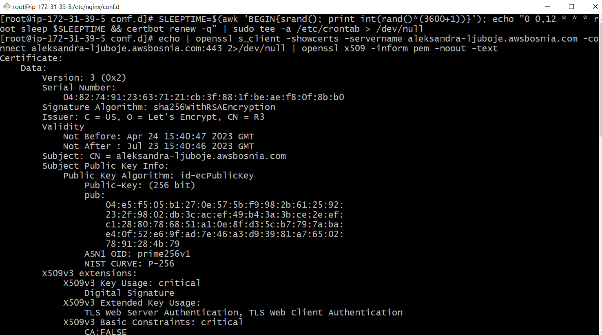


### Zadatak 5 
* *Koristeci openssl komande prikazati koji SSL certitikat koristite i datum njegovog isteka. Probajte korisitit razlicite openssl komande (HINT: Biljeskama za office hours imate knjigu u kojoj mozete pronaci recepte za razlicite openssl komande)*
### Prikazivanje SSL certifikata i datum isteka - openssl komanda

Koristimo komandu:
```bash
echo | openssl s_client -showcerts -servername <ime-prezime>.awsbosnia.com -connect <ime-prezime>.awsbosnia.com:443 2>/dev/null | openssl x509 -inform pem -noout -text
```
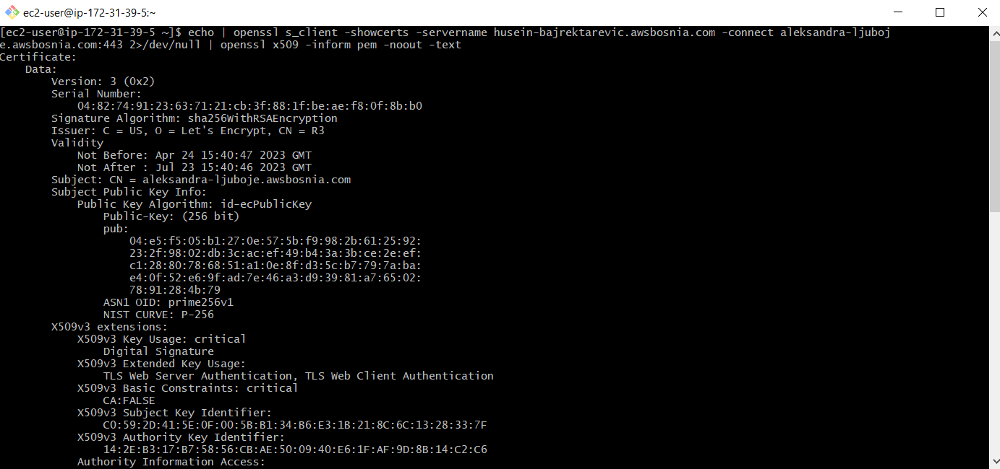
ili 
```bash
openssl s_client -showcerts -connect <ime-prezime>.awsbosnia.com:443
```
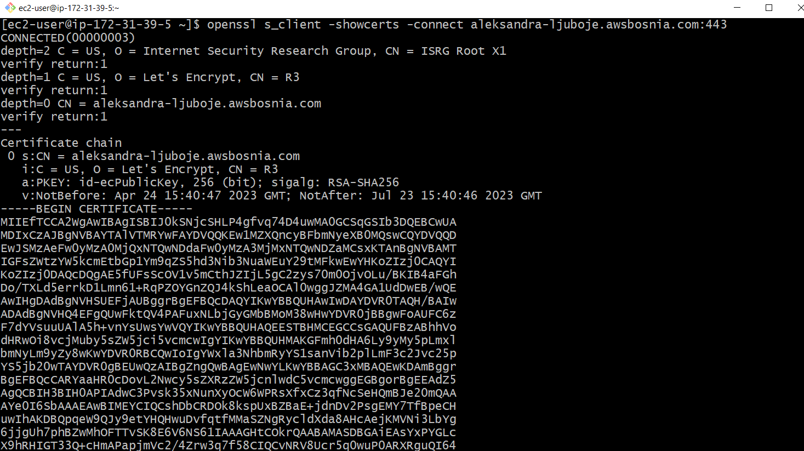

ili 
```bash
openssl s_client -showcerts -connect ime-prezime.awsbosnia.com:443 2>/dev/null | openssl x509 -noout -text
```

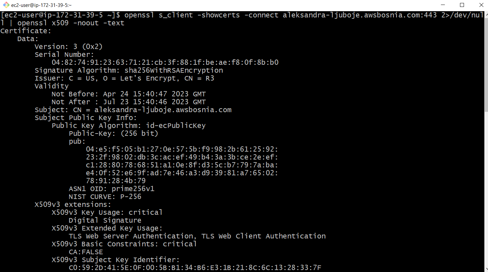

### Useful openssl commands

**OpenSSL** je open source alat ([github repo](https://github.com/openssl/openssl) | [dokumentacija]()) koji se moze korisiti za upravljanje kljucevima i certifikatima, potpisivanje digiralnih potpisa i provjeru autenticnosti certifikata.  
U nastavku su date neke od komandi koje se mogu koristiti za upravljanje certifikatima i kljucevima.  


### Zadatak 6
* *Importujte Lets Encrypt SSL certifikat unutar AWS Certified Managera*

1. Korak 1
```bash
# pozicioniramo se u folder sa certifikatima koje je generisao Lets Encrypt
$ cd /etc/letsencrypt/live/ime-prezime.awsbosnia.com/ 
```


2. U AWS-u, odemo na ACM i importujemo certifikat na način da kopiramo ključeve iz terminala u odgovarajuća polja
`Certificate body` - `cert.pem`
`Certificate private key` - `privkey.pem`
`Certificate chain` - `fullchain.pem`

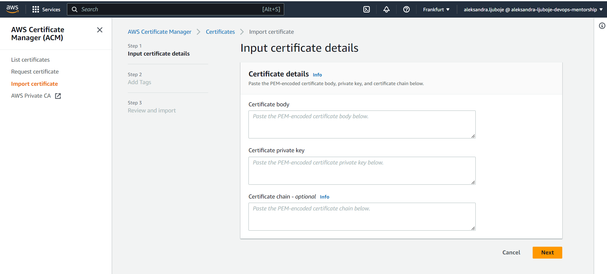

**Obavezno dodati tagove `CreatedBy` i `Email` pri kreiranju**

Dokumentacija za importovanje certifikata u AWS Certificate Manager se nalazi na [Importing certificates into AWS Certificate Manager](https://docs.aws.amazon.com/acm/latest/userguide/import-certificate.html).

Na slici vidimo uspješno importovan certifikat.

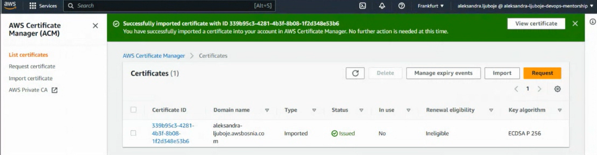

### Zadatak 7
*  *Kreirajte Load Balancer gdje cete na nivou Load Balancera da koristite SSL cert koji ste ranije importovali. (Hint: NGINX config je nophodno auzrirati). Load Balancer u pozadini koristi EC2 instancu ec2-ime-prezime-task-8, nije potrebno kreirati ASG.*

**Kako se radi o LB, potrebno je da imamo najmanje 2 instance kreiranje koje dodajemo u target group, kako bismo obezbjedili visoku dostupnost aplikacije**

1. Kreiramo još jednu EC2 instancu od AMI image-a

Na slici vidimo dvije `healthy` EC2 instance

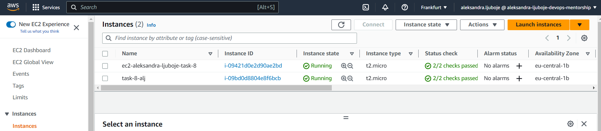

2. Kreiramo `security group` za LB - `HTTP 80 anywhere` i `HTTPS 443 anywhere`
3. Kreiramo `target group` za LB 
* Instances
* HTTP 80
* *Advanced:*
  * Traffic port
  *  Healthy treshold : 2
* Dodati obje EC2 instance u target group

4. Kreiramo Application Load Balancer `ec2-ime-prezime-task-8`
Dodamo kreiranu Security Grupu, u `Listener HTTP:80` dodamo kreiranu Target grupu

Ako provjerimo vidimo da je jedna od instanci `unhealthy` i dobijamo  code `301`. 
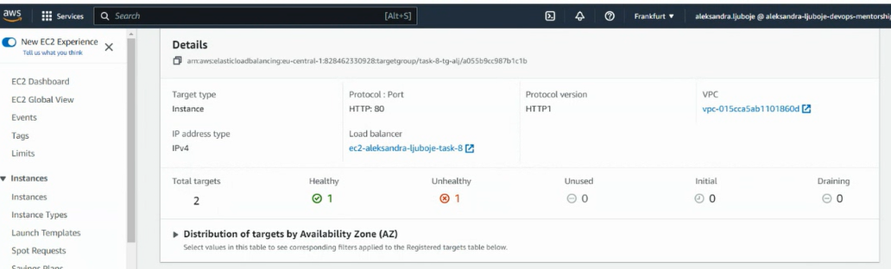

Vratimo se preko terminala u `node-app.conf` i zakomentarišemo liniju koda `return 301 ...`
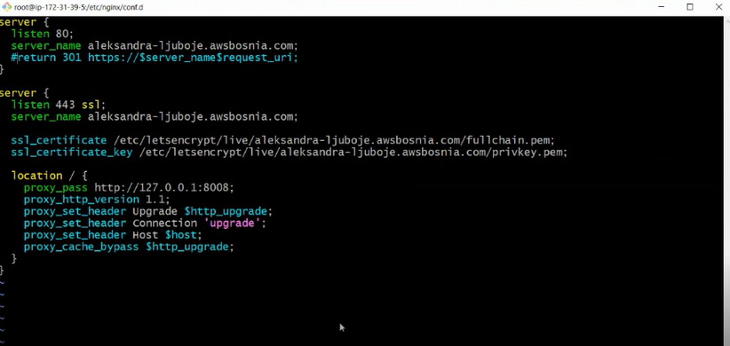

Nakon toga odradimo restart nginx-a `$ systemctl restart nginx` i trebamo imati obje instance u statusu `healthy` unutar target grupe

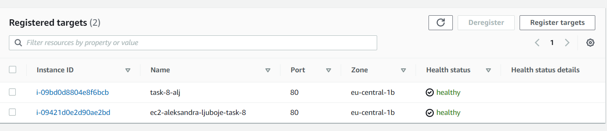

### Zadatak 8
* *Koristeci openssl komande prikazati koji SSL certitikat koristite za vasu domenu i datum njegovog isteka.*

```bash
openssl s_client -showcerts -connect ime-prezime.awsbosnia.com:443 2>/dev/null | openssl x509 -noout -text
```


### Zadatak 9
* *Kreirajte novi SSL certifikat unutar AWS Certified Managera, azurirajte ALB da koristi novi SSL cert koji ste kreirali.*

1.  Korak 1
Odemo u ACM i idemo na `Request`
`Key algorithm` je `RSA`

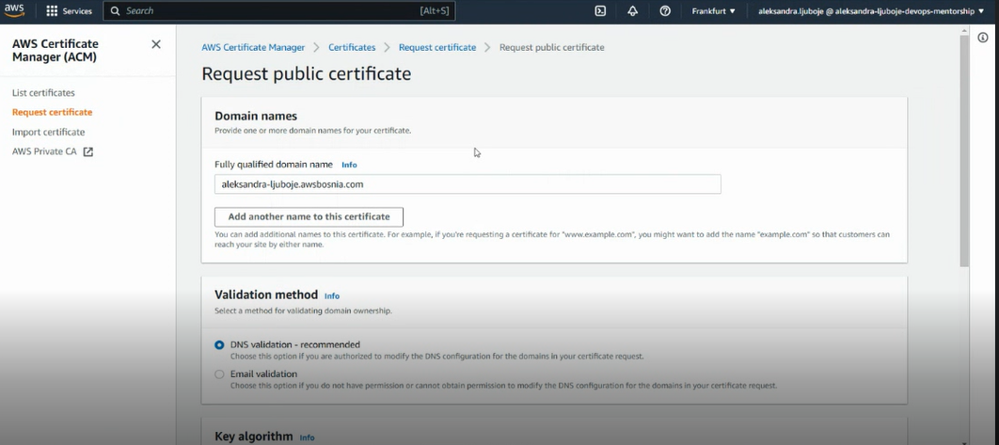


2. U AWS CLI izvršimo komandu, kojom dodajemo credentials od novog Amazon certifikata. **Promijeniti svoje podatke!!**


```bash
aws route53 change-resource-record-sets --hosted-zone-id Z3LHP8UIUC8CDK --change-batch '{"Changes":[{"Action":"CREATE","ResourceRecordSet":{"Name":"_1e8e5cc0384d453840a87cf74c724f8e.aleksandra-ljuboje.awsbosnia.com.","Type":"CNAME","TTL":60,"ResourceRecords":[{"Value":"_9b28cca30986716c8476f6bc8cb90f6f.fgsdscwdjl.acm-validations.aws."}]}}]}' --profile aws-bosnia
```
Gdje je
`Name` - `CNAME Name` našeg certifikata
`Value` - `CNAME Value`

ili 
```bash
aws route53 change-resource-record-sets --hosted-zone-id Z3LHP8UIUC8CDK --change-batch
```
Gdje u `json` fajlu možemo sačuvati detalje i proslijediti ih, umjesto da kucamo u terminalu.

**Sačekamo dok `Status` ne bude `Issued`, nakon čega radimo sljedeće.**

3. Korak 3
Odemo u LB i na opciju `Add listener`

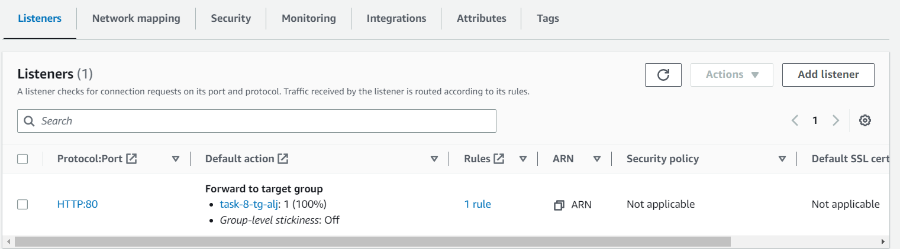

`Listener details`
* `HTTPS`, `443`
* izaberemo našu target group

`Secure listener settings`
* From ACM - izaberemo requestovani certifikat
* Dodamo tagove
* `Add`

Na slici vidimo kreirana dva `Listenera` za port `80` i `443`
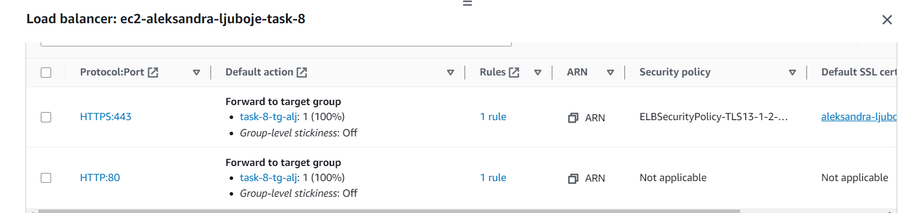

3. U AWS CLI odradimo komandu kojom kreiramo record sa domenom i DNS record od ALB. **Promijeniti svoje podatke!!**

```bash
aws route53 change-resource-record-sets --hosted-zone-id Z3LHP8UIUC8CDK --change-batch '{"Changes":[{"Action":"CREATE","ResourceRecordSet":{"Name":"aleksandra-ljuboje.awsbosnia.com.","Type":"CNAME","TTL":60,"ResourceRecords":[{"Value":"alb-web-servers-node-js-ssl-2007162558.eu-central-1.elb.amazonaws.com"}]}}]}' --profile aws-bosnia
```
Gdje je
`Name` naš DNS record
`Value` DNS record ALB-a


#### Nakon ovog koraka desila se greška

`An error occurred (InvalidChangeBatch) when calling the ChangeResourceRecordSets operation: [Tried to create resource record set [name='_15c4e5804a4fffad1234b69fae22b783.aleksandra-ljuboje.awsbosnia.com.', type='CNAME'] but it already exists]
[ec2-user@ip-172-31-39-5 ~]$`

***Potrebno je prvo obrisati prethodni record, a zatim dodati novi sa DNS recordom ALB-a***

* Komanda za brisanje postojećeg record-a
```bash
 aws route53 change-resource-record-sets --hosted-zone-id Z3LHP8UIUC8CDK --change-batch '{"Changes":[{"Action":"DELETE","ResourceRecordSet":{"Name":"ime-prezime.awsbosnia.com.","Type":"A","TTL":60,"ResourceRecords":[{"Value":"javna-ip-instance"}]}}]}'
 ```
 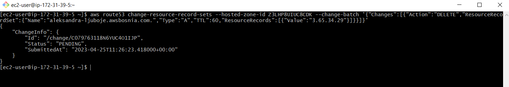

 * Kreiramo novi record sa domenom i DNS record od ALB

```bash
aws route53 change-resource-record-sets --hosted-zone-id Z3LHP8UIUC8CDK --change-batch '{"Changes":[{"Action":"CREATE","ResourceRecordSet":{"Name":"ime-prezime.awsbosnia.com.","Type":"CNAME","TTL":60,"ResourceRecords":[{"Value":"alb-for-web-dns"}]}}]}' --profile aws-bosnia
```
 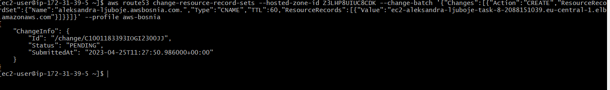


6. Ažurirati `node-app.conf` na sljedeći način
```bash
server {
  listen 80;
  server_name aleksandra-ljuboje.awsbosnia.com;
  location / {
    proxy_pass http://127.0.0.1:8008;
    proxy_http_version 1.1;
    proxy_set_header Upgrade $http_upgrade;
    proxy_set_header Connection 'upgrade';
    proxy_set_header Host $host;
    proxy_cache_bypass $http_upgrade;
  }
}
```

7. Restartovati nginx 
`$ systemctl restart nginx`

### Zadatak 10
* *Koristeci openssl komande prikazati koji SSL certitikat koristite za vasu domenu i datum njegovog isteka.*

```bash
echo | openssl s_client -showcerts -servername <ime-prezime>.awsbosnia.com -connect <ime-prezime>.awsbosnia.com:443 2>/dev/null | openssl x509 -inform pem -noout -text

```

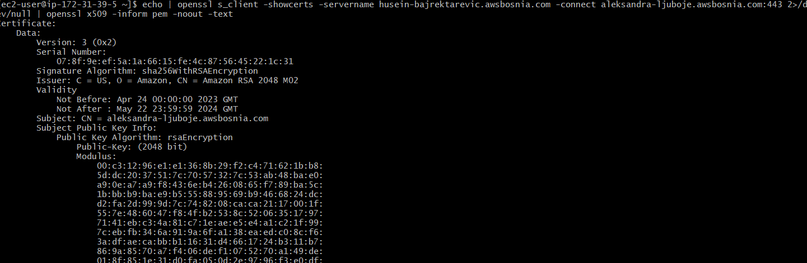


Screenshot browser-a gdje se vidi da sada koristimo Amazon certificate.

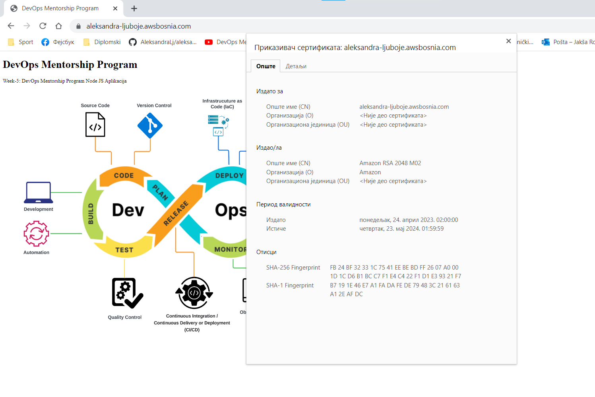


### Zadatak 11
* *Kada zavrsite sa taskom kreirajte AMI image pod nazivom `ami-ec2-ime-prezime-task-8` i terminirajte resurse koje ste koristili za izradu taska.*

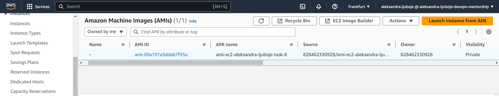

**Task se smatra kompletiranim kada kreirate PR koji sadrzi koristene komande u tekstualno formatu i skrinsote na kojima se vidi izvrsavanje tih komandi i dobijeni output.**


## Dodatne komande

`aws sts get-caller-identity` - provjera koji acees key koristimo